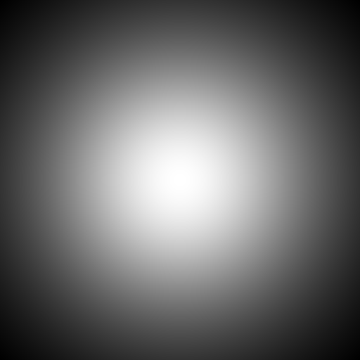
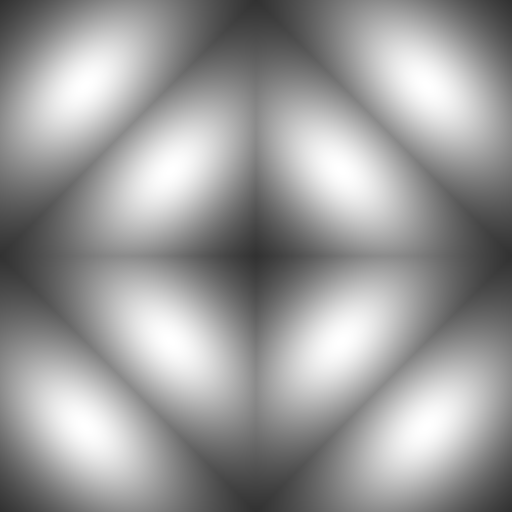

# Environment Lighting  

Notation | Description | Shader Code Convention  
:-: | :-: | :-:  
$\displaystyle \overrightarrow{\omega_i}$ | Incident Direction in Tangent Space | L  
$\displaystyle \overrightarrow{\omega_o}$ | Outgoing Direction in Tangent Space | V  
$\displaystyle \overrightarrow{\omega_h}$ | Half Vector in Tangent Space | H  
$\displaystyle \operatorname{f}(\overrightarrow{\omega_i}, \overrightarrow{\omega_o})$ | (Polychromatic) BRDF in Tangent Space | N/A  
$\displaystyle \operatorname{f_{MONO}}(\overrightarrow{\omega_i}, \overrightarrow{\omega_o})$ | (Monochromatic) BRDF in Tangent Space | N/A  
$\displaystyle \operatorname{L_i}(\overrightarrow{\omega_i})$ | Incident Radiance in Tangent Space | N/A  
$\displaystyle \operatorname{L_o}(\overrightarrow{\omega_o})$ | Outgoing Radiance in Tangent Space | N/A  
$\displaystyle \operatorname{K_{CC}} (\overrightarrow{\omega_i}) = \max(0, \cos \theta_i)$ | Clamped Cosine in Tangent Space | NdotL  
$\displaystyle \operatorname{p_{CC}} (\overrightarrow{\omega})$ | (Normalized) Clamped Cosine Distribution in Tangent Space | (1 / PI) * NdotL  
$\displaystyle \mathrm{\rho}$ | (Diffuse) (Polychromatic) Albedo (Hemispherical-Directional Reflectance) in Tangent Space | N/A  
$\displaystyle \mathrm{\rho_{MONO}}$ | (Diffuse) (Monochromatic) Albedo (Hemispherical-Directional Reflectance) in Tangent Space | N/A  
$\displaystyle \operatorname{\rho}(\overrightarrow{\omega_o})$ | (Specular) (Polychromatic) Albedo (Hemispherical-Directional Reflectance) in Tangent Space | N/A  
$\displaystyle \operatorname{\rho_{MONO}}(\overrightarrow{\omega_o})$ | (Specular) (Monochromatic) Albedo (Hemispherical-Directional Reflectance) in Tangent Space | N/A  
$\displaystyle \overrightarrow{n}$ | Normal in World Space | N  
$\displaystyle \operatorname{R}(\overrightarrow{n})$ | Rotation Matrix from Tangent Space to World Space | N/A  
$\displaystyle \operatorname{L_{EM}}(\operatorname{R}(\overrightarrow{n}) \cdot \overrightarrow{\omega_i})$ | Environment Map Radiance  Distribution in World Space | N/A  

The name **environment lighting** is from "10.2 Environment Lighting" of [Real-Time Rendering Fourth Edition](https://www.realtimerendering.com/), ["12.6 Infinite Area Lights"](https://pbr-book.org/3ed-2018/Light_Sources/Infinite_Area_Lights) of [PBR Book V3](https://pbr-book.org/3ed-2018/contents), and ["12.5 Infinite Area Lights"](https://pbr-book.org/4ed/Light_Sources/Infinite_Area_Lights) of [PBR Book V4](https://pbr-book.org/4ed/contents), while the **environment lighting** is called [HDRI Sky](https://docs.unity3d.com/Packages/com.unity.render-pipelines.high-definition@10.10/manual/Override-HDRI-Sky.html) in Unity3D and [Sky Light](https://dev.epicgames.com/documentation/en-us/unreal-engine/sky-light?application_version=4.27) in UnrealEngine.  

By "10.2 Environment Lighting" of [Real-Time Rendering Fourth Edition](https://www.realtimerendering.com/), "14.4 The Light Transport Equation" of [PBR Book V3](https://pbr-book.org/3ed-2018/Light_Transport_I_Surface_Reflection/The_Light_Transport_Equation#) and "13.1 The Light Transport Equation" of [PBR Book V4](https://pbr-book.org/4ed/Light_Transport_I_Surface_Reflection/The_Light_Transport_Equation#), the most important difference between **local illumination** and **global illumination** is that the shading algorithm of the local illumination is independent of the other positions on the surface except the shading position.  

When we are discussing the environment lighting, the position parameter $\displaystyle \overrightarrow{p}$ of most functions, such as $\displaystyle \operatorname{f}(\overrightarrow{p}, \overrightarrow{\omega_i}, \overrightarrow{\omega_o})$, $\displaystyle \operatorname{L_o}(\overrightarrow{p}, \overrightarrow{\omega_o})$ and $\displaystyle \operatorname{L_i}(\overrightarrow{p}, \overrightarrow{\omega_i})$, is omitted. This means that the environment lighting belongs to the local illumination.  

## 1\. Light  

Let $\displaystyle \operatorname{L_{EM}}(\operatorname{R}(\overrightarrow{n}) \cdot \overrightarrow{\omega_i})$ be the distant radiance distribution in world space which is represented by the **environment map** image.  

Note: Technically, the $\displaystyle \operatorname{L_{EM}}(\operatorname{R}(\overrightarrow{n}) \cdot \overrightarrow{\omega_i})$ is in environment map space: +Z Up, +X Forward. However, for convenience, we assume that world space and environment map space are the same, and we do NOT need to transform between world space and environment map space.  

### 1-1\. Environment Mapping  

By "10.4 Environment Mapping" [Real-Time Rendering Fourth Edition](https://www.realtimerendering.com/), there are many approaches to project the points on the sphere surface into the 2D texture coordinates, e.g. **cube map** (supported directly by Vulkan/Direct3D APIs),  [equirectangular (latitude-longitude) map](https://pbr-book.org/3ed-2018/Light_Sources/Infinite_Area_Lights) (supported by [PBR Book V3](https://pbr-book.org/3ed-2018/contents)), [octahedral map](https://pbr-book.org/4ed/Light_Sources/Infinite_Area_Lights#ImageInfiniteLights) (supported by [PBR Book V4](https://pbr-book.org/4ed/contents)), etc.  
  
#### 1-1-1\. Octahedral Mapping  
By "16.6 Compression and Precision" of [Real-Time Rendering Fourth Edition](https://www.realtimerendering.com/) and ["12.5.2 Image Infinite Lights"](https://pbr-book.org/4ed/Light_Sources/Infinite_Area_Lights#ImageInfiniteLights) of [PBR Book V4](https://pbr-book.org/4ed/contents), we have the octahedral mapping.  

The basic idea of the octahedral mapping is to first use the **Manhattan distance** (namely, L1 norm) to project the points on the sphere surface into the octahedron surface, and then use the orthogonal projection to project the points on the octahedron surface into the XOY plane.  

By \[Cigolle 2014\], we have the HLSL code of the octahedral mapping.  

```hlsl
float2 octahedral_map(float3 position_sphere_surface)
{
    // NOTE: positions on the sphere surface should have already been normalized

    float manhattan_norm = dot(abs(position_sphere_surface), float3(1.0, 1.0, 1.0));

    float3 position_octahedron_surface = position_sphere_surface * (1.0 / manhattan_norm);

    float2 position_ndc_space = (position_octahedron_surface.z > 0.0) ? position_octahedron_surface.xy : float2((1.0 - abs(position_octahedron_surface.y)) * ((position_octahedron_surface.x >= 0.0) ? 1.0 : -1.0), (1.0 - abs(position_octahedron_surface.x)) * ((position_octahedron_surface.y >= 0.0) ? 1.0 : -1.0));

    return position_ndc_space;
}

float3 octahedral_unmap(float2 position_ndc_space)
{
    float position_octahedron_surface_z = 1.0 - abs(position_ndc_space.x) - abs(position_ndc_space.y);

    float2 position_octahedron_surface_xy = (position_octahedron_surface_z >= 0.0) ? position_ndc_space : float2((1.0 - abs(position_ndc_space.y)) * ((position_ndc_space.x >= 0.0) ? 1.0 : -1.0), (1.0 - abs(position_ndc_space.x)) * ((position_ndc_space.y >= 0.0) ? 1.0 : -1.0));

    float3 position_sphere_surface = normalize(float3(position_octahedron_surface_xy, position_octahedron_surface_z));

    return position_sphere_surface;
}
```  

#### 1-1-2\. Equirectangular Mapping  

By "10.4.1 Latitude-Longitude Mapping" of [Real-Time Rendering Fourth Edition](https://www.realtimerendering.com/) and ["12.6 Infinite Area Lights"](https://pbr-book.org/3ed-2018/Light_Sources/Infinite_Area_Lights) of [PBR Book V3](https://pbr-book.org/3ed-2018/contents), we have the equirectangular mapping.  

```hlsl  
#define M_PI 3.141592653589793238462643

float2 equirectangular_map(float3 omega)
{
    // NOTE: omega should have already been normalized

    float theta = acos(omega.z);
    float phi = atan2(omega.y, omega.x);
    return float2((phi + M_PI) * (1.0 / (M_PI * 2.0)), theta * (1.0 / M_PI));
}

float3 equirectangular_unmap(float2 uv)
{
    // Khronos ANARI 
    // 5.7.2 HDRI
    //
    // direction
    //
    // the center of the texture should be mapped to (1, 0, 0) 

    float phi = uv.x * (M_PI * 2.0) - M_PI;
    float theta = uv.y * M_PI;
    float sin_phi = sin(phi);
    float cos_phi = cos(phi);
    float sin_theta = sin(theta);
    float cos_theta = cos(theta);
    return float3(sin_theta * cos_phi, sin_theta * sin_phi, cos_theta);
}
```  

### 1-2\. Hemisphere  

TODO: there are some cases in the industry, where only half of the sphere surface is involved; but why?   
[Lower Hemisphere is Solid Color](https://dev.epicgames.com/documentation/en-us/unreal-engine/sky-light?application_version=4.27)  
[Upper Hemisphere Only](https://docs.unity3d.com/Packages/com.unity.render-pipelines.high-definition@10.8/manual/Override-HDRI-Sky.html)  
[Upper Hemisphere Lux Value](https://docs.unity3d.com/Packages/com.unity.render-pipelines.high-definition@10.8/manual/Override-HDRI-Sky.html)  

## 2\. Interaction with Diffuse Material (Lambert)  

Let $\displaystyle \overrightarrow{n}$ be the normal in world space and $\displaystyle \overrightarrow{\omega_i}$ be the incident direction in tangent space. We have the rotation matrix, depending on the normal direction in world space $\displaystyle \overrightarrow{n}$, transforming from tangent space to world space. And the incident direction in world space can be calculated as $\displaystyle \operatorname{R}(\overrightarrow{n}) \cdot \overrightarrow{\omega_i}$. And we have the incident radiance $\displaystyle \operatorname{L_i}( \overrightarrow{\omega_i}) = \operatorname{L_{EM}}(\operatorname{R}(\overrightarrow{n}) \cdot \overrightarrow{\omega_i})$.  

Since the Lambert BRDF $\displaystyle \operatorname{f}(\overrightarrow{\omega_i}, \overrightarrow{\omega_o}) = \frac{1}{\pi} \rho$ is constant, we have $\displaystyle \operatorname{L_o}(\overrightarrow{\omega_o}) = \int_{\mathrm{S}^2} \operatorname{f}(\overrightarrow{\omega_i}, \overrightarrow{\omega_o}) \operatorname{L_i}(\overrightarrow{\omega_i}) \max(0, \cos \theta_i) \, d \overrightarrow{\omega_i} = \rho \cdot \operatorname{F}(\overrightarrow{n})$ where $\displaystyle \operatorname{F}(\overrightarrow{n}) = \int_{\mathrm{S}^2} \operatorname{L_i}(\overrightarrow{\omega_i}) \cdot \frac{1}{\pi} \cdot \max(0, \cos \theta_i) \, d \overrightarrow{\omega_i} = \int_{\mathrm{S}^2} \operatorname{L_{EM}}(\operatorname{R}(\overrightarrow{n}) \cdot \overrightarrow{\omega_i}) \cdot \frac{1}{\pi} \cdot \max(0, \cos \theta_i) \, d \overrightarrow{\omega_i}$.  

### 2-1\. SH Convolution

Analogous to the **convolution theorem**,  by \[Ramamoorthi 2001 A\], we have $\displaystyle \operatorname{F}(\overrightarrow{n}) = \int_{\mathrm{S}^2} \operatorname{L_i}(\overrightarrow{\omega_i}) \cdot \frac{1}{\pi} \cdot \max(0, \cos \theta_i) \, d \overrightarrow{\omega_i} = \int_{\mathrm{S}^2} \operatorname{L_{EM}}(\operatorname{R}(\overrightarrow{n}) \cdot \overrightarrow{\omega_i}) \cdot \frac{1}{\pi} \cdot \max(0, \cos \theta_i) \, d \overrightarrow{\omega_i} = \sum_{l = 0}^{\infty} \sum_{m = -l}^l \sqrt{\frac{4 \pi}{2l + 1}} \mathrm{L}_l^m \cdot \mathrm{T}_l \cdot \operatorname{\Upsilon}_l^m(\overrightarrow{n})$ where $\displaystyle \mathrm{L}_l^m = \operatorname{\mathcal{SH}}(\operatorname{L_{EM}}(\overrightarrow{\omega})) = \int_{\mathrm{S}^2} \operatorname{L_{EM}}(\overrightarrow{\omega}) \cdot \operatorname{\Upsilon}_l^m(\overrightarrow{\omega}) \, d\overrightarrow{\omega}$ and $\displaystyle \mathrm{T}_l = \operatorname{\mathcal{ZH}}(\frac{1}{\pi} \cdot \max(0, \cos \theta)) = \int_{\mathrm{S}^2} \frac{1}{\pi} \cdot \max(0, \cos \theta) \cdot \operatorname{\Upsilon}_l^0(\overrightarrow{\omega}) \, d\overrightarrow{\omega}$.  

> Proof (You may reference Appendix A-1\. SH (Spherical Harmonics)) 
>  
>> Let $\displaystyle \overrightarrow {\omega_{em}} = \operatorname{R}(\overrightarrow{n}) \cdot \overrightarrow{\omega_i}$. Evidently, we have $\displaystyle \overrightarrow{\omega_i} = {\operatorname{R}(\overrightarrow{n})}^{-1} \cdot \overrightarrow {\omega_{em}}$ and $\displaystyle \frac{d \overrightarrow{\omega_i}}{d \overrightarrow{\omega_{em}}} = 1$.  
>>  
>> By Integration by Substitution, we have $\displaystyle \operatorname{F}(\overrightarrow{n}) = \int_{\mathrm{S}^2} \operatorname{L_{EM}}(\operatorname{R}(\overrightarrow{n}) \cdot \overrightarrow{\omega_i}) \cdot \operatorname{p_{CC}} \, d \overrightarrow{\omega_i} = \int_{\mathrm{S}^2} \operatorname{L_{EM}}(\overrightarrow {\omega_{em}}) \cdot \operatorname{p_{CC}} ({\operatorname{R}(\overrightarrow{n})}^{-1} \cdot \overrightarrow {\omega_{em}}) \frac{d \overrightarrow{\omega_i}}{d \overrightarrow{\omega_{em}}} \, d \overrightarrow{\omega_{em}} = \int_{\mathrm{S}^2} \operatorname{L_{EM}}(\overrightarrow {\omega_{em}}) \cdot \operatorname{p_{CC}} ({\operatorname{R}(\overrightarrow{n})}^{-1} \cdot \overrightarrow {\omega_{em}}) \, d \overrightarrow{\omega_{em}}$.  
>  
>> Let $\displaystyle \operatorname{T}_l^m (\overrightarrow{n}) = \operatorname{\mathcal{SH}}(\operatorname{p_{CC}} ({\operatorname{R}(\overrightarrow{n})}^{-1} \cdot \overrightarrow {\omega_{em}})) = \int_{\mathrm{S}^2} \operatorname{p_{CC}} ({\operatorname{R}(\overrightarrow{n})}^{-1} \cdot \overrightarrow {\omega_{em}}) \cdot \operatorname{\Upsilon}_l^m(\overrightarrow{\omega_{em}}) \, d\overrightarrow{\omega_{em}}$.  
>>  
>> By "SH Product Integration", due to the orthonormality of the SH basis, we have $\displaystyle \operatorname{E}(\overrightarrow{n}) = \int_{\mathrm{S}^2} \operatorname{L_{EM}}(\overrightarrow {\omega_{em}}) \cdot \operatorname{p_{CC}} ({\operatorname{R}(\overrightarrow{n})}^{-1} \cdot \overrightarrow {\omega_{em}}) \, d \overrightarrow{\omega_{em}} = \int_{\mathrm{S}^2} \left( \sum_{l = 0}^{\infty} \mathrm{L}_l^m \cdot \operatorname{\Upsilon}_l^m(\overrightarrow{\omega_{em}}) \right) \left( \sum_{l = 0}^{\infty} \operatorname{T}_l^m (\overrightarrow{n}) \cdot \operatorname{\Upsilon}_l^m(\overrightarrow{\omega_{em}}) \right) \, d\overrightarrow{\omega_{em}} = \sum_{l = 0}^{\infty} \sum_{m = -l}^l \mathrm{L}_l^m \cdot \operatorname{T}_l^m (\overrightarrow{n})$.  
>  
>> Due to circular symmetry of the clamped cosine $\displaystyle \operatorname{p_{CC}} (\overrightarrow{\omega_{em}})$, only the coefficients of the ZH (Zonal Harmonics) are non-zero $\displaystyle \mathrm{T}_l = \operatorname{\mathcal{ZH}}(\operatorname{p_{CC}} (\overrightarrow{\omega_{em}})) = \int_{\mathrm{S}^2} \operatorname{p_{CC}} (\overrightarrow{\omega_{em}}) \cdot \operatorname{\Upsilon}_l^0(\overrightarrow{\omega}) \, d\overrightarrow{\omega_{em}}$.
>>  
>> Let $\displaystyle \operatorname{D}_l \left( {\operatorname{R}(\overrightarrow{n})}^{-1} \right)$ be the Wigner D-matrix. By "SH Rotational Invariance", for each degree (or band) $\displaystyle l$, only the elements $\displaystyle {\left( \operatorname{D}_l(\operatorname{R}(\overrightarrow{n})) \right)}_{m, 0}$ of the Wigner D-matrix are multiplied by the non-zero term $\displaystyle \begin{bmatrix} \operatorname{T}_l^{-l}(\overrightarrow{n}) & \cdots & \operatorname{T}_l^0(\overrightarrow{n}) & \cdots & \operatorname{T}_l^l(\overrightarrow{n}) \end{bmatrix} = \begin{bmatrix} 0 & \cdots & \mathrm{T}_l & \cdots & 0 \end{bmatrix} \operatorname{D}_l \left( {\operatorname{R}(\overrightarrow{n})}^{-1} \right) = \begin{bmatrix} 0 & \cdots & \mathrm{T}_l & \cdots & 0 \end{bmatrix} \begin{bmatrix} {\left( \operatorname{D}_l(\operatorname{R}(\overrightarrow{n})) \right)}_{-l, -l} & \cdots & {\left( \operatorname{D}_l \left( {\operatorname{R}(\overrightarrow{n})}^{-1} \right) \right)}_{-l, 0} & \cdots &  {\left( \operatorname{D}_l \left( {\operatorname{R}(\overrightarrow{n})}^{-1} \right) \right)}_{-l, l} \\ \vdots & \vdots & \vdots & \vdots & \vdots \\ {\left( \operatorname{D}_l \left( {\operatorname{R}(\overrightarrow{n})}^{-1} \right) \right)}_{0,-l} & \cdots & {\left( \operatorname{D}_l \left( {\operatorname{R}(\overrightarrow{n})}^{-1} \right) \right)}_{0, 0} & \cdots &  {\left( \operatorname{D}_l \left( {\operatorname{R}(\overrightarrow{n})}^{-1} \right) \right)}_{0, l} \\ \vdots & \vdots & \vdots & \vdots & \vdots \\ {\left( \operatorname{D}_l \left( {\operatorname{R}(\overrightarrow{n})}^{-1} \right) \right)}_{l,-l} & \cdots & {\left( \operatorname{D}_l \left( {\operatorname{R}(\overrightarrow{n})}^{-1} \right) \right)}_{l, 0} & \cdots & {\left( \operatorname{D}_l \left( {\operatorname{R}(\overrightarrow{n})}^{-1} \right) \right)}_{l, l} \end{bmatrix}$.  
>>  
>>  This means that $\displaystyle \operatorname{T}_l^m (\overrightarrow{n}) = \mathrm{T}_l \cdot {\left( \operatorname{D}_l \left( {\operatorname{R}(\overrightarrow{n})}^{-1} \right) \right)}_{0, m} = \mathrm{T}_l \cdot {{\left( \operatorname{D}_l ( \operatorname{R}(\overrightarrow{n}) ) \right)}^T}_{0, m} = \mathrm{T}_l \cdot {\left( \operatorname{D}_l(\operatorname{R}(\overrightarrow{n})) \right)}_{m, 0}$ and $\displaystyle \operatorname{E}(\overrightarrow{n}) = \sum_{l = 0}^{\infty} \sum_{m = -l}^l \mathrm{L}_l^m \cdot \operatorname{T}_l^m (\overrightarrow{n}) = \sum_{l = 0}^{\infty} \sum_{m = -l}^l \mathrm{L}_l^m \cdot \mathrm{T}_l \cdot {\left( \operatorname{D}_l(\operatorname{R}(\overrightarrow{n})) \right)}_{m, 0}$.  
>  
>> By "Equation \(23\)" of \[Ramamoorthi 2001 A\], we have $\displaystyle {\left( \operatorname{D}_l(\operatorname{R}(\overrightarrow{n})) \right)}_{m, 0} = \sqrt{\frac{4 \pi}{2l + 1}} \cdot \operatorname{\Upsilon}_l^m(\overrightarrow{n})$, and we have $\displaystyle \operatorname{E}(\overrightarrow{n}) = \sum_{l = 0}^{\infty} \sum_{m = -l}^l \mathrm{L}_l^m \cdot \mathrm{T}_l \cdot {\left( \operatorname{D}_l(\operatorname{R}(\overrightarrow{n})) \right)}_{m, 0} = \sum_{l = 0}^{\infty} \sum_{m = -l}^l \sqrt{\frac{4 \pi}{2l + 1}} \cdot \mathrm{L}_l^m \cdot \mathrm{T}_l \cdot \operatorname{\Upsilon}_l^m(\overrightarrow{n})$.  

### 2-2\. Environment Map SH Coefficients  
 
We merely use **numerical quadrature** rather than **Monte Carlo integration** to integrate over the environment map. But it should be noted that the **solid angle** subtended by each **texel** of the environment map is NOT the same.   

#### 2-2-1\. Cube Map Distortion  

Let ```ndc_x``` and ```ndc_y``` be the 2D normalized device coordinate within the same cube face. Let ```texture_width``` and ```texture_height``` be the texture size of each cube face.  
  
By "5.5.3 Integrals over Area" of [PBR Book V3](https://pbr-book.org/3ed-2018/Color_and_Radiometry/Working_with_Radiometric_Integrals#IntegralsoverArea) and "4.2.3 Integrals over Area" of [PBR Book V4](https://pbr-book.org/4ed/Radiometry,_Spectra,_and_Color/Working_with_Radiometric_Integrals#IntegralsoverArea), we have $\displaystyle d\omega = \frac{dA \cos \theta}{r^2} = dA \cdot \cos \theta \cdot \frac{1}{r^2} = \frac{(1 - (-1)) \cdot (1 - (-1))}{\text{texture\_width} \cdot \text{texture\_height}} \cdot \frac{1}{\sqrt{1^2 + {\text{ndc\_x}}^2 +{\text{ndc\_y}}^2}} \cdot \frac{1}{1^2 + {\text{ndc\_x}}^2 +{\text{ndc\_y}}^2} = \frac{4}{\sqrt{1^2 + {\text{ndc\_x}}^2 +{\text{ndc\_y}}^2} \cdot (1^2 + {\text{ndc\_x}}^2 +{\text{ndc\_y}}^2)} \cdot \frac{1}{\text{texture\_width} \cdot \text{texture\_height}}$.   

Actually, the pseudo code ```fWt = 4/(sqrt(fTmp)*fTmp)``` by "Projection from Cube Maps" of \[Sloan 2008\] is exactly the $\displaystyle \frac{4}{\sqrt{1^2 + {\text{ndc\_x}}^2 +{\text{ndc\_y}}^2} \cdot (1^2 + {\text{ndc\_x}}^2 +{ndc_y}^2)}$. The common factor $\displaystyle \frac{1}{\text{texture\_width} \cdot \text{texture\_height}}$ is extracted, and thus is NOT calculated by \[Sloan 2008\].   

The solid angle subtended by each texel of the cube map is calculated by [SHProjectCubeMap](https://github.com/microsoft/DirectXMath/blob/jul2018b/SHMath/DirectXSHD3D11.cpp#L341) in DirectXMath and [DiffuseIrradianceCopyPS](https://github.com/EpicGames/UnrealEngine/blob/4.27/Engine/Shaders/Private/ReflectionEnvironmentShaders.usf#L448) in UnrealEngine.  

Here is the MATLAB code to visualize the solid angle subtended by each texel within the same cube face ```fWt = 4/(sqrt(fTmp)*fTmp)```.  

  

```matlab
% texture size of each cube face
texture_width = single(512.0);
texture_height = single(512.0);

[ width_index, height_index ] = meshgrid((single(0.0) : (texture_width - single(1.0))), (single(0.0) : (texture_height - single(1.0))));
uv_x = (width_index + single(0.5)) ./ texture_width;
uv_y = (height_index + single(0.5)) ./ texture_height;
ndc_x = uv_x .* single(2.0) + single(-1.0);
ndc_y = uv_y .* single(-2.0) + single(1.0);

% calculate the texel solid angle weight of each texel within the same cube face
% the common factor "1 / (texture_width * texture_height)" is extracted, and thus is NOT calculated in the "fWt = 4/(sqrt(fTmp)*fTmp)"
d_a_mul_texture_size = (single(1.0) - single(-1.0)) * (single(1.0) - single(-1.0));
r_2 = single(1.0) .* single(1.0) + single(ndc_x) .* single(ndc_x) + single(ndc_y) .* single(ndc_y);
cos_theta = single(1.0) ./ sqrt(r_2);
d_omega_mul_texture_size = single(d_a_mul_texture_size) .* single(cos_theta) ./ single(r_2);

max_d_omega_mul_texture_size = max(max(d_omega_mul_texture_size));
% output: "max solid angle weight: 3.999954" // ndc_x = 0 ndc_y = 0
printf("max solid angle weight: %f \n", max_d_omega_mul_texture_size);

min_d_omega_mul_texture_size = min(min(d_omega_mul_texture_size));
% output: "min solid angle weight: 0.772814"
printf("min solid angle weight: %f \n", min_d_omega_mul_texture_size);

solid_angle_weight_image = uint8(255 * (d_omega_mul_texture_size / max_d_omega_mul_texture_size));
imwrite(solid_angle_weight_image, 'Environment-Lighting-Cube-Map-Texel-Solid-Angle-Weight.png');

sum_d_omega = sum(sum(d_omega_mul_texture_size)) / texture_width / texture_height;
% output: "sum solid angle: 2.094397" // 4 * PI / 6
printf("sum solid angle: %f \n", sum_d_omega);
```    

#### 2-2-2\. Octahedral Map Distortion  

Let ```ndc_x``` and ```ndc_y``` be the 2D normalized device coordinate.  

By "5.5.3 Integrals over Area" of [PBR Book V3](https://pbr-book.org/3ed-2018/Color_and_Radiometry/Working_with_Radiometric_Integrals#IntegralsoverArea) and "4.2.3 Integrals over Area" of [PBR Book V4](https://pbr-book.org/4ed/Radiometry,_Spectra,_and_Color/Working_with_Radiometric_Integrals#IntegralsoverArea), we have $\displaystyle d\omega = \frac{d A_{\text{OCT}} \cos \theta}{r^2} = \frac{(\sqrt{3} \cdot dA_{\text{NDC}}) \cos \theta}{r^2} = (\sqrt{3} \cdot dA_{\text{NDC}}) \cdot \cos \theta \cdot \frac{1}{r^2} = (\sqrt{3} \cdot \frac{(1 - (-1)) \cdot (1 - (-1))}{\text{texture\_width} \cdot \text{texture\_height}}) \cdot \frac{\frac{1}{\sqrt{3}}(|\text{oct\_x}| + |\text{oct\_y}| + |\text{oct\_z}|)}{\sqrt{{\text{oct\_x}}^2 + {\text{oct\_y}}^2 + {\text{oct\_z}}^2}} \cdot \frac{1}{{\text{oct\_x}}^2 + {\text{oct\_y}}^2 + {\text{oct\_z}}^2} = \frac{4 (|\text{oct\_x}| + |\text{oct\_y}| + |\text{oct\_z}|)}{\sqrt{{\text{oct\_x}}^2 + {\text{oct\_y}}^2 + {\text{oct\_z}}^2} \cdot ({\text{oct\_x}}^2 + {\text{oct\_y}}^2 + {\text{oct\_z}}^2)} \cdot \frac{1}{\text{texture\_width} \cdot \text{texture\_height}}$  

```hlsl  
float octahedral_map_solid_angle_weight(float2 position_ndc_space)
{
    float position_octahedron_surface_z = 1.0 - abs(position_ndc_space.x) - abs(position_ndc_space.y);

    float2 position_octahedron_surface_xy = (position_octahedron_surface_z >= 0.0) ? position_ndc_space : float2((1.0 - abs(position_ndc_space.y)) * ((position_ndc_space.x >= 0.0) ? 1.0 : -1.0), (1.0 - abs(position_ndc_space.x)) * ((position_ndc_space.y >= 0.0) ? 1.0 : -1.0));
    
    float3 position_octahedron_surface = float3(position_octahedron_surface_xy, position_octahedron_surface_z);

    // the common divisor "1 / (texture_width * texture_height)" can be reduced, and thus is NOT calculated here
    float d_a_mul_texture_size = (1.0 - (-1.0)) * (1.0 - (-1.0));

    float r_2 = dot(position_octahedron_surface, position_octahedron_surface);
    
    // technically, this term should be "sqrt(3) * cos_theta"
    float cos_theta = (abs(position_octahedron_surface.x) + abs(position_octahedron_surface.y) + abs(position_octahedron_surface.z)) / sqrt(r_2);
    
    float d_omega_mul_texture_size = d_a_mul_texture_size * cos_theta / r_2;

    return d_omega_mul_texture_size;
}
```  

Here is the MATLAB code to visualize the solid angle subtended by each texel.  

  

```matlab
% texture size
texture_width = single(512.0);
texture_height = single(512.0);

[ width_index, height_index ] = meshgrid((single(0.0) : (texture_width - single(1.0))), (single(0.0) : (texture_height - single(1.0))));
uv_x = (width_index + single(0.5)) ./ texture_width;
uv_y = (height_index + single(0.5)) ./ texture_height;
ndc_x = uv_x .* single(2.0) + single(-1.0);
ndc_y = uv_y .* single(-2.0) + single(1.0);

% octahedral unmap
octahedron_surface_z = single(1.0) - abs(ndc_x) - abs(ndc_y);

upper_hemisphere = (octahedron_surface_z > 0);

octahedron_surface_x = zeros(size(upper_hemisphere));
octahedron_surface_y = zeros(size(upper_hemisphere));

octahedron_surface_x(find(upper_hemisphere)) = ndc_x(find(upper_hemisphere));
octahedron_surface_y(find(upper_hemisphere)) = ndc_y(find(upper_hemisphere));

octahedron_surface_x(find(~upper_hemisphere)) = (single(1.0) - abs(ndc_y(find(~upper_hemisphere)))) .* (single(ndc_x(find(~upper_hemisphere)) >= single(0.0)) * single(2.0) - single(1.0));
octahedron_surface_y(find(~upper_hemisphere)) = (single(1.0) - abs(ndc_x(find(~upper_hemisphere)))) .* (single(ndc_y(find(~upper_hemisphere)) >= single(0.0)) * single(2.0) - single(1.0));

% surf(octahedron_surface_x, octahedron_surface_y, octahedron_surface_z, 'EdgeColor', 'none');

% calculate the texel solid angle weight of each texel
% the common factor "1 / (texture_width * texture_height)" is extracted, and thus is NOT calculated here
d_a_mul_texture_size = (single(1.0) - single(-1.0)) * (single(1.0) - single(-1.0));
r_2 = single(octahedron_surface_x) .* single(octahedron_surface_x) + single(octahedron_surface_y) .* single(octahedron_surface_y) + single(octahedron_surface_z) .* single(octahedron_surface_z);
% technically, this term should be "sqrt(3) * cos_theta"
cos_theta = (abs(octahedron_surface_x) + abs(octahedron_surface_y) + abs(octahedron_surface_z)) ./ sqrt(r_2);
d_omega_mul_texture_size = single(d_a_mul_texture_size) .* single(cos_theta) ./ single(r_2);

max_d_omega_mul_texture_size = max(max(d_omega_mul_texture_size));
% output: "max solid angle: 20.784372"
printf("min solid angle weight: %f \n", max_d_omega_mul_texture_size);

min_d_omega_mul_texture_size = min(min(d_omega_mul_texture_size));
% output: "min solid angle weight: 4.023506" // ndc_x = 0 ndc_y = 0
printf("min solid angle weight: %f \n", min_d_omega_mul_texture_size);

% surf(ndc_x, ndc_y, d_omega_mul_texture_size, 'EdgeColor', 'none');

solid_angle_weight_image = uint8(255 * (d_omega_mul_texture_size / max_d_omega_mul_texture_size));
imwrite(solid_angle_weight_image, 'Environment-Lighting-Octahedral-Map-Texel-Solid-Weight.png');

sum_d_omega = sum(sum(d_omega_mul_texture_size)) / texture_width / texture_height;
% output: "sum solid angle: 12.566369" // 4 * PI
printf("sum solid angle: %f \n", sum_d_omega);
```

#### 2-2-3\. Equirectangular (Latitude-Longitude) Map Distortion  

Let ```uv_x``` and ```uv_y``` be the 2D texture coordinate.  

By "5.5.2 Integrals over Spherical Coordinates" of [PBR Book V3](https://pbr-book.org/3ed-2018/Color_and_Radiometry/Working_with_Radiometric_Integrals#IntegralsoverSphericalCoordinates) and "
4.2.2 Integrals over Spherical Coordinates" of [PBR Book V4](https://pbr-book.org/4ed/Radiometry,_Spectra,_and_Color/Working_with_Radiometric_Integrals#IntegralsoverSphericalCoordinates), we have $\displaystyle d\omega = \sin \theta \cdot d \theta \cdot d \phi = \sin (\pi \cdot \text{uv\_y}) \cdot \frac{\pi}{\text{texture\_height}} \cdot \frac{2 \pi}{\text{texture\_width}} = 2 {\pi}^2 \sin (\pi \cdot \text{uv\_y}) \cdot \frac{1}{\text{texture\_width} \cdot \text{texture\_height}}$  

```hlsl  
#define M_PI 3.141592653589793238462643

float equirectangular_solid_angle_weight(float2 uv)
{
    float theta = uv.y * M_PI;
    float sin_theta = sin(theta);
    float d_theta_mul_texture_height = M_PI;
    float d_phi_mul_texture_width = M_PI * 2.0;
    float d_omega_mul_texture_size = sin_theta * d_theta_mul_texture_height * d_phi_mul_texture_width;
    return d_omega_mul_texture_size;
}
```  

Here is the MATLAB code to visualize the solid angle subtended by each texel.  

  

```matlab
% texture size of each cube face
texture_width = single(1024.0);
texture_height = single(512.0);

[ width_index, height_index ] = meshgrid((single(0.0) : (texture_width - single(1.0))), (single(0.0) : (texture_height - single(1.0))));
% uv_x = (width_index + single(0.5)) ./ texture_width;
uv_y = (height_index + single(0.5)) ./ texture_height;

% calculate the texel solid angle weight of each texel
% the common factor "1 / (texture_width * texture_height)" is extracted, and thus is NOT calculated in the "fWt = 4/(sqrt(fTmp)*fTmp)"
sin_theta = sin(single(pi) .* uv_y);
d_theta_mul_texture_height = single(pi);
d_phi_mul_texture_width = single(pi) .* single(2.0);
d_omega_mul_texture_size = single(sin_theta) .* single(d_theta_mul_texture_height) .* single(d_phi_mul_texture_width);

max_d_omega_mul_texture_size = max(max(d_omega_mul_texture_size));
% output: "max solid angle weight: 19.739117" // uv_y = 0.5 (ndc_y = 0)
printf("max solid angle weight: %f \n", max_d_omega_mul_texture_size);

min_d_omega_mul_texture_size = min(min(d_omega_mul_texture_size));
% output: "min solid angle weight: 0.060557"
printf("min solid angle weight: %f \n", min_d_omega_mul_texture_size);

solid_angle_weight_image = uint8(255 * (d_omega_mul_texture_size / max_d_omega_mul_texture_size));
imwrite(solid_angle_weight_image, 'Environment-Lighting-Equirectangular-Texel-Solid-Angle-Weight.png');

sum_d_omega = sum(sum(d_omega_mul_texture_size)) / texture_width / texture_height;
% output: "sum solid angle: 12.566404" // 4 * PI
printf("sum solid angle: %f \n", sum_d_omega);
```  

The $\displaystyle \mathrm{L}_l^m$ is precomputed by [DiffuseIrradianceCopyPS](https://github.com/EpicGames/UnrealEngine/blob/4.27/Engine/Shaders/Private/ReflectionEnvironmentShaders.usf#L438) and [ComputeSkyEnvMapDiffuseIrradianceCS](https://github.com/EpicGames/UnrealEngine/blob/4.27/Engine/Shaders/Private/ReflectionEnvironmentShaders.usf#L534) in UnrealEngine, and [AmbientProbeConvolution](https://github.com/Unity-Technologies/Graphics/blob/v10.8.0/com.unity.render-pipelines.high-definition/Runtime/Sky/AmbientProbeConvolution.compute#L36) in Unity3D, and is used by [GetSkyLighting](https://github.com/EpicGames/UnrealEngine/blob/4.27/Engine/Shaders/Private/BasePassPixelShader.usf#L557) in UnrealEngine and [ProbeVolumeEvaluateSphericalHarmonics](https://github.com/Unity-Technologies/Graphics/blob/v10.8.0/com.unity.render-pipelines.high-definition/Runtime/Lighting/LightLoop/LightLoop.hlsl#L553) in Unity3D.  

### 2-3\. Clamped Cosine SH Coefficients 

Evidently, $\displaystyle \operatorname{T}_l^m (\overrightarrow{n}) = \mathrm{T}_l \cdot {\left( \operatorname{D}_l(\operatorname{R}(\overrightarrow{n})) \right)}_{m, 0} = \sqrt{\frac{4 \pi}{2l + 1}} \cdot \mathrm{T}_l \cdot \operatorname{\Upsilon}_l^m(\overrightarrow{n})$ is closed-form.  

By \[Ramamoorthi 2001 B\], $\displaystyle \sqrt{\frac{4 \pi}{2l + 1}} \cdot \mathrm{T}_l$ is constant and can be precomputed. For example, by "5.5.1 Integrals over Projected Solid Angle" of [PBR Book V3](https://pbr-book.org/3ed-2018/Color_and_Radiometry/Working_with_Radiometric_Integrals#IntegralsoverProjectedSolidAngle) and "4.2.1 Integrals over Projected Solid Angle" of [PBR Book V4](https://pbr-book.org/4ed/Radiometry,_Spectra,_and_Color/Working_with_Radiometric_Integrals#IntegralsoverProjectedSolidAngle), $\displaystyle A_0$ can precomputed as $\displaystyle \mathrm{T}_0 = \int_{\mathrm{S}^2} \frac{1}{\pi} \cdot \max(0, \cos \theta) \operatorname{\Upsilon_0^0}(\overrightarrow{\omega}) \, d \overrightarrow{\omega} = \int_{\mathrm{S}^2} \frac{1}{\pi} \cdot \max(0, \cos \theta) \cdot \frac{1}{2 \sqrt{\pi}} \, d \overrightarrow{\omega} = \frac{1}{2 \sqrt{\pi}} \cdot \frac{1}{\pi} \cdot \int_{\mathrm{S}^2} \max(0, \cos \theta) \, d \overrightarrow{\omega} = \frac{1}{2 \sqrt{\pi}} \cdot \frac{1}{\pi} \cdot \int_{\mathrm{S}^2} \, d \overrightarrow{\omega}^{\perp} = \frac{1}{2 \sqrt{\pi}} \cdot \frac{1}{\pi} \cdot \pi = \frac{1}{2 \sqrt{\pi}}$. These constants are calculated by [CalcDiffuseTransferSH3](https://github.com/EpicGames/UnrealEngine/blob/4.27/Engine/Shaders/Private/SHCommon.ush#L285) in UnrealEngine.  

l | $\displaystyle \sqrt{\frac{4 \pi}{2l + 1}}$ | $\displaystyle \mathrm{T}_l$ | $\displaystyle \sqrt{\frac{4 \pi}{2l + 1}} \mathrm{T}_l$  
:-: | :-: | :-: | :-:  
0 | $\displaystyle 2 \sqrt{\pi}$ | $\displaystyle \frac{1}{2 \sqrt{\pi}}$ | 1  
1 | $\displaystyle \frac{2 \sqrt{\pi}}{\sqrt{3}}$ | $\displaystyle \frac{\sqrt{3}}{2 \sqrt{\pi}} \cdot \frac{2}{3}$ | $\displaystyle \frac{2}{3}$  
2 | $\displaystyle \frac{2 \sqrt{\pi}}{\sqrt{5}}$ | $\displaystyle \frac{\sqrt{5}}{2 \sqrt{\pi}} \cdot \frac{1}{4}$ | $\displaystyle \frac{1}{4}$  

By "Appendix A10" of \[Sloan 2008\], a more efficient approach is proposed to reconstruct from SH basis than \[Ramamoorthi 2001 B\]. This approach is used by [SampleSH9](https://github.com/Unity-Technologies/Graphics/blob/v10.8.0/com.unity.render-pipelines.core/ShaderLibrary/EntityLighting.hlsl#L37) in Unity3D and [GetSkySHDiffuse](https://github.com/EpicGames/UnrealEngine/blob/4.27/Engine/Shaders/Private/ReflectionEnvironmentShared.ush#L79) in UnrealEngine.  

It should be noted that it is **form factor** rather than **irradiance** that "Appendix A10" of \[Sloan 2008\] calculated. Although the terms **irradiance** and **form factor** may be interchangeably used, technically **irradiance** should NOT be divided by $\displaystyle \pi$. This means that $\displaystyle \operatorname{E}(\overrightarrow{n}) = \pi \operatorname{F}(\overrightarrow{n})$. This form factor is calculated by [PackCoefficients](https://github.com/Unity-Technologies/Graphics/blob/v10.8.0/com.unity.render-pipelines.high-definition/Runtime/Lighting/SphericalHarmonics.cs#L196) in Unity3D, and [SetupSkyIrradianceEnvironmentMapConstantsFromSkyIrradiance](https://github.com/EpicGames/UnrealEngine/blob/4.27/Engine/Source/Runtime/Renderer/Private/SceneRendering.cpp#L979) and [ComputeSkyEnvMapDiffuseIrradianceCS](https://github.com/EpicGames/UnrealEngine/blob/4.27/Engine/Shaders/Private/ReflectionEnvironmentShaders.usf#L607) in UnrealEngine.  

And since the value reconstructed from SH basis is form factor rather than irradiance, it should be multiplied by albedo rather than Lambert BRDF. This multiplication is calculated by [GetDiffuseOrDefaultColor](https://github.com/Unity-Technologies/Graphics/blob/v10.8.0/com.unity.render-pipelines.high-definition/Runtime/Material/Lit/Lit.hlsl#L1237) in Unity3D and [EnvBRDFApproxFullyRough](https://github.com/EpicGames/UnrealEngine/blob/4.27/Engine/Shaders/Private/BasePassPixelShader.usf#L1138) in UnrealEngine.  

  fc | value  
 :-: | :-:  
 fc0 | $\displaystyle \sqrt{\frac{4 \pi}{2l + 1}} \cdot \operatorname{\Upsilon_0^0} \cdot \mathrm{T}_0 = \frac{1}{2 \sqrt{\pi}} \cdot 1 = \frac{1}{2 \sqrt{\pi}}$  
 fc1 | $\displaystyle \sqrt{\frac{4 \pi}{2l + 1}} \cdot \operatorname{\Upsilon_1^0} \cdot \mathrm{T}_1 = \frac{\sqrt{3}}{2 \sqrt{\pi}} \cdot \frac{2}{3} = \frac{\sqrt{3}}{3 \sqrt{\pi}}$  
 fc2 | $\displaystyle \sqrt{\frac{4 \pi}{2l + 1}} \cdot \operatorname{\Upsilon_2^{-2}} \cdot \mathrm{T}_2 = \frac{\sqrt{15}}{2 \sqrt{\pi}} \cdot \frac{1}{4} = \frac{\sqrt{15}}{8 \sqrt{\pi}}$  
 fc3 | $\displaystyle \sqrt{\frac{4 \pi}{2l + 1}} \cdot (-\operatorname{\Upsilon_2^0}) \cdot \mathrm{T}_2 = \frac{\sqrt{5}}{4 \sqrt{\pi}} \cdot \frac{1}{4} = \frac{\sqrt{5}}{16 \sqrt{\pi}}$  
 0.3 * fc3 | $\displaystyle \sqrt{\frac{4 \pi}{2l + 1}} \cdot \operatorname{\Upsilon_2^0} \cdot \mathrm{T}_2 = \frac{3 \sqrt{5}}{4 \sqrt{\pi}} \cdot \frac{1}{4} = \frac{3 \sqrt{5}}{16 \sqrt{\pi}}$  
 fc4 | $\displaystyle \sqrt{\frac{4 \pi}{2l + 1}} \cdot  \operatorname{\Upsilon_2^2} \cdot \mathrm{T}_2 = \frac{\sqrt{15}}{4 \sqrt{\pi}} \cdot \frac{1}{4} = \frac{\sqrt{15}}{16 \sqrt{\pi}}$  

## 3\. Interaction with Specular Material (Trowbridge-Reitz)  

By "Equation 9.9" of [Real-Time Rendering Fourth Edition](https://www.realtimerendering.com/), "8.1.1 Reflectance" of [PBR Book V3](https://pbr-book.org/3ed-2018/Reflection_Models/Basic_Interface#Reflectance), "Equation 4.12" of [PBR Book V4](https://pbr-book.org/4ed/Radiometry,_Spectra,_and_Color/Surface_Reflection#TheBRDFandtheBTDF) and "13.4 A Better Path Tracer" of [PBR Book V4](https://pbr-book.org/4ed/Light_Transport_I_Surface_Reflection/A_Better_Path_Tracer), we have the **albedo** (Hemispherical-Directional Reflectance) $\displaystyle \operatorname{\rho} (\overrightarrow{\omega_o}) = \int_{\mathrm{S^2}} \operatorname{f}(\overrightarrow{\omega_i}, \overrightarrow{\omega_o}) \cdot \max(0, \cos \theta_i) \, d \overrightarrow{\omega_i}$.  

By \[Karis 2013\], the reflectance equation can be spiltted into DFG term (namely, albedo) and LD term  $\displaystyle \operatorname{L_o}(\overrightarrow{\omega_o}) = \int_{\mathrm{S^2}} \operatorname{f}(\overrightarrow{\omega_i}, \overrightarrow{\omega_o}) \cdot \operatorname{L_i}(\overrightarrow{\omega_i}) \cdot \max(0, \cos \theta_i) \, d\overrightarrow{\omega_i} = \operatorname{\rho} (\overrightarrow{\omega_o}) \cdot \frac{\int_{\mathrm{S^2}} \operatorname{f}(\overrightarrow{\omega_i}, \overrightarrow{\omega_o}) \cdot \operatorname{L_i}(\overrightarrow{\omega_i}) \cdot \max(0, \cos \theta_i) \, d\overrightarrow{\omega_i}}{\operatorname{\rho} (\overrightarrow{\omega_o})} = \operatorname{DFG}(\overrightarrow{\omega_o}) \cdot \operatorname{LD}(\overrightarrow{\omega_o})$.  

Evidently, the DFG term can be precomputed offline and stored in the LUT. But for the LD term, by\[Karis 2013\], by assuming $\displaystyle \overrightarrow{\omega_o} = \overrightarrow{\omega_i} = \begin{vmatrix} 0 & 0 & 1 \end{vmatrix}$, we have the [Split Sum Approximation](https://zero-radiance.github.io/post/split-sum/) $\displaystyle \operatorname{LD}(\overrightarrow{\omega_o}) \approx \frac{\sum_{i=1}^N \text{L} \cdot \max(0, \mathrm{NdotL})}{\sum_{i=1}^N  \max(0, \mathrm{NdotL})}$.  

The DFG term is precomputed by [InitializeFeatureLevelDependentTextures](https://github.com/EpicGames/UnrealEngine/blob/4.27/Engine/Source/Runtime/Renderer/Private/SystemTextures.cpp#L278) in UnrealEngine and [IntegrateGGXAndDisneyDiffuseFGD](https://github.com/Unity-Technologies/Graphics/blob/v10.8.0/com.unity.render-pipelines.core/ShaderLibrary/ImageBasedLighting.hlsl#L340) in Unity3D, and used by [EnvBRDF](https://github.com/EpicGames/UnrealEngine/blob/4.27/Engine/Shaders/Private/ReflectionEnvironmentPixelShader.usf#L334) in UnrealEngine and [GetPreIntegratedFGDGGXAndDisneyDiffuse](https://github.com/Unity-Technologies/Graphics/blob/v10.8.0/com.unity.render-pipelines.high-definition/Runtime/Material/Lit/Lit.hlsl#L1120) in Unity3D.  

The LD term is precomputed by [FilterCS](https://github.com/EpicGames/UnrealEngine/blob/4.27/Engine/Shaders/Private/ReflectionEnvironmentShaders.usf#L319) in UnrealEngine and [IntegrateLD](https://github.com/Unity-Technologies/Graphics/blob/v10.8.0/com.unity.render-pipelines.core/ShaderLibrary/ImageBasedLighting.hlsl#L532) in Unity3D, and used by [GetSkyLightReflection](https://github.com/EpicGames/UnrealEngine/blob/4.27/Engine/Shaders/Private/ReflectionEnvironmentShared.ush#L38) in UnrealEngine and [SampleEnvWithDistanceBaseRoughness](https://github.com/Unity-Technologies/Graphics/blob/v10.8.0/com.unity.render-pipelines.high-definition/Runtime/Lighting/LightEvaluation.hlsl#L600) in Unity3D.  

However, the assumption that $\displaystyle \overrightarrow{\omega_o} = \overrightarrow{\omega_i} = \begin{vmatrix} 0 & 0 & 1 \end{vmatrix}$ is intrinsically incorrect. And I would like to introduce my innovative approach based on **SH (Spherical Harmonics)**.  

By "Equation 9.9" of [Real-Time Rendering Fourth Edition](https://www.realtimerendering.com/), "8.1.1 Reflectance" of [PBR Book V3](https://pbr-book.org/3ed-2018/Reflection_Models/Basic_Interface#Reflectance), "Equation 4.12" of [PBR Book V4](https://pbr-book.org/4ed/Radiometry,_Spectra,_and_Color/Surface_Reflection#TheBRDFandtheBTDF) and "13.4 A Better Path Tracer" of [PBR Book V4](https://pbr-book.org/4ed/Light_Transport_I_Surface_Reflection/A_Better_Path_Tracer),  based on the (monochromatic and polychromatic) **albedo** (Hemispherical-Directional Reflectance), we have the approximation that $\displaystyle \operatorname{L_o}(\overrightarrow{\omega_o}) = \int_{\mathrm{S^2}} \mathrm{L_i}(\overrightarrow{\omega_i}) \cdot \operatorname{f}(\overrightarrow{\omega_i}, \overrightarrow{\omega_o}) \cdot \max(0, \cos \theta_i) \, d\overrightarrow{\omega_i} \approx \operatorname{\rho} (\overrightarrow{\omega_o}) \cdot \int_{\mathrm{S^2}} \mathrm{L_i}(\overrightarrow{\omega_i}) \cdot \frac{\operatorname{f_{MONO}}(\overrightarrow{\omega_i}, \overrightarrow{\omega_o})}{\operatorname{\rho_{MONO}} (\overrightarrow{\omega_o})} \cdot \max(0, \cos \theta_i) \, d\overrightarrow{\omega_i} = \operatorname{\rho} (\overrightarrow{\omega_o}) \cdot \int_{\mathrm{S^2}} \mathrm{L_{EM}}(\operatorname{R}(\overrightarrow{n}) \cdot \overrightarrow{\omega_i}) \cdot \frac{\operatorname{f_{MONO}}(\overrightarrow{\omega_i}, \overrightarrow{\omega_o})}{\operatorname{\rho_{MONO}} (\overrightarrow{\omega_o})} \cdot \max(0, \cos \theta_i) \, d\overrightarrow{\omega_i}$.  

Analogous to the diffuse environment lighting, we have that $\displaystyle \operatorname{L_o}(\overrightarrow{\omega_o}) = \operatorname{\rho} (\overrightarrow{\omega_o}) \cdot \sum_{l = 0}^{\infty} \sum_{m = -l}^l \mathrm{L}_l^m \cdot \operatorname{T}_l^m (\overrightarrow{n})$ where $\displaystyle \mathrm{L}_l^m = \operatorname{\mathcal{SH}}(\operatorname{L_{EM}}(\overrightarrow{\omega})) = \int_{\mathrm{S}^2} \operatorname{L_{EM}}(\overrightarrow{\omega}) \operatorname{\Upsilon}_l^m(\overrightarrow{\omega}) \, d\overrightarrow{\omega}$, $\displaystyle \mathrm{T}_l^m = \operatorname{\mathcal{SH}}(\frac{\operatorname{f_{MONO}}(\overrightarrow{\omega_i}, \overrightarrow{\omega_o})}{\operatorname{\rho_{MONO}} (\overrightarrow{\omega_o})} \cdot \max(0, \cos \theta_i)) = \int_{\mathrm{S}^2} \frac{\operatorname{f_{MONO}}(\overrightarrow{\omega_i}, \overrightarrow{\omega_o})}{\operatorname{\rho_{MONO}} (\overrightarrow{\omega_o})} \cdot \max(0, \cos \theta_i) \operatorname{\Upsilon}_l^m(\overrightarrow{\omega}) \, d\overrightarrow{\omega}$ and $\displaystyle \operatorname{T}_l^m (\overrightarrow{n}) = \begin{vmatrix} {\left( \operatorname{D}_l(\operatorname{R}(\overrightarrow{n})) \right)}_{m, -l} & \cdots & {\left( \operatorname{D}_l(\operatorname{R}(\overrightarrow{n})) \right)}_{m, 0} & \cdots & {\left( \operatorname{D}_l(\operatorname{R}(\overrightarrow{n})) \right)}_{m, l} \end{vmatrix} \cdot \begin{vmatrix} \mathrm{T}_l^{-l} \\ \vdots \\ \mathrm{T}_l^0 \\ \vdots \\ \mathrm{T}_l^l \end{vmatrix}$.  

Evidently, $\displaystyle \mathrm{L}_l^m$ is the same SH coefficients used in diffuse Environment lighting, $\displaystyle \mathrm{T}_l^m$ can be precomputed and stored in the LUT, and $\displaystyle {\left( \operatorname{D}_l(\operatorname{R}(\overrightarrow{n})) \right)}_{m, i}$ is closed-form.  

### 3-1\. BRDF Cosine SH Coefficients

For isotropic TrowBridge-Reitz BRDF,   

## Appendix

### A-1\. SH (Spherical Harmonics)

#### A-1-1\. SH Basis

Let $\displaystyle \operatorname{\Upsilon}_l^m(\overrightarrow{\omega})$ be the **SH (Spherical Harmonics)** basis function of which l is the degree (or band) and m is the basis function index from -l to l.  

The SH basis function $\displaystyle \operatorname{\Upsilon}_l^0(\overrightarrow{\omega})$ of which the m is zero is also called **ZH (zonal harmonics)**.  

By "Appendix A2" of \[Sloan 2008\], we have the **polynomial forms** of SH basis $\displaystyle \operatorname{\Upsilon}_l^m(\overrightarrow{\omega})$. These polynomial forms are calculated by [sh_eval_basis_2](https://github.com/microsoft/DirectXMath/blob/jul2018b/SHMath/DirectXSH.cpp#L132) in DirectXMath, and [SHBasisFunction3](https://github.com/EpicGames/UnrealEngine/blob/4.27/Engine/Shaders/Private/SHCommon.ush#L226) in UnrealEngine.  

Note that the direction vector $\displaystyle \overrightarrow{\omega} = \begin{bmatrix} x & y & z\end{bmatrix}$ should be **normalized** before using the polynomial forms. By "13.5.3 Spherical Coordinates" of [PBR Book V3](https://pbr-book.org/3ed-2018/Monte_Carlo_Integration/Transforming_between_Distributions#SphericalCoordinates) and "Spherical Coordinates" of "3.8.3 Spherical Parameterizations" of [PBR Book V4](https://pbr-book.org/4ed/Geometry_and_Transformations/Spherical_Geometry#x3-SphericalCoordinates), we have $\displaystyle \overrightarrow{\omega} = \begin{bmatrix} x & y & z\end{bmatrix} = \begin{bmatrix} \sin \theta \cos \phi & \sin \theta \sin \phi & \cos \theta \end{bmatrix}$ where $\displaystyle \phi$ is azimuth and $\displaystyle \theta$ is zenith (in physics, while in mathmatics $\displaystyle \theta$ is the azimuth and $\displaystyle \phi$ is the zenith).   

l  |  m  | $\displaystyle \operatorname{\Upsilon}_l^m(\overrightarrow{\omega})$  
:-: | :-: | :-:  
0  |  0  | $\displaystyle \frac{1}{2 \sqrt{\pi}} = 0.282094791773878140$       
1  | -1  | $\displaystyle - \frac{\sqrt{3}}{2 \sqrt{\pi}} y = -0.488602511902919920 y$     
1  |  0  | $\displaystyle \frac{\sqrt{3}}{2 \sqrt{\pi}} z = 0.488602511902919920 z$     
1  |  1  | $\displaystyle - \frac{\sqrt{3}}{2 \sqrt{\pi}} x = -0.488602511902919920 x$     
2  | -2  | $\displaystyle \frac{\sqrt{15}}{2 \sqrt{\pi}} x y = 1.092548430592079200 x y$  
2  | -1  | $\displaystyle - \frac{\sqrt{15}}{2 \sqrt{\pi}} y z = -1.092548430592079200 y z$    
2  |  0  | $\displaystyle \frac{3 \sqrt{5}}{4 \sqrt{\pi}} z^2 - \frac{\sqrt{5}}{4 \sqrt{\pi}} = 0.946174695757560080 z^2 - 0.315391565252520050$     
2  |  1  | $\displaystyle - \frac{\sqrt{15}}{2 \sqrt{\pi}} x z = -1.092548430592079200 x z$       
2  |  2  | $\displaystyle \frac{\sqrt{15}}{4 \sqrt{\pi}} (x^2 - y^2) = 0.546274215296039590 (x^2 - y^2)$  

#### A-1-2\. SH Rotation

Let $\displaystyle \mathrm{R}$ be the rotation matrix. By "A. Rotation of Spherical Harmonics" of "4. SPHERICAL HARMONIC REPRESENTATION" of \[Ramamoorthi 2001 A\], for each degree (or band) l, we have $\displaystyle \operatorname{\Upsilon}_l^m(\mathrm{R} \overrightarrow{\omega}) = \sum_{j = -l}^l \operatorname{D_{mj}^l}(\mathrm{R}) \operatorname{\Upsilon_l^j}(\overrightarrow{\omega})$ where $\displaystyle \operatorname{D}_l(\mathrm{R})$ is the **Wigner D-matrix**. This means that $\displaystyle \begin{bmatrix} \operatorname{\Upsilon}_l^{-l}(\mathrm{R} \overrightarrow{\omega}) \\ \vdots \\ \operatorname{\Upsilon}_l^0(\mathrm{R} \overrightarrow{\omega}) \\ \vdots \\ \operatorname{\Upsilon}_l^l(\mathrm{R} \overrightarrow{\omega}) \end{bmatrix} = \operatorname{D}_l(\mathrm{R}) \begin{bmatrix} \operatorname{\Upsilon}_l^{-l}(\overrightarrow{\omega}) \\ \vdots \\ \operatorname{\Upsilon}_l^0(\overrightarrow{\omega}) \\ \vdots \\ \operatorname{\Upsilon}_l^l(\overrightarrow{\omega}) \end{bmatrix}$.  

By "Appendix: SH Rotation" of \[Kautz 2002\], for each degree (or band) l, each element of the Wigner D-matrix can be calculated as $\displaystyle \operatorname{D_{ij}^l}(\mathrm{R}) = \int_{\mathrm{S}^2} \operatorname{\Upsilon_l^{i - l}}(\mathrm{R} \overrightarrow{\omega}) \operatorname{\Upsilon_l^{j - l}}(\overrightarrow{\omega}) \, d\overrightarrow{\omega}$.  

For l = 0, we have $\displaystyle \mathrm{D_{00}^0} = \int_{\mathrm{S}^2} \operatorname{\Upsilon_0^0}(\mathrm{R} \overrightarrow{\omega}) \operatorname{\Upsilon_0^0}(\overrightarrow{\omega}) \, d\overrightarrow{\omega} = \int_{\mathrm{S}^2} \frac{1}{2 \sqrt{\pi}} \frac{1}{2 \sqrt{\pi}} \, d\overrightarrow{\omega} = \frac{1}{4\pi} \int_{\mathrm{S}^2} 1 \, d\overrightarrow{\omega} = \frac{1}{4\pi} 4\pi = 1$. This means that $\displaystyle \operatorname{D}_l(\mathrm{R}) = \begin{bmatrix} 1 \end{bmatrix}$.  

For l = 1, it is too complex to calculate the intergral for each element of the Wigner D-matrix. The trick by \[Hable 2014\] can be used to calculate the Wigner D-matrix. Since the equation $\displaystyle \begin{bmatrix} \operatorname{\Upsilon_1^{-1}}(\mathrm{R} \overrightarrow{\omega}) \\ \operatorname{\Upsilon_1^0}(\mathrm{R} \overrightarrow{\omega}) \\ \operatorname{\Upsilon_1^1}(\mathrm{R} \overrightarrow{\omega}) \end{bmatrix} = \operatorname{D}_l(\mathrm{R}) \begin{bmatrix} \operatorname{\Upsilon_1^-1}(\overrightarrow{\omega}) \\ \operatorname{\Upsilon_1^0}(\overrightarrow{\omega}) \\ \operatorname{\Upsilon_1^1}(\overrightarrow{\omega}) \end{bmatrix}$ holds for arbitrary direction $\displaystyle \overrightarrow{\omega}$, we can apply this equation to three linearly independent vectors **$\displaystyle \begin{bmatrix} 1 \\ 0 \\ 0 \end{bmatrix}$**, $\displaystyle \begin{bmatrix} 0 \\ 1 \\ 0 \end{bmatrix}$ and $\displaystyle \begin{bmatrix} 0 \\ 0 \\ 1 \end{bmatrix}$ to construct an invertible matrix. By the **polynomial forms** of SH basis, we have $\displaystyle \begin{bmatrix} \operatorname{\Upsilon_1^{-1}}(\mathrm{R} \overrightarrow{\omega}) \\ \operatorname{\Upsilon_1^0}(\mathrm{R} \overrightarrow{\omega}) \\ \operatorname{\Upsilon_1^1}(\mathrm{R} \overrightarrow{\omega}) \end{bmatrix} = \operatorname{D}_l(\mathrm{R}) \begin{bmatrix} \operatorname{\Upsilon_1^-1}(\overrightarrow{\omega}) \\ \operatorname{\Upsilon_1^0}(\overrightarrow{\omega}) \\ \operatorname{\Upsilon_1^1}(\overrightarrow{\omega}) \end{bmatrix} \Rightarrow$ $\displaystyle \color{red} \begin{bmatrix} 0 & - \frac{\sqrt{3}}{2 \sqrt{\pi}} & 0 \\ 0 & 0 & \frac{\sqrt{3}}{2 \sqrt{\pi}} \\ - \frac{\sqrt{3}}{2 \sqrt{\pi}} & 0 & 0 \end{bmatrix} \mathrm{R} \color{green} \overrightarrow{\omega} \color{red} = \operatorname{D}_l(\mathrm{R}) \begin{bmatrix} 0 & - \frac{\sqrt{3}}{2 \sqrt{\pi}} & 0 \\ 0 & 0 & \frac{\sqrt{3}}{2 \sqrt{\pi}} \\ - \frac{\sqrt{3}}{2 \sqrt{\pi}} & 0 & 0 \end{bmatrix} \color{green} \overrightarrow{\omega} \color{red} \Rightarrow \begin{bmatrix} 0 & - \frac{\sqrt{3}}{2 \sqrt{\pi}} & 0 \\ 0 & 0 & \frac{\sqrt{3}}{2 \sqrt{\pi}} \\ - \frac{\sqrt{3}}{2 \sqrt{\pi}} & 0 & 0 \end{bmatrix} \mathrm{R} \color{green} \begin{bmatrix} 1 & 0 & 0 \\ 0 & 1 & 0 \\ 0 & 0 & 1 \end{bmatrix} \color{red} = \operatorname{D}_l(\mathrm{R}) \begin{bmatrix} 0 & - \frac{\sqrt{3}}{2 \sqrt{\pi}} & 0 \\ 0 & 0 & \frac{\sqrt{3}}{2 \sqrt{\pi}} \\ - \frac{\sqrt{3}}{2 \sqrt{\pi}} & 0 & 0 \end{bmatrix} \color{green} \begin{bmatrix} 1 & 0 & 0 \\ 0 & 1 & 0 \\ 0 & 0 & 1 \end{bmatrix} \color{red}$ $\displaystyle \Rightarrow \begin{bmatrix} 0 & -1 & 0 \\ 0 & 0 & 1 \\ -1 & 0 & 0 \end{bmatrix} \mathrm{R} \begin{bmatrix} 1 & 0 & 0 \\ 0 & 1 & 0 \\ 0 & 0 & 1 \end{bmatrix} = \operatorname{D}_l(\mathrm{R}) \begin{bmatrix} 0 & -1 & 0 \\ 0 & 0 & 1 \\ -1 & 0 & 0 \end{bmatrix} \begin{bmatrix} 1 & 0 & 0 \\ 0 & 1 & 0 \\ 0 & 0 & 1 \end{bmatrix}$. Evidently, $\displaystyle \begin{bmatrix} 0 & -1 & 0 \\ 0 & 0 & 1 \\ -1 & 0 & 0 \end{bmatrix} \begin{bmatrix} 1 & 0 & 0 \\ 0 & 1 & 0 \\ 0 & 0 & 1 \end{bmatrix}$ is invertible and we have $\displaystyle \operatorname{D}_l(\mathrm{R}) = \begin{bmatrix} 0 & -1 & 0 \\ 0 & 0 & 1 \\ -1 & 0 & 0 \end{bmatrix} \mathrm{R} \begin{bmatrix} 1 & 0 & 0 \\ 0 & 1 & 0 \\ 0 & 0 & 1 \end{bmatrix} {\left \lparen \begin{bmatrix} 0 & -1 & 0 \\ 0 & 0 & 1 \\ -1 & 0 & 0 \end{bmatrix} \begin{bmatrix} 1 & 0 & 0 \\ 0 & 1 & 0 \\ 0 & 0 & 1 \end{bmatrix} \right \rparen}^{-1} = \begin{bmatrix} 0 & -1 & 0 \\ 0 & 0 & 1 \\ -1 & 0 & 0 \end{bmatrix} \mathrm{R} \begin{bmatrix} 1 & 0 & 0 \\ 0 & 1 & 0 \\ 0 & 0 & 1 \end{bmatrix} \begin{bmatrix} 0 & 0 & -1 \\ -1 & 0 & 0 \\ 0 & 1 & 0 \end{bmatrix} = \begin{bmatrix} 0 & -1 & 0 \\ 0 & 0 & 1 \\ -1 & 0 & 0 \end{bmatrix} \mathrm{R} \begin{bmatrix} 0 & 0 & -1 \\ -1 & 0 & 0 \\ 0 & 1 & 0 \end{bmatrix} = \begin{bmatrix} -{\mathrm{R}}_{10} & -{\mathrm{R}}_{11} & -{\mathrm{R}}_{12} \\ {\mathrm{R}}_{20} & {\mathrm{R}}_{21} & {\mathrm{R}}_{22} \\ -{\mathrm{R}}_{00} & -{\mathrm{R}}_{01} & -{\mathrm{R}}_{02} \end{bmatrix} \begin{bmatrix} 0 & 0 & -1 \\ -1 & 0 & 0 \\ 0 & 1 & 0 \end{bmatrix} = \begin{bmatrix} {\mathrm{R}}_{11} & -{\mathrm{R}}_{12} & {\mathrm{R}}_{10} \\ -{\mathrm{R}}_{21} & {\mathrm{R}}_{22} & -{\mathrm{R}}_{20} \\ {\mathrm{R}}_{01} & -{\mathrm{R}}_{02} & {\mathrm{R}}_{00} \end{bmatrix}$.  

The Wigner D-matrix is calculated by [DirectX::XMSHRotate](https://github.com/microsoft/DirectXMath/blob/jul2018b/SHMath/DirectXSH.cpp#L1026) and [DirectX::XMSHRotateZ](https://github.com/microsoft/DirectXMath/blob/jul2018b/SHMath/DirectXSH.cpp#L1163) in DirectXMath.  

l | $\displaystyle \operatorname{D}_l(\mathrm{R})$  
:-: | :-:  
0 | $\displaystyle \begin{bmatrix} 1 \end{bmatrix}$  
1 | $\displaystyle \begin{bmatrix} {\mathrm{R}}_{11} & -{\mathrm{R}}_{12} & {\mathrm{R}}_{10} \\ -{\mathrm{R}}_{21} & {\mathrm{R}}_{22} & -{\mathrm{R}}_{20} \\ {\mathrm{R}}_{01} & -{\mathrm{R}}_{02} & {\mathrm{R}}_{00} \end{bmatrix}$  

#### A-1-3\. SH Projection

Let $\displaystyle \operatorname{\mathcal{SH}}$ be the **SH (Spherical Harmonics) projection operation**. Analogous to the **Fourier transform**, we have $\displaystyle f_l^m = \operatorname{\mathcal{SH}}(\operatorname{f}(\overrightarrow{\omega})) = \int_{\mathrm{S}^2} \operatorname{f}(\overrightarrow{\omega}) \operatorname{\Upsilon}_l^m(\overrightarrow{\omega}) \, d\overrightarrow{\omega}$, and the original function can be reconstructed as the SH series $\displaystyle \operatorname{f}(\overrightarrow{\omega}) = \sum_{l = 0}^{\infty} \sum_{m = -l}^l f_l^m \operatorname{\Upsilon}_l^m(\overrightarrow{\omega}) = \sum_{l = 0}^{\infty} \begin{bmatrix} f_l^{-l} & \cdots & f_l^0 & \cdots & f_l^l \end{bmatrix} \begin{bmatrix} \operatorname{\Upsilon}_l^{-l}(\overrightarrow{\omega}) \\ \vdots \\ \operatorname{\Upsilon}_l^0(\overrightarrow{\omega}) \\ \vdots \\ \operatorname{\Upsilon}_l^l(\overrightarrow{\omega}) \end{bmatrix}$.  

#### A-1-4\. SH Rotational Invariance  
  
Let $\displaystyle \mathrm{R}$ be the rotation matrix. Let $\displaystyle \operatorname{f'}(\overrightarrow{\omega}) = \operatorname{f}(\mathrm{R}\overrightarrow{\omega})$ and $\displaystyle \operatorname{f'}(\overrightarrow{\omega}) = \sum_{l = 0}^{\infty} \sum_{m = -l}^l {f'}_l^m \operatorname{\Upsilon}_l^m(\overrightarrow{\omega})$. By "Basic Properties" of "3\. Review of Spherical Harmonics" of \[Sloan 2002\], we have $\displaystyle \begin{bmatrix} {f'}_l^{-l} & \cdots & {f'}_l^0 & \cdots & {f'}_l^l \end{bmatrix} = \begin{bmatrix} f_l^{-l} & \cdots & f_l^0 & \cdots & f_l^l \end{bmatrix} \operatorname{D}_l(\mathrm{R})$ where $\displaystyle \operatorname{D}_l(\mathrm{R})$ is the Wigner D-matrix.  

Proof  

> By "SH Projection", we have $\displaystyle \operatorname{f}(\overrightarrow{\omega}) = \sum_{l = 0}^{\infty} \sum_{m = -l}^l f_l^m \operatorname{\Upsilon}_l^m(\overrightarrow{\omega}) = \sum_{l = 0}^{\infty} \begin{bmatrix} f_l^{-l} & \cdots & f_l^0 & \cdots & f_l^l \end{bmatrix} \begin{bmatrix} \operatorname{\Upsilon}_l^{-l}(\overrightarrow{\omega}) \\ \vdots \\ \operatorname{\Upsilon}_l^0(\overrightarrow{\omega}) \\ \vdots \\ \operatorname{\Upsilon}_l^l(\overrightarrow{\omega}) \end{bmatrix}$.  
>  
> By "SH Rotation", we have $\displaystyle \begin{bmatrix} \operatorname{\Upsilon}_l^{-l}(\mathrm{R} \overrightarrow{\omega}) \\ \vdots \\ \operatorname{\Upsilon}_l^0(\mathrm{R} \overrightarrow{\omega}) \\ \vdots \\ \operatorname{\Upsilon}_l^l(\mathrm{R} \overrightarrow{\omega}) \end{bmatrix} = \operatorname{D}_l(\mathrm{R}) \begin{bmatrix} \operatorname{\Upsilon}_l^{-l}(\overrightarrow{\omega}) \\ \vdots \\ \operatorname{\Upsilon}_l^0(\overrightarrow{\omega}) \\ \vdots \\ \operatorname{\Upsilon}_l^l(\overrightarrow{\omega}) \end{bmatrix}$.  
>  
> This means that $\displaystyle \operatorname{f'}(\overrightarrow{\omega}) = \operatorname{f}(\mathrm{R}\overrightarrow{\omega}) = \sum_{l = 0}^{\infty} \begin{bmatrix} f_l^{-l} & \cdots & f_l^0 & \cdots & f_l^l \end{bmatrix} \begin{bmatrix} \operatorname{\Upsilon}_l^{-l}(\mathrm{R}\overrightarrow{\omega}) \\ \vdots \\ \operatorname{\Upsilon}_l^0(\mathrm{R}\overrightarrow{\omega}) \\ \vdots \\ \operatorname{\Upsilon}_l^l(\mathrm{R}\overrightarrow{\omega}) \end{bmatrix}  = \sum_{l = 0}^{\infty} \begin{bmatrix} f_l^{-l} & \cdots & f_l^0 & \cdots & f_l^l \end{bmatrix} \operatorname{D}_l(\mathrm{R}) \begin{bmatrix} \operatorname{\Upsilon}_l^{-l}(\overrightarrow{\omega}) \\ \vdots \\ \operatorname{\Upsilon}_l^0(\overrightarrow{\omega}) \\ \vdots \\ \operatorname{\Upsilon}_l^l(\overrightarrow{\omega}) \end{bmatrix}$ where $\displaystyle \operatorname{D}_l(\mathrm{R})$ is the Wigner D-matrix.  
>  
> Since $\displaystyle \operatorname{f'}(\overrightarrow{\omega}) = \sum_{l = 0}^{\infty} \sum_{m = -l}^l {f'}_l^m \operatorname{\Upsilon}_l^m(\overrightarrow{\omega}) = \sum_{l = 0}^{\infty} \begin{bmatrix} {f'}_l^{-l} & \cdots & {f'}_l^0 & \cdots & {f'}_l^l \end{bmatrix} \begin{bmatrix} \operatorname{\Upsilon}_l^{-l}(\overrightarrow{\omega}) \\ \vdots \\ \operatorname{\Upsilon}_l^0(\overrightarrow{\omega}) \\ \vdots \\ \operatorname{\Upsilon}_l^l(\overrightarrow{\omega}) \end{bmatrix}$, we have $\displaystyle \begin{bmatrix} {f'}_l^{-l} & \cdots & {f'}_l^0 & \cdots & {f'}_l^l \end{bmatrix} = \begin{bmatrix} f_l^{-l} & \cdots & f_l^0 & \cdots & f_l^l \end{bmatrix} \operatorname{D}_l(\mathrm{R})$.  
>  

#### A-1-5\. SH Product Integration  
  
Let $\displaystyle \operatorname{f}(\overrightarrow{\omega}) = \sum_{l = 0}^{\infty} \sum_{m = -l}^l f_l^m \operatorname{\Upsilon}_l^m(\overrightarrow{\omega})$ and $\displaystyle \operatorname{g}(\overrightarrow{\omega}) = \sum_{l = 0}^{\infty} \sum_{m = -l}^l g_l^m \operatorname{\Upsilon}_l^m(\overrightarrow{\omega})$. By "Basic Properties" of "3\. Review of Spherical Harmonics" of \[Sloan 2002\], due to the orthonormality of the SH basis, we have $\displaystyle \int_{\mathrm{S}^2} \operatorname{f}(\overrightarrow{\omega}) \operatorname{g}(\overrightarrow{\omega}) \, d\overrightarrow{\omega} = \int_{\mathrm{S}^2} \left \lparen \sum_{l = 0}^{\infty} \sum_{m = -l}^l f_l^m \operatorname{\Upsilon}_l^m(\overrightarrow{\omega}) \right \rparen \left \lparen \sum_{l = 0}^{\infty} \sum_{m = -l}^l g_l^m \operatorname{\Upsilon}_l^m(\overrightarrow{\omega}) \right \rparen \, d\overrightarrow{\omega} = \sum_{l = 0}^{\infty} \sum_{m = -l}^l f_l^m g_l^m$.  

#### A-1-6\. SH Product Projection  

Actually, "SH Product Projection" is related to the **Clebsch–Gordan coefficients** which is too complex to be used in rendering. We only need to know that "SH Product Projection" should be distinguished from "SH Product Integration".  

Let $\displaystyle \operatorname{h}(\overrightarrow{\omega}) = \operatorname{f}(\overrightarrow{\omega}) \operatorname{g}(\overrightarrow{\omega})$. By "Product Projection" of "3\. Review of Spherical Harmonics" of \[Sloan 2002\], we have that $\displaystyle h_l^m = \int_{\mathrm{S}^2} \operatorname{h}(\overrightarrow{\omega}) \operatorname{\Upsilon}_l^m(\overrightarrow{\omega}) \, d\overrightarrow{\omega} = \int_{\mathrm{S}^2} \operatorname{f}(\overrightarrow{\omega}) \operatorname{g}(\overrightarrow{\omega}) \operatorname{\Upsilon}_l^m(\overrightarrow{\omega}) \, d\overrightarrow{\omega} \ne \int_{\mathrm{S}^2} \operatorname{f}(\overrightarrow{\omega}) \operatorname{g}(\overrightarrow{\omega}) \, d\overrightarrow{\omega}$ which is totally different from "SH Product Integration".  

## References  
\[Ramamoorthi 2001 A\] [Ravi Ramamoorthi, Pat Hanrahan. "On the Relationship between Radiance and Irradiance: Determining the illumination from images of a convex Lambertian object." JOSA 2001.](https://graphics.stanford.edu/papers/invlamb/)  
\[Ramamoorthi 2001 B\] [Ravi Ramamoorthi, Pat Hanrahan. "An Efficient Representation for Irradiance Environment Maps." SIGGRAPH 2001.](https://graphics.stanford.edu/papers/envmap/)  
\[Sloan 2002\] [Peter-Pike Sloan, Jan Kautz, John Snyder. "Precomputed Radiance Transfer for Real-Time Rendering in Dynamic, Low-Frequency Lighting Environments." SIGGRAPH 2002.](https://www.ppsloan.org/publications/shillum_final23.pdf)  
\[Kautz 2002\] [Jan Kautz, Peter-Pike Sloan, John Snyder. "Fast, Arbitrary BRDF Shading for Low-Frequency Lighting Using Spherical Harmonics." EGWR 2002.](http://www.ppsloan.org/publications/shbrdf_final17.pdf)  
\[Walter 2007\] [Bruce Walter, Stephen Marschner, Hongsong Li, Kenneth Torrance. "Microfacet Models for Refraction through Rough Surfaces." EGSR 2007.](https://www.cs.cornell.edu/~srm/publications/EGSR07-btdf.html)  
\[Sloan 2008\] [Peter-Pike Sloan. "Stupid Spherical Harmonics (SH) Tricks." GDC 2008.](http://www.ppsloan.org/publications/StupidSH36.pdf)  
\[Karis 2013\] [Brian Karis. "Real Shading in Unreal Engine 4." SIGGRAPH 2013.](https://cdn2.unrealengine.com/Resources/files/2013SiggraphPresentationsNotes-26915738.pdf)  
\[Cigolle 2014\] [Zina Cigolle, Sam Donow, Daniel Evangelakos, Michael Mara, Morgan McGuire, Quirin Meyer. "A Survey of Efficient Representations for Independent Unit Vectors." JCGT 2014.](https://jcgt.org/published/0003/02/01/)  
\[Hable 2014\] [John Hable. "Simple and Fast Spherical Harmonic Rotation." Filmic Worlds Blog 2014.](http://filmicworlds.com/blog/simple-and-fast-spherical-harmonic-rotation/)  
