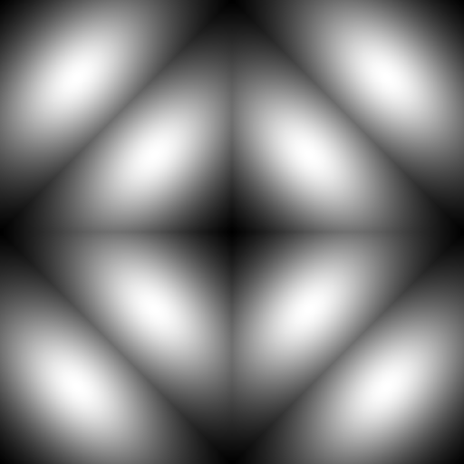

# Environment Lighting  

The name **environment lighting** is from "10.2 Environment Lighting" of [Real-Time Rendering Fourth Edition](https://www.realtimerendering.com/), ["12.6 Infinite Area Lights"](https://pbr-book.org/3ed-2018/Light_Sources/Infinite_Area_Lights) of [PBR Book V3](https://pbr-book.org/3ed-2018/contents), and ["12.5 Infinite Area Lights"](https://pbr-book.org/4ed/Light_Sources/Infinite_Area_Lights) of [PBR Book V4](https://pbr-book.org/4ed/contents), while the **environment lighting** is called [HDRI Sky](https://docs.unity3d.com/Packages/com.unity.render-pipelines.high-definition@10.10/manual/Override-HDRI-Sky.html) in Unity3D and [Sky Light](https://dev.epicgames.com/documentation/en-us/unreal-engine/sky-light?application_version=4.27) in UnrealEngine.  

By "10.2 Environment Lighting" of [Real-Time Rendering Fourth Edition](https://www.realtimerendering.com/), "14.4 The Light Transport Equation" of [PBR Book V3](https://pbr-book.org/3ed-2018/Light_Transport_I_Surface_Reflection/The_Light_Transport_Equation#) and "13.1 The Light Transport Equation" of [PBR Book V4](https://pbr-book.org/4ed/Light_Transport_I_Surface_Reflection/The_Light_Transport_Equation#), the most important difference between **local illumination** and **global illumination** is that the shading algorithm of the local illumination is independent of the other positions on the surface except the shading position.  

When we are discussing the environment lighting, the position parameter $\displaystyle \overrightarrow{p}$ of most functions, such as $\displaystyle \operatorname{f}(\overrightarrow{p}, \overrightarrow{\omega_i}, \overrightarrow{\omega_o})$, $\displaystyle \operatorname{L_o}(\overrightarrow{p}, \overrightarrow{\omega_o})$ and $\displaystyle \operatorname{L_i}(\overrightarrow{p}, \overrightarrow{\omega_i})$, is omitted. This means that the environment lighting belongs to the local illumination.  

Notation | Description | Shader Code Convention  
:-: | :-: | :-:  
$\displaystyle \overrightarrow{\omega_i}$ | Incident Direction in Tangent Space | L  
$\displaystyle \overrightarrow{\omega_o}$ | Outgoing Direction in Tangent Space | V  
$\displaystyle \operatorname{f}(\overrightarrow{\omega_i}, \overrightarrow{\omega_o})$ | BRDF | N/A
$\displaystyle \operatorname{L_i}( \overrightarrow{\omega_i})$ | Incident Radiance | N/A
$\displaystyle \operatorname{L_o}( \overrightarrow{\omega_o})$ | Outgoing Radiance | N/A  
$\displaystyle \max(0, \cos \theta_i)$ | Clamped Cosine | clamp(dot(N, L), 0.0, 1.0)  
$\displaystyle \overrightarrow{\omega_h}$ | Half Vector in Tangent Space | H  
$\displaystyle \overrightarrow{n}$ | Normal in World Space | N  

## 1\. Light  

Let $\displaystyle \operatorname{L}(\overrightarrow{\omega})$ be the distant radiance distribution which is represented by the image **environment map**.  

By "10.4 Environment Mapping" [Real-Time Rendering Fourth Edition](https://www.realtimerendering.com/), there are many approaches to project the points on the sphere surface into the 2D texture coordinates, e.g. **cube map** (supported directly by Vulkan/Direct3D APIs),  **latitude-longitude map** (supported by PBRT V3), **octahedron map** (supported by PBRT V4), etc.  
  
TODO:   
[Lower Hemisphere is Solid Color](https://dev.epicgames.com/documentation/en-us/unreal-engine/sky-light?application_version=4.27)  
[Upper Hemisphere Only](https://docs.unity3d.com/Packages/com.unity.render-pipelines.high-definition@10.8/manual/Override-HDRI-Sky.html)  
[Upper Hemisphere Lux Value](https://docs.unity3d.com/Packages/com.unity.render-pipelines.high-definition@10.8/manual/Override-HDRI-Sky.html)  

TODO: octahedron mapping  
"16.6 Compression and Precision" of [Real-Time Rendering Fourth Edition](https://www.realtimerendering.com/)  
["12.5.2 Image Infinite Lights"](https://pbr-book.org/4ed/Light_Sources/Infinite_Area_Lights) of [PBR Book V4](https://pbr-book.org/4ed/contents)  

## 2\. Interaction with Diffuse Material (Lambert)  

Let $\displaystyle \operatorname{L}(\overrightarrow{\omega})$ be the distant radiance distribution of which the domain $\displaystyle \overrightarrow{\omega}$ is in world space.  

Let $\displaystyle \overrightarrow{n}$ be the normal in world space and $\displaystyle \overrightarrow{\omega_i}$ be the incident direction in tangent space (where the normal direction is the Z axis $\displaystyle \begin{bmatrix}0 & 0 & 1\end{bmatrix}$). Evidently, the incident direction in world space can be calculated as $\displaystyle \operatorname{R}(\overrightarrow{n}) \overrightarrow{\omega_i}$ where $\displaystyle \operatorname{R}(\overrightarrow{n})$ is the rotation matrix depending on the normal direction $\displaystyle \overrightarrow{n}$ in world space. And we have the incident radiance $\displaystyle \operatorname{L_i}( \overrightarrow{\omega_i}) = \operatorname{L}(\operatorname{R}(\overrightarrow{n}) \overrightarrow{\omega_i})$.  

Since the Lambert BRDF $\displaystyle \operatorname{f}(\overrightarrow{\omega_i}, \overrightarrow{\omega_o}) = \frac{1}{\pi} \rho_{hd}$ is constant, we have $\displaystyle \operatorname{L_o}(\overrightarrow{\omega_o}) = \int_{\mathrm{S}^2} \operatorname{f}(\overrightarrow{\omega_i}, \overrightarrow{\omega_o}) \operatorname{L_i}(\overrightarrow{\omega_i}) \max(0, \cos \theta_i) \, d \overrightarrow{\omega_i} = \frac{1}{\pi} \rho_{hd} \cdot \operatorname{E}(\overrightarrow{n})$ where $\displaystyle \operatorname{E}(\overrightarrow{n}) = \int_{\mathrm{S}^2} \operatorname{L_i}(\overrightarrow{\omega_i}) \max(0, \cos \theta_i) \, d \overrightarrow{\omega_i} = \int_{\mathrm{S}^2} \operatorname{L}(\operatorname{R}(\overrightarrow{n}) \overrightarrow{\omega_i}) \max(0, \cos \theta_i) \, d \overrightarrow{\omega_i}$.  

### 2-1\. SH convolution

Analogous to the **convolution theorem**,  by \[Ramamoorthi 2001 A\], we have $\displaystyle \operatorname{E}(\overrightarrow{n}) = \int_{\mathrm{S}^2} \operatorname{L_i}(\overrightarrow{\omega_i}) \max(0, \cos \theta_i) \, d \overrightarrow{\omega_i} = \int_{\mathrm{S}^2} \operatorname{L}(\operatorname{R}(\overrightarrow{n}) \overrightarrow{\omega_i}) \max(0, \cos \theta_i) \, d \overrightarrow{\omega_i} = \sum_{l = 0}^{\infin} \sum_{m = -l}^l \sqrt{\frac{4 \pi}{2l + 1}} L_l^m A_l \operatorname{\Upsilon_l^m}(\overrightarrow{n})$ where $\displaystyle L_l^m = \operatorname{\mathcal{SH}}(\operatorname{L}(\overrightarrow{\omega})) = \int_{\mathrm{S}^2} \operatorname{L}(\overrightarrow{\omega}) \operatorname{\Upsilon_l^m}(\overrightarrow{\omega}) \, d\overrightarrow{\omega}$ and $\displaystyle A_l = \operatorname{\mathcal{ZH}}(\max(0, \cos \theta_i)) = \int_{\mathrm{S}^2} \max(0, \cos \theta_i) \operatorname{\Upsilon_l^0}(\overrightarrow{\omega_i}) \, d\overrightarrow{\omega_i}$.  

> Proof (You may reference Appendix A-1\. SH (Spherical Harmonics)) 
>  
>> By "SH Rotational Invariance", we have $\displaystyle \operatorname{L}(\operatorname{R}(\overrightarrow{n}) \overrightarrow{\omega_i}) = \sum_{l = 0}^{\infin} \begin{bmatrix} L_l^{-l} & \cdots & L_l^0 & \cdots & L_l^l \end{bmatrix} \operatorname{D_l}(\operatorname{R}(\overrightarrow{n})) \begin{bmatrix} \operatorname{\Upsilon_l^{-l}}(\overrightarrow{\omega_i}) \\ \vdots \\ \operatorname{\Upsilon_l^0}(\overrightarrow{\omega_i}) \\ \vdots \\ \operatorname{\Upsilon_l^l}(\overrightarrow{\omega_i}) \end{bmatrix}$ where $\displaystyle \operatorname{D_l}(\operatorname{R}(\overrightarrow{n}))$ is the Wigner D-matrix.  
>  
>> Due to circular symmetry of the clamped cosine, only the coefficients of the ZH(Zonal Harmonics) are non-zero. By "SH Projection", we have $\displaystyle \max(0, \cos \theta_i) = \sum_{l = 0}^{\infin} A_l \operatorname{\Upsilon_l^0}(\overrightarrow{\omega_i})$.  
>  
>> By "SH Product Integration", due to the orthonormality of the SH basis, only the elements $\displaystyle \operatorname{D_{m0}^l}(\operatorname{R}(\overrightarrow{n}))$ of the Wigner D-matrix are multiplied by the non-zero term, and we have $\displaystyle \operatorname{E}(\overrightarrow{n}) = \int_{\mathrm{S}^2} \operatorname{L}(\operatorname{R}(\overrightarrow{n}) \overrightarrow{\omega_i}) \max(0, \cos \theta_i) \, d \overrightarrow{\omega_i} = \int_{\mathrm{S}^2} \left \lparen \sum_{l = 0}^{\infin} \begin{bmatrix} L_l^{-l} & \cdots & L_l^0 & \cdots & L_l^l \end{bmatrix} \operatorname{D_l}(\operatorname{R}(\overrightarrow{n})) \begin{bmatrix} \operatorname{\Upsilon_l^{-l}}(\overrightarrow{\omega_i}) \\ \vdots \\ \operatorname{\Upsilon_l^0}(\overrightarrow{\omega_i}) \\ \vdots \\ \operatorname{\Upsilon_l^l}(\overrightarrow{\omega_i}) \end{bmatrix} \right \rparen \left \lparen \sum_{l = 0}^{\infin} A_l \operatorname{\Upsilon_l^0}(\overrightarrow{\omega_i}) \right \rparen \, d \overrightarrow{\omega_i} = \sum_{l = 0}^{\infin} \sum_{m = -l}^l L_l^m A_l \operatorname{D_{m0}^l}(\operatorname{R}(\overrightarrow{n}))$.  
>  
>> By "Equation \(23\)" of \[Ramamoorthi 2001 A\], we have $\displaystyle \operatorname{D_{m0}^l}(\operatorname{R}(\overrightarrow{n})) = \sqrt{\frac{4 \pi}{2l + 1}} \operatorname{\Upsilon_l^m}(\overrightarrow{n})$, and we have $\displaystyle \operatorname{E}(\overrightarrow{n}) = \sum_{l = 0}^{\infin} \sum_{m = -l}^l L_l^m A_l \operatorname{D_{m0}^l}(\operatorname{R}(\overrightarrow{n})) = \sum_{l = 0}^{\infin} \sum_{m = -l}^l \sqrt{\frac{4 \pi}{2l + 1}} L_l^m A_l \operatorname{\Upsilon_l^m}(\overrightarrow{n})$.  
>    

### 2-2\. Environment Map Distortion  
 
We merely use **numerical quadrature** rather than **Monte Carlo integration** to integrate over the environment map. But it should be noted that the **solid angle** subtended by each **texel** of the environment map is NOT the same.   

#### 2-2-1\. Cube Map  

Let ```ndc_x``` and ```ndc_y``` be the 2D normalized device coordinate within the same cube face. Let ```texture_width``` and ```texture_height``` be the texture size of each cube face.  
  
By "5.5.3 Integrals over Area" of [PBRT Book V3](https://pbr-book.org/3ed-2018/Color_and_Radiometry/Working_with_Radiometric_Integrals#IntegralsoverArea) and "4.2.3 Integrals over Area" of [PBR Book V4](https://pbr-book.org/4ed/Radiometry,_Spectra,_and_Color/Working_with_Radiometric_Integrals#IntegralsoverArea), we have $\displaystyle d\omega = \frac{dA \cos \theta}{r^2} = dA \cdot \cos \theta \cdot \frac{1}{r^2} = \frac{(1 - (-1)) \cdot (1 - (-1))}{\text{texture\_width} \cdot \text{texture\_height}} \cdot \frac{1}{\sqrt{1^2 + {\text{ndc\_x}}^2 +{\text{ndc\_y}}^2}} \cdot \frac{1}{1^2 + {\text{ndc\_x}}^2 +{\text{ndc\_y}}^2} = \frac{4}{\sqrt{1^2 + {\text{ndc\_x}}^2 +{\text{ndc\_y}}^2} \cdot (1^2 + {\text{ndc\_x}}^2 +{\text{ndc\_y}}^2)} \cdot \frac{1}{\text{texture\_width} \cdot \text{texture\_height}}$.   

Actually, the pseudo code ```fWt = 4/(sqrt(fTmp)*fTmp)``` by "Projection from Cube Maps" of \[Sloan 2008\] is exactly the $\displaystyle \frac{4}{\sqrt{1^2 + {\text{ndc\_x}}^2 +{\text{ndc\_y}}^2} \cdot (1^2 + {\text{ndc\_x}}^2 +{ndc_y}^2)}$. The common factor $\displaystyle \frac{1}{\text{texture\_width} \cdot \text{texture\_height}}$ is extracted, and thus is NOT calculated by \[Sloan 2008\].   

The solid angle subtended by each texel of the cube map is calculated by [SHProjectCubeMap](https://github.com/microsoft/DirectXMath/blob/jul2018b/SHMath/DirectXSHD3D11.cpp#L341) in DirectXMath and [DiffuseIrradianceCopyPS](https://github.com/EpicGames/UnrealEngine/blob/4.27/Engine/Shaders/Private/ReflectionEnvironmentShaders.usf#L448) in UnrealEngine.  

Here is the MATLAB code to visualize the solid angle subtended by each texel within the same cube face ```fWt = 4/(sqrt(fTmp)*fTmp)```.  

  

```MATLAB
% texture size of each cube face
texture_width = single(512.0);
texture_height = single(512.0);

[ width_index, height_index ] = meshgrid((single(0.0) : (texture_width - single(1.0))), (single(0.0) : (texture_height - single(1.0))));
ndc_x = (width_index + single(0.5)) ./ texture_width .* single(2.0) - single(1.0);
ndc_y = (height_index + single(0.5)) ./ texture_height .* single(2.0) - single(1.0);

% calculate the texel solid angle weight of each texel within the same cube face
% the common factor "1 / (texture_width * texture_height)" is extracted, and thus is NOT calculated in the "fWt = 4/(sqrt(fTmp)*fTmp)"
d_a_mul_texture_size = (single(1.0) - single(-1.0)) * (single(1.0) - single(-1.0));
r_2 = single(1.0) .* single(1.0) + single(ndc_x) .* single(ndc_x) + single(ndc_y) .* single(ndc_y);
cos_theta = single(1.0) ./ sqrt(r_2);
d_omega_mul_texture_size = single(d_a_mul_texture_size) .* single(cos_theta) ./ single(r_2);

max_d_omega_mul_texture_size = max(max(d_omega_mul_texture_size));
% output: "max solid angle weight: 3.999954" // ndc_x = 0 ndc_y = 0
printf("max solid angle weight: %f \n", max_d_omega_mul_texture_size);

min_d_omega_mul_texture_size = min(min(d_omega_mul_texture_size));
% output: "min solid angle weight: 0.772814"
printf("min solid angle weight: %f \n", min_d_omega_mul_texture_size);

solid_angle_weight_image = uint8(255 * (d_omega_mul_texture_size / max_d_omega_mul_texture_size));
imwrite(solid_angle_weight_image, 'Environment-Lighting-Cube-Map-Texel-Solid-Angle-Weight.png');

sum_d_omega = sum(sum(d_omega_mul_texture_size)) / texture_width / texture_height;
% output: "sum solid angle: 2.094397" // 4 * PI / 6
printf("sum solid angle: %f \n", sum_d_omega);
```    

#### 2-2-2\. Octahedron Map  

Let ```ndc_x``` and ```ndc_y``` be the 2D normalized device coordinate.  

By "5.5.3 Integrals over Area" of [PBRT Book V3](https://pbr-book.org/3ed-2018/Color_and_Radiometry/Working_with_Radiometric_Integrals#IntegralsoverArea) and "4.2.3 Integrals over Area" of [PBR Book V4](https://pbr-book.org/4ed/Radiometry,_Spectra,_and_Color/Working_with_Radiometric_Integrals#IntegralsoverArea), we have $\displaystyle d\omega = \frac{d A_{\text{OCT}} \cos \theta}{r^2} = d A_{\text{OCT}} \cdot \cos \theta \cdot \frac{1}{r^2} = (\sqrt{3} \cdot dA_{\text{NDC}}) \cdot \cos \theta \cdot \frac{1}{r^2} = (\sqrt{3} \cdot \frac{(1 - (-1)) \cdot (1 - (-1))}{\text{texture\_width} \cdot \text{texture\_height}}) \cdot \frac{\frac{1}{\sqrt{3}}(|\text{oct\_x}| + |\text{oct\_y}| + |\text{oct\_z}|)}{\sqrt{{\text{oct\_x}}^2 + {\text{oct\_y}}^2 + {\text{oct\_z}}^2}} \cdot \frac{1}{{\text{oct\_x}}^2 + {\text{oct\_y}}^2 + {\text{oct\_z}}^2} = \frac{4 (|\text{oct\_x}| + |\text{oct\_y}| + |\text{oct\_z}|)}{\sqrt{{\text{oct\_x}}^2 + {\text{oct\_y}}^2 + {\text{oct\_z}}^2} \cdot ({\text{oct\_x}}^2 + {\text{oct\_y}}^2 + {\text{oct\_z}}^2)} \cdot \frac{1}{\text{texture\_width} \cdot \text{texture\_height}}$  

Here is the MATLAB code to visualize the solid angle subtended by each texel.  

  

```MATLAB
% texture size
texture_width = single(512.0);
texture_height = single(512.0);

[ width_index, height_index ] = meshgrid((single(0.0) : (texture_width - single(1.0))), (single(0.0) : (texture_height - single(1.0))));
ndc_x = (width_index + single(0.5)) ./ texture_width .* single(2.0) - single(1.0);
ndc_y = (height_index + single(0.5)) ./ texture_height .* single(2.0) - single(1.0);

% octahedron unmap
octahedron_surface_z = single(1.0) - abs(ndc_x) - abs(ndc_y);

upper_hemisphere = (octahedron_surface_z > 0);

octahedron_surface_x = zeros(size(upper_hemisphere));
octahedron_surface_y = zeros(size(upper_hemisphere));

octahedron_surface_x(find(upper_hemisphere)) = ndc_x(find(upper_hemisphere));
octahedron_surface_y(find(upper_hemisphere)) = ndc_y(find(upper_hemisphere));

octahedron_surface_x(find(~upper_hemisphere)) = (single(1.0) - abs(ndc_y(find(~upper_hemisphere)))) .* (single(ndc_x(find(~upper_hemisphere)) >= single(0.0)) * single(2.0) - single(1.0));
octahedron_surface_y(find(~upper_hemisphere)) = (single(1.0) - abs(ndc_x(find(~upper_hemisphere)))) .* (single(ndc_y(find(~upper_hemisphere)) >= single(0.0)) * single(2.0) - single(1.0));

% surf(octahedron_surface_x, octahedron_surface_y, octahedron_surface_z, 'EdgeColor', 'none');

% calculate the texel solid angle weight of each texel within the cube face
% the common factor "1 / (texture_width * texture_height)" is extracted, and thus is NOT calculated here
d_a_mul_texture_size = (single(1.0) - single(-1.0)) * (single(1.0) - single(-1.0));
r_2 = single(octahedron_surface_x) .* single(octahedron_surface_x) + single(octahedron_surface_y) .* single(octahedron_surface_y) + single(octahedron_surface_z) .* single(octahedron_surface_z);
% technically, this term should be "sqrt(3) * cos_theta"
cos_theta = (abs(octahedron_surface_x) + abs(octahedron_surface_y) + abs(octahedron_surface_z)) ./ sqrt(r_2);
d_omega_mul_texture_size = single(d_a_mul_texture_size) .* single(cos_theta) ./ single(r_2);

max_d_omega_mul_texture_size = max(max(d_omega_mul_texture_size));
% output: "max solid angle: 20.784372"
printf("min solid angle weight: %f \n", max_d_omega_mul_texture_size);

min_d_omega_mul_texture_size = min(min(d_omega_mul_texture_size));
% output: "min solid angle weight: 4.023506" // ndc_x = 0 ndc_y = 0
printf("min solid angle weight: %f \n", min_d_omega_mul_texture_size);

% surf(ndc_x, ndc_y, d_omega_mul_texture_size, 'EdgeColor', 'none');

solid_angle_weight_image = uint8(255 * (d_omega_mul_texture_size / max_d_omega_mul_texture_size));
imwrite(solid_angle_weight_image, 'Environment-Lighting-Octahedron-Map-Texel-Solid-Weight.png');

sum_d_omega = sum(sum(d_omega_mul_texture_size)) / texture_width / texture_height;
% output: "sum solid angle: 12.566369" // 4 * PI
printf("sum solid angle: %f \n", sum_d_omega);
```

### 2-3\. Clamped Cosine  

By \[Ramamoorthi 2001 B\], $\displaystyle \sqrt{\frac{4 \pi}{2l + 1}} A_l$ is constant and can be pre-integrated. For example, by "5.5.1 Integrals over Projected Solid Angle" of [PBR Book V3](https://pbr-book.org/3ed-2018/Color_and_Radiometry/Working_with_Radiometric_Integrals#IntegralsoverProjectedSolidAngle) and "4.2.1 Integrals over Projected Solid Angle" of [PBR Book V4](https://pbr-book.org/4ed/Radiometry,_Spectra,_and_Color/Working_with_Radiometric_Integrals#IntegralsoverProjectedSolidAngle), $\displaystyle A_0$ can pre-integrated as $\displaystyle A_0 = \int_{\mathrm{S}^2} (\cos \theta)^+ \operatorname{\Upsilon_0^0}(\overrightarrow{\omega}) \, d \overrightarrow{\omega} = \int_{\mathrm{S}^2} (\cos \theta)^+ \frac{1}{2 \sqrt{\pi}} \, d \overrightarrow{\omega} = \frac{1}{2 \sqrt{\pi}} \int_{\mathrm{S}^2} (\cos \theta)^+ \, d \overrightarrow{\omega} = \frac{1}{2 \sqrt{\pi}} \int_{\mathrm{S}^2} \, d \overrightarrow{\omega}^{\perp} = \frac{1}{2 \sqrt{\pi}} \pi$. These constants are calculated by [CalcDiffuseTransferSH3](https://github.com/EpicGames/UnrealEngine/blob/4.27/Engine/Shaders/Private/SHCommon.ush#L285) in UnrealEngine.  

  l | $\displaystyle \sqrt{\frac{4 \pi}{2l + 1}}$ | $\displaystyle A_l$ | $\displaystyle \sqrt{\frac{4 \pi}{2l + 1}} A_l$  
:-: | :-: | :-: | :-:  
  0 | $\displaystyle 2 \sqrt{\pi}$ | $\displaystyle \frac{1}{2 \sqrt{\pi}} \pi$ | $\displaystyle \pi$  
  1 | $\displaystyle \frac{2 \sqrt{\pi}}{\sqrt{3}}$ | $\displaystyle \frac{\sqrt{3}}{2 \sqrt{\pi}} \frac{2\pi}{3}$ | $\displaystyle \frac{2 \pi}{3}$  
  2 | $\displaystyle \frac{2 \sqrt{\pi}}{\sqrt{5}}$ | $\displaystyle \frac{\sqrt{5}}{2 \sqrt{\pi}} \frac{\pi}{4}$ | $\displaystyle \frac{\pi}{4}$  

### 2-4\. Form Factor  

"Appendix A10" of \[Sloan 2008\] proposed a more efficient approach to reconstruct from SH basis than \[Ramamoorthi 2001 B\]. This approach is used by [SampleSH9](https://github.com/Unity-Technologies/Graphics/blob/v10.8.0/com.unity.render-pipelines.core/ShaderLibrary/EntityLighting.hlsl#L37) in Unity3D and [GetSkySHDiffuse](https://github.com/EpicGames/UnrealEngine/blob/4.27/Engine/Shaders/Private/ReflectionEnvironmentShared.ush#L79) in UnrealEngine.  
However, it was **form factor** rather than **irradiance** that "Appendix A10" of \[Sloan 2008\] calculated. Although the terms **irradiance** and **form factor** may be interchangeably used, technically **irradiance** should NOT be divided by $\displaystyle \pi$. This means that $\displaystyle \operatorname{E}(\overrightarrow{n}) = \pi \operatorname{F}(\overrightarrow{n})$. This form factor is calculated by [PackCoefficients](https://github.com/Unity-Technologies/Graphics/blob/v10.8.0/com.unity.render-pipelines.high-definition/Runtime/Lighting/SphericalHarmonics.cs#L196) in Unity3D, and [SetupSkyIrradianceEnvironmentMapConstantsFromSkyIrradiance](https://github.com/EpicGames/UnrealEngine/blob/4.27/Engine/Source/Runtime/Renderer/Private/SceneRendering.cpp#L979) and [ComputeSkyEnvMapDiffuseIrradianceCS](https://github.com/EpicGames/UnrealEngine/blob/4.27/Engine/Shaders/Private/ReflectionEnvironmentShaders.usf#L607) in UnrealEngine.  
And since the value reconstructed from SH basis is form factor rather than irradiance, it should be multiplied by albedo rather than Lambert BRDF. This multiplication is calculated by [GetDiffuseOrDefaultColor](https://github.com/Unity-Technologies/Graphics/blob/v10.8.0/com.unity.render-pipelines.high-definition/Runtime/Material/Lit/Lit.hlsl#L1237) in Unity3D and [EnvBRDFApproxFullyRough](https://github.com/EpicGames/UnrealEngine/blob/4.27/Engine/Shaders/Private/BasePassPixelShader.usf#L1138) in UnrealEngine.  

  fc | value  
 :-: | :-:  
 fc0 | $\displaystyle \frac{1}{\pi} \operatorname{\Upsilon_0^0} A_0 = \frac{1}{\pi} \frac{1}{2 \sqrt{\pi}} \pi = \frac{1}{2 \sqrt{\pi}}$  
 fc1 | $\displaystyle \frac{1}{\pi} \operatorname{\Upsilon_1^0} A_1 = \frac{1}{\pi} \frac{\sqrt{3}}{2 \sqrt{\pi}} \frac{2 \pi}{3} = \frac{\sqrt{3}}{3 \sqrt{\pi}}$  
 fc2 | $\displaystyle \frac{1}{\pi} \operatorname{\Upsilon_2^{-2}} A_2 = \frac{1}{\pi} \frac{\sqrt{15}}{2 \sqrt{\pi}} \frac{\pi}{4} = \frac{\sqrt{15}}{8 \sqrt{\pi}}$  
 fc3 | $\displaystyle \frac{1}{\pi} (-\operatorname{\Upsilon_2^0}) A_2 = \frac{1}{\pi} \frac{\sqrt{5}}{4 \sqrt{\pi}} \frac{\pi}{4} = \frac{\sqrt{5}}{16 \sqrt{\pi}}$  
 0.3 * fc3 | $\displaystyle \frac{1}{\pi} \operatorname{\Upsilon_2^0} A_2 = \frac{1}{\pi} \frac{3 \sqrt{5}}{4 \sqrt{\pi}} \frac{\pi}{4} = \frac{3 \sqrt{5}}{16 \sqrt{\pi}}$  
 fc4 | $\displaystyle \frac{1}{\pi} \operatorname{\Upsilon_2^2} A_2 = \frac{1}{\pi} \frac{\sqrt{15}}{4 \sqrt{\pi}} \frac{\pi}{4} = \frac{\sqrt{15}}{16 \sqrt{\pi}}$  

## 3\. Interaction with Specular Material (Trowbridge-Reitz)  

Let $\displaystyle \operatorname{L}(\overrightarrow{\omega})$ be the distant radiance distribution.  

[Split Sum Approximation](https://zero-radiance.github.io/post/split-sum/)  

Evidently, we have $\displaystyle \operatorname{L_o}(\overrightarrow{\omega_o}) = \int_{\mathrm{S}^2} \operatorname{f}(\overrightarrow{\omega_i}, \overrightarrow{\omega_o}) \operatorname{L_i}(\overrightarrow{\omega_i}) \max(0, \cos \theta_i) \, d \overrightarrow{\omega_i} = \frac{\int_{\mathrm{S}^2} \operatorname{f}(\overrightarrow{\omega_i}, \overrightarrow{\omega_o}) \operatorname{L_i}(\overrightarrow{\omega_i}) \max(0, \cos \theta_i) \, d \overrightarrow{\omega_i}}{\int_{\mathrm{S}^2} \operatorname{f}(\overrightarrow{\omega_i}, \overrightarrow{\omega_o}) \max(0, \cos \theta_i) \, d \overrightarrow{\omega_i}} \cdot \int_{\mathrm{S}^2} \operatorname{f}(\overrightarrow{\omega_i}, \overrightarrow{\omega_o}) \max(0, \cos \theta_i) \, d \overrightarrow{\omega_i} = \operatorname{LD}(\overrightarrow{\omega_o}) \cdot \operatorname{DFG}(\overrightarrow{\omega_o})$ where $\displaystyle \operatorname{LD}(\overrightarrow{\omega_o}) = \frac{\int_{\mathrm{S}^2} \operatorname{f}(\overrightarrow{\omega_i}, \overrightarrow{\omega_o}) \operatorname{L_i}(\overrightarrow{\omega_i}) \max(0, \cos \theta_i) \, d \overrightarrow{\omega_i}}{\int_{\mathrm{S}^2} \operatorname{f}(\overrightarrow{\omega_i}, \overrightarrow{\omega_o}) \max(0, \cos \theta_i) \, d \overrightarrow{\omega_i}}$ and $\operatorname{DFG}(\overrightarrow{\omega_o}) = \int_{\mathrm{S}^2} \operatorname{f}(\overrightarrow{\omega_i}, \overrightarrow{\omega_o}) \max(0, \cos \theta_i) \, d \overrightarrow{\omega_i}$.  
   
### 3-1\. DFG Term

By "Equation \(9.9\)" of [Real-Time Rendering Fourth Edition](https://www.realtimerendering.com/), ["Equation \(8.1\)"](https://www.pbr-book.org/3ed-2018/Reflection_Models/Basic_Interface) of [PBR Book V3](https://pbr-book.org/3ed-2018/contents), ["Equation \(4.12\)"](https://www.pbr-book.org/4ed/Radiometry,_Spectra,_and_Color/Surface_Reflection) of [PBR Book V4](https://pbr-book.org/4ed/contents), the **DFG term** is literally the **HDR (Hemispherical Directional Reflectance)** $\displaystyle \operatorname{\rho_{hd}}(\overrightarrow{\omega_o}) = \int_{\mathop{\mathrm{H^2}}(\overrightarrow{n})} \operatorname{f}(\overrightarrow{\omega_i}, \overrightarrow{\omega_o}) \cos \theta_i \, d \overrightarrow{\omega_i}$.   

This integral can be calculated in the tangent space, where the normal direction is Z axis $\displaystyle \begin{bmatrix}0 & 0 & 1\end{bmatrix}$, $\displaystyle \operatorname{\rho_{hd}}(\overrightarrow{\omega_o}) = \int_{\mathop{\mathrm{H^2}}(\overrightarrow{n})} \operatorname{f}(\overrightarrow{\omega_i}, \overrightarrow{\omega_o}) \cos \theta_i = \int_{\mathop{\mathrm{H^2}}(\overrightarrow{\begin{bmatrix}0 & 0 & 1\end{bmatrix}})} \operatorname{f}(\overrightarrow{\omega_i}, \overrightarrow{\omega_o}) \max (0, \overrightarrow{\begin{bmatrix}0 & 0 & 1\end{bmatrix}} \cdot \overrightarrow{\omega_i}) \, d \overrightarrow{\omega_i}$. This means that this integral is independent of the normal direction and can be determined solely by the view direction in tangent space.  

By ["13.4 A Better Path Tracer"](https://pbr-book.org/4ed/Light_Transport_I_Surface_Reflection/A_Better_Path_Tracer) of [PBR Book V4](https://pbr-book.org/4ed/contents), the **HDR (Hemispherical Directional Reflectance)** is also called **albedo**. For example, the albedo of the Lambert BRDF can be calculated analytically $\displaystyle \mathop{\mathrm{\rho_{hd}}} (\overrightarrow{\omega_o}) = \int_{\mathop{\mathrm{H^2}}(\overrightarrow{n})} \operatorname{f}(\overrightarrow{\omega_i}, \overrightarrow{\omega_o}) \cos \theta_i \, d \overrightarrow{\omega_i} = \int_{\mathop{\mathrm{H^2}}(\overrightarrow{n})} \frac{1}{\pi} \rho_{hd} \cos \theta_i \, d \overrightarrow{\omega_i} = \frac{1}{\pi} \rho_{hd} \int_{\mathop{\mathrm{H^2}}(\overrightarrow{n})} \cos \theta_i \, d \overrightarrow{\omega_i} = \frac{1}{\pi} \rho_{hd} \int_{\mathop{\mathrm{H^2}}(\overrightarrow{n})} \, d \overrightarrow{\omega_i}^{\perp} = \rho_{hd} \frac{1}{\pi} \pi = \rho_{hd}$.  
 
By ["Equation \(13.3\)"](https://pbr-book.org/3ed-2018/Monte_Carlo_Integration/The_Monte_Carlo_Estimator) of [PBRT-V3](https://pbr-book.org/3ed-2018/contents), we have the **Monte Carlo estimator** $\displaystyle \mathop{\mathrm{\rho_{hd}}}(\overrightarrow{\omega_o}) = \int_{\mathop{\mathrm{H^2}}(\overrightarrow{n})} \operatorname{f}(\overrightarrow{\omega_i}, \overrightarrow{\omega_o}) \cos \theta_i \, d \overrightarrow{\omega_i} = \frac{1}{N} \sum_{i=1}^N \frac{\operatorname{f}(\overrightarrow{\omega_i}, \overrightarrow{\omega_o}) \cos \theta_i}{\displaystyle \operatorname{p}(\overrightarrow{\omega_i}, \overrightarrow{\omega_o})}$.  

Firstly, $\displaystyle \operatorname{D}(\overrightarrow{\omega_h})$ exists in both $\displaystyle \operatorname{f}(\overrightarrow{\omega_i}, \overrightarrow{\omega_o})$ and $\displaystyle \operatorname{p}(\overrightarrow{\omega_i}, \overrightarrow{\omega_o})$ (You may reference Appendix A-2\. Monte Carlo Integration). This means that $\displaystyle \operatorname{D}(\overrightarrow{\omega_h})$ can be omitted when calculating the integral.  

Secondly, by "Equation \(9\)" of \[Karis 2013\], the Fresnel term can be treated separately. This means that we have $\displaystyle \operatorname{\rho_{hd}}(\overrightarrow{\omega_o}) = \int_{\mathop{\mathrm{H^2}}(\overrightarrow{n})} [F_0 + (F_{90} - F_0) {(1.0 - \overrightarrow{\omega_o} \cdot \overrightarrow{\omega_h})}^5] \operatorname{DV}(\overrightarrow{\omega_i}, \overrightarrow{\omega_o}) \, d \overrightarrow{\omega_i} = F_0 \cdot \operatorname{n_R}(\overrightarrow{\omega_o}) + F_{90} \cdot \operatorname{n_G}(\overrightarrow{\omega_o})$ where $\displaystyle \operatorname{n_R}(\overrightarrow{\omega_o}) = \int_{\mathop{\mathrm{H^2}}(\overrightarrow{n})} [1.0 - {(1.0 - \overrightarrow{\omega_o} \cdot \overrightarrow{\omega_h})}^5] \operatorname{DV}(\overrightarrow{\omega_i}, \overrightarrow{\omega_o}) \, d \overrightarrow{\omega_i}$ and $\displaystyle \operatorname{n_G}(\overrightarrow{\omega_o}) = \int_{\mathop{\mathrm{H^2}}(\overrightarrow{n})} {(1.0 - \overrightarrow{\omega_o} \cdot \overrightarrow{\omega_h})}^5 \operatorname{DV}(\overrightarrow{\omega_i}, \overrightarrow{\omega_o}) \, d \overrightarrow{\omega_i}$, and $\displaystyle \operatorname{n_R}(\overrightarrow{\omega_o})$ and $\displaystyle \operatorname{n_G}(\overrightarrow{\omega_o})$ are stored in the LUT.  

The DFG term is pre-integrated by [InitializeFeatureLevelDependentTextures](https://github.com/EpicGames/UnrealEngine/blob/4.27/Engine/Source/Runtime/Renderer/Private/SystemTextures.cpp#L278) in UnrealEngine and [IntegrateGGXAndDisneyDiffuseFGD](https://github.com/Unity-Technologies/Graphics/blob/v10.8.0/com.unity.render-pipelines.core/ShaderLibrary/ImageBasedLighting.hlsl#L340) in Unity3D, and used by [EnvBRDF](https://github.com/EpicGames/UnrealEngine/blob/4.27/Engine/Shaders/Private/ReflectionEnvironmentPixelShader.usf#L334) in UnrealEngine and [GetPreIntegratedFGDGGXAndDisneyDiffuse](https://github.com/Unity-Technologies/Graphics/blob/v10.8.0/com.unity.render-pipelines.high-definition/Runtime/Material/Lit/Lit.hlsl#L1120) in Unity3D.  

### 3-2\. LD Term

#### 3-2-1\. Split Integral Approximation  

By "Equation \(13.3\)" of [PBRT-V3](https://pbr-book.org/3ed-2018/Monte_Carlo_Integration/The_Monte_Carlo_Estimator), we have $\operatorname{LD}(\overrightarrow{\omega_o}) = \frac{\int_{\mathrm{S}^2} \operatorname{f}(\overrightarrow{\omega_i}, \overrightarrow{\omega_o}) \operatorname{L_i}(\overrightarrow{\omega_i}) \max(0, \cos \theta_i) \, d \overrightarrow{\omega_i}}{\int_{\mathrm{S}^2} \operatorname{f}(\overrightarrow{\omega_i}, \overrightarrow{\omega_o}) \max(0, \cos \theta_i) \, d \overrightarrow{\omega_i}} = \frac{\frac{1}{N} \sum_{i=1}^N \frac{\operatorname{f}(\overrightarrow{\omega_i}, \overrightarrow{\omega_o}) \operatorname{L_i}(\overrightarrow{\omega_i}) \max(0, \cos \theta_i)}{\displaystyle \operatorname{p}(\overrightarrow{\omega_i}, \overrightarrow{\omega_o})}}{\frac{1}{N} \sum_{i=1}^N \frac{\operatorname{f}(\overrightarrow{\omega_i}, \overrightarrow{\omega_o}) \max(0, \cos \theta_i)}{\displaystyle \operatorname{p}(\overrightarrow{\omega_i}, \overrightarrow{\omega_o})}} = \frac{\sum_{i=1}^N \frac{\text{D} \cdot \text{F} \cdot \text{G} \cdot \text{L} \cdot (\text{NdotL})^+}{4 \cdot (\text{NdotL})^+ \cdot (\text{NdotV})^+} \frac{4 \cdot (\text{LdotH})^+}{\text{D} \cdot (\text{NdotH})^+}}{\sum_{i=1}^N \frac{\text{D} \cdot \text{F} \cdot \text{G} \cdot (\text{NdotL})^+}{4 \cdot (\text{NdotL})^+ \cdot (\text{NdotV})^+} \frac{4 \cdot (\text{LdotH})^+}{\text{D} \cdot (\text{NdotH})^+}} = \frac{\sum_{i=1}^N \text{L} \frac{\text{F} \cdot \text{G} \cdot (\text{LdotH})^+}{(\text{NdotV})^+ \cdot (\text{NdotH})^+}}{\sum_{i=1}^N \frac{\text{F} \cdot \text{G} \cdot (\text{LdotH})^+}{(\text{NdotV})^+ \cdot (\text{NdotH})^+}} = \frac{\sum_{i=1}^N \text{L} \cdot \text{Weight}}{\sum_{i=1}^N \text{Weight}}$ where $\displaystyle \text{Weight} = \frac{\text{F} \cdot \text{G} \cdot (\text{LdotH})^+}{(\text{NdotV})^+ \cdot (\text{NdotH})^+}$.  

By "Equation \(53\)" of \[Lagarde 2014\], when $\displaystyle \operatorname{L_i}(\overrightarrow{\omega_i})$ is constant, we have $\displaystyle \operatorname{LD}(\overrightarrow{\omega_o}) = \frac{\sum_{i=1}^N \text{L} \cdot \text{Weight}}{\sum_{i=1}^N \text{Weight}} = \frac{\text{L} \cdot \sum_{i=1}^N \text{Weight}}{\sum_{i=1}^N \text{Weight}} = \text{L}$ which does NOT depend on the Weight term. This means that when $\displaystyle \operatorname{L_i}(\overrightarrow{\omega_i})$ is constant, no matter what Weight term we use, we will always have an exact match.    
   
By \[Karis 2013\], assuming that the Weight term equals $\displaystyle \max(0, \cos \theta_i)$, we have the **split integral approximation** $\displaystyle \operatorname{LD}(\overrightarrow{\omega_o}) = \frac{\sum_{i=1}^N \text{L} \cdot \text{Weight}}{\sum_{i=1}^N \text{Weight}} \approx \frac{\sum_{i=1}^N \text{L} \cdot (\text{NdotL})^+}{\sum_{i=1}^N (\text{NdotL})^+}$.    

The LD term is pre-integrated by [FilterCS](https://github.com/EpicGames/UnrealEngine/blob/4.27/Engine/Shaders/Private/ReflectionEnvironmentShaders.usf#L319) in UnrealEngine and [IntegrateLD](https://github.com/Unity-Technologies/Graphics/blob/v10.8.0/com.unity.render-pipelines.core/ShaderLibrary/ImageBasedLighting.hlsl#L532) in Unity3D, and used by [GetSkyLightReflection](https://github.com/EpicGames/UnrealEngine/blob/4.27/Engine/Shaders/Private/ReflectionEnvironmentShared.ush#L38) in UnrealEngine and [SampleEnvWithDistanceBaseRoughness](https://github.com/Unity-Technologies/Graphics/blob/v10.8.0/com.unity.render-pipelines.high-definition/Runtime/Lighting/LightEvaluation.hlsl#L600) in Unity3D.  

#### 3-2-2\. Dimensions   

Ideally, we should use three dimensions: N (world space), NdotV and roughness to look up the pre-integrated LD term.  

By [Karis 2013], roughness is mapped to mip-level.   

The mapping between roughness and mip-level is calculated by [ComputeReflectionCaptureMipFromRoughness](https://github.com/EpicGames/UnrealEngine/blob/4.27/Engine/Shaders/Private/ReflectionEnvironmentShared.ush#L21) and [ComputeReflectionCaptureRoughnessFromMip](https://github.com/EpicGames/UnrealEngine/blob/4.27/Engine/Shaders/Private/ReflectionEnvironmentShared.ush#L30) in UnrealEngine, and [PerceptualRoughnessToMipmapLevel](https://github.com/Unity-Technologies/Graphics/blob/v10.8.0/com.unity.render-pipelines.core/ShaderLibrary/ImageBasedLighting.hlsl#L44) and [MipmapLevelToPerceptualRoughness](https://github.com/Unity-Technologies/Graphics/blob/v10.8.0/com.unity.render-pipelines.core/ShaderLibrary/ImageBasedLighting.hlsl#L61) in Unity3D.  

However, we do NOT have enough remaining dimensions to store both N (world space) and NdotV. By \[Karis 2013\], we assume "V = N" when pre-integrating the LD term, while the reflection direction R is used to look up the LD term when rendering. By "Figure 10.37" of [Real-Time Rendering Fourth Edition](https://www.realtimerendering.com/), by \[Lagarde 2014\], the reflection direction is biased towards the normal direction to reduce the error generated by the non-clipped specular lobe.   

The deviation is calculated by [GetOffSpecularPeakReflectionDir](https://github.com/EpicGames/UnrealEngine/blob/4.27/Engine/Shaders/Private/ReflectionEnvironmentShared.ush#L120) in UnrealEngine and [GetSpecularDominantDir](https://github.com/Unity-Technologies/Graphics/blob/v10.8.0/com.unity.render-pipelines.core/ShaderLibrary/ImageBasedLighting.hlsl#L105) in Unity3D.  

**TODO: If we use the Paraboloid Map, perhaps we can use the 3D texture and provide one dimension for the NdotV. Thus, we can use both N (world space) and NdotV to look up the LD term.**  

#### 3-2-3\. Variance Reduction  

By "20.4 Mipmap Filtered Samples" of \[Colbert 2007\], we use the mip-level $\text{sample\_mip\_level} = \displaystyle \max(0, \log(\sqrt{\frac{d\overrightarrow{\omega_S}}{d\overrightarrow{\omega_P}}}))$ to sample the filtered L value from the distant radiance distribution to reduce the variance. The $\displaystyle d\overrightarrow{\omega_S}$ is the solid angle subtended by the sample, and we have $\displaystyle d\overrightarrow{\omega_S} = \frac{1}{\text{N}} \cdot \frac{1}{\text{PDF}}$. The $\displaystyle d\overrightarrow{\omega_P}$ is the solid angle subtended by a single texel of the zeroth mip-level of the texture, and by "Projection from Cube Maps" of \[Sloan 2008\], we have $\displaystyle d\overrightarrow{\omega_P} = \frac{1}{\text{texture\_width} \cdot \text{texture\_height}} \cdot \frac{4}{\sqrt{1^2 + u^2 +v^2} \cdot (1^2 + u^2 +v^2)}$.  

The $\displaystyle d\overrightarrow{\omega_S}$ is calculated by [SolidAngleSample](https://github.com/EpicGames/UnrealEngine/blob/4.27/Engine/Shaders/Private/ReflectionEnvironmentShaders.usf#L414) in UnrealEngine and [omegaS](https://github.com/Unity-Technologies/Graphics/blob/v10.8.0/com.unity.render-pipelines.core/ShaderLibrary/ImageBasedLighting.hlsl#L500) in Unity3D. And the $\displaystyle d\overrightarrow{\omega_P}$ is calculated by [SolidAngleTexel](https://github.com/EpicGames/UnrealEngine/blob/4.27/Engine/Shaders/Private/ReflectionEnvironmentShaders.usf#L355) in UnrealEngine and [invOmegaP](https://github.com/Unity-Technologies/Graphics/blob/v10.8.0/com.unity.render-pipelines.core/ShaderLibrary/ImageBasedLighting.hlsl#L506) in Unity3D.  

## Appendix

### A-1\. SH (Spherical Harmonics)

#### A-1-1\. SH Basis

Let $\displaystyle \operatorname{\Upsilon_l^m}(\overrightarrow{\omega})$ be the **SH (Spherical Harmonics)** basis function of which l is the degree (or band) and m is the basis function index from -l to l.  

The SH basis function $\displaystyle \operatorname{\Upsilon_l^0}(\overrightarrow{\omega})$ of which the m is zero is also called **ZH (zonal harmonics)**.  

By "Appendix A2" of \[Sloan 2008\], we have the **polynomial forms** of SH basis $\displaystyle \operatorname{\Upsilon_l^m}(\overrightarrow{\omega})$. These polynomial forms are calculated by [sh_eval_basis_2](https://github.com/microsoft/DirectXMath/blob/jul2018b/SHMath/DirectXSH.cpp#L132) in DirectXMath, and [SHBasisFunction3](https://github.com/EpicGames/UnrealEngine/blob/4.27/Engine/Shaders/Private/SHCommon.ush#L226) in UnrealEngine.  

Note that the direction vector $\displaystyle \overrightarrow{\omega} = \begin{bmatrix} x & y & z\end{bmatrix}$ should be **normalized** before using the polynomial forms. By "13.5.3 Spherical Coordinates" of [PBR Book V3](https://pbr-book.org/3ed-2018/Monte_Carlo_Integration/Transforming_between_Distributions#SphericalCoordinates) and "Spherical Coordinates" of "3.8.3 Spherical Parameterizations" of [PBR Book V4](https://pbr-book.org/4ed/Geometry_and_Transformations/Spherical_Geometry#x3-SphericalCoordinates), we have $\displaystyle \overrightarrow{\omega} = \begin{bmatrix} x & y & z\end{bmatrix} = \begin{bmatrix} \sin \theta \cos \phi & \sin \theta \sin \phi & \cos \theta \end{bmatrix}$ where $\displaystyle \phi$ is azimuth and $\displaystyle \theta$ is zenith (in physics, while in mathmatics $\displaystyle \theta$ is the azimuth and $\displaystyle \phi$ is the zenith).   

l  |  m  | $\displaystyle \operatorname{\Upsilon_l^m}(\overrightarrow{\omega})$  
:-: | :-: | :-:  
0  |  0  | $\displaystyle \frac{1}{2 \sqrt{\pi}} = 0.282094791773878140$       
1  | -1  | $\displaystyle - \frac{\sqrt{3}}{2 \sqrt{\pi}} y = -0.488602511902919920 y$     
1  |  0  | $\displaystyle \frac{\sqrt{3}}{2 \sqrt{\pi}} z = 0.488602511902919920 z$     
1  |  1  | $\displaystyle - \frac{\sqrt{3}}{2 \sqrt{\pi}} x = -0.488602511902919920 x$     
2  | -2  | $\displaystyle \frac{\sqrt{15}}{2 \sqrt{\pi}} x y = 1.092548430592079200 x y$  
2  | -1  | $\displaystyle - \frac{\sqrt{15}}{2 \sqrt{\pi}} y z = -1.092548430592079200 y z$    
2  |  0  | $\displaystyle \frac{3 \sqrt{5}}{4 \sqrt{\pi}} z^2 - \frac{\sqrt{5}}{4 \sqrt{\pi}} = 0.946174695757560080 z^2 - 0.315391565252520050$     
2  |  1  | $\displaystyle - \frac{\sqrt{15}}{2 \sqrt{\pi}} x z = -1.092548430592079200 x z$       
2  |  2  | $\displaystyle \frac{\sqrt{15}}{4 \sqrt{\pi}} (x^2 - y^2) = 0.546274215296039590 (x^2 - y^2)$  

#### A-1-2\. SH Rotation

Let $\displaystyle \mathrm{R}$ be the rotation matrix. By "A. Rotation of Spherical Harmonics" of "4. SPHERICAL HARMONIC REPRESENTATION" of \[Ramamoorthi 2001 A\], for each degree (or band) l, we have $\displaystyle \operatorname{\Upsilon_l^m}(\mathrm{R} \overrightarrow{\omega}) = \sum_{j = -l}^l \operatorname{D_{mj}^l}(\mathrm{R}) \operatorname{\Upsilon_l^j}(\overrightarrow{\omega})$ where $\displaystyle \operatorname{D_l}(\mathrm{R})$ is the **Wigner D-matrix**. This means that $\displaystyle \begin{bmatrix} \operatorname{\Upsilon_l^{-l}}(\mathrm{R} \overrightarrow{\omega}) \\ \vdots \\ \operatorname{\Upsilon_l^0}(\mathrm{R} \overrightarrow{\omega}) \\ \vdots \\ \operatorname{\Upsilon_l^l}(\mathrm{R} \overrightarrow{\omega}) \end{bmatrix} = \operatorname{D_l}(\mathrm{R}) \begin{bmatrix} \operatorname{\Upsilon_l^{-l}}(\overrightarrow{\omega}) \\ \vdots \\ \operatorname{\Upsilon_l^0}(\overrightarrow{\omega}) \\ \vdots \\ \operatorname{\Upsilon_l^l}(\overrightarrow{\omega}) \end{bmatrix}$.  

By "Appendix: SH Rotation" of \[Kautz 2002\], for each degree (or band) l, each element of the Wigner D-matrix can be calculated as $\displaystyle \operatorname{D_{ij}^l}(\mathrm{R}) = \int_{\mathrm{S}^2} \operatorname{\Upsilon_l^{i - l}}(\mathrm{R} \overrightarrow{\omega}) \operatorname{\Upsilon_l^{j - l}}(\overrightarrow{\omega}) \, d\overrightarrow{\omega}$.  

For l = 0, we have $\displaystyle \mathrm{D_{00}^0} = \int_{\mathrm{S}^2} \operatorname{\Upsilon_0^0}(\mathrm{R} \overrightarrow{\omega}) \operatorname{\Upsilon_0^0}(\overrightarrow{\omega}) \, d\overrightarrow{\omega} = \int_{\mathrm{S}^2} \frac{1}{2 \sqrt{\pi}} \frac{1}{2 \sqrt{\pi}} \, d\overrightarrow{\omega} = \frac{1}{4\pi} \int_{\mathrm{S}^2} 1 \, d\overrightarrow{\omega} = \frac{1}{4\pi} 4\pi = 1$. This means that $\displaystyle \operatorname{D_l}(\mathrm{R}) = \begin{bmatrix} 1 \end{bmatrix}$.  

For l = 1, it is too complex to calculate the intergral for each element of the Wigner D-matrix. The trick by \[Hable 2014\] can be used to calculate the Wigner D-matrix. Since the equation $\displaystyle \begin{bmatrix} \operatorname{\Upsilon_1^{-1}}(\mathrm{R} \overrightarrow{\omega}) \\ \operatorname{\Upsilon_1^0}(\mathrm{R} \overrightarrow{\omega}) \\ \operatorname{\Upsilon_1^1}(\mathrm{R} \overrightarrow{\omega}) \end{bmatrix} = \operatorname{D_l}(\mathrm{R}) \begin{bmatrix} \operatorname{\Upsilon_1^-1}(\overrightarrow{\omega}) \\ \operatorname{\Upsilon_1^0}(\overrightarrow{\omega}) \\ \operatorname{\Upsilon_1^1}(\overrightarrow{\omega}) \end{bmatrix}$ holds for arbitrary direction $\displaystyle \overrightarrow{\omega}$, we can apply this equation to three linearly independent vectors **$\displaystyle \begin{bmatrix} 1 \\ 0 \\ 0 \end{bmatrix}$**, $\displaystyle \begin{bmatrix} 0 \\ 1 \\ 0 \end{bmatrix}$ and $\displaystyle \begin{bmatrix} 0 \\ 0 \\ 1 \end{bmatrix}$ to construct an invertible matrix. By the **polynomial forms** of SH basis, we have $\displaystyle \begin{bmatrix} \operatorname{\Upsilon_1^{-1}}(\mathrm{R} \overrightarrow{\omega}) \\ \operatorname{\Upsilon_1^0}(\mathrm{R} \overrightarrow{\omega}) \\ \operatorname{\Upsilon_1^1}(\mathrm{R} \overrightarrow{\omega}) \end{bmatrix} = \operatorname{D_l}(\mathrm{R}) \begin{bmatrix} \operatorname{\Upsilon_1^-1}(\overrightarrow{\omega}) \\ \operatorname{\Upsilon_1^0}(\overrightarrow{\omega}) \\ \operatorname{\Upsilon_1^1}(\overrightarrow{\omega}) \end{bmatrix} \Rightarrow$ $\displaystyle \color{red} \begin{bmatrix} 0 & - \frac{\sqrt{3}}{2 \sqrt{\pi}} & 0 \\ 0 & 0 & \frac{\sqrt{3}}{2 \sqrt{\pi}} \\ - \frac{\sqrt{3}}{2 \sqrt{\pi}} & 0 & 0 \end{bmatrix} \mathrm{R} \color{green} \overrightarrow{\omega} \color{red} = \operatorname{D_l}(\mathrm{R}) \begin{bmatrix} 0 & - \frac{\sqrt{3}}{2 \sqrt{\pi}} & 0 \\ 0 & 0 & \frac{\sqrt{3}}{2 \sqrt{\pi}} \\ - \frac{\sqrt{3}}{2 \sqrt{\pi}} & 0 & 0 \end{bmatrix} \color{green} \overrightarrow{\omega} \color{red} \Rightarrow \begin{bmatrix} 0 & - \frac{\sqrt{3}}{2 \sqrt{\pi}} & 0 \\ 0 & 0 & \frac{\sqrt{3}}{2 \sqrt{\pi}} \\ - \frac{\sqrt{3}}{2 \sqrt{\pi}} & 0 & 0 \end{bmatrix} \mathrm{R} \color{green} \begin{bmatrix} 1 & 0 & 0 \\ 0 & 1 & 0 \\ 0 & 0 & 1 \end{bmatrix} \color{red} = \operatorname{D_l}(\mathrm{R}) \begin{bmatrix} 0 & - \frac{\sqrt{3}}{2 \sqrt{\pi}} & 0 \\ 0 & 0 & \frac{\sqrt{3}}{2 \sqrt{\pi}} \\ - \frac{\sqrt{3}}{2 \sqrt{\pi}} & 0 & 0 \end{bmatrix} \color{green} \begin{bmatrix} 1 & 0 & 0 \\ 0 & 1 & 0 \\ 0 & 0 & 1 \end{bmatrix} \color{red}$ $\displaystyle \Rightarrow \begin{bmatrix} 0 & -1 & 0 \\ 0 & 0 & 1 \\ -1 & 0 & 0 \end{bmatrix} \mathrm{R} \begin{bmatrix} 1 & 0 & 0 \\ 0 & 1 & 0 \\ 0 & 0 & 1 \end{bmatrix} = \operatorname{D_l}(\mathrm{R}) \begin{bmatrix} 0 & -1 & 0 \\ 0 & 0 & 1 \\ -1 & 0 & 0 \end{bmatrix} \begin{bmatrix} 1 & 0 & 0 \\ 0 & 1 & 0 \\ 0 & 0 & 1 \end{bmatrix}$. Evidently, $\displaystyle \begin{bmatrix} 0 & -1 & 0 \\ 0 & 0 & 1 \\ -1 & 0 & 0 \end{bmatrix} \begin{bmatrix} 1 & 0 & 0 \\ 0 & 1 & 0 \\ 0 & 0 & 1 \end{bmatrix}$ is invertible and we have $\displaystyle \operatorname{D_l}(\mathrm{R}) = \begin{bmatrix} 0 & -1 & 0 \\ 0 & 0 & 1 \\ -1 & 0 & 0 \end{bmatrix} \mathrm{R} \begin{bmatrix} 1 & 0 & 0 \\ 0 & 1 & 0 \\ 0 & 0 & 1 \end{bmatrix} {\left \lparen \begin{bmatrix} 0 & -1 & 0 \\ 0 & 0 & 1 \\ -1 & 0 & 0 \end{bmatrix} \begin{bmatrix} 1 & 0 & 0 \\ 0 & 1 & 0 \\ 0 & 0 & 1 \end{bmatrix} \right \rparen}^{-1} = \begin{bmatrix} 0 & -1 & 0 \\ 0 & 0 & 1 \\ -1 & 0 & 0 \end{bmatrix} \mathrm{R} \begin{bmatrix} 1 & 0 & 0 \\ 0 & 1 & 0 \\ 0 & 0 & 1 \end{bmatrix} \begin{bmatrix} 0 & 0 & -1 \\ -1 & 0 & 0 \\ 0 & 1 & 0 \end{bmatrix} = \begin{bmatrix} 0 & -1 & 0 \\ 0 & 0 & 1 \\ -1 & 0 & 0 \end{bmatrix} \mathrm{R} \begin{bmatrix} 0 & 0 & -1 \\ -1 & 0 & 0 \\ 0 & 1 & 0 \end{bmatrix} = \begin{bmatrix} -{\mathrm{R}}_{10} & -{\mathrm{R}}_{11} & -{\mathrm{R}}_{12} \\ {\mathrm{R}}_{20} & {\mathrm{R}}_{21} & {\mathrm{R}}_{22} \\ -{\mathrm{R}}_{00} & -{\mathrm{R}}_{01} & -{\mathrm{R}}_{02} \end{bmatrix} \begin{bmatrix} 0 & 0 & -1 \\ -1 & 0 & 0 \\ 0 & 1 & 0 \end{bmatrix} = \begin{bmatrix} {\mathrm{R}}_{11} & -{\mathrm{R}}_{12} & {\mathrm{R}}_{10} \\ -{\mathrm{R}}_{21} & {\mathrm{R}}_{22} & -{\mathrm{R}}_{20} \\ {\mathrm{R}}_{01} & -{\mathrm{R}}_{02} & {\mathrm{R}}_{00} \end{bmatrix}$.  

The Wigner D-matrix is calculated by [DirectX::XMSHRotate](https://github.com/microsoft/DirectXMath/blob/jul2018b/SHMath/DirectXSH.cpp#L1026) and [DirectX::XMSHRotateZ](https://github.com/microsoft/DirectXMath/blob/jul2018b/SHMath/DirectXSH.cpp#L1163) in DirectXMath.  

l | $\displaystyle \operatorname{D_l}(\mathrm{R})$  
:-: | :-:  
0 | $\displaystyle \begin{bmatrix} 1 \end{bmatrix}$  
1 | $\displaystyle \begin{bmatrix} {\mathrm{R}}_{11} & -{\mathrm{R}}_{12} & {\mathrm{R}}_{10} \\ -{\mathrm{R}}_{21} & {\mathrm{R}}_{22} & -{\mathrm{R}}_{20} \\ {\mathrm{R}}_{01} & -{\mathrm{R}}_{02} & {\mathrm{R}}_{00} \end{bmatrix}$  

#### A-1-3\. SH Projection

Let $\displaystyle \operatorname{\mathcal{SH}}$ be the **SH (Spherical Harmonics) projection operation**. Analogous to the **Fourier transform**, we have $\displaystyle f_l^m = \operatorname{\mathcal{SH}}(\operatorname{f}(\overrightarrow{\omega})) = \int_{\mathrm{S}^2} \operatorname{f}(\overrightarrow{\omega}) \operatorname{\Upsilon_l^m}(\overrightarrow{\omega}) \, d\overrightarrow{\omega}$, and the original function can be reconstructed as the SH series $\displaystyle \operatorname{f}(\overrightarrow{\omega}) = \sum_{l = 0}^{\infin} \sum_{m = -l}^l f_l^m \operatorname{\Upsilon_l^m}(\overrightarrow{\omega}) = \sum_{l = 0}^{\infin} \begin{bmatrix} f_l^{-l} & \cdots & f_l^0 & \cdots & f_l^l \end{bmatrix} \begin{bmatrix} \operatorname{\Upsilon_l^{-l}}(\overrightarrow{\omega}) \\ \vdots \\ \operatorname{\Upsilon_l^0}(\overrightarrow{\omega}) \\ \vdots \\ \operatorname{\Upsilon_l^l}(\overrightarrow{\omega}) \end{bmatrix}$.  

#### A-1-4\. SH Rotational Invariance  
  
Let $\displaystyle \mathrm{R}$ be the rotation matrix. Let $\displaystyle \operatorname{f'}(\overrightarrow{\omega}) = \operatorname{f}(\mathrm{R}\overrightarrow{\omega})$ and $\displaystyle \operatorname{f'}(\overrightarrow{\omega}) = \sum_{l = 0}^{\infin} \sum_{m = -l}^l {f'}_l^m \operatorname{\Upsilon_l^m}(\overrightarrow{\omega})$. By "Basic Properties" of "3\. Review of Spherical Harmonics" of \[Sloan 2002\], we have $\displaystyle \begin{bmatrix} {f'}_l^{-l} & \cdots & {f'}_l^0 & \cdots & {f'}_l^l \end{bmatrix} = \begin{bmatrix} f_l^{-l} & \cdots & f_l^0 & \cdots & f_l^l \end{bmatrix} \operatorname{D_l}(\mathrm{R})$ where $\displaystyle \operatorname{D_l}(\mathrm{R})$ is the Wigner D-matrix.  

Proof  

> By "SH Projection", we have $\displaystyle \operatorname{f}(\overrightarrow{\omega}) = \sum_{l = 0}^{\infin} \sum_{m = -l}^l f_l^m \operatorname{\Upsilon_l^m}(\overrightarrow{\omega}) = \sum_{l = 0}^{\infin} \begin{bmatrix} f_l^{-l} & \cdots & f_l^0 & \cdots & f_l^l \end{bmatrix} \begin{bmatrix} \operatorname{\Upsilon_l^{-l}}(\overrightarrow{\omega}) \\ \vdots \\ \operatorname{\Upsilon_l^0}(\overrightarrow{\omega}) \\ \vdots \\ \operatorname{\Upsilon_l^l}(\overrightarrow{\omega}) \end{bmatrix}$.  
>  
> By "SH Rotation", we have $\displaystyle \begin{bmatrix} \operatorname{\Upsilon_l^{-l}}(\mathrm{R} \overrightarrow{\omega}) \\ \vdots \\ \operatorname{\Upsilon_l^0}(\mathrm{R} \overrightarrow{\omega}) \\ \vdots \\ \operatorname{\Upsilon_l^l}(\mathrm{R} \overrightarrow{\omega}) \end{bmatrix} = \operatorname{D_l}(\mathrm{R}) \begin{bmatrix} \operatorname{\Upsilon_l^{-l}}(\overrightarrow{\omega}) \\ \vdots \\ \operatorname{\Upsilon_l^0}(\overrightarrow{\omega}) \\ \vdots \\ \operatorname{\Upsilon_l^l}(\overrightarrow{\omega}) \end{bmatrix}$.  
>  
> This means that $\displaystyle \operatorname{f'}(\overrightarrow{\omega}) = \operatorname{f}(\mathrm{R}\overrightarrow{\omega}) = \sum_{l = 0}^{\infin} \begin{bmatrix} f_l^{-l} & \cdots & f_l^0 & \cdots & f_l^l \end{bmatrix} \begin{bmatrix} \operatorname{\Upsilon_l^{-l}}(\mathrm{R}\overrightarrow{\omega}) \\ \vdots \\ \operatorname{\Upsilon_l^0}(\mathrm{R}\overrightarrow{\omega}) \\ \vdots \\ \operatorname{\Upsilon_l^l}(\mathrm{R}\overrightarrow{\omega}) \end{bmatrix}  = \sum_{l = 0}^{\infin} \begin{bmatrix} f_l^{-l} & \cdots & f_l^0 & \cdots & f_l^l \end{bmatrix} \operatorname{D_l}(\mathrm{R}) \begin{bmatrix} \operatorname{\Upsilon_l^{-l}}(\overrightarrow{\omega}) \\ \vdots \\ \operatorname{\Upsilon_l^0}(\overrightarrow{\omega}) \\ \vdots \\ \operatorname{\Upsilon_l^l}(\overrightarrow{\omega}) \end{bmatrix}$ where $\displaystyle \operatorname{D_l}(\mathrm{R})$ is the Wigner D-matrix.  
>  
> Since $\displaystyle \operatorname{f'}(\overrightarrow{\omega}) = \sum_{l = 0}^{\infin} \sum_{m = -l}^l {f'}_l^m \operatorname{\Upsilon_l^m}(\overrightarrow{\omega}) = \sum_{l = 0}^{\infin} \begin{bmatrix} {f'}_l^{-l} & \cdots & {f'}_l^0 & \cdots & {f'}_l^l \end{bmatrix} \begin{bmatrix} \operatorname{\Upsilon_l^{-l}}(\overrightarrow{\omega}) \\ \vdots \\ \operatorname{\Upsilon_l^0}(\overrightarrow{\omega}) \\ \vdots \\ \operatorname{\Upsilon_l^l}(\overrightarrow{\omega}) \end{bmatrix}$, we have $\displaystyle \begin{bmatrix} {f'}_l^{-l} & \cdots & {f'}_l^0 & \cdots & {f'}_l^l \end{bmatrix} = \begin{bmatrix} f_l^{-l} & \cdots & f_l^0 & \cdots & f_l^l \end{bmatrix} \operatorname{D_l}(\mathrm{R})$.  
>  

#### A-1-5\. SH Product Integration  
  
Let $\displaystyle \operatorname{f}(\overrightarrow{\omega}) = \sum_{l = 0}^{\infin} \sum_{m = -l}^l f_l^m \operatorname{\Upsilon_l^m}(\overrightarrow{\omega})$ and $\displaystyle \operatorname{g}(\overrightarrow{\omega}) = \sum_{l = 0}^{\infin} \sum_{m = -l}^l g_l^m \operatorname{\Upsilon_l^m}(\overrightarrow{\omega})$. By "Basic Properties" of "3\. Review of Spherical Harmonics" of \[Sloan 2002\], due to the orthonormality of the SH basis, we have $\displaystyle \int_{\mathrm{S}^2} \operatorname{f}(\overrightarrow{\omega}) \operatorname{g}(\overrightarrow{\omega}) \, d\overrightarrow{\omega} = \int_{\mathrm{S}^2} \left \lparen \sum_{l = 0}^{\infin} \sum_{m = -l}^l f_l^m \operatorname{\Upsilon_l^m}(\overrightarrow{\omega}) \right \rparen \left \lparen \sum_{l = 0}^{\infin} \sum_{m = -l}^l g_l^m \operatorname{\Upsilon_l^m}(\overrightarrow{\omega}) \right \rparen \, d\overrightarrow{\omega} = \sum_{l = 0}^{\infin} \sum_{m = -l}^l f_l^m g_l^m$.  

#### A-1-6\. SH Product Projection  

Actually, "SH Product Projection" is related to the **Clebsch–Gordan coefficients** which is too complex to be used in rendering. We only need to know that "SH Product Projection" should be distinguished from "SH Product Integration".  

Let $\displaystyle \operatorname{h}(\overrightarrow{\omega}) = \operatorname{f}(\overrightarrow{\omega}) \operatorname{g}(\overrightarrow{\omega})$. By "Product Projection" of "3\. Review of Spherical Harmonics" of \[Sloan 2002\], we have that $\displaystyle h_l^m = \int_{\mathrm{S}^2} \operatorname{h}(\overrightarrow{\omega}) \operatorname{\Upsilon_l^m}(\overrightarrow{\omega}) \, d\overrightarrow{\omega} = \int_{\mathrm{S}^2} \operatorname{f}(\overrightarrow{\omega}) \operatorname{g}(\overrightarrow{\omega}) \operatorname{\Upsilon_l^m}(\overrightarrow{\omega}) \, d\overrightarrow{\omega} \ne \int_{\mathrm{S}^2} \operatorname{f}(\overrightarrow{\omega}) \operatorname{g}(\overrightarrow{\omega}) \, d\overrightarrow{\omega}$ which is totally different from "SH Product Integration".  

### A-2\. Monte Carlo Integration  

#### A-2-1\. PDF - NDF 

Let $\displaystyle \overrightarrow{\omega_h} = \frac{\overrightarrow{\omega_i} + \overrightarrow{\omega_o}}{\| \overrightarrow{\omega_i} + \overrightarrow{\omega_o} \|}$ be the half vector. By "Equation (5.6)" of [PBRT-V3](https://pbr-book.org/3ed-2018/Color_and_Radiometry/Working_with_Radiometric_Integrals#IntegralsoverArea), "Figure 6" of \[Walter 2007\] and "Figure 14.4" of [PBRT-V3](https://pbr-book.org/3ed-2018/Light_Transport_I_Surface_Reflection/Sampling_Reflection_Functions#MicrofacetBxDFs), we have the relationship between $\displaystyle d \overrightarrow{\omega_h}$ and $\displaystyle d \overrightarrow{\omega_i}$ that $\displaystyle d \overrightarrow{\omega_h} =  \frac{\cos\theta}{r^2} d A = \frac{|\overrightarrow{\omega_i} \cdot \overrightarrow{\omega_h}|}{{\|\overrightarrow{\omega_i} + \overrightarrow{\omega_o}\|}^2} d \overrightarrow{\omega_i} = \frac{|\overrightarrow{\omega_i} \cdot \overrightarrow{\omega_h}|}{{\|\overrightarrow{\omega_i} + (2 (\overrightarrow{\omega_i} \cdot \overrightarrow{\omega_h})\overrightarrow{\omega_h} - \overrightarrow{\omega_i})\|}^2} d \overrightarrow{\omega_o} = \frac{|\overrightarrow{\omega_i} \cdot \overrightarrow{\omega_h}|}{4{(\overrightarrow{\omega_i} \cdot \overrightarrow{\omega_h})}^2 {\|\overrightarrow{\omega_h}\|}^2} d \overrightarrow{\omega_i} = \frac{1}{4 |\overrightarrow{\omega_i} \cdot \overrightarrow{\omega_h}|} d \overrightarrow{\omega_i}$. Note that since the subtended area on the sphere surface remains the same, the $\displaystyle d \overrightarrow{\omega_h}$ can be calculated even if the $\displaystyle \overrightarrow{\omega_h}$ is NOT normalized.  

By "Equation \(9\)" of \[Heitz 2014\] and "Figure 8.15" of [PBRT-V3](https://pbr-book.org/3ed-2018/Reflection_Models/Microfacet_Models#MicrofacetDistributionFunctions), we have $\displaystyle \int_{\Omega} \operatorname{D}(\overrightarrow{\omega_h}) ( \cos \theta_h )^+ \, d \overrightarrow{\omega_h} = 1$. According to the relationship between $\displaystyle d \overrightarrow{\omega_h}$ and $\displaystyle d \overrightarrow{\omega_i}$, we have $\displaystyle \int_{\Omega} \operatorname{D}(\overrightarrow{\omega_h}) ( \cos \theta_h )^+ \, d \overrightarrow{\omega_h} = \int_{\Omega} \operatorname{D}(\overrightarrow{\omega_h}) ( \cos \theta_h )^+ \frac{1}{4 |\overrightarrow{\omega_i} \cdot \overrightarrow{\omega_h}|} \, d \overrightarrow{\omega_i} = 1$.  Evidently, this normalized function can be used as the PDF $\displaystyle \operatorname{p}(\overrightarrow{\omega_i}) = \operatorname{D}(\overrightarrow{\omega_h}) ( \cos \theta_h )^+ \frac{1}{4 |\overrightarrow{\omega_i} \cdot \overrightarrow{\omega_h}|}$.  

#### A-2-2\. PDF - VNDF  

Genuinely, although the NDF is the PDF used by UnrealEngine, the VNDF by \[Heitz 2018\] is the better alternative.  

By "Equation (14)" of \[Heitz 2014\] and "Equation \(8.12\)" of [PBRT-V3](https://pbr-book.org/3ed-2018/Reflection_Models/Microfacet_Models#MaskingandShadowing), we have $\displaystyle \int_{\Omega} \operatorname{G_1}(\overrightarrow{\omega_o},  \overrightarrow{\omega_h}) ( \overrightarrow{\omega_o} \cdot  \overrightarrow{\omega_h} )^+ \operatorname{D}(\overrightarrow{\omega_h}) \, d \overrightarrow{\omega_h} = \cos \theta_o$.  

**TODO:**  

#### A-2-3\. Sampling Trowbridge-Reitz Distribution - NDF

For **Beckmann–Spizzichino** ("Equation \(8.9\)" of [PBR Book V3](https://pbr-book.org/3ed-2018/Reflection_Models/Microfacet_Models#MicrofacetDistributionFunctions)) distribution, the derivation of the NDF sampling is provided by "Equation \(14.1\)" of [PBR Book V3](https://pbr-book.org/3ed-2018/Light_Transport_I_Surface_Reflection/Sampling_Reflection_Functions#MicrofacetBxDFs).  

For isotropic **Trowbridge-Reitz** ("Equation \(8.11\)" of [PBR Book V3](https://pbr-book.org/3ed-2018/Reflection_Models/Microfacet_Models#MicrofacetDistributionFunctions)) distribution, namely, [**GGX**](https://pharr.org/matt/blog/2022/05/06/trowbridge-reitz) distribution, the NDF sampling can be analogously derived. Since the distribution is isotropic, we have $\displaystyle \displaystyle \operatorname{p}(\phi | \theta_h) = \frac{1}{2 \pi} \Rightarrow \phi = 2 \pi \xi_2$. Since the PDF is $\displaystyle \operatorname{p}(\overrightarrow{\omega_h}) = \operatorname{D}(\overrightarrow{\omega_h}) ( \cos \theta_h )^+$,  by "13.5.3 Spherical Coordinates" of [PBR Book V3](https://pbr-book.org/3ed-2018/Monte_Carlo_Integration/Transforming_between_Distributions#SphericalCoordinates), we have the marginal PDF $\displaystyle \operatorname{p}(\theta_h) = \int_0^{2 \pi} \operatorname{p}(\theta_h, \phi) \, d \phi =  \int_0^{2 \pi} \operatorname{p}(\overrightarrow{\omega_h}) \sin \theta_h \, d \phi = \int_0^{2 \pi} \operatorname{D}(\overrightarrow{\omega_h}) ( \cos \theta_h )^+ \sin \theta_h \, d \phi = 2 \pi \operatorname{D}(\overrightarrow{\omega_h}) ( \cos \theta_h )^+ \sin \theta_h$ and the CDF $\displaystyle \operatorname{P}(\theta_h) = \int_0^{\theta_h} \operatorname{p}(\theta'_h) \, d \theta'_h = \xi_1$. Fortunately, the inverse of the CDF is closed-form and we have $\displaystyle \tan^2 \theta_h = \frac{\alpha^2 \xi_1}{1 - \xi_1} \Rightarrow \cos \theta_h = \frac{1}{\sqrt{1 + \tan^2 \theta_h}} = \sqrt{\frac{1 - \xi_1}{1 + (\alpha^2 - 1) \xi_1}}$.  

The NDF sampling is calculated by [TrowbridgeReitzDistribution::Sample_wh](https://github.com/mmp/pbrt-v3/blob/book/src/core/microfacet.cpp#L308) in PBRT-V3, [ImportanceSampleGGX](https://github.com/EpicGames/UnrealEngine/blob/4.27/Engine/Shaders/Private/MonteCarlo.ush#L331) in UnrealEngine and [SampleGGXDir](https://github.com/Unity-Technologies/Graphics/blob/v10.8.0/com.unity.render-pipelines.core/ShaderLibrary/ImageBasedLighting.hlsl#L127) in Unity3D.  

#### A-2-4\. Sampling Trowbridge-Reitz Distribution - VNDF

For **Beckmann–Spizzichino** ("Equation \(8.9\)" of [PBRT-V3](https://pbr-book.org/3ed-2018/Reflection_Models/Microfacet_Models#MicrofacetDistributionFunctions)) distribution, the derivation of the VNDF sampling is provided by "Equation \(14.2\)" of [PBRT-V3](https://pbr-book.org/3ed-2018/Light_Transport_I_Surface_Reflection/Sampling_Reflection_Functions#MicrofacetBxDFs).  

**TODO:**  

#### A-2-5\. Low-Discrepancy Sequence  
  
By "20.3 Quasirandom Low-Discrepancy Sequences" of \[Colbert 2007\] and "13.8.2 Quasi Monte Carlo" of [PBRT-V3](https://pbr-book.org/3ed-2018/Monte_Carlo_Integration/Careful_Sample_Placement#QuasiMonteCarlo), the **low-discrepancy sequence** is the better alternative than **pseudo-random sequence** to generate the $\displaystyle \xi_1$ and $\displaystyle \xi_2$.  

For example, the **Hammersley sequence** ("7.4.1 Hammersley and Halton Sequences" of [PBRT-V3](https://pbr-book.org/3ed-2018/Sampling_and_Reconstruction/The_Halton_Sampler#HammersleyandHaltonSequences)) is a typical **low-discrepancy sequence**.  

The **Hammersley sequence** is calculated by [Hammersley](https://github.com/EpicGames/UnrealEngine/blob/4.27/Engine/Shaders/Private/MonteCarlo.ush#L34) in UnrealEngine and [Hammersley2d](https://github.com/Unity-Technologies/Graphics/blob/v10.8.0/com.unity.render-pipelines.core/ShaderLibrary/Sampling/Hammersley.hlsl#L415) in Unity3D.  

## References  
\[Ramamoorthi 2001 A\] [Ravi Ramamoorthi, Pat Hanrahan. "On the Relationship between Radiance and Irradiance: Determining the illumination from images of a convex Lambertian object." JOSA 2001.](https://graphics.stanford.edu/papers/invlamb/)  
\[Ramamoorthi 2001 B\] [Ravi Ramamoorthi, Pat Hanrahan. "An Efficient Representation for Irradiance Environment Maps." SIGGRAPH 2001.](https://graphics.stanford.edu/papers/envmap/)  
\[Sloan 2002\] [Peter-Pike Sloan, Jan Kautz, John Snyder. "Precomputed Radiance Transfer for Real-Time Rendering in Dynamic, Low-Frequency Lighting Environments." SIGGRAPH 2002.](https://www.ppsloan.org/publications/shillum_final23.pdf)  
\[Kautz 2002\] [Jan Kautz, Peter-Pike Sloan, John Snyder. "Fast, Arbitrary BRDF Shading for Low-Frequency Lighting Using Spherical Harmonics." EGWR 2002.](http://www.ppsloan.org/publications/shbrdf_final17.pdf)  
\[Walter 2007\] [Bruce Walter, Stephen Marschner, Hongsong Li, Kenneth Torrance. "Microfacet Models for Refraction through Rough Surfaces." EGSR 2007.](https://www.cs.cornell.edu/~srm/publications/EGSR07-btdf.html)  
\[Colbert 2007\] [Mark Colbert, Jaroslav Krivanek. "GPU-Based Importance Sampling." GPU Gems 3.](https://developer.nvidia.com/gpugems/gpugems3/part-iii-rendering/chapter-20-gpu-based-importance-sampling)  
\[Sloan 2008\] [Peter-Pike Sloan. "Stupid Spherical Harmonics (SH) Tricks." GDC 2008.](http://www.ppsloan.org/publications/StupidSH36.pdf)  
\[Karis 2013\] [Brian Karis. "Real Shading in Unreal Engine 4." SIGGRAPH 2013.](https://cdn2.unrealengine.com/Resources/files/2013SiggraphPresentationsNotes-26915738.pdf)  
\[Hable 2014\] [John Hable. "Simple and Fast Spherical Harmonic Rotation." Filmic Worlds Blog 2014.](http://filmicworlds.com/blog/simple-and-fast-spherical-harmonic-rotation/)  
\[Lagarde 2014\] [Sebastian Lagarde, Charles Rousiers. "Moving Frostbite to PBR." SIGGRAPH 2014.](https://www.ea.com/frostbite/news/moving-frostbite-to-pb)  
\[Heitz 2014\] [Eric Heitz. "Understanding the Masking-Shadowing Function in Microfacet-Based BRDFs." JCGT 2014.](https://jcgt.org/published/0003/02/03/)  
\[Heitz 2018\] [Eric Heitz. "Sampling the GGX Distribution of Visible Normals." JCGT 2018.](https://jcgt.org/published/0007/04/01/)  


