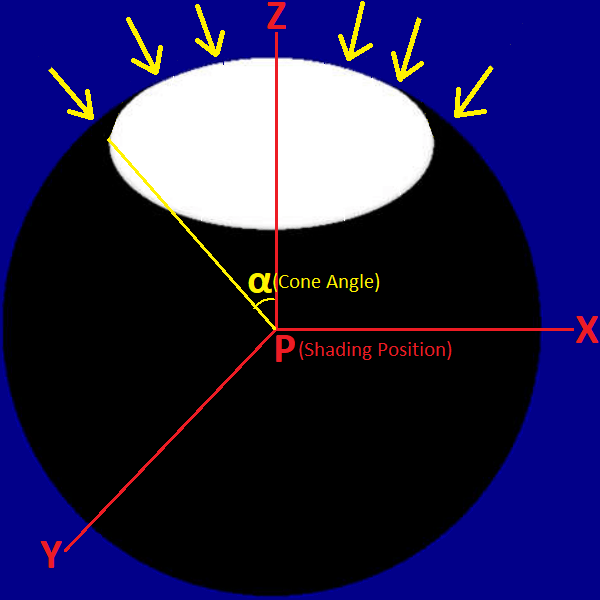

# LPV (Light Propagation Volumes)  

## RSM (Reflective Shadow Map)

### Radiometric and Photometric quantities  

Quantity | Radiometric Name | Radiometric Unit | Photometric Name | Photometric Unit  
 :-: | :-: | :-: | :-: | :-:  
$\displaystyle \text{Power}$ | Radiant Flux $\displaystyle \mathrm{\Phi}$ | $\displaystyle W$ | Luminous Flux $\displaystyle \mathrm{\Phi}$ | Lumen $\displaystyle \mathrm{lm}$  
$\displaystyle \frac{\text{Power}}{\text{Solid Angle}}$ | Radiant Intensity $\displaystyle \mathrm{I}$ | $\displaystyle \frac{W}{\mathrm{sr}}$ | Luminous Intensity $\displaystyle \mathrm{I}$ | Candela $\displaystyle \mathrm{cd}$  
$\displaystyle \frac{\text{Power}}{\text{Area}}$ | Radiant Exitance $\displaystyle \mathrm{M}$ (Radiosity $\displaystyle \mathrm{B}$) | $\displaystyle \frac{W}{m^2}$ | Luminous Exitance $\displaystyle \mathrm{M}$ (Luminosity $\displaystyle \mathrm{B}$) | Lux $\displaystyle \mathrm{lx}$  
$\displaystyle \frac{\text{Power}}{\text{Area}}$ | Irradiance $\displaystyle \mathrm{E}$ | $\displaystyle \frac{W}{m^2}$ | Illuminance $\displaystyle \mathrm{E}$ | Lux $\displaystyle \mathrm{lx}$  
$\displaystyle \frac{\text{Power}}{\text{Area} \cdot \text{Solid Angle}}$ | Radiance $\displaystyle \mathrm{L}$ | $\displaystyle \frac{W}{m^2 \cdot \mathrm{sr}}$ | Luminance $\displaystyle \mathrm{L}$ | Nit $\displaystyle \mathrm{nt}$  

### Light

For directional light, by "4.6 Sun" of \[Lagarde 2014\], the illuminance $\displaystyle \mathrm{E}$ for the surface perpendicular to the light direction is specified.  

For point light, by "4.4 Punctual lights" of \[Lagarde 2014\], the flux $\displaystyle \mathrm{\Phi}$ is specified, and we have the intensity $\displaystyle \mathrm{I} = \frac{\mathrm{\Phi}}{4 \pi}$. By the inverse square law, we have the illuminance for the surface perpendicular to the light direction $\displaystyle \mathrm{E} = \frac{\mathrm{I}}{{\text{distance}}^2}$. But the light radius and the attenuation windowing function are usually specified, and the illuminance $\displaystyle \mathrm{E}$ will smoothly reach zero at the light radius.  

For spot light

### VPL (Virtual Point Light)  

VPL described by flux and orientation (and position)

"directional intensity distribution" // to do find name  

not use uniform distribution $\displaystyle \mathrm{I} = \frac{\mathrm{\Phi}}{4 \pi}$  

"Indirect Light" of "3.1 LPV Initialization" and "Reprojection" of "3.3 Propagation Scheme" of 


## DOM (Discrete Ordinates Method)  

By "Further Reading" of "15 Light Transport II: Volume Rendering" of [PBR Book V3](https://www.pbr-book.org/3ed-2018/Light_Transport_II_Volume_Rendering/Further_Reading), **DOM (Discrete Ordinates Method)** is used by \[Fattal 2009\] as well to calculate the diffusion profile.  

By "11.1.3 Out-Scattering and Attenuation" of [PBR Book V3](https://www.pbr-book.org/3ed-2018/Volume_Scattering/Volume_Scattering_Processes#Out-ScatteringandAttenuation), we have the relationship between the coefficients $\displaystyle \operatorname{\sigma_t}(\overrightarrow{p}, \overrightarrow{\omega}) = \operatorname{\sigma_a}(\overrightarrow{p}, \overrightarrow{\omega}) + \operatorname{\sigma_s}(\overrightarrow{p}, \overrightarrow{\omega})$.  

By "Equation \(15.15\)" of [PBR Book V3](https://www.pbr-book.org/3ed-2018/Light_Transport_II_Volume_Rendering/Subsurface_Scattering_Using_the_Diffusion_Equation#DiffusionTheory), we have the **RTE (Radiative Transfer Equation)** $\displaystyle \frac{\partial \operatorname{L}(\overrightarrow{p} + \overrightarrow{\omega}t, \overrightarrow{\omega})}{\partial t} = \operatorname{L_e}(\overrightarrow{p}, \overrightarrow{\omega}) - \operatorname{\sigma_t}(\overrightarrow{p}, \overrightarrow{\omega}) \operatorname{L}(\overrightarrow{p}, \overrightarrow{\omega}) + \frac{\operatorname{\sigma_s}(\overrightarrow{p}, \overrightarrow{\omega})}{4 \pi} \int_{\mathrm{S}^2} \operatorname{L}(\overrightarrow{p}, \overrightarrow{\omega_s}) \, d \overrightarrow{\omega_s} = \operatorname{L_e}(\overrightarrow{p}, \overrightarrow{\omega}) - (\operatorname{\sigma_a}(\overrightarrow{p}, \overrightarrow{\omega}) + \operatorname{\sigma_s}(\overrightarrow{p}, \overrightarrow{\omega})) \operatorname{L}(\overrightarrow{p}, \overrightarrow{\omega}) + \frac{\operatorname{\sigma_s}(\overrightarrow{p}, \overrightarrow{\omega})}{4 \pi} \int_{\mathrm{S}^2} \operatorname{L}(\overrightarrow{p}, \overrightarrow{\omega_s}) \, d \overrightarrow{\omega_s}$.  


"13.6.4 Lattice-Boltzmann Method" of \[Howell 2021\]


## Appendix

### A-1\. SH (Spherical Harmonics)  

#### A-1-1\. SH Basis

Let $\displaystyle \operatorname{\Upsilon_l^m}(\overrightarrow{\omega})$ be the **SH (Spherical Harmonics)** basis function of which l is the degree (or band) and m is the basis function index from -l to l.  

The SH basis function $\displaystyle \operatorname{\Upsilon_l^0}(\overrightarrow{\omega})$ of which the m is zero is also called **ZH (zonal harmonics)**.  

By "Appendix A2" of \[Sloan 2008\], we have the **polynomial forms** of SH basis $\displaystyle \operatorname{\Upsilon_l^m}(\overrightarrow{\omega})$. These polynomial forms are calculated by [sh_eval_basis_2](https://github.com/microsoft/DirectXMath/blob/jul2018b/SHMath/DirectXSH.cpp#L132) in DirectXMath, and [SHBasisFunction3](https://github.com/EpicGames/UnrealEngine/blob/4.27/Engine/Shaders/Private/SHCommon.ush#L226) in UnrealEngine.  

Note that the direction vector $\displaystyle \overrightarrow{\omega} = \begin{bmatrix} x & y & z\end{bmatrix}$ should be **normalized** before using the polynomial forms. By "13.5.3 Spherical Coordinates" of [PBR Book V3](https://pbr-book.org/3ed-2018/Monte_Carlo_Integration/Transforming_between_Distributions#SphericalCoordinates) and "Spherical Coordinates" of "3.8.3 Spherical Parameterizations" of [PBR Book V4](https://pbr-book.org/4ed/Geometry_and_Transformations/Spherical_Geometry#x3-SphericalCoordinates), we have $\displaystyle \overrightarrow{\omega} = \begin{bmatrix} x & y & z\end{bmatrix} = \begin{bmatrix} \sin \theta \cos \phi & \sin \theta \sin \phi & \cos \theta \end{bmatrix}$ where $\displaystyle \phi$ is azimuth and $\displaystyle \theta$ is zenith (in physics, while in mathmatics $\displaystyle \theta$ is the azimuth and $\displaystyle \phi$ is the zenith).   

l  |  m  | $\displaystyle \operatorname{\Upsilon_l^m}(\overrightarrow{\omega})$  
:-: | :-: | :-:  
0  |  0  | $\displaystyle \frac{1}{2 \sqrt{\pi}} = 0.282094791773878140$       
1  | -1  | $\displaystyle - \frac{\sqrt{3}}{2 \sqrt{\pi}} y = -0.488602511902919920 y$     
1  |  0  | $\displaystyle \frac{\sqrt{3}}{2 \sqrt{\pi}} z = 0.488602511902919920 z$     
1  |  1  | $\displaystyle - \frac{\sqrt{3}}{2 \sqrt{\pi}} x = -0.488602511902919920 x$     
2  | -2  | $\displaystyle \frac{\sqrt{15}}{2 \sqrt{\pi}} x y = 1.092548430592079200 x y$  
2  | -1  | $\displaystyle - \frac{\sqrt{15}}{2 \sqrt{\pi}} y z = -1.092548430592079200 y z$    
2  |  0  | $\displaystyle \frac{3 \sqrt{5}}{4 \sqrt{\pi}} z^2 - \frac{\sqrt{5}}{4 \sqrt{\pi}} = 0.946174695757560080 z^2 - 0.315391565252520050$     
2  |  1  | $\displaystyle - \frac{\sqrt{15}}{2 \sqrt{\pi}} x z = -1.092548430592079200 x z$       
2  |  2  | $\displaystyle \frac{\sqrt{15}}{4 \sqrt{\pi}} (x^2 - y^2) = 0.546274215296039590 (x^2 - y^2)$  

#### A-1-2\. SH Rotation

Let $\displaystyle \mathrm{R}$ be the rotation matrix. By "A. Rotation of Spherical Harmonics" of "4. SPHERICAL HARMONIC REPRESENTATION" of \[Ramamoorthi 2001 A\], for each degree (or band) l, we have $\displaystyle \operatorname{\Upsilon_l^m}(\mathrm{R} \overrightarrow{\omega}) = \sum_{j = -l}^l \operatorname{D_{mj}^l}(\mathrm{R}) \operatorname{\Upsilon_l^j}(\overrightarrow{\omega})$ where $\displaystyle \operatorname{D_l}(\mathrm{R})$ is the **Wigner D-matrix**. This means that $\displaystyle \begin{bmatrix} \operatorname{\Upsilon_l^{-l}}(\mathrm{R} \overrightarrow{\omega}) \\ \vdots \\ \operatorname{\Upsilon_l^0}(\mathrm{R} \overrightarrow{\omega}) \\ \vdots \\ \operatorname{\Upsilon_l^l}(\mathrm{R} \overrightarrow{\omega}) \end{bmatrix} = \operatorname{D_l}(\mathrm{R}) \begin{bmatrix} \operatorname{\Upsilon_l^{-l}}(\overrightarrow{\omega}) \\ \vdots \\ \operatorname{\Upsilon_l^0}(\overrightarrow{\omega}) \\ \vdots \\ \operatorname{\Upsilon_l^l}(\overrightarrow{\omega}) \end{bmatrix}$.  

By "Appendix: SH Rotation" of \[Kautz 2002\], for each degree (or band) l, each element of the Wigner D-matrix can be calculated as $\displaystyle \operatorname{D_{ij}^l}(\mathrm{R}) = \int_{\mathrm{S}^2} \operatorname{\Upsilon_l^{i - l}}(\mathrm{R} \overrightarrow{\omega}) \operatorname{\Upsilon_l^{j - l}}(\overrightarrow{\omega}) \, d\overrightarrow{\omega}$.  

For l = 0, we have $\displaystyle \mathrm{D_{00}^0} = \int_{\mathrm{S}^2} \operatorname{\Upsilon_0^0}(\mathrm{R} \overrightarrow{\omega}) \operatorname{\Upsilon_0^0}(\overrightarrow{\omega}) \, d\overrightarrow{\omega} = \int_{\mathrm{S}^2} \frac{1}{2 \sqrt{\pi}} \frac{1}{2 \sqrt{\pi}} \, d\overrightarrow{\omega} = \frac{1}{4\pi} \int_{\mathrm{S}^2} 1 \, d\overrightarrow{\omega} = \frac{1}{4\pi} 4\pi = 1$. This means that $\displaystyle \operatorname{D_l}(\mathrm{R}) = \begin{bmatrix} 1 \end{bmatrix}$.  

For l = 1, it is too complex to calculate the intergral for each element of the Wigner D-matrix. The trick by \[Hable 2014\] can be used to calculate the Wigner D-matrix. Since the equation $\displaystyle \begin{bmatrix} \operatorname{\Upsilon_1^{-1}}(\mathrm{R} \overrightarrow{\omega}) \\ \operatorname{\Upsilon_1^0}(\mathrm{R} \overrightarrow{\omega}) \\ \operatorname{\Upsilon_1^1}(\mathrm{R} \overrightarrow{\omega}) \end{bmatrix} = \operatorname{D_l}(\mathrm{R}) \begin{bmatrix} \operatorname{\Upsilon_1^-1}(\overrightarrow{\omega}) \\ \operatorname{\Upsilon_1^0}(\overrightarrow{\omega}) \\ \operatorname{\Upsilon_1^1}(\overrightarrow{\omega}) \end{bmatrix}$ holds for arbitrary direction $\displaystyle \overrightarrow{\omega}$, we can apply this equation to three linearly independent vectors **$\displaystyle \begin{bmatrix} 1 \\ 0 \\ 0 \end{bmatrix}$**, $\displaystyle \begin{bmatrix} 0 \\ 1 \\ 0 \end{bmatrix}$ and $\displaystyle \begin{bmatrix} 0 \\ 0 \\ 1 \end{bmatrix}$ to construct an invertible matrix. By the **polynomial forms** of SH basis, we have $\displaystyle \begin{bmatrix} \operatorname{\Upsilon_1^{-1}}(\mathrm{R} \overrightarrow{\omega}) \\ \operatorname{\Upsilon_1^0}(\mathrm{R} \overrightarrow{\omega}) \\ \operatorname{\Upsilon_1^1}(\mathrm{R} \overrightarrow{\omega}) \end{bmatrix} = \operatorname{D_l}(\mathrm{R}) \begin{bmatrix} \operatorname{\Upsilon_1^-1}(\overrightarrow{\omega}) \\ \operatorname{\Upsilon_1^0}(\overrightarrow{\omega}) \\ \operatorname{\Upsilon_1^1}(\overrightarrow{\omega}) \end{bmatrix} \Rightarrow$ $\displaystyle \color{red} \begin{bmatrix} 0 & - \frac{\sqrt{3}}{2 \sqrt{\pi}} & 0 \\ 0 & 0 & \frac{\sqrt{3}}{2 \sqrt{\pi}} \\ - \frac{\sqrt{3}}{2 \sqrt{\pi}} & 0 & 0 \end{bmatrix} \mathrm{R} \color{green} \overrightarrow{\omega} \color{red} = \operatorname{D_l}(\mathrm{R}) \begin{bmatrix} 0 & - \frac{\sqrt{3}}{2 \sqrt{\pi}} & 0 \\ 0 & 0 & \frac{\sqrt{3}}{2 \sqrt{\pi}} \\ - \frac{\sqrt{3}}{2 \sqrt{\pi}} & 0 & 0 \end{bmatrix} \color{green} \overrightarrow{\omega} \color{red} \Rightarrow \begin{bmatrix} 0 & - \frac{\sqrt{3}}{2 \sqrt{\pi}} & 0 \\ 0 & 0 & \frac{\sqrt{3}}{2 \sqrt{\pi}} \\ - \frac{\sqrt{3}}{2 \sqrt{\pi}} & 0 & 0 \end{bmatrix} \mathrm{R} \color{green} \begin{bmatrix} 1 & 0 & 0 \\ 0 & 1 & 0 \\ 0 & 0 & 1 \end{bmatrix} \color{red} = \operatorname{D_l}(\mathrm{R}) \begin{bmatrix} 0 & - \frac{\sqrt{3}}{2 \sqrt{\pi}} & 0 \\ 0 & 0 & \frac{\sqrt{3}}{2 \sqrt{\pi}} \\ - \frac{\sqrt{3}}{2 \sqrt{\pi}} & 0 & 0 \end{bmatrix} \color{green} \begin{bmatrix} 1 & 0 & 0 \\ 0 & 1 & 0 \\ 0 & 0 & 1 \end{bmatrix} \color{red}$ $\displaystyle \Rightarrow \begin{bmatrix} 0 & -1 & 0 \\ 0 & 0 & 1 \\ -1 & 0 & 0 \end{bmatrix} \mathrm{R} \begin{bmatrix} 1 & 0 & 0 \\ 0 & 1 & 0 \\ 0 & 0 & 1 \end{bmatrix} = \operatorname{D_l}(\mathrm{R}) \begin{bmatrix} 0 & -1 & 0 \\ 0 & 0 & 1 \\ -1 & 0 & 0 \end{bmatrix} \begin{bmatrix} 1 & 0 & 0 \\ 0 & 1 & 0 \\ 0 & 0 & 1 \end{bmatrix}$. Evidently, $\displaystyle \begin{bmatrix} 0 & -1 & 0 \\ 0 & 0 & 1 \\ -1 & 0 & 0 \end{bmatrix} \begin{bmatrix} 1 & 0 & 0 \\ 0 & 1 & 0 \\ 0 & 0 & 1 \end{bmatrix}$ is invertible and we have $\displaystyle \operatorname{D_l}(\mathrm{R}) = \begin{bmatrix} 0 & -1 & 0 \\ 0 & 0 & 1 \\ -1 & 0 & 0 \end{bmatrix} \mathrm{R} \begin{bmatrix} 1 & 0 & 0 \\ 0 & 1 & 0 \\ 0 & 0 & 1 \end{bmatrix} {\left \lparen \begin{bmatrix} 0 & -1 & 0 \\ 0 & 0 & 1 \\ -1 & 0 & 0 \end{bmatrix} \begin{bmatrix} 1 & 0 & 0 \\ 0 & 1 & 0 \\ 0 & 0 & 1 \end{bmatrix} \right \rparen}^{-1} = \begin{bmatrix} 0 & -1 & 0 \\ 0 & 0 & 1 \\ -1 & 0 & 0 \end{bmatrix} \mathrm{R} \begin{bmatrix} 1 & 0 & 0 \\ 0 & 1 & 0 \\ 0 & 0 & 1 \end{bmatrix} \begin{bmatrix} 0 & 0 & -1 \\ -1 & 0 & 0 \\ 0 & 1 & 0 \end{bmatrix} = \begin{bmatrix} 0 & -1 & 0 \\ 0 & 0 & 1 \\ -1 & 0 & 0 \end{bmatrix} \mathrm{R} \begin{bmatrix} 0 & 0 & -1 \\ -1 & 0 & 0 \\ 0 & 1 & 0 \end{bmatrix} = \begin{bmatrix} -{\mathrm{R}}_{10} & -{\mathrm{R}}_{11} & -{\mathrm{R}}_{12} \\ {\mathrm{R}}_{20} & {\mathrm{R}}_{21} & {\mathrm{R}}_{22} \\ -{\mathrm{R}}_{00} & -{\mathrm{R}}_{01} & -{\mathrm{R}}_{02} \end{bmatrix} \begin{bmatrix} 0 & 0 & -1 \\ -1 & 0 & 0 \\ 0 & 1 & 0 \end{bmatrix} = \begin{bmatrix} {\mathrm{R}}_{11} & -{\mathrm{R}}_{12} & {\mathrm{R}}_{10} \\ -{\mathrm{R}}_{21} & {\mathrm{R}}_{22} & -{\mathrm{R}}_{20} \\ {\mathrm{R}}_{01} & -{\mathrm{R}}_{02} & {\mathrm{R}}_{00} \end{bmatrix}$.  

The Wigner D-matrix is calculated by [DirectX::XMSHRotate](https://github.com/microsoft/DirectXMath/blob/jul2018b/SHMath/DirectXSH.cpp#L1026) and [DirectX::XMSHRotateZ](https://github.com/microsoft/DirectXMath/blob/jul2018b/SHMath/DirectXSH.cpp#L1163) in DirectXMath.  

l | $\displaystyle \operatorname{D_l}(\mathrm{R})$  
:-: | :-:  
0 | $\displaystyle \begin{bmatrix} 1 \end{bmatrix}$  
1 | $\displaystyle \begin{bmatrix} {\mathrm{R}}_{11} & -{\mathrm{R}}_{12} & {\mathrm{R}}_{10} \\ -{\mathrm{R}}_{21} & {\mathrm{R}}_{22} & -{\mathrm{R}}_{20} \\ {\mathrm{R}}_{01} & -{\mathrm{R}}_{02} & {\mathrm{R}}_{00} \end{bmatrix}$  

#### A-1-3\. SH Projection

Let $\displaystyle \operatorname{\mathcal{SH}}$ be the **SH (Spherical Harmonics) projection operation**. Analogous to the **Fourier transform**, we have $\displaystyle f_l^m = \operatorname{\mathcal{SH}}(\operatorname{f}(\overrightarrow{\omega})) = \int_{\mathrm{S}^2} \operatorname{f}(\overrightarrow{\omega}) \operatorname{\Upsilon_l^m}(\overrightarrow{\omega}) \, d\overrightarrow{\omega}$, and the original function can be reconstructed as the SH series $\displaystyle \operatorname{f}(\overrightarrow{\omega}) = \sum_{l = 0}^{\infin} \sum_{m = -l}^l f_l^m \operatorname{\Upsilon_l^m}(\overrightarrow{\omega}) = \sum_{l = 0}^{\infin} \begin{bmatrix} f_l^{-l} & \cdots & f_l^0 & \cdots & f_l^l \end{bmatrix} \begin{bmatrix} \operatorname{\Upsilon_l^{-l}}(\overrightarrow{\omega}) \\ \vdots \\ \operatorname{\Upsilon_l^0}(\overrightarrow{\omega}) \\ \vdots \\ \operatorname{\Upsilon_l^l}(\overrightarrow{\omega}) \end{bmatrix}$.  

#### A-1-4\. SH Rotational Invariance  
  
Let $\displaystyle \mathrm{R}$ be the rotation matrix. Let $\displaystyle \operatorname{f'}(\overrightarrow{\omega}) = \operatorname{f}(\mathrm{R}\overrightarrow{\omega})$ and $\displaystyle \operatorname{f'}(\overrightarrow{\omega}) = \sum_{l = 0}^{\infin} \sum_{m = -l}^l {f'}_l^m \operatorname{\Upsilon_l^m}(\overrightarrow{\omega})$. By "Basic Properties" of "3\. Review of Spherical Harmonics" of \[Sloan 2002\], we have $\displaystyle \begin{bmatrix} {f'}_l^{-l} & \cdots & {f'}_l^0 & \cdots & {f'}_l^l \end{bmatrix} = \begin{bmatrix} f_l^{-l} & \cdots & f_l^0 & \cdots & f_l^l \end{bmatrix} \operatorname{D_l}(\mathrm{R})$ where $\displaystyle \operatorname{D_l}(\mathrm{R})$ is the Wigner D-matrix.  

Proof  

> By "SH Projection", we have $\displaystyle \operatorname{f}(\overrightarrow{\omega}) = \sum_{l = 0}^{\infin} \sum_{m = -l}^l f_l^m \operatorname{\Upsilon_l^m}(\overrightarrow{\omega}) = \sum_{l = 0}^{\infin} \begin{bmatrix} f_l^{-l} & \cdots & f_l^0 & \cdots & f_l^l \end{bmatrix} \begin{bmatrix} \operatorname{\Upsilon_l^{-l}}(\overrightarrow{\omega}) \\ \vdots \\ \operatorname{\Upsilon_l^0}(\overrightarrow{\omega}) \\ \vdots \\ \operatorname{\Upsilon_l^l}(\overrightarrow{\omega}) \end{bmatrix}$.  
>  
> By "SH Rotation", we have $\displaystyle \begin{bmatrix} \operatorname{\Upsilon_l^{-l}}(\mathrm{R} \overrightarrow{\omega}) \\ \vdots \\ \operatorname{\Upsilon_l^0}(\mathrm{R} \overrightarrow{\omega}) \\ \vdots \\ \operatorname{\Upsilon_l^l}(\mathrm{R} \overrightarrow{\omega}) \end{bmatrix} = \operatorname{D_l}(\mathrm{R}) \begin{bmatrix} \operatorname{\Upsilon_l^{-l}}(\overrightarrow{\omega}) \\ \vdots \\ \operatorname{\Upsilon_l^0}(\overrightarrow{\omega}) \\ \vdots \\ \operatorname{\Upsilon_l^l}(\overrightarrow{\omega}) \end{bmatrix}$.  
>  
> This means that $\displaystyle \operatorname{f'}(\overrightarrow{\omega}) = \operatorname{f}(\mathrm{R}\overrightarrow{\omega}) = \sum_{l = 0}^{\infin} \begin{bmatrix} f_l^{-l} & \cdots & f_l^0 & \cdots & f_l^l \end{bmatrix} \begin{bmatrix} \operatorname{\Upsilon_l^{-l}}(\mathrm{R}\overrightarrow{\omega}) \\ \vdots \\ \operatorname{\Upsilon_l^0}(\mathrm{R}\overrightarrow{\omega}) \\ \vdots \\ \operatorname{\Upsilon_l^l}(\mathrm{R}\overrightarrow{\omega}) \end{bmatrix}  = \sum_{l = 0}^{\infin} \begin{bmatrix} f_l^{-l} & \cdots & f_l^0 & \cdots & f_l^l \end{bmatrix} \operatorname{D_l}(\mathrm{R}) \begin{bmatrix} \operatorname{\Upsilon_l^{-l}}(\overrightarrow{\omega}) \\ \vdots \\ \operatorname{\Upsilon_l^0}(\overrightarrow{\omega}) \\ \vdots \\ \operatorname{\Upsilon_l^l}(\overrightarrow{\omega}) \end{bmatrix}$ where $\displaystyle \operatorname{D_l}(\mathrm{R})$ is the Wigner D-matrix.  
>  
> Since $\displaystyle \operatorname{f'}(\overrightarrow{\omega}) = \sum_{l = 0}^{\infin} \sum_{m = -l}^l {f'}_l^m \operatorname{\Upsilon_l^m}(\overrightarrow{\omega}) = \sum_{l = 0}^{\infin} \begin{bmatrix} {f'}_l^{-l} & \cdots & {f'}_l^0 & \cdots & {f'}_l^l \end{bmatrix} \begin{bmatrix} \operatorname{\Upsilon_l^{-l}}(\overrightarrow{\omega}) \\ \vdots \\ \operatorname{\Upsilon_l^0}(\overrightarrow{\omega}) \\ \vdots \\ \operatorname{\Upsilon_l^l}(\overrightarrow{\omega}) \end{bmatrix}$, we have $\displaystyle \begin{bmatrix} {f'}_l^{-l} & \cdots & {f'}_l^0 & \cdots & {f'}_l^l \end{bmatrix} = \begin{bmatrix} f_l^{-l} & \cdots & f_l^0 & \cdots & f_l^l \end{bmatrix} \operatorname{D_l}(\mathrm{R})$.  
>  

#### A-1-5\. SH Product Integration  
  
Let $\displaystyle \operatorname{f}(\overrightarrow{\omega}) = \sum_{l = 0}^{\infin} \sum_{m = -l}^l f_l^m \operatorname{\Upsilon_l^m}(\overrightarrow{\omega})$ and $\displaystyle \operatorname{g}(\overrightarrow{\omega}) = \sum_{l = 0}^{\infin} \sum_{m = -l}^l g_l^m \operatorname{\Upsilon_l^m}(\overrightarrow{\omega})$. By "Basic Properties" of "3\. Review of Spherical Harmonics" of \[Sloan 2002\], due to the orthonormality of the SH basis, we have $\displaystyle \int_{\mathrm{S}^2} \operatorname{f}(\overrightarrow{\omega}) \operatorname{g}(\overrightarrow{\omega}) \, d\overrightarrow{\omega} = \int_{\mathrm{S}^2} \left \lparen \sum_{l = 0}^{\infin} \sum_{m = -l}^l f_l^m \operatorname{\Upsilon_l^m}(\overrightarrow{\omega}) \right \rparen \left \lparen \sum_{l = 0}^{\infin} \sum_{m = -l}^l g_l^m \operatorname{\Upsilon_l^m}(\overrightarrow{\omega}) \right \rparen \, d\overrightarrow{\omega} = \sum_{l = 0}^{\infin} \sum_{m = -l}^l f_l^m g_l^m$.  

#### A-1-6\. SH Product Projection  

Actually, "SH Product Projection" is related to the **Clebsch–Gordan coefficients** which is too complex to be used in rendering. We only need to know that "SH Product Projection" should be distinguished from "SH Product Integration".  

Let $\displaystyle \operatorname{h}(\overrightarrow{\omega}) = \operatorname{f}(\overrightarrow{\omega}) \operatorname{g}(\overrightarrow{\omega})$. By "Product Projection" of "3\. Review of Spherical Harmonics" of \[Sloan 2002\], we have that $\displaystyle h_l^m = \int_{\mathrm{S}^2} \operatorname{h}(\overrightarrow{\omega}) \operatorname{\Upsilon_l^m}(\overrightarrow{\omega}) \, d\overrightarrow{\omega} = \int_{\mathrm{S}^2} \operatorname{f}(\overrightarrow{\omega}) \operatorname{g}(\overrightarrow{\omega}) \operatorname{\Upsilon_l^m}(\overrightarrow{\omega}) \, d\overrightarrow{\omega} \ne \int_{\mathrm{S}^2} \operatorname{f}(\overrightarrow{\omega}) \operatorname{g}(\overrightarrow{\omega}) \, d\overrightarrow{\omega}$ which is totally different from "SH Product Integration".  

### A-2\. SH Irradiance  

#### A-2-1\. SH Convolution

Analogous to the **convolution theorem**,  by \[Ramamoorthi 2001 A\], we have $\displaystyle \operatorname{E}(\overrightarrow{n}) = \int_{\mathrm{S}^2} \operatorname{L_i}(\overrightarrow{\omega_i}) \max(0, \cos \theta_i) \, d \overrightarrow{\omega_i} = \int_{\mathrm{S}^2} \operatorname{L}(\operatorname{R}(\overrightarrow{n}) \overrightarrow{\omega_i}) \max(0, \cos \theta_i) \, d \overrightarrow{\omega_i} = \sum_{l = 0}^{\infin} \sum_{m = -l}^l \sqrt{\frac{4 \pi}{2l + 1}} L_l^m A_l \operatorname{\Upsilon_l^m}(\overrightarrow{n})$ where $\displaystyle L_l^m = \operatorname{\mathcal{SH}}(\operatorname{L}(\overrightarrow{\omega})) = \int_{\mathrm{S}^2} \operatorname{L}(\overrightarrow{\omega}) \operatorname{\Upsilon_l^m}(\overrightarrow{\omega}) \, d\overrightarrow{\omega}$ and $\displaystyle A_l = \operatorname{\mathcal{ZH}}(\max(0, \cos \theta_i)) = \int_{\mathrm{S}^2} \max(0, \cos \theta_i) \operatorname{\Upsilon_l^0}(\overrightarrow{\omega_i}) \, d\overrightarrow{\omega_i}$.  

> Proof  
>  
>> By "SH Rotational Invariance", we have $\displaystyle \operatorname{L}(\operatorname{R}(\overrightarrow{n}) \overrightarrow{\omega_i}) = \sum_{l = 0}^{\infin} \begin{bmatrix} L_l^{-l} & \cdots & L_l^0 & \cdots & L_l^l \end{bmatrix} \operatorname{D_l}(\operatorname{R}(\overrightarrow{n})) \begin{bmatrix} \operatorname{\Upsilon_l^{-l}}(\overrightarrow{\omega_i}) \\ \vdots \\ \operatorname{\Upsilon_l^0}(\overrightarrow{\omega_i}) \\ \vdots \\ \operatorname{\Upsilon_l^l}(\overrightarrow{\omega_i}) \end{bmatrix}$ where $\displaystyle \operatorname{D_l}(\operatorname{R}(\overrightarrow{n}))$ is the Wigner D-matrix.  
>  
>> Due to circular symmetry of the clamped cosine, only the coefficients of the ZH(Zonal Harmonics) are non-zero. By "SH Projection", we have $\displaystyle \max(0, \cos \theta_i) = \sum_{l = 0}^{\infin} A_l \operatorname{\Upsilon_l^0}(\overrightarrow{\omega_i})$.  
>  
>> By "SH Product Integration", due to the orthonormality of the SH basis, only the elements $\displaystyle \operatorname{D_{m0}^l}(\operatorname{R}(\overrightarrow{n}))$ of the Wigner D-matrix are multiplied by the non-zero term, and we have $\displaystyle \operatorname{E}(\overrightarrow{n}) = \int_{\mathrm{S}^2} \operatorname{L}(\operatorname{R}(\overrightarrow{n}) \overrightarrow{\omega_i}) \max(0, \cos \theta_i) \, d \overrightarrow{\omega_i} = \int_{\mathrm{S}^2} \left \lparen \sum_{l = 0}^{\infin} \begin{bmatrix} L_l^{-l} & \cdots & L_l^0 & \cdots & L_l^l \end{bmatrix} \operatorname{D_l}(\operatorname{R}(\overrightarrow{n})) \begin{bmatrix} \operatorname{\Upsilon_l^{-l}}(\overrightarrow{\omega_i}) \\ \vdots \\ \operatorname{\Upsilon_l^0}(\overrightarrow{\omega_i}) \\ \vdots \\ \operatorname{\Upsilon_l^l}(\overrightarrow{\omega_i}) \end{bmatrix} \right \rparen \left \lparen \sum_{l = 0}^{\infin} A_l \operatorname{\Upsilon_l^0}(\overrightarrow{\omega_i}) \right \rparen \, d \overrightarrow{\omega_i} = \sum_{l = 0}^{\infin} \sum_{m = -l}^l L_l^m A_l \operatorname{D_{m0}^l}(\operatorname{R}(\overrightarrow{n}))$.  
>  
>> By "Equation \(23\)" of \[Ramamoorthi 2001 A\], we have $\displaystyle \operatorname{D_{m0}^l}(\operatorname{R}(\overrightarrow{n})) = \sqrt{\frac{4 \pi}{2l + 1}} \operatorname{\Upsilon_l^m}(\overrightarrow{n})$, and we have $\displaystyle \operatorname{E}(\overrightarrow{n}) = \sum_{l = 0}^{\infin} \sum_{m = -l}^l L_l^m A_l \operatorname{D_{m0}^l}(\operatorname{R}(\overrightarrow{n})) = \sum_{l = 0}^{\infin} \sum_{m = -l}^l \sqrt{\frac{4 \pi}{2l + 1}} L_l^m A_l \operatorname{\Upsilon_l^m}(\overrightarrow{n})$.  
>    
  
#### A-2-2\. Clamped Cosine  

By \[Ramamoorthi 2001 B\], $\displaystyle \sqrt{\frac{4 \pi}{2l + 1}} A_l$ is constant and can be pre-integrated. For example, by "5.5.1 Integrals over Projected Solid Angle" of [PBR Book V3](https://pbr-book.org/3ed-2018/Color_and_Radiometry/Working_with_Radiometric_Integrals#IntegralsoverProjectedSolidAngle) and "4.2.1 Integrals over Projected Solid Angle" of [PBR Book V4](https://pbr-book.org/4ed/Radiometry,_Spectra,_and_Color/Working_with_Radiometric_Integrals#IntegralsoverProjectedSolidAngle), $\displaystyle A_0$ can pre-integrated as $\displaystyle A_0 = \int_{\mathrm{S}^2} \max(0, \cos \theta) \operatorname{\Upsilon_0^0}(\overrightarrow{\omega}) \, d \overrightarrow{\omega} = \int_{\mathrm{S}^2} \max(0, \cos \theta) \frac{1}{2 \sqrt{\pi}} \, d \overrightarrow{\omega} = \frac{1}{2 \sqrt{\pi}} \int_{\mathrm{S}^2} \max(0, \cos \theta) \, d \overrightarrow{\omega} = \frac{1}{2 \sqrt{\pi}} \int_{\mathrm{S}^2} \, d \overrightarrow{\omega}^{\perp} = \frac{1}{2 \sqrt{\pi}} \pi$. These constants are calculated by [CalcDiffuseTransferSH3](https://github.com/EpicGames/UnrealEngine/blob/4.27/Engine/Shaders/Private/SHCommon.ush#L285) in UnrealEngine.  

  l | $\displaystyle \sqrt{\frac{4 \pi}{2l + 1}}$ | $\displaystyle A_l$ | $\displaystyle \sqrt{\frac{4 \pi}{2l + 1}} A_l$  
:-: | :-: | :-: | :-:  
  0 | $\displaystyle 2 \sqrt{\pi}$ | $\displaystyle \frac{1}{2 \sqrt{\pi}} \pi$ | $\displaystyle \pi$  
  1 | $\displaystyle \frac{2 \sqrt{\pi}}{\sqrt{3}}$ | $\displaystyle \frac{\sqrt{3}}{2 \sqrt{\pi}} \frac{2\pi}{3}$ | $\displaystyle \frac{2 \pi}{3}$  
  2 | $\displaystyle \frac{2 \sqrt{\pi}}{\sqrt{5}}$ | $\displaystyle \frac{\sqrt{5}}{2 \sqrt{\pi}} \frac{\pi}{4}$ | $\displaystyle \frac{\pi}{4}$  

#### A-2-3\. Form Factor  

"Appendix A10" of \[Sloan 2008\] proposed a more efficient approach to reconstruct from SH basis than \[Ramamoorthi 2001 B\]. This approach is used by [SampleSH9](https://github.com/Unity-Technologies/Graphics/blob/v10.8.0/com.unity.render-pipelines.core/ShaderLibrary/EntityLighting.hlsl#L37) in Unity3D and [GetSkySHDiffuse](https://github.com/EpicGames/UnrealEngine/blob/4.27/Engine/Shaders/Private/ReflectionEnvironmentShared.ush#L79) in UnrealEngine.  
However, it was **form factor** rather than **irradiance** that "Appendix A10" of \[Sloan 2008\] calculated. Although the terms **irradiance** and **form factor** may be interchangeably used, technically **irradiance** should NOT be divided by $\displaystyle \pi$. This means that $\displaystyle \operatorname{E}(\overrightarrow{n}) = \pi \operatorname{F}(\overrightarrow{n})$. This form factor is calculated by [PackCoefficients](https://github.com/Unity-Technologies/Graphics/blob/v10.8.0/com.unity.render-pipelines.high-definition/Runtime/Lighting/SphericalHarmonics.cs#L196) in Unity3D, and [SetupSkyIrradianceEnvironmentMapConstantsFromSkyIrradiance](https://github.com/EpicGames/UnrealEngine/blob/4.27/Engine/Source/Runtime/Renderer/Private/SceneRendering.cpp#L979) and [ComputeSkyEnvMapDiffuseIrradianceCS](https://github.com/EpicGames/UnrealEngine/blob/4.27/Engine/Shaders/Private/ReflectionEnvironmentShaders.usf#L607) in UnrealEngine.  
And since the value reconstructed from SH basis is form factor rather than irradiance, it should be multiplied by albedo rather than Lambert BRDF. This multiplication is calculated by [GetDiffuseOrDefaultColor](https://github.com/Unity-Technologies/Graphics/blob/v10.8.0/com.unity.render-pipelines.high-definition/Runtime/Material/Lit/Lit.hlsl#L1237) in Unity3D and [EnvBRDFApproxFullyRough](https://github.com/EpicGames/UnrealEngine/blob/4.27/Engine/Shaders/Private/BasePassPixelShader.usf#L1138) in UnrealEngine.  

  fc | value  
 :-: | :-:  
 fc0 | $\displaystyle \frac{1}{\pi} \operatorname{\Upsilon_0^0} A_0 = \frac{1}{\pi} \frac{1}{2 \sqrt{\pi}} \pi = \frac{1}{2 \sqrt{\pi}}$  
 fc1 | $\displaystyle \frac{1}{\pi} \operatorname{\Upsilon_1^0} A_1 = \frac{1}{\pi} \frac{\sqrt{3}}{2 \sqrt{\pi}} \frac{2 \pi}{3} = \frac{\sqrt{3}}{3 \sqrt{\pi}}$  
 fc2 | $\displaystyle \frac{1}{\pi} \operatorname{\Upsilon_2^{-2}} A_2 = \frac{1}{\pi} \frac{\sqrt{15}}{2 \sqrt{\pi}} \frac{\pi}{4} = \frac{\sqrt{15}}{8 \sqrt{\pi}}$  
 fc3 | $\displaystyle \frac{1}{\pi} (-\operatorname{\Upsilon_2^0}) A_2 = \frac{1}{\pi} \frac{\sqrt{5}}{4 \sqrt{\pi}} \frac{\pi}{4} = \frac{\sqrt{5}}{16 \sqrt{\pi}}$  
 0.3 * fc3 | $\displaystyle \frac{1}{\pi} \operatorname{\Upsilon_2^0} A_2 = \frac{1}{\pi} \frac{3 \sqrt{5}}{4 \sqrt{\pi}} \frac{\pi}{4} = \frac{3 \sqrt{5}}{16 \sqrt{\pi}}$  
 fc4 | $\displaystyle \frac{1}{\pi} \operatorname{\Upsilon_2^2} A_2 = \frac{1}{\pi} \frac{\sqrt{15}}{4 \sqrt{\pi}} \frac{\pi}{4} = \frac{\sqrt{15}}{16 \sqrt{\pi}}$  

### A-3\. SH Analytic Light

#### A-3-1\. Light Distribution

By "SH Light Sources" of \[Green 2003\], we have the uniform light distribution at the shading position is $\displaystyle \operatorname{L}(\overrightarrow{\omega}) = \begin{cases} 1 & \theta < \alpha \\ 0 & \theta \geq \alpha \end{cases}$ where $\displaystyle \alpha$ is the cone angle.  

  

Due to circular symmetry of the light distribution at the shading position, only the coefficients on the ZH(Zonal Harmonics) of the light distribution are non-zero.  

By "Appendix A3 ZH Coefficients for Spherical Light Source" of \[Sloan 2008\], we have the coefficients on the ZH(Zonal Harmonics) of the light distribution.  

By "13.5.3 Spherical Coordinates" of [PBR Book V3](https://pbr-book.org/3ed-2018/Monte_Carlo_Integration/Transforming_between_Distributions#SphericalCoordinates) and "Equation \(2.23\)" of [PBR Book V4](https://pbr-book.org/4ed/Monte_Carlo_Integration/Transforming_between_Distributions#eq:spherical-cartesian-pdf-relation), we have $\displaystyle \int_{\Omega_\alpha} \operatorname{f}(\overrightarrow{\omega}) \, d \overrightarrow{\omega} = \int_0^{2\pi} \left\lparen \int_0^{\alpha} \operatorname{f}(\theta, \phi) \sin \theta \, d \theta \right\rparen \, d \phi$.  

For l = 0, we have $\displaystyle \mathrm{L_0} = \int_{\mathrm{S}^2} \operatorname{L}(\overrightarrow{\omega}) \operatorname{\Upsilon_0^0}(\overrightarrow{\omega}) \, d \overrightarrow{\omega} = \int_{\mathrm{S}^2} \operatorname{L}(\overrightarrow{\omega}) \frac{1}{2 \sqrt{\pi}} \, d \overrightarrow{\omega} = \frac{1}{2 \sqrt{\pi}} \int_{\mathrm{S}^2} \operatorname{L}(\overrightarrow{\omega}) \, d \overrightarrow{\omega} = \frac{1}{2 \sqrt{\pi}} \int_{\Omega_\alpha} 1 \, d \overrightarrow{\omega} = \frac{1}{2 \sqrt{\pi}} \int_0^{2\pi} \left\lparen \int_0^{\alpha} \sin \theta \, d \theta \right\rparen \, d \phi = \frac{1}{2 \sqrt{\pi}} \int_0^{2\pi} ( (-\cos \alpha) - (-\cos 0) ) \, d \phi = \frac{1}{2 \sqrt{\pi}} \int_0^{2\pi} (1 - \cos \alpha) \, d \phi = \frac{1}{2 \sqrt{\pi}} (1 - \cos \alpha) \int_0^{2\pi} 1 \, d \phi = \frac{1}{2 \sqrt{\pi}} (1 - \cos \alpha) 2 \pi = \sqrt{\pi} (1 - \cos \alpha)$.  

For l = 1, we have $\displaystyle \mathrm{L_1} = \int_{\mathrm{S}^2} \operatorname{L}(\overrightarrow{\omega}) \operatorname{\Upsilon_1^0}(\overrightarrow{\omega}) \, d \overrightarrow{\omega} = \int_{\mathrm{S}^2} \operatorname{L}(\overrightarrow{\omega}) \frac{\sqrt{3}}{2 \sqrt{\pi}} z \, d \overrightarrow{\omega} = \frac{\sqrt{3}}{2 \sqrt{\pi}} \int_{\mathrm{S}^2} \operatorname{L}(\overrightarrow{\omega}) z \, d \overrightarrow{\omega} = \frac{\sqrt{3}}{2 \sqrt{\pi}} \int_{\Omega_\alpha} \cos \theta \, d \overrightarrow{\omega} = \frac{\sqrt{3}}{2 \sqrt{\pi}} \int_0^{2\pi} \left\lparen \int_0^{\alpha} \cos \theta \sin \theta \, d \theta \right\rparen \, d \phi = \frac{\sqrt{3}}{2 \sqrt{\pi}} \int_0^{2\pi} \left\lparen \int_0^{\alpha} \cos \theta \sin \theta \, d \theta \right\rparen \, d \phi = \frac{\sqrt{3}}{2 \sqrt{\pi}} \int_0^{2\pi} \left\lparen \frac{\sin^2 \alpha}{2} - \frac{\sin^2 0}{2} \right\rparen \, d \phi = \frac{\sqrt{3}}{2 \sqrt{\pi}} \int_0^{2\pi} \frac{\sin^2 \alpha}{2} \, d \phi = \frac{\sqrt{3}}{2 \sqrt{\pi}} \frac{\sin^2 \alpha}{2} \int_0^{2\pi} 1 \, d \phi = \frac{\sqrt{3}}{2 \sqrt{\pi}} \frac{\sin^2 \alpha}{2} 2 \pi = \frac{\sqrt{3} \sqrt{\pi}}{2} \sin^2 \alpha$.  

The coefficients on the ZH(Zonal Harmonics) of the light distribution is calculated by [ComputeCapInt](https://github.com/microsoft/DirectXMath/blob/jul2018b/SHMath/DirectXSH.cpp#L35) in DirectXMath.  

#### A-3-2\. Transfer Function

By "Normalization" of \[Sloan 2008\], the normalized clamped cosine $\displaystyle \frac{1}{\pi} \max(0, \cos \theta)$ can be used as the **transfer function** (\[Sloan 2002\]).  

Due to circular symmetry of the normalized clamped cosine, only the coefficients on the ZH(Zonal Harmonics) of the normalized clamped cosine are non-zero.  

By "Equation \(8\)" of \[Ramamoorthi 2001 B\] and "Normalization" of \[Sloan 2008\], we have the coefficients on the ZH(Zonal Harmonics) of the light distribution.  

For l = 0, by "5.5.1 Integrals over Projected Solid Angle" of [PBR Book V3](https://pbr-book.org/3ed-2018/Color_and_Radiometry/Working_with_Radiometric_Integrals#IntegralsoverProjectedSolidAngle) and "4.2.1 Integrals over Projected Solid Angle" of [PBR Book V4](https://pbr-book.org/4ed/Radiometry,_Spectra,_and_Color/Working_with_Radiometric_Integrals#IntegralsoverProjectedSolidAngle), we have $\displaystyle T_0 = \int_{\mathrm{S}^2} \frac{1}{\pi} \max(0, \cos \theta) \operatorname{\Upsilon_0^0}(\overrightarrow{\omega}) \, d \overrightarrow{\omega} = \int_{\mathrm{S}^2} \frac{1}{\pi} \max(0, \cos \theta) \frac{1}{2 \sqrt{\pi}} \, d \overrightarrow{\omega} = \frac{1}{\pi} \frac{1}{2 \sqrt{\pi}}\int_{\mathrm{S}^2} \max(0, \cos \theta) \, d \overrightarrow{\omega} = \frac{1}{\pi} \frac{1}{2 \sqrt{\pi}} \int_{\mathcal{H}^2}  1 \, d \overrightarrow{\omega^{\perp}} = \frac{1}{\pi} \frac{1}{2 \sqrt{\pi}} \pi = \frac{1}{2 \sqrt{\pi}}$

For l = 1, we have $\displaystyle \mathrm{T_1} = \int_{\mathrm{S}^2} \frac{1}{\pi} \max(0, \cos \theta) \operatorname{\Upsilon_1^0}(\overrightarrow{\omega}) \, d \overrightarrow{\omega} = \int_{\mathrm{S}^2} \frac{1}{\pi} \max(0, \cos \theta) \frac{\sqrt{3}}{2 \sqrt{\pi}} z \, d \overrightarrow{\omega} = \frac{1}{\pi} \frac{\sqrt{3}}{2 \sqrt{\pi}} \int_{\mathrm{S}^2} \max(0, \cos \theta) z \, d \overrightarrow{\omega} = \frac{1}{\pi} \frac{\sqrt{3}}{2 \sqrt{\pi}} \int_{\mathcal{H}^2} \cos \theta \cos \theta \, d \overrightarrow{\omega} = \frac{1}{\pi} \frac{\sqrt{3}}{2 \sqrt{\pi}} \int_0^{2\pi} \left\lparen \int_0^{\frac{\pi}{2}} \cos \theta \cos \theta \sin \theta \, d \theta \right\rparen \, d \phi =  \frac{1}{\pi} \frac{\sqrt{3}}{2 \sqrt{\pi}} \int_0^{2\pi} \left\lparen \left\lparen -\frac{\cos^3 \frac{\pi}{2}}{3} \right\rparen - \left\lparen -\frac{\cos^3 0}{3} \right\rparen \right\rparen \, d \phi = \frac{1}{\pi} \frac{\sqrt{3}}{2 \sqrt{\pi}} \int_0^{2\pi} \frac{1}{3} \, d \phi = \frac{1}{\pi} \frac{\sqrt{3}}{2 \sqrt{\pi}} \frac{1}{3} \int_0^{2\pi} 1 \, d \phi = \frac{1}{\pi} \frac{\sqrt{3}}{2 \sqrt{\pi}} \frac{1}{3} 2\pi = \frac{\sqrt{3}}{3 \sqrt{\pi}}$.

#### A-3-3\. Mistake - SH Product Integration 

By "A-1-5\. SH Product Integration", we have $\displaystyle \int_{\mathrm{S}^2} \operatorname{L}(\overrightarrow{\omega}) \frac{1}{\pi} \max(0, \cos \theta) \, d\overrightarrow{\omega} = \int_{\mathrm{S}^2} (\sum \mathrm{L}_l^m \operatorname{\Upsilon_l^m}(\overrightarrow{\omega})) (\sum \mathrm{T}_l^m \operatorname{\Upsilon_l^m}(\overrightarrow{\omega})) \, d\overrightarrow{\omega} = \sum \mathrm{L}_l^m \mathrm{T}_l^m$.  

Due to circular symmetry of the light distribution and the normalized clamped cosine, only the coefficients on the ZH(Zonal Harmonics) of the light distribution and the normalized clamped cosine are non-zero.  

For l = 0, we have $\displaystyle \mathrm{L}_0 \mathrm{T}_0 = \sqrt{\pi} (1 - \cos \alpha) \frac{1}{2 \sqrt{\pi}} = \frac{1}{2} (1 - \cos \alpha)$.  

For l = 1, we have $\displaystyle \mathrm{L}_1 \mathrm{T}_1 = \frac{\sqrt{3} \sqrt{\pi}}{2} \sin^2 \alpha \frac{\sqrt{3}}{3 \sqrt{\pi}} = \frac{1}{2} \sin^2 \alpha$.  

The result $\displaystyle \mathrm{L}_0 \mathrm{T}_0 = \frac{1}{2} (1 - \cos \alpha)$ and $\displaystyle \mathrm{L}_1 \mathrm{T}_1 = \frac{3}{4} \sin^2 \alpha$ by "11.2 Analytical generation of cone and cosine lobes" of \[Kaplanyan 2009\] is **NOT** correct.  

We have the counterexample when the cone angle $\displaystyle \alpha$ is $\displaystyle \frac{\pi}{2}$, namely, the solid angle is the whole hemisphere. This means that $\displaystyle \int_{\mathrm{S}^2} \operatorname{L}(\overrightarrow{\omega}) \frac{1}{\pi} \max(0, \cos \theta) \, d\overrightarrow{\omega} = \int_{\mathcal{H}^2} \frac{1}{\pi} \cos \theta \, d\overrightarrow{\omega} =  \frac{1}{\pi} \int_{\mathcal{H}^2} \cos \theta \, d\overrightarrow{\omega} = \frac{1}{\pi} \int_{\mathcal{H}^2} 1 \, d \overrightarrow{\omega^{\perp}} = \frac{1}{\pi} \pi = 1$. This is consistent with our result $\displaystyle \int_{\mathrm{S}^2} \operatorname{L}(\overrightarrow{\omega}) \frac{1}{\pi} \max(0, \cos \theta) \, d\overrightarrow{\omega} = \mathrm{L}_0 \mathrm{T}_0 + \mathrm{L}_1 \mathrm{T}_1 = \frac{1}{2} (1 - \cos \alpha) + \frac{1}{2} \sin^2 \alpha = \frac{1}{2} (1 - \cos \frac{\pi}{2}) + \frac{1}{2} \sin^2 \frac{\pi}{2} = 1$.  

However, according to result by \[Kaplanyan 2009\], we have $\displaystyle \int_{\mathrm{S}^2} \operatorname{L}(\overrightarrow{\omega}) \frac{1}{\pi} \max(0, \cos \theta) \, d\overrightarrow{\omega} = \mathrm{L}_0 \mathrm{T}_0 + \mathrm{L}_1 \mathrm{T}_1 = \frac{1}{2} (1 - \cos \alpha) + \frac{3}{4} \sin^2 \alpha = \frac{1}{2} (1 - \cos \frac{\pi}{2}) + \frac{3}{4} \sin^2 \frac{\pi}{2} = \frac{5}{4}$ which is **NOT** correct.  

#### A-3-4\. Mistake - SH Rotation  
  
We need to rotate the light from the Z axis to the specific direction $\displaystyle \begin{bmatrix} x & y & z\end{bmatrix} = \begin{bmatrix} \sin \theta \cos \phi & \sin \theta \sin \phi & \cos \theta \end{bmatrix}$. And we have the rotation matrix $\displaystyle \mathrm{R} = \mathrm{R_z}(\phi) \mathrm{R_y}(\theta) = \begin{bmatrix} \cos \phi & - \sin \phi & 0 \\ \sin \phi & \cos \phi & 0 \\ 0 & 0 & 1 \end{bmatrix} \begin{bmatrix} \cos \theta & 0 & \sin \theta \\ 0 & 1 & 0 \\ - \sin \theta & 0 & \cos \theta \end{bmatrix} = \begin{bmatrix} \cos \theta \cos \phi & - \sin \phi & \sin \theta \cos \phi \\ \cos \theta \sin \phi & \cos \phi & \sin \theta \sin \phi \\ - \sin \theta & 0 & \cos \theta \end{bmatrix}$. By "A-1-2\. SH Rotation", we have the Wigner D-matrix $\displaystyle \operatorname{D_1}(\mathrm{R}) = \begin{bmatrix} {\mathrm{R}}_{11} & -{\mathrm{R}}_{12} & {\mathrm{R}}_{10} \\ -{\mathrm{R}}_{21} & {\mathrm{R}}_{22} & -{\mathrm{R}}_{20} \\ {\mathrm{R}}_{01} & -{\mathrm{R}}_{02} & {\mathrm{R}}_{00} \end{bmatrix} = \begin{bmatrix} \cos \phi & - \sin \theta \sin \phi & \cos \theta \sin \phi \\ 0 & \cos \theta & \sin \theta \\ - \sin \phi & -\sin \theta \cos \phi & \cos \theta \cos \phi \end{bmatrix} = \begin{bmatrix} \cos \phi & - y & \cos \theta \sin \phi \\ 0 & z & \sin \theta \\ - \sin \phi & -x & \cos \theta \cos \phi \end{bmatrix}$.  

However, the result $\displaystyle \operatorname{D_1}(\mathrm{R}) = \begin{bmatrix} ? & y & ? \\ ? & -z & ? \\  ? & x & ? \end{bmatrix}$ by "11.1 Arbitrary Rotation of function with circularly symmetry around Z" of \[Kaplanyan 2009\] is **NOT** correct.  

We have the counterexample when the "vcDir" is $\displaystyle \begin{bmatrix} 0 & 0 & 1 \end{bmatrix}$, namely, we do **NOT** rotate the light at all. This means that the coefficients should be the same in this case, namely, ```vResult.xyzw == half4(vZHCoeffs.x, 0, vZHCoeffs.y, 0)```.  

However, according to result by \[Kaplanyan 2009\], we have ```vResult.xyzw = half4(vZHCoeffs.x, 0, -vZHCoeffs.y, 0)``` which is **NOT** correct.  

#### A-3-5\. SH Irradiance  

Another **mistake** by "11.1 Arbitrary Rotation of function with circularly symmetry around Z" of \[Kaplanyan 2009\] is that we should first rotate the light distribution and then muliply the transfer function when we calculate the SH coeffecients of the integration $\displaystyle \operatorname{F}(\mathrm{R}) = \int_{\mathrm{S}^2} \operatorname{L}(\mathrm{R}\overrightarrow{\omega}) \frac{1}{\pi} \max(0, \cos \theta) \, d\overrightarrow{\omega}$ where the rotation matrix $\displaystyle \mathrm{R}$ is deduced from ```NdotL```.  

For l = 0, we have $\displaystyle \mathrm{F}_0^0 = \operatorname{D_0}(\mathrm{R}) \mathrm{L}_0^0 \mathrm{T}_0^0 = \mathrm{L}_0^0 \mathrm{T}_0^0$.  

For l = 1, we have $\displaystyle \begin{bmatrix} \mathrm{F}_1^{-1} \\ \mathrm{F}_1^0 \\ \mathrm{F}_1^1 \end{bmatrix} = \left( \operatorname{D_1}(\mathrm{R}) \begin{bmatrix} \mathrm{L}_1^{-1} \\ \mathrm{L}_1^0 \\ \mathrm{L}_1^1 \end{bmatrix} \right)  \begin{bmatrix} \mathrm{T}_1^{-1} \\ \mathrm{T}_1^0 \\ \mathrm{T}_1^1 \end{bmatrix}$. This means that $\displaystyle \mathrm{F}_1^{-1} = 0$, $\displaystyle \mathrm{F}_1^0 = {(\operatorname{D_1}(\mathrm{R}))}_{11} \mathrm{L}_1^0 \mathrm{T}_1^0 = {(\mathrm{R} \begin{bmatrix} 0 & 0 & 1 \end{bmatrix})}_z \mathrm{L}_1^0 \mathrm{T}_1^0$ and $\displaystyle \mathrm{F}_1^1 = 0$.  

Actually, our result is consistent with "A-2-1\. SH Convolution" $\displaystyle \mathrm{F}_l^m = \frac{1}{\pi} \operatorname{E}(\mathrm{R}) = \sqrt{\frac{4 \pi}{2l + 1}} \mathrm{L}_l^m (\frac{1}{\pi} \mathrm{A}_l) \operatorname{\Upsilon_l^m}(\mathrm{R} \begin{bmatrix} 0 & 0 & 1 \end{bmatrix}) = \sqrt{\frac{4 \pi}{2l + 1}} \mathrm{L}_l^m \mathrm{T}_l^0 \operatorname{\Upsilon_l^m}(\mathrm{R} \begin{bmatrix} 0 & 0 & 1 \end{bmatrix})$.  

For l = 0 and m = 0, we have $\displaystyle \mathrm{F}_0^0 = (2 \sqrt{\pi}) \mathrm{L}_0 \mathrm{T}_0 (\frac{1}{2 \sqrt{\pi}}) = \mathrm{L}_0^0 \mathrm{T}_0^0$.  

For l = 1 and m = -1, we have $\displaystyle \mathrm{F}_0^{-1} = \sqrt{\frac{4 \pi}{2l + 1}} \mathrm{L}_1^{-1} \mathrm{T}_1^{-1} \operatorname{\Upsilon_1^{-1}}(\mathrm{R} \begin{bmatrix} 0 & 0 & 1 \end{bmatrix}) = \sqrt{\frac{4 \pi}{2l + 1}} \cdot 0 \cdot 0  \cdot\operatorname{\Upsilon_1^{-1}}(\mathrm{R} \begin{bmatrix} 0 & 0 & 1 \end{bmatrix}) = 0$.  

For l = 1 and m = 0, we have $\displaystyle \mathrm{F}_0^0 = (\frac{2 \sqrt{\pi}}{\sqrt{3}}) \mathrm{L}_1^0 \mathrm{T}_1^0 \operatorname{\Upsilon_1^0}(\mathrm{R} \begin{bmatrix} 0 & 0 & 1 \end{bmatrix}) = (\frac{2 \sqrt{\pi}}{\sqrt{3}}) \mathrm{L}_1^0 \mathrm{T}_1^0 (\frac{\sqrt{3}}{2 \sqrt{\pi}} {(\mathrm{R} \begin{bmatrix} 0 & 0 & 1 \end{bmatrix})}_z) = {(\mathrm{R} \begin{bmatrix} 0 & 0 & 1 \end{bmatrix})}_z \mathrm{L}_1^0 \mathrm{T}_1^0$.  

For l = 1 and m = 1, we have $\displaystyle \mathrm{F}_0^1 = \sqrt{\frac{4 \pi}{2l + 1}} \mathrm{L}_1^1 \mathrm{T}_1^1 \operatorname{\Upsilon_1^{-1}}(\mathrm{R} \begin{bmatrix} 0 & 0 & 1 \end{bmatrix}) = \sqrt{\frac{4 \pi}{2l + 1}} \cdot 0 \cdot 0  \cdot\operatorname{\Upsilon_1^{-1}}(\mathrm{R} \begin{bmatrix} 0 & 0 & 1 \end{bmatrix}) = 0$.  

TODO: the distribution of directional light is not uniform within the cone angle?  


and then we rotate the form factor L_0T_0 -N.y NdotL L_1T_1 N.z NdotL L_1T_1 -N.x NdotL L_1T_1

## References  
\[Ramamoorthi 2001 A\] [Ravi Ramamoorthi, Pat Hanrahan. "On the Relationship between Radiance and Irradiance: Determining the illumination from images of a convex Lambertian object." JOSA 2001.](https://graphics.stanford.edu/papers/invlamb/)  
\[Ramamoorthi 2001 B\] [Ravi Ramamoorthi, Pat Hanrahan. "An Efficient Representation for Irradiance Environment Maps." SIGGRAPH 2001.](https://graphics.stanford.edu/papers/envmap/)  
\[Sloan 2002\] [Peter-Pike Sloan, Jan Kautz, John Snyder. "Precomputed Radiance Transfer for Real-Time Rendering in Dynamic, Low-Frequency Lighting Environments." SIGGRAPH 2002.](https://www.ppsloan.org/publications/shillum_final23.pdf)  
\[Kautz 2002\] [Jan Kautz, Peter-Pike Sloan, John Snyder. "Fast, Arbitrary BRDF Shading for Low-Frequency Lighting Using Spherical Harmonics." EGWR 2002.](http://www.ppsloan.org/publications/shbrdf_final17.pdf)  
\[Green 2003\] Robin Green. "Spherical Harmonic Lighting: The Gritty Details." GDC 2003.  
\[Dachsbacher 2005\] Carsten Dachsbacher, Marc Stamminger. "Reflective Shadow Maps." I3D 2005.  
\[Sloan 2008\] [Peter-Pike Sloan. "Stupid Spherical Harmonics (SH) Tricks." GDC 2008.](http://www.ppsloan.org/publications/StupidSH36.pdf)  
\[Fattal 2009\] [Raanan Fattal. "Participating Media Illumination using Light Propagation Maps." TOG 2009.](https://www.cs.huji.ac.il/w~raananf/projects/lpm/)  
\[Kaplanyan 2009\] [Anton Kaplanyan. "Light Propagation Volumes in CryEngine 3." SIGGRAPH 2009.](https://advances.realtimerendering.com/s2009/Light_Propagation_Volumes.pdf)  
\[Kaplanyan 2010\] [Anton Kaplanyan. "Cascaded Light Propagation Volumes for Real-Time Indirect Illumination." I3D 2010.](https://cg.ivd.kit.edu/publications/p2010/CLPVFRII_Kaplanyan_2010/CLPVFRII_Kaplanyan_2010.pdf)  
\[Kaplanyan 2011\] [Anton Kaplanyan, Wolfgang Engel, Carsten Dachsbacher. "Diffuse Global Illumination with Temporally Coherent Light Propagation Volumes." GPU Pro 2.](https://gpupro.blogspot.com/2012/11/gpu-pro-2-table-of-content.html)  
\[Engel 2012\] Wolfgang Engel, Igor Lobanchikov, Timothy Martin. "Dynamic Global Illumination from Many Lights." AltDevConf 2012.  
\[Lagarde 2014\] [Sebastian Lagarde, Charles Rousiers. "Moving Frostbite to PBR." SIGGRAPH 2014.](https://www.ea.com/frostbite/news/moving-frostbite-to-pb)  
\[Hable 2014\] [John Hable. "Simple and Fast Spherical Harmonic Rotation." Filmic Worlds Blog 2014.](http://filmicworlds.com/blog/simple-and-fast-spherical-harmonic-rotation/)  
\[Howell 2021\] [John Howell, Pinar Menguc, Kyle Daun, Robert Siegel. "Thermal Radiation Heat Transfer Seventh Edition." CRC Press 2021.](https://www.thermalradiation.net/index.html)  
