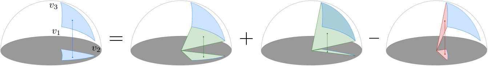
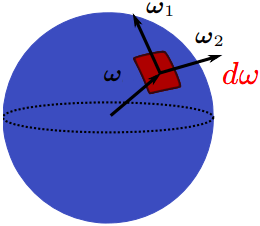
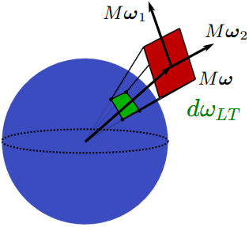
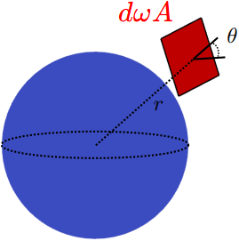

# LTC (Linearly Transformed Cosine)  

Notation | Description | Shader Code Convention  
:-: | :-: | :-:  
$\displaystyle \operatorname{D}$ | (Original) (Normalized) Clamped Cosine Distribution | (1 / PI) * NdotL  
$\displaystyle \operatorname{D_{LT}}$ | LTC (Linearly Transformed Cosine) Distribution | N/A  
$\displaystyle \overrightarrow{\omega_i}$ | Incident Direction in Tangent Space | L  
$\displaystyle \overrightarrow{\omega_o}$ | Outgoing Direction in Tangent Space | V  
$\displaystyle \overrightarrow{\omega_h}$ | Half Vector in Tangent Space | H  
$\displaystyle \overrightarrow{n}$ | Normal in World Space | N  
$\displaystyle \operatorname{f}(\overrightarrow{\omega_i}, \overrightarrow{\omega_o})$ | BRDF | N/A
$\displaystyle \operatorname{f_{MONO}}(\overrightarrow{\omega_i}, \overrightarrow{\omega_o})$ | (Monochromatic) BRDF | N/A
$\displaystyle \operatorname{L_i}(\overrightarrow{\omega_i})$ | Incident Radiance | N/A
$\displaystyle \operatorname{L_o}(\overrightarrow{\omega_o})$ | Outgoing Radiance | N/A  
$\displaystyle \max(0, \cos \theta_i)$ | Clamped Cosine | NdotL  
$\displaystyle \operatorname{\rho}(\overrightarrow{\omega_o})$ | Albedo (Hemispherical-Directional Reflectance) | N/A  
$\displaystyle \operatorname{\rho_{MONO}}(\overrightarrow{\omega_o})$ | (Monochromatic) Albedo (Hemispherical-Directional Reflectance) | N/A  

By "Equation 5.9" of [PBR Book V3](https://www.pbr-book.org/3ed-2018/Color_and_Radiometry/Surface_Reflection#TheBRDF) and "Equation 4.14" of [PBR Book V4](https://pbr-book.org/4ed/Radiometry,_Spectra,_and_Color/Surface_Reflection#TheBRDFandtheBTDF), we have the outgoing radiance that $\displaystyle  \operatorname{L_o}(\overrightarrow{\omega_o}) = \int_\Omega \operatorname{f}(\overrightarrow{\omega_i}, \overrightarrow{\omega_o}) \cdot \operatorname{L_i}(\overrightarrow{\omega_i}) \cdot max(0, \cos \theta_i) \, d\overrightarrow{\omega_i}$. By "Figure 14.13" of [PBR Book V3](https://pbr-book.org/3ed-2018/Light_Transport_I_Surface_Reflection/Direct_Lighting#EstimatingtheDirectLightingIntegral), "13.10.1 Multiple Importance Sampling" of [PBR Book V3](https://pbr-book.org/3ed-2018/Monte_Carlo_Integration/Importance_Sampling#MultipleImportanceSampling), "Figure 13.8" of [PBR Book V4](https://pbr-book.org/4ed/Light_Transport_I_Surface_Reflection/A_Better_Path_Tracer) and "2.2.3 Multiple Importance Sampling" of [PBR Book V4](https://pbr-book.org/4ed/Monte_Carlo_Integration/Improving_Efficiency#MultipleImportanceSampling), based on the **MIS (Multiple Importance Sampling)**, we can sample multiple incident directions to calculate the outgoing radiance.  

Evidently, the MIS is NOT efficient in real time rendering. By "Equation 9.9" of [Real-Time Rendering Fourth Edition](https://www.realtimerendering.com/), "8.1.1 Reflectance" of [PBR Book V3](https://pbr-book.org/3ed-2018/Reflection_Models/Basic_Interface#Reflectance), "Equation 4.12" of [PBR Book V4](https://pbr-book.org/4ed/Radiometry,_Spectra,_and_Color/Surface_Reflection#TheBRDFandtheBTDF) and "13.4 A Better Path Tracer" of [PBR Book V4](https://pbr-book.org/4ed/Light_Transport_I_Surface_Reflection/A_Better_Path_Tracer), we have the **Albedo** (Hemispherical-Directional Reflectance) $\displaystyle \operatorname{\rho} (\overrightarrow{\omega_o}) = \int_\Omega \operatorname{f}(\overrightarrow{\omega_i}, \overrightarrow{\omega_o}) \cdot max(0, \cos \theta_i) \, d \overrightarrow{\omega_i}$.  By "14.1.3 Specular Reflection and Transmission" of [PBR Book V3](https://pbr-book.org/3ed-2018/Light_Transport_I_Surface_Reflection/Sampling_Reflection_Functions#SpecularReflectionandTransmission) and "14.1.3 Specular Reflection and Transmission" of [PBR Book V4](https://pbr-book.org/3ed-2018/Light_Transport_I_Surface_Reflection/Sampling_Reflection_Functions#SpecularReflectionandTransmission), based on the **Dirac Delta Distribution**, the area light can be approximated by the punctual light, and we have the Whitted integrator that $\displaystyle \operatorname{L_o}(\omega_o) = \int_\Omega \operatorname{f}(\omega_o, \omega_i) \cdot \operatorname{L_i}(\omega_i) \cdot max(0, \cos \theta_i) \, d\omega_i = \operatorname{\rho} \cdot \operatorname{L_i}(\omega_i)$.  

Although the albedo $\displaystyle \operatorname{\rho}(\overrightarrow{\omega_o})$ can be precalculated offline, the Whitted integrator is still NOT efficient enough in real time rendering. By \[Lagarde 2014\], we usually calculate the irradiance  $\displaystyle \mathrm{E_L}$ from the punctual light, and we have the approximation of the outgoing radiance of the punctual light that $\displaystyle \operatorname{L_o}(\omega_o) = \int_\Omega \operatorname{f}(\omega_o, \omega_i) \cdot \operatorname{L_i}(\omega_i) \cdot max(0, \cos \theta_i) \, d\omega_i = \operatorname{\rho} \cdot \operatorname{L_i}(\omega_i) \approx \operatorname{f}(\omega_o, \omega_i) \cdot \mathrm{E_L} \cdot \mathrm{NdotL} = \operatorname{f}(\omega_o, \omega_i) \cdot \mathrm{E_N}$.  

However, by \[Lagarde 2014\], the material roughness should be modified to hide the infinitesimal specular highlight of the punctual light. This means that the material and lighting can NOT be decoupled. And thus, the area light, which can reduce specular aliasing, is still important in real time rendering.  

## 1\. Clamped Cosine    

In tangent space, the (normalized) **clamped cosine** distribution is defined as $\displaystyle \operatorname{D} (\overrightarrow{\omega}) = \frac{1}{\pi} \max(0, \cos \theta)$. By "Figure 5.13" of [PBR Book V3](https://pbr-book.org/3ed-2018/Color_and_Radiometry/Working_with_Radiometric_Integrals#IntegralsoverProjectedSolidAngle), we have $\displaystyle \int_\Omega \operatorname{D} \, d \overrightarrow{\omega} = \frac{1}{\pi} \int_\Omega \max(0, \cos \theta) \, d \overrightarrow{\omega} = \frac{1}{\pi} \int_\Omega 1 \, d \overrightarrow{\omega^{\perp}} = \frac{1}{\pi} \cdot \pi = 1$. This means that the clamped cosine distribution $\displaystyle \operatorname{D} (\overrightarrow{\omega})$ is **normalized**.  

### 1-1\. Closed-Form Integral  
We assume that the vertices $\displaystyle \overrightarrow{p_1}, \overrightarrow{p_2}, \ldots, \overrightarrow{p_n}$ of the polygon $\displaystyle \mathrm{P}$ are in the tangent space, normalized, and located in the upper hemisphere. By \[Heitz 2017\], the clamped cosine integral over the polygon $\displaystyle \operatorname{F}(\mathrm{P}) = \int_{\mathrm{P}} \operatorname{D} \, d\omega_o$ is closed-form $\displaystyle \operatorname{F}(\mathrm{P}) = \frac{1}{2\pi} \sum_{i \, j}^n \arccos(\overrightarrow{p_i} \cdot \overrightarrow{p_j}) (\operatorname{normalize}(\overrightarrow{p_i} \times \overrightarrow{p_j}) \cdot \overrightarrow{(0, 0, 1)})$. Note that the **winding order** of the vertices implies the direction of the resulting vector $\displaystyle \overrightarrow{p_i} \times \overrightarrow{p_j}$ and thus the facing of the polygon.  

It should be noted that it is **form factor** rather than **irradiance** that \[Heitz 2017\] calculates. Although the terms **irradiance** and **form factor** may be interchangeably used, technically **irradiance** should NOT be divided by $\displaystyle \pi$. This means that $\displaystyle \operatorname{E}(\mathrm{P}) = \pi \operatorname{F}(\mathrm{P})$.  

### 1-2\. Branch Divergence

However, the assumption, that the vertices are in the upper hemisphere, forces us to clip the polygon. This introduces [divergent branches](https://docs.nvidia.com/gameworks/content/developertools/desktop/analysis/report/cudaexperiments/sourcelevel/divergentbranch.htm) which should ideally be avoided.  

By \[Snyder 1996\], the integral over the sphere can be calculated without clipping as $\displaystyle \operatorname{F} = \frac{1}{\pi} {\begin{cases} {\displaystyle \pi \cos \omega \sin^2 \sigma} &{\displaystyle \omega \isin [0, \frac{\pi}{2} - \sigma]} \\{\displaystyle \pi \cos \omega \sin^2 \sigma + \operatorname{G}(\omega, \sigma, \gamma) - \operatorname{H}(\omega, \sigma, \gamma)} &{\displaystyle \omega \isin [\frac{\pi}{2} - \sigma, \frac{\pi}{2}]} \\{\operatorname{G}(\omega, \sigma, \gamma) - \operatorname{H}(\omega, \sigma, \gamma)} &{\displaystyle \omega \isin [\frac{\pi}{2}, \frac{\pi}{2} + \sigma]} \\{0} &{\omega \isin [\frac{\pi}{2} + \sigma, {\pi}]} \end{cases}}$ where $\displaystyle \omega$ is the **elevation angle** and $\displaystyle \sigma$ is the **angular extent**.  

By [Stephen 2016], using the linear fit, this formula by \[Snyder 1996\] can be further approximated by $\displaystyle \operatorname{F} = \sin^2 \sigma \frac{\sin^2 \sigma + \cos \omega}{\sin^2 \sigma + 1}$ which can be evidently calculated efficiently in real time.  

The integral over the sphere is calculated by the [genSphereTab](https://github.com/selfshadow/ltc_code/blob/master/fit/fitLTC.cpp#L307) in the WebGL Demo by \[Stephen 2016\], [PolygonIrradianceFromVectorFormFactor](https://github.com/Unity-Technologies/Graphics/blob/v10.8.0/com.unity.render-pipelines.high-definition/Runtime/Material/Lit/Lit.hlsl#L1630) in Unity3D, and [SphereHorizonCosWrap](https://github.com/EpicGames/UnrealEngine/blob/4.27/Engine/Shaders/Private/CapsuleLight.ush#L95) in UE4.

By \[Stephen 2016\], the **vector form factor** over the polygon can be calculated as $\displaystyle \overrightarrow{\operatorname{F}}(\mathrm{P}) = \frac{1}{2\pi} \sum_{i \, j}^n \arccos(\overrightarrow{p_i} \cdot \overrightarrow{p_j}) \operatorname{normalize}(\overrightarrow{p_i} \times \overrightarrow{p_j})$ even if the vertices are NOT in the upper hemisphere.  

Analogous to the term **vector irradiance** ("Equation 15.16" of [PBR Book V3](https://www.pbr-book.org/3ed-2018/Light_Transport_II_Volume_Rendering/Subsurface_Scattering_Using_the_Diffusion_Equation#DiffusionTheory)) of which the direction is the direction where a flat surface can receive the highest irradiance, the term **vector form factor** over the sphere is the vector of which the direction is towards the center of the sphere and the length is $\displaystyle \operatorname{F} = \frac{1}{\pi} \int_0^{2\pi} \int_0^\alpha \cos \theta \sin \theta \, d \theta d \phi  = \sin^2(\sigma)$ where $\displaystyle \sigma$ is the angular extent.   

By \[Snyder 1996\], a proxy sphere with the same vector form factor can be introduced, and this proxy sphere can be used to calculate the integral over the polygon without clipping.  

The integral over the polygon is calculated by the [LTC_Evaluate](https://github.com/selfshadow/ltc_code/blob/master/webgl/shaders/ltc/ltc_quad.fs#L274) in the WebGL Demo provided by \[Stephen 2016\], [EvaluateBSDF_Rect](https://github.com/Unity-Technologies/Graphics/blob/v10.8.0/com.unity.render-pipelines.high-definition/Runtime/Material/Lit/Lit.hlsl#L1764) in Unity3D, and [RectIrradianceLambert](https://github.com/EpicGames/UnrealEngine/blob/4.27/Engine/Shaders/Private/RectLight.ush#L108) and [RectGGXApproxLTC](https://github.com/EpicGames/UnrealEngine/blob/4.27/Engine/Shaders/Private/RectLight.ush#L442) in UE4.  

## 2\. LTC (Linearly Transformed Cosine)  

We assume that M is the linear transform matrix, $\displaystyle \overrightarrow{\omega}$ is the (original) direction in tangent space and $\displaystyle \overrightarrow{\omega_{LT}} = \operatorname{normalize}(M \overrightarrow{\omega}) = \frac{\displaystyle M \overrightarrow{\omega}}{\displaystyle \| M \overrightarrow{\omega} \|}$ is the linearly transformed direction in tangent space. The **linearly transformed cosine** distribution is defined as $\displaystyle \operatorname{D_{LT}}(\overrightarrow{\omega_{LT}}) = \operatorname{D} (\overrightarrow{\omega}) \frac{d \overrightarrow{\omega}}{d \overrightarrow{\omega_{LT}}}$. By [Integration by Substitution](https://en.wikipedia.org/wiki/Integration_by_substitution), we have that $\displaystyle \int_{\Omega} \operatorname{D_{LT}}(\overrightarrow{\omega_{LT}}) \, d \overrightarrow{\omega_{LT}} = \int_{\Omega} \operatorname{D} (\overrightarrow{\omega}) \frac{d \overrightarrow{\omega}}{d \overrightarrow{\omega_{LT}}} \, d \overrightarrow{\omega_{LT}} = \int_{\Omega} \operatorname{D}(\overrightarrow{\omega}) \, d \overrightarrow{\omega} = 1$. This means that the linearly transformed cosine distribution $\displaystyle \operatorname{D_{LT}} (\overrightarrow{\omega_{LT}})$ is **normalized**.  

### 2-1\. Closed-Form Jacobian  

By "Appendix A" of \[Heitz 2016\], we have the closed-form relationship between $d \overrightarrow{\omega}$ and $d \overrightarrow{\omega_{LT}}$ that $\displaystyle \frac{d \overrightarrow{\omega}}{d \overrightarrow{\omega_{LT}}}(\overrightarrow{\omega_{LT}}) = \frac{|M^{-1}|}{{\| M^{-1} \overrightarrow{\omega_{LT}} \|}^3}$ where $\displaystyle |M^{-1}|$ is the determinant of $\displaystyle M^{-1}$ and $\displaystyle \| M^{-1} \overrightarrow{\omega_{LT}} \|$ is the norm of $\displaystyle M^{-1} \overrightarrow{\omega_{LT}}$. This means that linearly transformed cosine distribution is closed-form $\displaystyle \operatorname{D_{LT}}(\overrightarrow{\omega_{LT}}) = \operatorname{D} (\overrightarrow{\omega}) \frac{d \overrightarrow{\omega}}{d \overrightarrow{\omega_{LT}}} = \operatorname{D} \left( \frac{M^{-1} \overrightarrow{\omega_{LT}}}{\| M^{-1} \overrightarrow{\omega_{LT}} \|} \right) \frac{|M^{-1}|}{{\| M^{-1} \overrightarrow{\omega_{LT}} \|}^3}$.  

> Proof  
>  
> The normalized vectors $\displaystyle \overrightarrow{\omega}$ and $\displaystyle \overrightarrow{\omega_{LT}}$ are corresponding to the directions. The solid angles $\displaystyle d \overrightarrow{\omega}$ and $\displaystyle d \overrightarrow{\omega_{LT}}$ are corresponding to area on the sphere surface.  
>  
>   
> The orthonormal vectors $\displaystyle \omega_1$ and $\displaystyle \omega_2$ are corresponding to the principal curvatures of the Gaussian curvature.  
>  
>   
> By "Equation 5.6" of [PBR Book V3](https://pbr-book.org/3ed-2018/Color_and_Radiometry/Working_with_Radiometric_Integrals#IntegralsoverArea), we have $\displaystyle d \overrightarrow{\omega_{LT}} = \frac{(A d \overrightarrow{\omega}) \cos\theta}{r^2}$ where the A is the ratio, and the $\displaystyle A d \overrightarrow{\omega}$ is the area subtended by the solid angle $\displaystyle d \overrightarrow{\omega_{LT}}$.  
>  
>   
>  
> $\displaystyle \mathrm{A} = \| (M \overrightarrow{\omega}) \times (M \overrightarrow{\omega}) \|$  
> $\displaystyle \cos \theta = \left< \frac{M \overrightarrow{\omega}}{\| M \overrightarrow{\omega} \|}, \frac{(M \overrightarrow{\omega}) \times (M \overrightarrow{\omega})}{\| (M \overrightarrow{\omega}) \times (M \overrightarrow{\omega}) \|} \right>$  
> $\displaystyle \mathrm{r} = \| M \overrightarrow{\omega} \|$

## 3\. Wavelength-Independent BRDF Cosine Approximation  

Evidently, the LTC is wavelength-independent (namely, monochromatic). And it may be too complex to approximate the whole BRDF cosine by the LTC for each RGB channel in rendering.  

Let $\displaystyle \operatorname{f_{MONO}}(\overrightarrow{\omega_i}, \overrightarrow{\omega_o})$ be the monochromatic BRDF. For microfacet BRDF, the monochromatic BRDF is the whole BRDF without the Fresnel $\displaystyle \operatorname{f_{MONO}}(\overrightarrow{\omega_i}, \overrightarrow{\omega_o}) = \frac{\operatorname{D}(\overrightarrow{\omega_i}, \overrightarrow{\omega_o}) \cdot \operatorname{G}(\overrightarrow{\omega_i}, \overrightarrow{\omega_o})}{4 \cdot max(0, \cos \theta_i) \cdot max(0, \cos \theta_o)}$. And our aim is to approximate the monochromatic BRDF cosine by the LTC.  

### 3-1\. Norm (Zeroth Spherical Moment)  

By "Equation 9.9" of [Real-Time Rendering Fourth Edition](https://www.realtimerendering.com/), "8.1.1 Reflectance" of [PBR Book V3](https://pbr-book.org/3ed-2018/Reflection_Models/Basic_Interface#Reflectance), "Equation 4.12" of [PBR Book V4](https://pbr-book.org/4ed/Radiometry,_Spectra,_and_Color/Surface_Reflection#TheBRDFandtheBTDF) and "13.4 A Better Path Tracer" of [PBR Book V4](https://pbr-book.org/4ed/Light_Transport_I_Surface_Reflection/A_Better_Path_Tracer), we have the monochromatic **albedo** (Hemispherical-Directional Reflectance) $\displaystyle \operatorname{\rho_{MONO}} (\overrightarrow{\omega_o}) = \int_\Omega \operatorname{f_{MONO}}(\overrightarrow{\omega_i}, \overrightarrow{\omega_o}) \cdot max(0, \cos \theta_i) \, d \overrightarrow{\omega_i}$.  

The monochromatic albedo $\displaystyle \operatorname{\rho_{MONO}} (\overrightarrow{\omega_o})$ is essentially the **zeroth spherical moment** (namely, **norm**) of the monochromatic BRDF cosine.  
  
By "8.4.3 Masking and Shadowing" of [PBR Book V3](https://pbr-book.org/3ed-2018/Reflection_Models/Microfacet_Models#MaskingandShadowing) and "9.6.3 The Masking-Shadowing Function" of [PBR Book V4](https://pbr-book.org/4ed/Reflection_Models/Roughness_Using_Microfacet_Theory#TheMasking-ShadowingFunction), due to masking and shadowing $\displaystyle \operatorname{G}(\overrightarrow{\omega_i}, \overrightarrow{\omega_o})$, the norm of the monochromatic BRDF cosine $\displaystyle \operatorname{\rho} (\overrightarrow{\omega_o})$ can be less than one.  

However, as we state above, the LTC is always normalized. This means that we should use the the norm of the monochromatic BRDF cosine to scale the LTC first before we approximate the monochromatic BRDF cosine by the LTC.  

The norm of the monochromatic BRDF cosine is calculated by [computeAvgTerms](https://github.com/selfshadow/ltc_code/blob/master/fit/fitLTC.cpp#L34) in the WebGL Demo by \[Stephen 2016\].  

### 3-2\. Median Vector (First Spherical Moment)  

By "Equation 15.16" of [PBR Book V3](https://www.pbr-book.org/3ed-2018/Light_Transport_II_Volume_Rendering/Subsurface_Scattering_Using_the_Diffusion_Equation#DiffusionTheory) and \[Heitz 2016\], we have the **first spherical moment** (namely, **median vector**) of the monochromatic BRDF cosine $\displaystyle \overrightarrow{\mu_1} = \int_\Omega \overrightarrow{\omega_i} \cdot \operatorname{f}(\overrightarrow{\omega_i}, \overrightarrow{\omega_o}) \cdot max(0, \cos \theta_i) \, d \overrightarrow{\omega_i}$.  

By \[Heitz 2016\], the median vector of clamped cosine is the surface normal. This means that we should define the linear (rotation) transform matrix $\displaystyle \mathrm{M_1}$ to make the median vector of LTC align with the median vector of the monochromatic BRDF cosine $\displaystyle \overrightarrow{\mu_1}$ first before we tweak the whole linear transform matrix $\displaystyle \mathrm{M} = \mathrm{M_1} \cdot \mathrm{M_2}$ further of the LTC.  

The median vector of the monochromatic BRDF cosine is calculated by [computeAvgTerms](https://github.com/selfshadow/ltc_code/blob/master/fit/fitLTC.cpp#L34) in the WebGL Demo by \[Stephen 2016\].   

### 3-3\. Optimization  

Based on the **MoM (Method of Moments)**, according to our intuition, we may find another linear (scale and shear) transform matrix $\displaystyle \mathrm{M_2}$ such that the whole linear transform matrix $\displaystyle \mathrm{M} = \mathrm{M_1} \cdot \mathrm{M_2}$ can make the **second spherical moment** of the monochromatic BRDF cosine and LTC align with each other.  

However, the second spherical moment is a tensor, which may be too complex to be used in rendering. By \[Heitz 2016\], we use the $\displaystyle \mathrm{L}^3$ error function $\displaystyle \operatorname{J}(\mathrm{M_2}) = \int_\Omega {\left( \left| \operatorname{f}(\overrightarrow{\omega_i}, \overrightarrow{\omega_o}) \cdot max(0, \cos \theta_i) - \operatorname{\rho_{MONO}}(\overrightarrow{\omega_o}) \cdot \operatorname{D_{LT}}(\overrightarrow{\omega_i}) \right| \right)}^3 \, d \overrightarrow{\omega_i}$ and the **Nelder–Mead Method** nonlinear optimization.  

The $\displaystyle \mathrm{L}^3$ error function is calculated by [computeError](https://github.com/selfshadow/ltc_code/blob/master/fit/fitLTC.cpp#L78) in the WebGL Demo by \[Stephen 2016\]. The Nelder–Mead Method nonlinear optimization is calculated by [NelderMead](https://github.com/selfshadow/ltc_code/blob/master/fit/nelder_mead.h#L26) in the WebGL Demo by \[Stephen 2016\] and [fminsearch](https://github.com/gnu-octave/octave/blob/default/scripts/optimization/fminsearch.m) in GNU Octave.  

### 3-4\. Isotropic TrowBridge-Reitz BRDF  

For isotropic BRDF, the azimuth of the outgoing direction does NOT matter, and we only need to consider the zenith of the outgoing direction.  

According to the convention, we assume that the surface normal is the Z axis $\displaystyle \begin{bmatrix} 0, 0, 1 \end{bmatrix}$, and the outgoing direction is in the XOZ plane $\displaystyle \begin{bmatrix} \sin\theta, 0, \cos\theta \end{bmatrix}$.  

For isotropic TrowBridge-Reitz BRDF, the precalculated value can be determined by the combination of the azimuth of the outgoing direction $$ 

For an isotropic BRDF, the first spherical moment is in the same plane as the surface normal and the outgoing direction.  

By "Equation 5.9" of [PBR Book V3](https://www.pbr-book.org/3ed-2018/Color_and_Radiometry/Surface_Reflection#TheBRDF) and "Equation 4.14" of [PBR Book V4](https://pbr-book.org/4ed/Radiometry,_Spectra,_and_Color/Surface_Reflection#TheBRDFandtheBTDF), we have the outgoing radiance that $\displaystyle  \operatorname{L_o}(\overrightarrow{\omega_o}) = \int_\Omega \operatorname{f}(\overrightarrow{\omega_i}, \overrightarrow{\omega_o}) \cdot \operatorname{L_i}(\overrightarrow{\omega_i}) \cdot max(0, \cos \theta_i) \, d\overrightarrow{\omega_i}$.   

The albedo $\displaystyle \operatorname{\rho} (\overrightarrow{\omega_o})$ is essentially the norm (zeroth spherical moment) of the BRDF cosine, and we have the normalized BRDF cosine $\displaystyle \frac{\operatorname{f}(\overrightarrow{\omega_i}, \overrightarrow{\omega_o}) \cdot max(0, \cos \theta_i)}{\operatorname{\rho} (\overrightarrow{\omega_o})}$.  
  
For any given outgoing direction $\displaystyle \overrightarrow{\omega_o}$ and BRDF $\displaystyle \operatorname{f}(\overrightarrow{\omega_i}, \overrightarrow{\omega_o})$, if we can find the linear transform matrix M to approximate the normalized BRDF cosine by LTC that $\displaystyle \frac{\operatorname{f}(\overrightarrow{\omega_i}, \overrightarrow{\omega_o}) \cdot max(0, \cos \theta_i)}{\operatorname{\rho} (\overrightarrow{\omega_o})} \approx  \operatorname{D_{LT}}(\overrightarrow{\omega_i}) = \operatorname{D} \left( \frac{M^{-1} \overrightarrow{\omega_i}}{\| M^{-1} \overrightarrow{\omega_i} \|} \right) \frac{|M^{-1}|}{{\| M^{-1} \overrightarrow{\omega_i} \|}^3}$, by [Integration by Substitution](https://en.wikipedia.org/wiki/Integration_by_substitution), we can have the closed-form integral of the BRDF cosine over the polygon that $\displaystyle \int_{\mathrm{P}} \operatorname{f}(\overrightarrow{\omega_i}, \overrightarrow{\omega_o}) \cdot max(0, \cos \theta_i) \, d\overrightarrow{\omega_i} = \operatorname{\rho} (\overrightarrow{\omega_o}) \int_{\mathrm{P}} \frac{\operatorname{f}(\overrightarrow{\omega_i}, \overrightarrow{\omega_o}) \cdot max(0, \cos \theta_i)}{\operatorname{\rho} (\overrightarrow{\omega_o})} \, d \overrightarrow{\omega_i} \approx \operatorname{\rho} (\overrightarrow{\omega_o}) \int_{\mathrm{P}} \operatorname{D_{LT}}(\overrightarrow{\omega_{LT}}) \, d \overrightarrow{\omega_{LT}} = \operatorname{\rho} \cdot (\overrightarrow{\omega_o}) \int_{\mathrm{P}} \operatorname{D} (\overrightarrow{\omega}) \frac{d \overrightarrow{\omega}}{d \overrightarrow{\omega_{LT}}} \, d \overrightarrow{\omega_{LT}} = \operatorname{\rho} (\overrightarrow{\omega_o}) \cdot \int_{\mathrm{P_{LT}}} \operatorname{D} (\overrightarrow{\omega}) \, d \overrightarrow{\omega} = \operatorname{\rho} (\overrightarrow{\omega_o}) \cdot \operatorname{F}(\mathrm{P_{LT}})$ wbere $\displaystyle \mathrm{P_{LT}} = M^{-1} \mathrm{P}$ is linearly transformed polygon and $\displaystyle \operatorname{F}(\mathrm{P_{LT}})$ is closed-form by \[Heitz 2017\].  

By "Equation 9" of \[Karis 2013\], [LTC Fresnel Approximation](https://blog.selfshadow.com/publications/s2016-advances/s2016_ltc_fresnel.pdf) of \[Stephen 2016\] and "8.5 Fresnel Incidence Effects" of [PBR Book V3](https://pbr-book.org/3ed-2018/Reflection_Models/Fresnel_Incidence_Effects), based on **Schlick** Fresnel, we have that $\displaystyle \operatorname{\rho} (\overrightarrow{\omega_o}) = \int_\Omega \frac{\operatorname{D}(\overrightarrow{\omega_i}, \overrightarrow{\omega_o}) \cdot \operatorname{F}(\overrightarrow{\omega_i}, \overrightarrow{\omega_o}) \cdot \operatorname{G}(\overrightarrow{\omega_i}, \overrightarrow{\omega_o})}{4 \cdot max(0, \cos \theta_i) \cdot max(0, \cos \theta_o)} \cdot max(0, \cos \theta_i) \, d \overrightarrow{\omega_i} \approx \int_\Omega \frac{\operatorname{D}(\overrightarrow{\omega_i}, \overrightarrow{\omega_o}) \cdot \left( \mathrm{F_0} + \left( \mathrm{F_{90}} - \mathrm{F_0} \right) \cdot {\left(1 - \overrightarrow{\omega_o} \cdot \overrightarrow{\omega_h} \right)}^5 \right) \cdot \operatorname{G}(\overrightarrow{\omega_i}, \overrightarrow{\omega_o})}{4 \cdot max(0, \cos \theta_i) \cdot max(0, \cos \theta_o)} \cdot max(0, \cos \theta_i) \, d \overrightarrow{\omega_i} = \mathrm{F_0} \cdot \int_\Omega \frac{\operatorname{D}(\overrightarrow{\omega_i}, \overrightarrow{\omega_o}) \cdot \left( 1 - {\left(1 - \overrightarrow{\omega_o} \cdot \overrightarrow{\omega_h} \right)}^5 \right)  \cdot \operatorname{G}(\overrightarrow{\omega_i}, \overrightarrow{\omega_o})}{4 \cdot max(0, \cos \theta_i) \cdot max(0, \cos \theta_o)} \cdot max(0, \cos \theta_i) \, d \overrightarrow{\omega_i} + \mathrm{F_{90}} \cdot \int_\Omega \frac{\operatorname{D}(\overrightarrow{\omega_i}, \overrightarrow{\omega_o}) \cdot {\left(1 - \overrightarrow{\omega_o} \cdot \overrightarrow{\omega_h} \right)}^5 \cdot \operatorname{G}(\overrightarrow{\omega_i}, \overrightarrow{\omega_o})}{4 \cdot max(0, \cos \theta_i) \cdot max(0, \cos \theta_o)} \cdot max(0, \cos \theta_i) \, d \overrightarrow{\omega_i}$ where $\displaystyle \int_\Omega \frac{\operatorname{D}(\overrightarrow{\omega_i}, \overrightarrow{\omega_o}) \cdot \left( 1 - {\left(1 - \overrightarrow{\omega_o} \cdot \overrightarrow{\omega_h} \right)}^5 \right)  \cdot \operatorname{G}(\overrightarrow{\omega_i}, \overrightarrow{\omega_o})}{4 \cdot max(0, \cos \theta_i) \cdot max(0, \cos \theta_o)} \cdot max(0, \cos \theta_i) \, d \overrightarrow{\omega_i}$ and $\displaystyle \int_\Omega \frac{\operatorname{D}(\overrightarrow{\omega_i}, \overrightarrow{\omega_o}) \cdot {\left(1 - \overrightarrow{\omega_o} \cdot \overrightarrow{\omega_h} \right)}^5 \cdot \operatorname{G}(\overrightarrow{\omega_i}, \overrightarrow{\omega_o})}{4 \cdot max(0, \cos \theta_i) \cdot max(0, \cos \theta_o)} \cdot max(0, \cos \theta_i) \, d \overrightarrow{\omega_i}$ can be precalculated and stored in the **LUT** (Look-Up Table).  

The norm of the BRDF cosine is calculated by [FSystemTextures::InitializeFeatureLevelDependentTextures](https://github.com/EpicGames/UnrealEngine/blob/4.27/Engine/Source/Runtime/Renderer/Private/SystemTextures.cpp#L297) in UE4 and [IntegrateGGXAndDisneyDiffuseFGD](https://github.com/Unity-Technologies/Graphics/blob/v10.8.1/com.unity.render-pipelines.core/ShaderLibrary/ImageBasedLighting.hlsl#L340) in Unity3D.  

// LUT UV
Since the GGX BRDF is isotropic, the distribution can be determined by the outgoing direction $\displaystyle \omega_v$ and the roughness $\displaystyle \alpha$, which are used as the UV of the LUTs. 

/// Tangent Space  
Note that the LUTs are precomputed by assuming that the vectors are in the tangent space where the normal direction is assumed to be the Z axis (0, 0, 1), and since the GGX BRDF is isotropic, the outgoing direction $\displaystyle \omega_v$ is assumed to be in the XOZ plane. Thus, the vectors should be transformed to this tangent space before the approximation is applied.  

// LUT M
Actually, when M is the scaling transformation $\displaystyle M = \lambda I$, we have $\displaystyle \frac{d\omega_o}{d\omega} = \frac{|M^{-1}|}{{\|M^{-1}w\|}^3} = \frac{\frac{1}{{\lambda}^3}}{{(\frac{1}{\lambda})}^3} = 1$, and thus the LTSC is scale invariant. And since GGX BRDF is planar symmetry and isotropic, by \[Heitz 2016\], the M can be represented by only 4 parameters. The the inverse $\displaystyle M^{-1} = \begin{bmatrix} 1 & 0 & G \\ 0 & B & 0 \\ A & 0 & R \end{bmatrix}$, which is used when rendering, is stored in the LUT. This LUT is called the [ltc_1](https://github.com/selfshadow/ltc_code/blob/master/webgl/shaders/ltc/ltc_quad.fs#L26) in the WebGL Demo provided by \[Stephen 2016\].  

dF/du be constant // reduce linear interpolation error  
 
## 4\. Light  

### 4-1\. Integration over Polygons  
By [Integration by Substitution](https://en.wikipedia.org/wiki/Integration_by_substitution), we can comprehend intuitively that $\displaystyle \int_{P} \operatorname{D}(\omega) \, d\omega = \int_{P_o} \operatorname{D_o}(\omega_o) \frac{d\omega_o}{d\omega} d\omega = \int_{P_o} \operatorname{D_o}(\omega_o) d\omega_o$ where $\displaystyle P_o = M^{-1} P$. Evidently, $\displaystyle P_o = \operatorname{normalize}(M^{-1} P)$ is more consistent with $\displaystyle \omega_o = \operatorname{normalize}(M^{-1} \omega)$. However, even if the $\displaystyle M^{-1} P$ is **NOT** normalized, the area on the sphere surface subtended by the polygon remains the same. Thus, the normalize operator is **NOT** necessary here. Actually, the normalize operator will eventually be applied when the irradiance $\displaystyle \operatorname{E}(P_o)$ is calculated by \[Heitz 2017\].  

### 4-2\. Shading with Constant Polygonal Lights  

By **2\. Approximation**, we have $L_l \int_{P} \operatorname{BRDF}(\omega_v, \omega_l) |\cos \theta_l| \, d\omega_l \approx L_l \int_{P} \mathrm{NormBRDFCosine} \cdot \operatorname{D}(\omega_l) \, d\omega_l = L_l \cdot \mathrm{NormBRDFCosine} \cdot \int_{P} \operatorname{D}(\omega_l) \, d\omega_l$. Note that the polygon P should be transformed to the tangent space before the approximation is applied.  
And by **3-1\. Integration over Polygons**, we have $\displaystyle  L_l \cdot \mathrm{NormBRDFCosine} \cdot \int_{P} \operatorname{D}(\omega_l) \, d\omega_l = L_l \cdot \mathrm{NormBRDFCosine} \cdot \int_{P_o} \operatorname{D_o}(\omega_o) \, d\omega_o = L_l \cdot \mathrm{NormBRDFCosine} \cdot \operatorname{E}(P_o)$ where $\displaystyle P_o = M^{-1} P$ and $\displaystyle \operatorname{E}(P_o) = \int_{P_o} \operatorname{D_o}(\omega_o) \, d\omega_o = \int_{P_o} \frac{1}{\pi}|\cos \theta_o| \, d\omega_o$.  

## Attenuation  

"windowing function" from \[Lagarde 2014\]  

[EllipsoidalDistanceAttenuation](https://github.com/Unity-Technologies/Graphics/blob/v10.8.0/com.unity.render-pipelines.high-definition/Runtime/Material/Lit/Lit.hlsl#L1591)  
[BoxDistanceAttenuation](https://github.com/Unity-Technologies/Graphics/blob/v10.8.0/com.unity.render-pipelines.high-definition/Runtime/Material/Lit/Lit.hlsl#L1597)  

## References  
\[Snyder 1996\] [John Snyder. "Area Light Sources for Real-Time Graphics." Technical Report 1996](https://www.microsoft.com/en-us/research/publication/area-light-sources-for-real-time-graphics/)  
\[Karis 2013\] [Brian Karis. "Real Shading in Unreal Engine 4." SIGGRAPH 2013.](https://cdn2.unrealengine.com/Resources/files/2013SiggraphPresentationsNotes-26915738.pdf)  
\[Lagarde 2014\] [Sebastian Lagarde, Charles Rousiers. "Moving Frostbite to PBR." SIGGRAPH 2014.](https://www.ea.com/frostbite/news/moving-frostbite-to-pb)  
\[Heitz 2016\] [Eric Heitz, Jonathan Dupuy, Stephen Hill, David Neubelt. "Real-Time Polygonal-Light Shading with Linearly Transformed Cosines." SIGGRAPH 2016.](https://eheitzresearch.wordpress.com/415-2/)  
\[Stephen 2016\] [Stephen Hill, Eric Heitz. "Real-Time Area Lighting: a Journey from Research to Production." SIGGRAPH 2016.](https://blog.selfshadow.com/publications/s2016-advances/)  
\[Heitz 2017\] [Eric Heitz. "Geometric Derivation of the Irradiance of Polygonal Lights." Technical report 2017.](https://hal.archives-ouvertes.fr/hal-01458129)  
