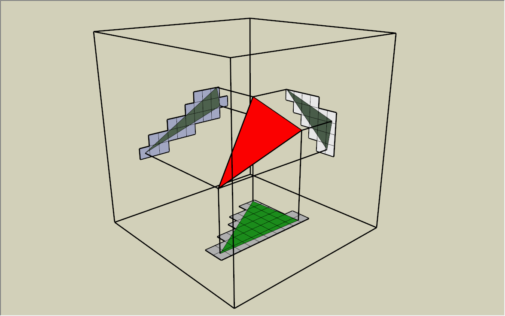
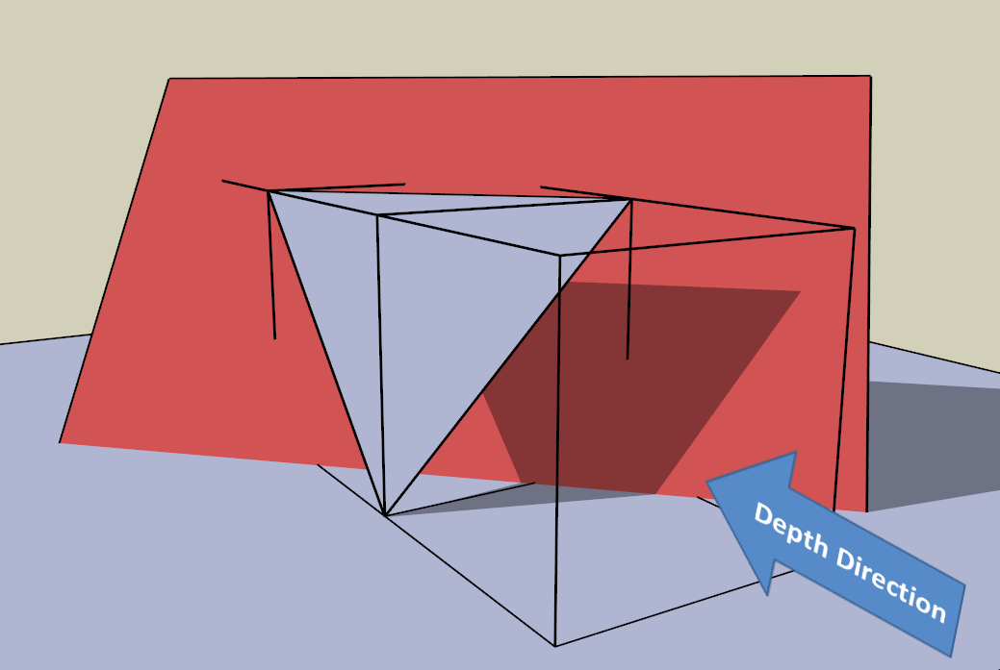
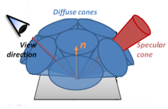
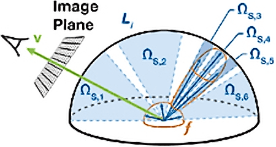
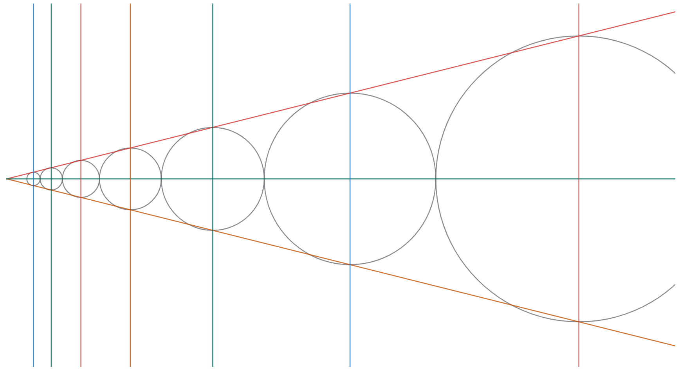

# VCT (Voxel Cone Tracing)  

Notation | Description | Shader Code Convention  
:-: | :-: | :-:  
$\displaystyle \overrightarrow{p}$ | Surface Position in World Space | N/A  
$\displaystyle \overrightarrow{\omega_i}$ | Incident Direction in Tangent Space | L  
$\displaystyle \overrightarrow{\omega_o}$ | Outgoing Direction in Tangent Space | V  
$\displaystyle \overrightarrow{n}$ | Normal in World Space | N  
$\displaystyle \operatorname{f}(\overrightarrow{p}, \overrightarrow{\omega_i}, \overrightarrow{\omega_o})$ | BRDF | N/A  
$\displaystyle \operatorname{L_i}(\overrightarrow{p}, \overrightarrow{\omega_i})$ | Incident Radiance | N/A
$\displaystyle \operatorname{L_o}(\overrightarrow{p}, \overrightarrow{\omega_o})$ | Outgoing Radiance | N/A  
$\displaystyle \max(0, \cos \theta_i)$ | Clamped Cosine | NdotL  


## 1\. Voxel Photon  

### 1-1\. Photon Mapping  

By "4.3 Overview" of \[Jensen 2001\] and \[Hachisuka 2005\], the **photon mapping** is composed of two steps: **photon tracing** and **rendering**. During the **photon tracing** step, the **photon rays** are traced from the light sources, and the lighting information of the intersection positions of these **photon rays** is recorded as the photons. During the **rendering** step, the **primary rays** are traced from the camera and the **final gather rays** are traced from the [**final gather points**](http://docs.autodesk.com/MENTALRAY/2015/ENU/mental-ray-help/files/manual/node52.html), and the lighting information of the neighboring photons of the intersection positions of these **primary rays** or **final gather rays** is used to approximate the lighting of these intersection points.  

By \[Crassin 2011\], the **VCT (Voxel Cone Tracing)** is composed of three steps: **light injection**, **filtering** and **cone tracing**. The idea of the voxel cone tracing is intrinsically to implement the photon mapping by storing the photons in the voxels. The **voxelization** (**light injection** and **filtering**) step of the voxel cone tracing is analogous to the **photon tracing** step of the photon mapping. The **cone tracing** step of the voxel cone tracing is analogous to the **rendering** step of the photon mapping.  

Given N photons at position $\displaystyle \overrightarrow{p_j}$ within the neighborhood of position $\displaystyle \overrightarrow{p_0}$, we have the approximation of the outgoing radiance at position $\displaystyle \overrightarrow{p_0}$ that $\displaystyle \operatorname{L_o}(\overrightarrow{p_0}, \overrightarrow{\omega_o}) \approx \frac{1}{\mathrm{NeighborhoodArea}} \sum_{j=0}^N \operatorname{f}(\overrightarrow{p_j}, \overrightarrow{\omega_i}, \overrightarrow{\omega_o}) \operatorname{\Delta\Phi}(\overrightarrow{p_j})$.  

> Proof  
>  
> We assume that $\displaystyle \operatorname{L_i}(\overrightarrow{p}, \overrightarrow{\omega_i})$ is the indicent radiance distribution on position direction space $\displaystyle \operatorname{B_r}(\overrightarrow{p_0}) \times {\mathrm{S}}^2$ (of which $\displaystyle \operatorname{B_r}(\overrightarrow{p_0})$ is the neighborhood with center $\displaystyle \overrightarrow{p_0}$ and radius r, and $\displaystyle {\mathrm{S}}^2$ is the sphere).  
>  
> Evidently, we have the total flux over the whole neighborhood $\displaystyle \mathrm{\Phi} = \int_{\operatorname{B_r}(\overrightarrow{p_0})} \int_{{\mathrm{S}}^2} \operatorname{L_i}(\overrightarrow{p}, \overrightarrow{\omega_i}) \max(0, \cos \theta_i) \, d \omega_i \, d \operatorname{A}(\overrightarrow{p})$. And we have the normalized PDF $\displaystyle \operatorname{p}(\overrightarrow{p}, \overrightarrow{\omega_i}) = \frac{\operatorname{L_i}(\overrightarrow{p}, \overrightarrow{\omega_i}) \max(0, \cos \theta_i)}{\mathrm{\Phi}}$.  
>  
> We assume that within the neighborhood are N samples (namely, photons) $\displaystyle \operatorname{\Delta\Phi}(\overrightarrow{p_j})$ such that the expectation $\displaystyle \operatorname{\mathbb{E}_p}\left(\sum_{j=1}^N \operatorname{\Delta\Phi}(\overrightarrow{p_j}) \right) = \int_{\operatorname{B_r}(\overrightarrow{p_0})} \int_{{\mathrm{S}}^2} \operatorname{L_i}(\overrightarrow{p}, \overrightarrow{\omega_i}) \max(0, \cos \theta_i) \, d \omega_i \, d \operatorname{A}(\overrightarrow{p}) = \mathrm{\Phi}$.  
>  
> By "Equation 16.7" of [PBR Book V3](https://www.pbr-book.org/3ed-2018/Light_Transport_III_Bidirectional_Methods/Stochastic_Progressive_Photon_Mapping#TheoreticalBasisforParticleTracing), given the uniform kernel $\displaystyle \operatorname{K}(\overrightarrow{p_0}, \overrightarrow{p}) = \frac{1}{\operatorname{Area}(\operatorname{B_r}(\overrightarrow{p_0}))}$, we have the expectation $\displaystyle \operatorname{\mathbb{E}_p}\left(\sum_{j=1}^N \operatorname{K}(\overrightarrow{p_0}, \overrightarrow{p_j}) \operatorname{f}(\overrightarrow{p_j}, \overrightarrow{\omega_i}, \overrightarrow{\omega_o}) \operatorname{\Delta\Phi}(\overrightarrow{p_j}) \right) = \int_{\operatorname{B_r}(\overrightarrow{p_0})} \int_{{\mathrm{S}}^2} \operatorname{K}(\overrightarrow{p_0}, \overrightarrow{p}) \operatorname{f}(\overrightarrow{p}, \overrightarrow{\omega_i}, \overrightarrow{\omega_o}) \operatorname{L_i}(\overrightarrow{p}, \overrightarrow{\omega_i}) \max(0, \cos \theta_i) \, d \omega_i \, d \operatorname{A}(\overrightarrow{p})$.  
>  
> By "Equation 16.9" of [PBR Book V3](https://pbr-book.org/3ed-2018/Light_Transport_III_Bidirectional_Methods/Stochastic_Progressive_Photon_Mapping#PhotonMapping), since $\displaystyle \operatorname{K}(\overrightarrow{p_0}, \overrightarrow{p})$ is the dirac delta distribution when r tends to zero, we have that $\displaystyle \lim\limits_{r \rightarrow 0} \operatorname{\mathbb{E}_p}\left(\sum_{j=1}^N \operatorname{K}(\overrightarrow{p_0}, \overrightarrow{p_j}) \operatorname{f}(\overrightarrow{p_j}, \overrightarrow{\omega_i}, \overrightarrow{\omega_o}) \operatorname{\Delta\Phi}(\overrightarrow{p_j}) \right) = \int_{{\mathrm{S}}^2} \operatorname{f}(\overrightarrow{p_0}, \overrightarrow{\omega_i}, \overrightarrow{\omega_o}) \operatorname{L_i}(\overrightarrow{p_0}, \overrightarrow{\omega_i}) \max(0, \cos \theta_i) \, d \omega_i = \operatorname{L_o}(\overrightarrow{p_0}, \overrightarrow{\omega_o})$ which is exactly the "Equation 7.6" of \[Jensen 2001\].  

By "Equation 16.15" of [PBR Book V3](https://pbr-book.org/3ed-2018/Light_Transport_III_Bidirectional_Methods/Stochastic_Progressive_Photon_Mapping#AccumulatingPhotonContributions), in real time rendering, we have the approximation of the $\displaystyle \operatorname{\Delta\Phi}(\overrightarrow{p_j})$ at position $\displaystyle \overrightarrow{p_j}$ that $\displaystyle \operatorname{\Delta\Phi}(\overrightarrow{p_j}) \approx \operatorname{E_N}(\overrightarrow{p_j}) \cdot \mathrm{PhotonArea} = \operatorname{E_L}(\overrightarrow{p_j}) \cdot \mathrm{NdotL} \cdot \mathrm{PhotonArea}$.  

In voxel cone tracing, we store only one photon in each voxel, and we have $\displaystyle \mathrm{NeighborhoodArea} = {\mathrm{ConeDiameter}}^2$ and $\displaystyle \mathrm{PhotonArea} = {\mathrm{VoxelSize}}^2$. This means that we have the approximation of the outgoing radiance at voxel position in voxel outgoing direction that $\displaystyle \operatorname{L_o}(\mathrm{VoxelPosition}, \mathrm{VoxelOutgoingDirection}) \approx \frac{1}{{\mathrm{ConeDiameter}}^2} \cdot \operatorname{BRDF}(\mathrm{VoxelPosition}, \mathrm{VoxelOutgoingDirection}) \cdot \operatorname{E_N}(\mathrm{VoxelPosition}) \cdot {\mathrm{VoxelSize}}^2$. During the **voxelization** step, the $\displaystyle \operatorname{BRDF}(\mathrm{VoxelPosition}, \mathrm{VoxelOutgoingDirection}) \cdot \operatorname{E_N}(\mathrm{VoxelPosition})$ part of the formula is calculated and store in voxels. During the **cone tracing** step, the $\displaystyle \frac{1}{{\mathrm{ConeDiameter}}^2} \cdot {\mathrm{VoxelSize}}^2$ part of the formula is calculated on the fly.  

### 1-2\. Spherical Function

By "Figure 11.1" of [Real-Time Rendering Fourth Edition](http://www.realtimerendering.com/), ["Figure 14.14"](https://pbr-book.org/3ed-2018/Light_Transport_I_Surface_Reflection/The_Light_Transport_Equation) of [PBR Book V3](https://www.pbr-book.org/3ed-2018/contents) and ["Figure 13.1"](https://www.pbr-book.org/4ed/Light_Transport_I_Surface_Reflection/The_Light_Transport_Equation) of [PBR Book V4](https://www.pbr-book.org/4ed/contents), by assuming no **participating media**, we have the relationship $\displaystyle \mathop{\mathrm{L_i}}(\overrightarrow{p}, \overrightarrow{\omega_i}) = \mathop{\mathrm{L_o}}(\mathop{\mathrm{t}}(\overrightarrow{p}, \overrightarrow{\omega_i}), -\overrightarrow{\omega_i})$ where $\displaystyle \mathop{\mathrm{t}}(\overrightarrow{p}, \overrightarrow{\omega})$ is the ray-casting function. This means that the incident radiance $\displaystyle \mathop{\mathrm{L_i}}(\overrightarrow{p}, \overrightarrow{\omega_i})$ at one position $\displaystyle \overrightarrow{p}$ is exactly the outgoing radiance $\displaystyle \mathop{\mathrm{L_o}}(\mathop{\mathrm{t}}(\overrightarrow{p}, \overrightarrow{\omega_i}), -\overrightarrow{\omega_i})$ at another position $\displaystyle \mathop{\mathrm{t}}(\overrightarrow{p}, \overrightarrow{\omega_i})$.  

In voxel cone tracing, we need to calculate the outgoing radiance $\displaystyle \mathop{\mathrm{L_o}}(\mathrm{VoxelPosition}, -\mathrm{ConeAxisDirection})$ in arbitrary negative cone axis direction. However, in each voxel, we can only store $\displaystyle \operatorname{L_o}(\mathrm{VoxelPosition}, \mathrm{VoxelOutgoingDirection})$ in a limited number of voxel outgoing directions.  

By "10.4.4 Other Projections" of [Real-Time Rendering Fourth Edition](http://www.realtimerendering.com/), ["3.8.3 Spherical Parameterizations"](https://www.pbr-book.org/4ed/Geometry_and_Transformations/Spherical_Geometry#x3-OctahedralEncoding) of [PBR Book V4](https://www.pbr-book.org/4ed/contents), we use the 4x4 **octahadral map** to store 16 voxel outgoing directions in each voxel during the voxelization step, and we reconstruct the arbitrary negative cone axis direction based on these 16 voxel outgoing directions during the cone tracing step.  

TODO: **Spherical Gaussians** investigation ???  

## 2\. Voxelization  

### 2-1\. View Direction

By \[Takeshige 2015\], we should select the view direction based on the maximum component of the absolute triangle normal to make sure that both ```ddx(voxel_coordinates_depth_direction)``` and ```ddy(voxel_coordinates_depth_direction)``` are less than 1.0 to avoid "cracks".  

The traditional implementation (e.g. \[Takeshige 2015\]) may depend on the geometry shader to calculate the normal of triangle. However, the geometry shader is actually NOT necessary. By binding the index and vertex buffers as the ```RWByteAddressBuffer```, just like how we access the vertex information based on ```RayQuery::CommittedPrimitiveIndex``` in [DXR (DirectX Raytracing)](https://microsoft.github.io/DirectX-Specs/d3d/Raytracing.html),  we can access the vertex information of the whole triangle in the vertex shader.  

  

### 2-2\. Multi Sample  

By \[Takeshige 2015\], the same pixel may intersect multiple voxels in view depth direction. And this is the reason why we need to enable the [MSAA](https://learn.microsoft.com/en-us/windows/win32/api/d3d11/ne-d3d11-d3d11_standard_multisample_quality_levels) to check the opacity contribution of each sample, within the same pixel, to different voxels. In practice, the [Conservative Rasterization](https://learn.microsoft.com/en-us/windows/win32/direct3d11/conservative-rasterization) is NOT necessary, and MSAA is a better alternative.  

  

### 2-3\. Premultiplied Alpha

As we state above, during the voxelization step, the $\displaystyle \mathrm{BRDF} \cdot \mathrm{E_N}$ part of the photon mapping formula is calculated. And then, the premultiplied alpha (\[Dunn 2014\]) value $\displaystyle \mathrm{BRDF} \cdot \mathrm{E_N} \cdot \mathrm{VoxelOpacity}$ is calculate and stored in voxels.  

It should be noted that we have to calculate the premultiplied alpha value during the voxelization step. This is because the same voxel can be occupied by multiple triangles, but the alpha should only contribute to the color of the same triangle. During the cone tracing step, the alpha and the color of the triangles that occupy the same voxel have been accumulated, making it NOT possible to distinguish them.  

## 3\. Cone Tracing  

### 3-1\. Monte Carlo Method

The idea of cone tracing is intrinsically to approximate the ray of cone axis direction by the cone, which can be considered as the average of multiple rays within the cone aperture angle.  

By sampling the PDF (Probability Density Function), just like how we calculate the ray direction in ray tracing, we can calculate the cone axis direction in cone tracing.  

By "20.3 Quasirandom Low-Discrepancy Sequences" of \[Colbert 2007\], "13.8.2 Quasi Monte Carlo" of [PBR Book V3](https://pbr-book.org/3ed-2018/Monte_Carlo_Integration/Careful_Sample_Placement#QuasiMonteCarlo) and "8.2.2 Low Discrepancy and Quasi Monte Carlo" of [PBR Book V4](https://pbr-book.org/4ed/Sampling_and_Reconstruction/Sampling_and_Integration#LowDiscrepancyandQuasiMonteCarlo), the low discrepancy sequence is the better alternative than pseudo random sequence.  
  
  

By "20.4 Mipmap Filtered Samples" of \[Colbert 2007\],  we have the cone solid angle that $\displaystyle \mathrm{ConeSolidAngle} = \min \left( \frac{1}{\text{N}} \cdot \frac{1}{\operatorname{PDF}(\mathrm{ConeAxisDirection})}, 2 \pi \right)$. And by [Solid Angle for Cone](https://en.wikipedia.org/wiki/Solid_angle#Solid_angles_for_common_objects), we have the cone ratio that $\displaystyle \mathrm{ConeRatio} = \tan \left( \mathrm{ConeHalfAngle} \right) = \frac{\sqrt{1 - \cos^2 \left( \mathrm{ConeHalfAngle} \right)}}{\cos \left( \mathrm{ConeHalfAngle} \right)}$ where $\displaystyle \cos \left( \mathrm{ConeHalfAngle} \right) = 1 - \frac{\mathrm{ConeSolidAngle}}{2 \pi}$.  

  

### 3-2\. Self Intersection  

By \[Wachter 2019\], "3.9.5 Robust Spawned Ray Origins" of [PBR Book V3](https://pbr-book.org/3ed-2018/Shapes/Managing_Rounding_Error#RobustSpawnedRayOrigins) and "6.8.6 Robust Spawned Ray Origins" of [PBR Book V4](https://pbr-book.org/4ed/Shapes/Managing_Rounding_Error#RobustSpawnedRayOrigins), we should offset the ray origin to avoid self intersection.  

TODO 

### 3-3\. Iteration  

By "Figure 11.12" of [Real-Time Rendering Fourth Edition](http://www.realtimerendering.com/), cone tracing is approximated by intersecting the scene surface with sphere with cone radius. We have the cone height recursive formula that $\displaystyle \mathrm{ConeHeight_{Next}} = \frac{\mathrm{ConeHeight_{Current}} + \mathrm{ConeHeight_{Current}} * \mathrm{ConeRatio}}{1 - \mathrm{ConeRatio}}$ and the cone height increment for each iteration that $\displaystyle \mathrm{ConeHeightIncrement} = \mathrm{ConeHeight_{Next}} - \mathrm{ConeHeight_{Current}}$.  

> Proof  
>  
>  We assume that the front edge of the current sphere touches exactly the back edge of the next sphere, and we have that $\displaystyle \mathrm{ConeHeight_{Next}} - \mathrm{ConeRadius_{Next}} = \mathrm{ConeHeight_{Current}} + \mathrm{ConeRadius_{Current}}$.  
>  
> Since $\displaystyle \mathrm{ConeRadius_{Next}} = \mathrm{ConeHeight_{Next}} * \mathrm{ConeRatio}$ and $\displaystyle \mathrm{ConeRadius_{Current}} = \mathrm{ConeHeight_{Current}} * \mathrm{ConeRatio}$, we have that $\displaystyle \mathrm{ConeHeight_{Next}} * \mathrm{ConeRatio} - \mathrm{ConeRadius_{Next}} = \mathrm{ConeHeight_{Current}} + \mathrm{ConeHeight_{Current}} * \mathrm{ConeRatio}$.  
>  
> This means that $\displaystyle \mathrm{ConeHeight_{Next}} = \frac{\mathrm{ConeHeight_{Current}} + \mathrm{ConeHeight_{Current}} * \mathrm{ConeRatio}}{1 - \mathrm{ConeRatio}}$.  

  

By [Crassin 2011] and [Dunn 2014], the **under operator** is used to calculated the visibility function $\displaystyle \mathrm{V_k} = \prod (1 - \mathrm{A_k})$ and the incident radiance $\displaystyle \sum \mathrm{V_{k-1}} (\mathrm{A_k} \mathrm{C_k}$) at cone apex position in cone axis direction.  

By "Equation 11.3" of [PBR Book V3](https://pbr-book.org/3ed-2018/Volume_Scattering/Volume_Scattering_Processes) and "Equation 11.7" of [PBR Book V4](https://pbr-book.org/4ed/Volume_Scattering/Transmittance), according to Beer's Law, we can calculate the opacity for each cone height increment based on the opacity sampled from voxels that $\displaystyle \mathrm{A_k} = 1 - {(1 - \mathrm{SampledOpacity})}^{\displaystyle \frac{\mathrm{ConeDiameter}}{\mathrm{ConeHeightIncrement}}}$. We assume that the visibility function is piecewise constant along the cone axis direction for each cone height increment, and we have the visibility function that $\displaystyle \mathrm{V_k} = \prod (1 - \mathrm{A_k}) = \prod \mathrm{{\left[ {(1 - \mathrm{SampledOpacity})}^{\displaystyle \frac{\mathrm{ConeDiameter}}{\mathrm{ConeHeightIncrement}}} \right]}_k}$.  

> Proof  
> 
> We assume that the volume is homogeneous with the attenuation/extinction $\sigma_t$.  
>  
> For the opacity sampled from voxels, we have that $\displaystyle 1 - \mathrm{SampledOpacity} = \mathrm{SampledTransmittance} = \exp (- \sigma_t \cdot \mathrm{ConeDiameter})$.  
>  
> For the opacity for each cone height increment, we have that $\displaystyle 1 - \mathrm{A_k} = \mathrm{ConeHeightIncrementTransmittance} = \exp (- \sigma_t \cdot \mathrm{ConeHeightIncrement})$.  
>   
> This means that $\displaystyle \mathrm{A_k} = 1 - {(1 - \mathrm{SampledOpacity})}^{\displaystyle \frac{\mathrm{ConeDiameter}}{\mathrm{ConeHeightIncrement}}}$ which is oblivious to the attenuation/extinction $\sigma_t$.  

As we state above, during the voxelization step, the $\displaystyle \mathrm{BRDF} \cdot \mathrm{E_N}$ part of the photon mapping formula is calculated, and the premultiplied alpha value $\displaystyle \mathrm{BRDF} \cdot \mathrm{E_N} \cdot \mathrm{VoxelOpacity}$ is stored in voxels. And now, during the cone tracing step, the $\displaystyle \frac{1}{{\mathrm{ConeDiameter}}^2} \cdot {\mathrm{VoxelSize}}^2$ part of the photon mapping formula is calculated, and we have the premultiplied alpha color $\displaystyle \mathrm{A_k} \mathrm{C_k} = \mathrm{VoxelOpacity} \cdot \left( \frac{1}{{\mathrm{ConeDiameter}}^2} \cdot \mathrm{BRDF} \cdot \mathrm{E_N} \cdot {\mathrm{VoxelSize}}^2 \right)$. And then we have the incident radiance that $\displaystyle \sum \mathrm{V_{k-1}} (\mathrm{A_k} \mathrm{C_k}) = \sum \mathrm{V_{k-1}} \mathrm{{\left[ \mathrm{VoxelOpacity} \cdot \left( \frac{1}{{\mathrm{ConeDiameter}}^2} \cdot \mathrm{BRDF} \cdot \mathrm{E_N} \cdot {\mathrm{VoxelSize}}^2 \right) \right]}_k}$.  

By "Equation 11.11" of [Real-Time Rendering Fourth Edition](http://www.realtimerendering.com/), the visibility function is not sufficient to describe the ambient occlusion, since the opacity contribution should decrease with distance. The normalized kernel [exponential distribution](https://en.wikipedia.org/wiki/Exponential_distribution) is used to weight the visibility function and we have the distance mapping function $\displaystyle \mathrm{V^{\prime}} = \int \lambda \exp (- \lambda t) \cdot \operatorname{V}(t) \, dt$ where λ is the rate parameter and t is the cone height. Since the visibility function is piecewise constant, according to Newton Leibniz theorem, we have that $\displaystyle \mathrm{V^{\prime}} = \int \lambda \exp (- \lambda t) \cdot \operatorname{V}(t) \, dt = \sum \mathrm{V_k} \cdot \int_{\mathrm{ConeHeight_{k-1}}}^{\mathrm{ConeHeight_k}} \lambda \exp (- \lambda t) \, dt = \sum \mathrm{V_k} \cdot ((- \exp (- \lambda \cdot \mathrm{ConeHeight_k})) - (- \exp (- \lambda \cdot \mathrm{ConeHeight_{k-1}})))$ where $\displaystyle -\exp (- \lambda t)$ is the antiderivative of $\displaystyle \lambda \exp (- \lambda t)$.  

## References  
\[Jensen 2001\] [Henrik Jensen. "Realistic Image Synthesis Using Photon Mapping." AK Peters 2001.](http://www.graphics.stanford.edu/papers/jensen_book/)  
\[Hachisuka 2005\] [Toshiya Hachisuka. "High-Quality Global Illumination Rendering Using Rasterization." GPU Gems 2.](https://developer.nvidia.com/gpugems/gpugems2/part-v-image-oriented-computing/chapter-38-high-quality-global-illumination)  
\[Colbert 2007\] [Mark Colbert, Jaroslav Krivanek. "GPU-Based Importance Sampling." GPU Gems 3.](https://developer.nvidia.com/gpugems/gpugems3/part-iii-rendering/chapter-20-gpu-based-importance-sampling)  
\[Crassin 2011\] [Cyril Crassin, Fabrice Neyret, Miguel Sainz, Simon Green, Elmar Eisemann. "Interactive Indirect Illumination Using Voxel Cone Tracing." SIGGRAPH 2011.](https://research.nvidia.com/publication/interactive-indirect-illumination-using-voxel-cone-tracing)  
\[Dunn 2014\] [Alex Dunn. "Transparency (or Translucency) Rendering." NVIDIA GameWorks Blog 2014.](https://developer.nvidia.com/content/transparency-or-translucency-rendering)   
\[Takeshige 2015\] [Masaya Takeshige. "The Basics of GPU Voxelization." NVIDIA GameWorks Blog 2015.](https://developer.nvidia.com/content/basics-gpu-voxelization)  
