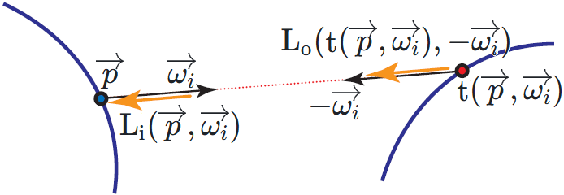

# Path Tracing  

## Rendering Equation  

### Surface Reflection

By ["14.4 The Light Transport Equation"](https://www.pbr-book.org/3ed-2018/Light_Transport_I_Surface_Reflection/The_Light_Transport_Equation) of [PBR Book V3](https://www.pbr-book.org/3ed-2018/contents) and ["13.1 The Light Transport Equation"](https://www.pbr-book.org/4ed/Light_Transport_I_Surface_Reflection/The_Light_Transport_Equation) of [PBR Book V4](https://www.pbr-book.org/4ed/contents), we have the **LTE (Light Transport Equation)** (namely, the **Rendering Equation**) $\displaystyle \mathop{\mathrm{L_o}}(\overrightarrow{p}, \overrightarrow{\omega_o}) = \mathop{\mathrm{L_e}}(\overrightarrow{p}, \overrightarrow{\omega_o}) + \int_{\mathrm{S}^2} \mathop{\mathrm{f}}(\overrightarrow{p}, \overrightarrow{\omega_i}, \overrightarrow{\omega_o}) \mathop{\mathrm{L_i}}(\overrightarrow{p}, \overrightarrow{\omega_i}) | \cos \theta_i | \, d \overrightarrow{\omega_i}$.   

From the **Rendering Equation**, we can learn that the surface and the light are actually the same thing, since the light is merely the surface which is emissive. This is actually the idea of the [OSL (Open Shading Language)](https://github.com/AcademySoftwareFoundation/OpenShadingLanguage).  

It should be noted that, by "Equation \(11.2\)" of [Real-Time Rendering Fourth Edition](http://www.realtimerendering.com/), we have another version of the Rendering Equation $\displaystyle \mathop{\mathrm{L_o}}(\overrightarrow{p}, \overrightarrow{\omega_o}) = \mathop{\mathrm{L_e}}(\overrightarrow{p}, \overrightarrow{\omega_o}) + \int_{\mathrm{S}^2} \mathop{\mathrm{f}}(\overrightarrow{p}, \overrightarrow{\omega_i}, \overrightarrow{\omega_o}) \mathop{\mathrm{L_i}}(\overrightarrow{p}, \overrightarrow{\omega_i}) \max (0, \cos \theta_i ) \, d \overrightarrow{\omega_i}$. 

The difference is that the $\displaystyle \mathop{\mathrm{f}} (\overrightarrow{p}, \overrightarrow{\omega_i}, \overrightarrow{\omega_o})$ from [PBR Book](https://www.pbr-book.org) denotes the **BSDF (Bidirectional Scattering Distribution Function)**, while the $\displaystyle \mathop{\mathrm{f}} (\overrightarrow{p}, \overrightarrow{\omega_i}, \overrightarrow{\omega_o})$ from [Real-Time Rendering Fourth Edition](http://www.realtimerendering.com/) denotes the **BRDF (Bidirectional Reflectance Distribution Function)**.  

By ["5.6 Surface Reflection"](https://www.pbr-book.org/3ed-2018/Color_and_Radiometry/Surface_Reflection) of [PBR Book V3](https://www.pbr-book.org/3ed-2018/contents) and ["4.3 Surface Reflection"](https://www.pbr-book.org/4ed/Radiometry,_Spectra,_and_Color/Surface_Reflection) of [PBR Book V4](https://www.pbr-book.org/4ed/contents), we have the relationship $\displaystyle \mathop{\mathrm{BSDF}} (\overrightarrow{p}, \overrightarrow{\omega_i}, \overrightarrow{\omega_o}) = \begin{cases} \mathop{\mathrm{BRDF}} (\overrightarrow{p}, \overrightarrow{\omega_i}, \overrightarrow{\omega_o}) & \overrightarrow{\omega_i} \text{ and }\overrightarrow{\omega_o} \text{ same hemisphere} \\ \mathop{\mathrm{BTDF}} (\overrightarrow{p}, \overrightarrow{\omega_i}, \overrightarrow{\omega_o}) & \overrightarrow{\omega_i} \text{ and }\overrightarrow{\omega_o} \text{ NOT same hemisphere} \end{cases}$. This is the reason why the $\displaystyle | \cos \theta_i |$ is used for the [PBR Book](https://www.pbr-book.org/) version, while the $\displaystyle \max (0, \cos \theta_i )$ is used for the [Real-Time Rendering Fourth Edition](http://www.realtimerendering.com/) version.  

  

The condition, whether $\displaystyle \overrightarrow{\omega_i}$ and $\displaystyle \overrightarrow{\omega_o}$ are in the same hemisphere, is checked by [BSDF::f](https://pbr-book.org/3ed-2018/Materials/BSDFs) of [PBR Book V3](https://www.pbr-book.org/3ed-2018/contents) and [*BxDF::f](https://pbr-book.org/4ed/Reflection_Models/Dielectric_BSDF) of [PBR Book V4](https://www.pbr-book.org/4ed/contents).   

### Participating Media  

By "Figure 11.1" of [Real-Time Rendering Fourth Edition](http://www.realtimerendering.com/), ["Figure 14.14"](https://pbr-book.org/3ed-2018/Light_Transport_I_Surface_Reflection/The_Light_Transport_Equation) of [PBR Book V3](https://www.pbr-book.org/3ed-2018/contents) and ["Figure 13.1"](https://www.pbr-book.org/4ed/Light_Transport_I_Surface_Reflection/The_Light_Transport_Equation) of [PBR Book V4](https://www.pbr-book.org/4ed/contents), by assuming no **participating media**, we have the relationship $\displaystyle \mathop{\mathrm{L_i}}(\overrightarrow{p}, \overrightarrow{\omega_i}) = \mathop{\mathrm{L_o}}(\mathop{\mathrm{t}}(\overrightarrow{p}, \overrightarrow{\omega_i}), -\overrightarrow{\omega_i})$ where $\displaystyle \mathop{\mathrm{t}}(\overrightarrow{p}, \overrightarrow{\omega})$ is the ray-casting function. This means that the incident radiance $\displaystyle \mathop{\mathrm{L_i}}(\overrightarrow{p}, \overrightarrow{\omega_i})$ at one position $\displaystyle \overrightarrow{p}$ is exactly the exitant radiance $\displaystyle \mathop{\mathrm{L_o}}(\mathop{\mathrm{t}}(\overrightarrow{p}, \overrightarrow{\omega_i}), -\overrightarrow{\omega_i})$ at another position $\displaystyle \mathop{\mathrm{t}}(\overrightarrow{p}, \overrightarrow{\omega_i})$.  

  

### Fredholm Theory  

Hence, both the incident radiance $\displaystyle \mathop{\mathrm{L_i}}(\overrightarrow{p}, \overrightarrow{\omega})$ and the exitant radiance $\displaystyle \mathop{\mathrm{L_o}}(\overrightarrow{p}, \overrightarrow{\omega})$ can be represented by the same function $\displaystyle \mathop{\mathrm{L}}(\overrightarrow{p}, \overrightarrow{\omega})$. Thus, we have the **integral equation** $\displaystyle \mathop{\mathrm{L}}(\overrightarrow{p}, \overrightarrow{\omega_o}) = \mathop{\mathrm{L_e}}(\overrightarrow{p}, \overrightarrow{\omega_o}) + \int_{\mathrm{S}^2} \mathop{\mathrm{f}}(\overrightarrow{p}, \overrightarrow{\omega_i}, \overrightarrow{\omega_o}) \mathop{\mathrm{L}}(\mathop{\mathrm{t}}(\overrightarrow{p}, \overrightarrow{\omega_i}), -\overrightarrow{\omega_i}) | \cos \theta_i | \, d \overrightarrow{\omega_i}$ of which the unknown function is the $\displaystyle \mathop{\mathrm{L}}(\overrightarrow{p}, \overrightarrow{\omega})$. This means that the problem of rendering is essentially converted into the problem of solving this integral equation. 

There are two independent approaches: **ray tracing** (based on the **Fredholm theory**) and **radiosity** (based on the **FEM(Finite Element Method)**). But we currently only focus on the Fredholm theory.  
   
By ["Light transport and the rendering equation"](http://www-graphics.stanford.edu/courses/cs348b-96/transport/transport.html) of [CS 348B - Computer Graphics: Image Synthesis Techniques - Levoy 1996](http://www-graphics.stanford.edu/courses/cs348b-96/), this intergral equation is actually the [**Fredholm  integral equation of the second kind**](https://en.wikipedia.org/wiki/Fredholm_integral_equation) of which the solution is the **Liouville–Neumann series** $\displaystyle \mathop{\mathrm{L}}(\overrightarrow{p_1} \rightarrow \overrightarrow{p_0}) = \mathop{\mathrm{L_e}}(\overrightarrow{p_1} \rightarrow \overrightarrow{p_0}) + \int_{\mathrm{S}^2} \mathop{\mathrm{f}}(\overrightarrow{p_1}, -(\overrightarrow{p_2} \rightarrow \overrightarrow{p_1}), \overrightarrow{p_1} \rightarrow \overrightarrow{p_0}) \mathop{\mathrm{L_e}}(-(\overrightarrow{p_2} \rightarrow \overrightarrow{p_1})) |\cos \theta_{-(\overrightarrow{p_2} \rightarrow \overrightarrow{p_1})} | \, d \overrightarrow{\omega_{-(\overrightarrow{p_2} \rightarrow \overrightarrow{p_1})}} + \int_{\mathrm{S}^2} \int_{\mathrm{S}^2} \mathop{\mathrm{f}}(\overrightarrow{p_1}, -(\overrightarrow{p_2} \rightarrow \overrightarrow{p_1}), \overrightarrow{p_1} \rightarrow \overrightarrow{p_0}) \mathop{\mathrm{f}}(\overrightarrow{p_2}, -(\overrightarrow{p_3} \rightarrow \overrightarrow{p_2}), \overrightarrow{p_2} \rightarrow \overrightarrow{p_1}) \mathop{\mathrm{L_e}}(-(\overrightarrow{p_3} \rightarrow \overrightarrow{p_2})) |\cos \theta_{-(\overrightarrow{p_3} \rightarrow \overrightarrow{p_2})} | |\cos \theta_{-(\overrightarrow{p_2} \rightarrow \overrightarrow{p_1})} | \, d \overrightarrow{\omega_{-(\overrightarrow{p_2} \rightarrow \overrightarrow{p_1})}} d \overrightarrow{\omega_{-(\overrightarrow{p_3} \rightarrow \overrightarrow{p_2})}} + \cdots$.  

  

SPP (samples per pixel)  

### Surface Form  

By ["Equation (5.6)"](https://pbr-book.org/3ed-2018/Color_and_Radiometry/Working_with_Radiometric_Integrals) of [PBR Book V3](https://www.pbr-book.org/3ed-2018/contents) and ["Equation (4.9)"](https://pbr-book.org/4ed/Radiometry,_Spectra,_and_Color/Working_with_Radiometric_Integrals) of [PBR Book V4](https://www.pbr-book.org/4ed/contents), we have the relationship $\displaystyle d\omega = \frac{\cos\theta}{r^2} dA$.  

  

By ["Figure 14.15"](https://pbr-book.org/3ed-2018/Light_Transport_I_Surface_Reflection/The_Light_Transport_Equation) of [PBR Book V3](https://www.pbr-book.org/3ed-2018/contents) and ["Figure 13.2"](https://www.pbr-book.org/4ed/Light_Transport_I_Surface_Reflection/The_Light_Transport_Equation) of [PBR Book V4](https://www.pbr-book.org/4ed/contents), we have 

only the last step Next Event Estimation requires the dA // other vertices use domega  

#### Throughput

###  

// Distribution / Sample / 

// Incremental Path Construction  

// Correlation // NOT independent  

#### Visibility

// always 1 // ray tracing provides an operation to importance sample the visibility  

#### NEE (Next Event Estimation)  

// p(w) PDF \int p(w) dw = 1 // \int p(w) /r da = 1 // PDF  

// equation 13.7 13.9  

// code simple light  

// previous vertices of the path  
// sampleBSDF
// samples generated from the BSDF distributtion // considier uncolude (shadow ray) // direct light  
 
// last vertex of the path 
//  
// sampleLight
//  
// samples generated from the light distribution    
//   
// the l_e is from light // light is essentially surface // we do not consider the l_e from intersection position (another surface (the light) has been considered)  
//  
// MIS (sampleBSDF + sampleLight)  
//   

### russian rulleto  

bounce number - geometric distribution // sample Light (last vertex) does not need russian rulleto // only required by sample BSDF  

## Delta Distribution  

["14.4.5 Delta Distributions in the Integrand"](https://pbr-book.org/3ed-2018/Light_Transport_I_Surface_Reflection/The_Light_Transport_Equation#DeltaDistributionsintheIntegrand) of "PBR Book V3"  
["13.1.5 Delta Distributions in the Integrand"](https://pbr-book.org/4ed/Light_Transport_I_Surface_Reflection/The_Light_Transport_Equation#DeltaDistributionsintheIntegrand) of "PBR Book V4"  

## Texture Sampling and Antialiasing  

### Ray Differentials  

ray differentials -> mipmap Level   
"10.1 Texture Sampling and Antialiasing" of "PBR Book V4"  
"10.1 Sampling and Antialiasing" of "PBR Book V3"  

### Specular Antialiasing  

Toksvig   
normal variance  
the NDF of the average normal and the average roughness (separately) is NOT the average NDF  
[NormalCurvatureToRoughness](https://github.com/EpicGames/UnrealEngine/blob/4.27/Engine/Shaders/Private/BasePassPixelShader.usf#L67) of "Unreal Engine"  
[TextureNormalVariance](https://github.com/Unity-Technologies/Graphics/blob/v10.8.1/com.unity.render-pipelines.core/ShaderLibrary/CommonMaterial.hlsl#L214) of "Unity3D"  
"7.8.1 Mipmapping BRDF and Normal Maps" of "Real-Time Rendering Third Edition"  
"9.13.1 Filtering Normals and Normal Distributions" of "Real-Time Rendering Fourth Edition"  
