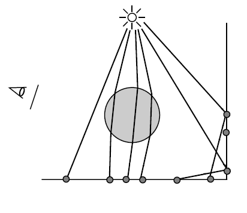
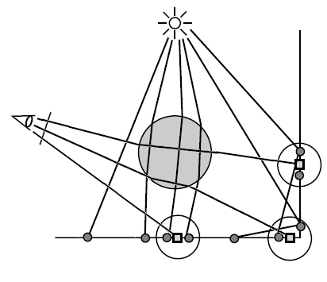
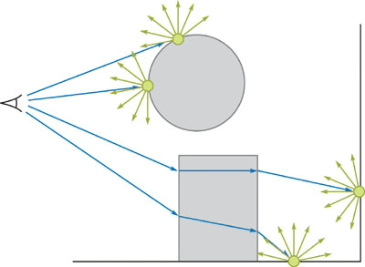

# Photon Mapping

## Workflow  

By "4.3 Overview" of \[Jensen 2001\] and "16.2.2 Photon Mapping" of [PBR Book V3](https://pbr-book.org/3ed-2018/Light_Transport_III_Bidirectional_Methods/Stochastic_Progressive_Photon_Mapping#PhotonMapping), the **photon mapping** is composed of two steps: **photon tracing** and **rendering**. During the **photon tracing** step, the **photon rays** are traced from the light sources, and the lighting information of the intersection positions of these **photon rays** is recorded as the photons. During the **rendering** step, the **primary rays** are traced from the camera and the **final gather rays** are traced from the [**final gather points**](http://docs.autodesk.com/MENTALRAY/2015/ENU/mental-ray-help/files/manual/node52.html), and the lighting information of the vicinal photons of the intersection positions of these **primary rays** or **final gather rays** is used to approximate the lighting of these intersection points by **density estimation**.  

By "7.5 Photon Gathering" of \[Jensen 2001\], "38.2.2 Final Gathering" of \[Hachisuka 2005\] and "16.2.2 Photon Mapping" of [PBR Book V3](https://pbr-book.org/3ed-2018/Light_Transport_III_Bidirectional_Methods/Stochastic_Progressive_Photon_Mapping#PhotonMapping), the rendering step of the photon mapping is usually composed of two steps: **radiance estimate** and **final gathering**. During the **radiance estimate** step, the **primary rays** are traced from the camera, and the lighting information of the vicinal photons of the intersection positions of these **primary rays** is used to approximate the lighting of these intersection points by **density estimation**. During the **final gathering** step, from some of the intersection positions of the **primary rays**, which are called the [**final gather points**](http://docs.autodesk.com/MENTALRAY/2015/ENU/mental-ray-help/files/manual/node52.html), the **final gather rays** are traced, and the lighting information of the vicinal photons of the intersection positions of these **final gather rays** is used to approximate the lighting of these intersection positions by **density estimation**.  

| **Photon Tracing** | **Rendering / Radiance-Estimate** | **Rendering / Final Gathering** |  
| :-: | :-: | :-: |  
|  |  |  |  

## Density Estimation   

By "Equation \(16.9\)" of [PBR Book V3](https://pbr-book.org/3ed-2018/Light_Transport_III_Bidirectional_Methods/Stochastic_Progressive_Photon_Mapping#PhotonMapping), "Equation \(7.3\)" of \[Jensen 2001\] and "14.4.5 Delta Distributions in the Integrand" of [PBR Book V3](https://pbr-book.org/3ed-2018/Light_Transport_I_Surface_Reflection/The_Light_Transport_Equation#DeltaDistributionsintheIntegrand), we have $\displaystyle \operatorname{L_o}(\overrightarrow{p}, \overrightarrow{\omega_o}) = \int_{\mathrm{S}^2} \operatorname{f}(\overrightarrow{p}, \overrightarrow{\omega_i}, \overrightarrow{\omega_o}) \operatorname{L_i}(\overrightarrow{p}, \overrightarrow{\omega_i}) (\cos \theta_i)^+ \, d \overrightarrow{\omega_i} = \int_A \left\lparen \int_{\mathrm{S}^2} \operatorname{\delta}(\overrightarrow{p'} - \overrightarrow{p}) \operatorname{f}(\overrightarrow{p'}, \overrightarrow{\omega_i}, \overrightarrow{\omega_o}) \operatorname{L_i}(\overrightarrow{p'}, \overrightarrow{\omega_i}) (\cos \theta_i)^+ \, d \overrightarrow{\omega_i} \right\rparen \, d \operatorname{A}(\overrightarrow{p'})$ where $\displaystyle \operatorname{\delta}(\overrightarrow{p'} - \overrightarrow{p})$ is the **delta function**.  

By "Equation \(16.11\)" of [PBR Book V3](https://pbr-book.org/3ed-2018/Light_Transport_III_Bidirectional_Methods/Stochastic_Progressive_Photon_Mapping#PhotonMapping) and "Equation \(7.4\)" of \[Jensen 2001\], the **delta function** is approximated by the **filter function**. This is the reason why the photon mapping algorithm is **biased**. Theoretically, the **delta function** is considered as an unknown **probability density function**, and the **density estimation** is used to **approximate** the **probability density** at the shading position.  The **kernel density estimation** is one of the methods of the **density estimation**, and we have $\displaystyle \operatorname{L_o}(\overrightarrow{p}, \overrightarrow{\omega_o}) = \int_A \left\lparen \int_{\mathrm{S}^2} \operatorname{\delta}(\overrightarrow{p'} - \overrightarrow{p}) \operatorname{f}(\overrightarrow{p'}, \overrightarrow{\omega_i}, \overrightarrow{\omega_o}) \operatorname{L_i}(\overrightarrow{p'}, \overrightarrow{\omega_i}) (\cos \theta_i)^+ \, d \overrightarrow{\omega_i} \right\rparen \, d \operatorname{A}(\overrightarrow{p'}) \approx \sum_{i=1}^N \left\lparen \frac{1}{N} \frac{1}{h} \operatorname{K}(\frac{\overrightarrow{p_i} - \overrightarrow{p}}{h}) \right\rparen \left\lparen \int_{\mathrm{S}^2} \operatorname{f}(\overrightarrow{p}, \overrightarrow{\omega_i}, \overrightarrow{\omega_o}) \operatorname{L_i}(\overrightarrow{p_i}, \overrightarrow{\omega_i}) (\cos \theta_i)^+ \, d \overrightarrow{\omega_i} \right\rparen$ where $\displaystyle \frac{1}{h} \operatorname{K}(\frac{\overrightarrow{p_i} - \overrightarrow{p}}{h}) = \operatorname{K_h}(\overrightarrow{p_i} - \overrightarrow{p})$ is the **scaled kernel**. The **k-NN (k-Nearest Neighbors)** is one of the methods of the **kernel density estimation**, and is the actual method used by the photon mapping algorithm, and we have $\displaystyle \operatorname{L_o}(\overrightarrow{p}, \overrightarrow{\omega_o}) = \int_A \left\lparen \int_{\mathrm{S}^2} \operatorname{\delta}(\overrightarrow{p'} - \overrightarrow{p}) \operatorname{f}(\overrightarrow{p'}, \overrightarrow{\omega_i}, \overrightarrow{\omega_o}) \operatorname{L_i}(\overrightarrow{p'}, \overrightarrow{\omega_i}) (\cos \theta_i)^+ \, d \overrightarrow{\omega_i} \right\rparen \, d \operatorname{A}(\overrightarrow{p'}) \approx \frac{k}{N} \frac{1}{\pi {(\operatorname{R_k}(\overrightarrow{p}))}^2} \sum_{i=1}^N \int_{\mathrm{S}^2} \operatorname{f}(\overrightarrow{p}, \overrightarrow{\omega_i}, \overrightarrow{\omega_o}) \operatorname{L_i}(\overrightarrow{p_i}, \overrightarrow{\omega_i}) (\cos \theta_i)^+ \, d \overrightarrow{\omega_i}$ where $\displaystyle N = k \Rightarrow \frac{k}{N} = 1$ (the samples are exactly the k-nearest neighbors, namely, the number of the samples N is exactly the k), and $\displaystyle \operatorname{R_k}(\overrightarrow{p})$, which is also called the radius, is the maximum distance between each sample position $\displaystyle \overrightarrow{p_i}$ and the shading position $\displaystyle \overrightarrow{p}$.  

## SPPM (Stochastic Progressive Photon Mapping)  

"Equation \(16.13\)" of [PBR Book V3](https://pbr-book.org/3ed-2018/Light_Transport_III_Bidirectional_Methods/Stochastic_Progressive_Photon_Mapping#PhotonMapping)  

"SPPMIntegrator::Render" of [PBRT V3](https://github.com/mmp/pbrt-v3/blob/book/src/integrators/sppm.cpp#L424)  

##  

"24. Real-Time Global Illumination with Photon Mapping" of [Ray Tracing Gems](https://www.realtimerendering.com/raytracinggems/rtg/index.html)  

"30. Caustics Using Screen Space Photon Mapping" of [Ray Tracing Gems](https://www.realtimerendering.com/raytracinggems/rtg/index.html)  

"30. Real-Time Ray Traced Caustics" of [Ray Tracing Gems II](https://www.realtimerendering.com/raytracinggems/rtg2/index.html)  

## References  
\[Jensen 2001\] [Henrik Jensen. "Realistic Image Synthesis Using Photon Mapping." AK Peters 2001.](http://www.graphics.stanford.edu/papers/jensen_book/)  
\[Hachisuka 2008\] [Toshiya Hachisuka, Shinji Ogaki, Henrik Jensen. "Progressive Photon Mapping." SIGGRAPH 2008.](http://graphics.ucsd.edu/~henrik/papers/progressive_photon_mapping/)  
\[Hachisuka 2009\] [Toshiya Hachisuka, Henrik Jensen. "Stochastic Progressive Photon Mapping." SIGGRAPH 2009.](http://graphics.ucsd.edu/~henrik/papers/sppm/index.html)  

