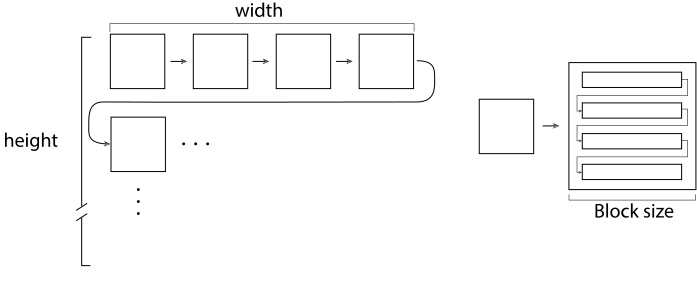
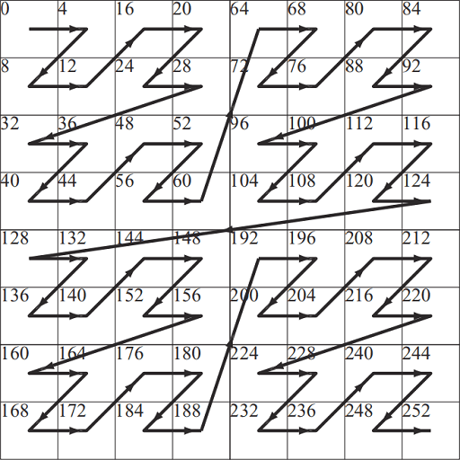

# Resource Uploading  

## Memory Architecture

There are two GPU memory architectures: UMA and NUMA.  

Desktop PC discrete GPUs are the typical cases of the NUMA architecture where the system memory can be accessed by both the GPU and CPU, while the dedicated video memory can be only accessed by the the GPU.  

Desktop PC integrated GPUs, mobile GPUs and console (PlayStation and XBox) GPUs are the typical cases of the UMA architecture where the GPU and CPU share the same memory.    

### NUMA

For NUMA GPU, we need to first fill the [staging buffer](https://chromium.googlesource.com/angle/angle/+/refs/heads/chromium/5777/src/libANGLE/renderer/vulkan/vk_helpers.cpp#4877) with the initial data, and then issue the GPU command to copy the data from the staging buffer to the destination buffer or image.  

### UMA 

For UMA GPU, we can use the CPU to write initial data into the destination buffer or image directly.  

This approach works trivially when we are writing into the buffer.  

However, the tile mode (**VkImageTiling** in Vulkan, **D3D12_TEXTURE_LAYOUT** in Direct3D12) should be considered when we are writing into the image.  

## Tile Mode  

### Linear  

The linear tile mode (**VK_IMAGE_TILING_LINEAR** in Vulkan, **D3D12_TEXTURE_LAYOUT_ROW_MAJOR** in Direct3D12) is exactly the natural memory layout of the **C++ 2D array**.  

### Optimal  

However, by "A.4.4 Blocked 2D Arrays" of [PBR Book V3](https://pbr-book.org/3ed-2018/Utilities/Memory_Management#Blocked2DArrays), the linear tile mode is NOT efficient when the 2D texture is indexed by (u, v), since the adjacent locations in the v direction would be on different cache line.  
  
The optimal tile mode (**VK_IMAGE_TILING_OPTIMAL** in Vulkan, **D3D12_TEXTURE_LAYOUT_UNKNOWN** in Direct3D12) is the efficient memory layout of which the implementation is vendor dependent.  

By "A.4.4 Blocked 2D Arrays" of [PBR Book V3](https://pbr-book.org/3ed-2018/Utilities/Memory_Management#Blocked2DArrays), the **Blocked 2D Array** can be one implementation.  
  

And by "Figure 23.15" of [Real-Time Rendering Fourth Edition](https://www.realtimerendering.com/), the **Morton sequence** can be one implementation.  
  

Since the image is usually in optimal tile mode for better performance, we can NOT simply copy the linear initial data into the image just like how we initialize the buffer.  

For UMA GPU, we can use **VK_EXT_host_image_copy** in Vulkan or **ID3D12Resource::WriteToSubresource** in Direct3D12 to use the CPU to write initial data into the image directly. These two functions can convert the linear initial data into the optimal tiling mode of the image.  

In console, an analog of the the AMD addrlib [ac_surface_addr_from_coord](https://gitlab.freedesktop.org/mesa/mesa/-/blob/22.3/src/amd/vulkan/radv_meta_bufimage.c#L1372) can be used.
 
