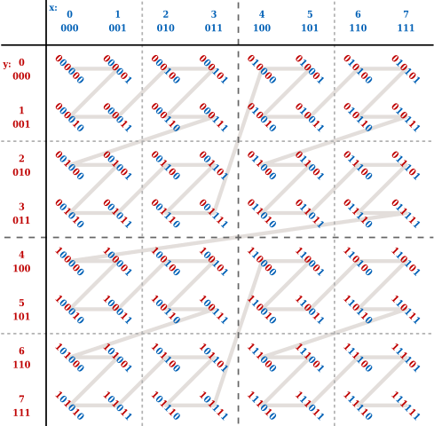

# Image Tiling  

The linear tiling (VK_IMAGE_TILING_LINEAR) is similiar to the natural layout of the C++ 2D array. By "A.4.4 Blocked 2D Arrays" of [PBR Book](https://pbr-book.org/3ed-2018/Utilities/Memory_Management#Blocked2DArrays), for the 2D image indexed by (u, v), the linear tiling is NOT efficient, since the adjacent values in the v direction would be on different cache line.  

The optimal tiling (VK_IMAGE_TILING_OPTIMAL) is the more efficient memory layout. By "Figure 23.15" of [Real-Time Rendering Fourth Edition](https://www.realtimerendering.com/), the Morton sequence can be one implementation.  

  

The implementation of the optimal tiling is vendor dependent. This is why we usually do NOT write to optimal tiling image even if we can map the memory. For AMD GPU, the AMD addrlib [ac_surface_addr_from_coord](https://gitlab.freedesktop.org/mesa/mesa/-/blob/22.3/src/amd/vulkan/radv_meta_bufimage.c#L1372) can be used to calculate the address from the (u, v) index.  
