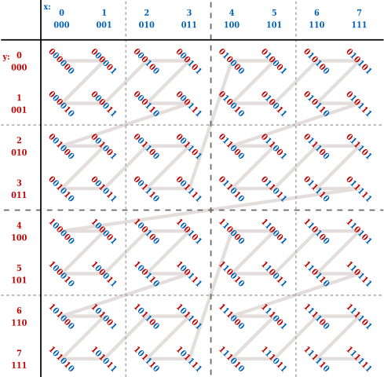

# Image 

## Tiling Mode 

The memory layout of the texture is determined by the **tiling mode** (VkImageTiling).  
The **linear tiling mode** (VK_IMAGE_TILING_LINEAR) is exactly the natural memory layout of the **C++ 2D array**. However, by "A.4.4 Blocked 2D Arrays" of [PBRT-V3](https://pbr-book.org/3ed-2018/Utilities/Memory_Management#Blocked2DArrays), the linear tiling mode is NOT efficient when the 2D texture is indexed by (u, v), since the adjacent locations in the v direction would be on different cache line.  
The **optimal tiling mode** (VK_IMAGE_TILING_OPTIMAL) is the efficient memory layout of which the implementation is vendor dependent. By "A.4.4 Blocked 2D Arrays" of [PBRT-V3](https://pbr-book.org/3ed-2018/Utilities/Memory_Management#Blocked2DArrays), the **Blocked 2D Array** can be one implementation. And by "Figure 23.15" of [Real-Time Rendering Fourth Edition](https://www.realtimerendering.com/), the **Morton sequence** can be one implementation. And for AMD GPU, the AMD addrlib [ac_surface_addr_from_coord](https://gitlab.freedesktop.org/mesa/mesa/-/blob/22.3/src/amd/vulkan/radv_meta_bufimage.c#L1372) can be used to calculate the address from the (u, v) index.  
  

## Metadata  

CB (Color Block) Metadata  

DCC (Delta Color Compression) [Getting the Most Out of Delta Color Compression](https://gpuopen.com/learn/dcc-overview/)  

[radv_device_init_meta_dcc_retile_state](https://gitlab.freedesktop.org/mesa/mesa/-/blob/22.3/src/amd/vulkan/radv_meta_dcc_retile.c#L110)  

CMASK (Color Mask) [HD 7350 demo: MSAA 8x](https://asurati.github.io/wip/post/2022/06/14/hd-7350-demo-msaa-8x/)  
FMask (Fragment Mask) VK_AMD_shader_fragment_mask

DB (Depth Block) Metadata  
HTILE: HiZ(Hierarchical Z)  

D3D12_RESOURCE_FLAG_DENY_SHADER_RESOURCE  