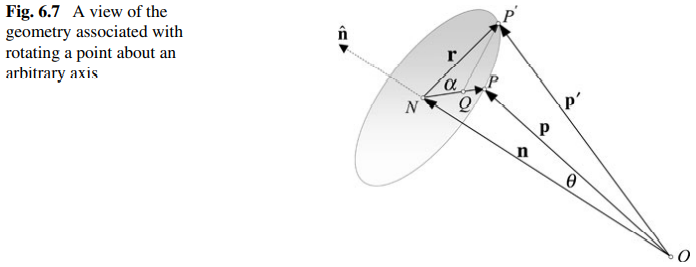

# Dual Quaternion Vertex Blending

## 1\. Dual Quaternion Mathematics

Type | Notation | Examples  
:-: | :-: | :-:  
real number | N/A | $\displaystyle a$  
vector in 3D space | over right arrow | $\displaystyle \overrightarrow{v} = \begin{bmatrix}x, & y, & z\end{bmatrix}$  
quaternion | bold symbol | $\displaystyle \boldsymbol{q} = \begin{bmatrix}s, & \overrightarrow{v}\end{bmatrix}$  
dual number | hat | $\displaystyle \hat{a} = a_0 + a_\epsilon \epsilon$  
dual quaternion | hat & bold symbol | $\displaystyle \hat{\boldsymbol{q}} = \boldsymbol{q_0} + \boldsymbol{q_\epsilon} \epsilon$  

Operator | Description  
:-: | :-:  
$\displaystyle \sqrt{a}$ $\displaystyle \sqrt{\hat{a}}$ | square root (real number, dual number)  
$\displaystyle \overrightarrow{v_1} \cdot \overrightarrow{v_2}$ | dot product (vector)  
$\displaystyle \overrightarrow{v_1} \times \overrightarrow{v_2}$ | cross product (vector)  
$\displaystyle \langle \boldsymbol{q_1} , \boldsymbol{q_1}  \rangle$ | inner product (quaternion)  
$\displaystyle {\\| \overrightarrow{v} \\|}$ $\displaystyle {\\| \boldsymbol{q} \\|}$ $\displaystyle {\\| \hat{a} \\|}$ $\displaystyle {\\| \hat{\boldsymbol{q}} \\|}$ | norm (vector, quaternion, dual number, dual quaternion)  
$\displaystyle {\boldsymbol{q}}^*$ $\displaystyle {\hat{\boldsymbol{q}}}^*$ | conjugation (quaternion, dual quaternion)  
$\displaystyle \overline{\hat{a}}$ $\displaystyle \overline{\hat{\boldsymbol{q}}}$ | conjugation (dual number, dual quaternion)  

### 1-1\. Quaternion

By "Equation \(5.3\)" of [Quaternions for Computer Graphics](https://link.springer.com/book/10.1007/978-1-4471-7509-4), a quaternion can be written as $\displaystyle \boldsymbol{q} = w + xi + yj + zk = \begin{bmatrix}s, & \overrightarrow{v}\end{bmatrix}$ where $\displaystyle s = w$ is a real number and $\displaystyle \overrightarrow{v} = \begin{bmatrix}x, & y, & z\end{bmatrix}$ is a vector in 3D space.  

#### 1-1-1\. Multiplication  

By "Equation \(5.9\)" of [Quaternions for Computer Graphics](https://link.springer.com/book/10.1007/978-1-4471-7509-4), we have the multiplication of quaternions $\displaystyle \boldsymbol{q_0}\boldsymbol{q_1} = \begin{bmatrix}s_0, & \overrightarrow{v_0}\end{bmatrix} \begin{bmatrix}s_1, & \overrightarrow{v_1}\end{bmatrix} = \begin{bmatrix}s_0 s_1 - \overrightarrow{v_0} \cdot \overrightarrow{v_1}, & s_0 \overrightarrow{v_1} + s_1 \overrightarrow{v_0} + \overrightarrow{v_0} \times \overrightarrow{v_1}\end{bmatrix}$.  

#### 1-1-2\. Inner Product 

By [Inner Product Space](https://en.wikipedia.org/wiki/Inner_product_space#Definition) of Wikipedia,  we have the inner product of the quaternions $ \langle \boldsymbol{q_0}, \boldsymbol{q_1} \rangle =  \langle \begin{bmatrix}s_0, & \overrightarrow{v_0}\end{bmatrix}, \begin{bmatrix}s_1, & \overrightarrow{v_1}\end{bmatrix} \rangle = s_0 s_1 + \overrightarrow{v_0} \cdot \overrightarrow{v_1} = w_0 w_1 + x_0 x_1 + y_0 y_1 + z_0 z_1$.  

#### 1-1-3\. Conjugate  

By "5.12 The Conjugate" of [Quaternions for Computer Graphics](https://link.springer.com/book/10.1007/978-1-4471-7509-4), we have the conjugate of a quaternion ${\boldsymbol{q}}^* = {\begin{bmatrix}s, & \overrightarrow{v}\end{bmatrix}}^* = \begin{bmatrix}s, & -\overrightarrow{v}\end{bmatrix}$.  

##### 1-1-3-1\. Distributive Property  

By the multiplication of quaternions, we have that $\displaystyle {(\boldsymbol{q_0} \boldsymbol{q_1})}^* = {\boldsymbol{q_1}}^* {\boldsymbol{q_0}}^*$. The lengthy calculation is provided by "Equation \(5.10\)" and "Equation \(5.11\)" of [Quaternions for Computer Graphics](https://link.springer.com/book/10.1007/978-1-4471-7509-4). 

#### 1-1-4\. Norm  

By "5.12 The Conjugate" of [Quaternions for Computer Graphics](https://link.springer.com/book/10.1007/978-1-4471-7509-4), we have the norm of a quaternion $\displaystyle {\| \boldsymbol{q} \|}^2 = \boldsymbol{q} {\boldsymbol{q}}^* = \begin{bmatrix}s, & \overrightarrow{v}\end{bmatrix} \begin{bmatrix}s, & -\overrightarrow{v}\end{bmatrix} = \begin{bmatrix}s^2 - \overrightarrow{v} \cdot (-\overrightarrow{v}), & s (-\overrightarrow{v}) + s \overrightarrow{v} + \overrightarrow{v} \times (-\overrightarrow{v})\end{bmatrix} = \begin{bmatrix}s^2 + {|\overrightarrow{v}|}^2, &  \overrightarrow{0}\end{bmatrix} = s^2 + {\| \overrightarrow{v} \|}^2 = w^2 + x^2 + y^2 + z^2 = \langle \boldsymbol{q}, \boldsymbol{q} \rangle \Rightarrow \| \boldsymbol{q} \| = \sqrt{\langle \boldsymbol{q}, \boldsymbol{q} \rangle}$.  

#### 1-1-5\. Unit Quaternion  

By "5.14 Normalised Quaternion" of [Quaternions for Computer Graphics](https://link.springer.com/book/10.1007/978-1-4471-7509-4), a unit quaternion  is a quaternion  of which the norm is one.  

#### 1-1-6\. Inverse 

By "5.16 Inverse Quaternion" of [Quaternions for Computer Graphics](https://link.springer.com/book/10.1007/978-1-4471-7509-4), we have the inverse of the quaternion $\displaystyle \boldsymbol{q} {\boldsymbol{q}}^{-1} = 1 = \begin{bmatrix}1, &  \overrightarrow{0}\end{bmatrix} \Rightarrow {\boldsymbol{q}}^* \boldsymbol{q} {\boldsymbol{q}}^{-1} = {\boldsymbol{q}}^* \Rightarrow ({\boldsymbol{q}}^* \boldsymbol{q}) {\boldsymbol{q}}^{-1} = {\boldsymbol{q}}^* \Rightarrow {\| \boldsymbol{q} \|}^2 {\boldsymbol{q}}^{-1} = {\boldsymbol{q}}^* \Rightarrow {\boldsymbol{q}}^{-1} = \frac{{\boldsymbol{q}}^*}{{\| \boldsymbol{q} \|}^2}$.  

#### 1-1-7\. Bijection between Rotation Transforms and Unit Quaternions  

Each rotation transform can be represented by a unit quaternion. And conversely, each unit quaternion can represent a rotation transform.  

##### 1-1-7-1\. Mapping the Rotation Transform to the Unit Quaternion  

Let $\displaystyle \boldsymbol{q} = \begin{bmatrix}\cos \frac{\theta}{2}, & \sin \frac{\theta}{2} \overrightarrow{n}\end{bmatrix}$ where $\displaystyle \overrightarrow{n}$ is a unit vector in 3D space.  

First, we would like to prove that $\displaystyle \boldsymbol{q}$ is a unit quaternion.  

> The norm of of $\displaystyle \boldsymbol{q}$ is calculated as $\displaystyle {\| \boldsymbol{q} \|}^2 = \cos^2 \frac{\theta}{2} + \sin^2 \frac{\theta}{2} {| \overrightarrow{n} |}^2 = \cos^2 \frac{\theta}{2} + \sin^2 \frac{\theta}{2} = 1$. This means that the norm of $\displaystyle \boldsymbol{q}$ is one. And thus, $\displaystyle \boldsymbol{q}$ is a unit quaternion.  
  
Second, we would like to prove that $\displaystyle \boldsymbol{q}$ represents the rotation transform about the axis $\displaystyle \overrightarrow{n}$ by the angle $\displaystyle \theta$.  

> Let $\displaystyle \boldsymbol{p} = \begin{bmatrix}0, & \overrightarrow{p}\end{bmatrix}$ where $\displaystyle \overrightarrow{p}$ is the position in 3D space.  
>  
> Let $\displaystyle \boldsymbol{p'} = \boldsymbol{q} \boldsymbol{p} {\boldsymbol{q}}^{-1} = \begin{bmatrix}s', \overrightarrow{p'}\end{bmatrix}$ where $\displaystyle \overrightarrow{p'}$ is the new position of the position $\displaystyle \overrightarrow{p}$ after the transfrom. Actually, we will later prove that we always have $\displaystyle s' = 0$. Thus, these variable can be ignored.  
>  
> The inverse of of $\displaystyle \boldsymbol{q}$ is calculated as $\displaystyle {\boldsymbol{q}}^{-1} = \frac{\begin{bmatrix}\cos \frac{\theta}{2}, & - \sin \frac{\theta}{2} \overrightarrow{n}\end{bmatrix}}{{\| \boldsymbol{q} \|}^2} = \begin{bmatrix}\cos \frac{\theta}{2}, & - \sin \frac{\theta}{2} \overrightarrow{n}\end{bmatrix}$.  
>  
> By the multiplication of quaternions, we have that $\displaystyle \boldsymbol{p'} = \boldsymbol{q} \boldsymbol{p} {\boldsymbol{q}}^{-1} = \begin{bmatrix}\cos \frac{\theta}{2}, & \sin \frac{\theta}{2} \overrightarrow{n}\end{bmatrix} \begin{bmatrix}0, & \overrightarrow{p}\end{bmatrix} \begin{bmatrix}\cos \frac{\theta}{2}, & - \sin \frac{\theta}{2} \overrightarrow{n}\end{bmatrix} = \begin{bmatrix}0, & (1 - \cos \theta) (\overrightarrow{n} \cdot \overrightarrow{p}) \overrightarrow{p} + \cos \theta \overrightarrow{p} + \sin \theta \overrightarrow{n} \times \overrightarrow{p}\end{bmatrix}$. The lengthy calculation is provided by "Equation \(7.13\)" of [Quaternions for Computer Graphics](https://link.springer.com/book/10.1007/978-1-4471-7509-4). This means that $\displaystyle s' = 0$ and $\displaystyle \overrightarrow{p'} = (1 - \cos \theta) (\overrightarrow{v} \cdot \overrightarrow{p}) \overrightarrow{p} + \cos 2 \theta \overrightarrow{p} + \sin 2 \theta \overrightarrow{v} \times \overrightarrow{p}$.  
>  
> By "Fig. 6.7" and "Fig. 6.8" of [Quaternions for Computer Graphics](https://link.springer.com/book/10.1007/978-1-4471-7509-4), we have  $\displaystyle \overrightarrow{p'}$ is exactly the new position of the position $\displaystyle \overrightarrow{p}$ after the rotation transform about the axis $\displaystyle \overrightarrow{n}$ by the angle $\displaystyle \theta$.  
>  
> Proof  
>  
>>   
>>   
>> TODO  

##### 1-1-7-2\. Mapping the Unit Quaternion to the Rotation Transform  

Let $\displaystyle \boldsymbol{q} = \begin{bmatrix}s, & \overrightarrow{v}\end{bmatrix}$ be the unit quaternion where $\displaystyle s^2 + {\| \overrightarrow{v} \|}^2 = 1$.  

We would like to prove that there exists the $\displaystyle \theta$ and the $\overrightarrow{n}$ such that $\displaystyle \boldsymbol{q} = \begin{bmatrix}\cos \frac{\theta}{2}, & \sin \frac{\theta}{2} \overrightarrow{n}\end{bmatrix}$ and $\displaystyle \overrightarrow{n}$ is a unit vector in 3D space.  

> Since $\displaystyle s^2 + {\| \overrightarrow{v} \|}^2 = 1$, we can find the $\displaystyle \theta$ such that $\displaystyle \cos \frac{\theta}{2} = s$ and $\displaystyle \sin \frac{\theta}{2} = \| \overrightarrow{v} \|$. And let $\displaystyle \overrightarrow{n} = \frac{\overrightarrow{v}}{\| \overrightarrow{v} \|}$. Thus, we have $\displaystyle \boldsymbol{q} = \begin{bmatrix}\cos \frac{\theta}{2}, & \sin \frac{\theta}{2} \overrightarrow{n}\end{bmatrix} = \begin{bmatrix}s, & \overrightarrow{v}\end{bmatrix}$.  

This means that the rotation transform about the axis $\displaystyle \overrightarrow{n}$ by the angle $\displaystyle \theta$ is the rotation transform represented by the unit quaternion $\displaystyle \boldsymbol{q}$.  

### 1-2\. Dual Numbder    
By "A.1 Dual Numbers" of \[Kavan 2008\], a dual number can be written as $\displaystyle \hat{a} = a_0 + a_\epsilon \epsilon$, where $\displaystyle a_0$ and $\displaystyle a_\epsilon$ are real numbers, and $\displaystyle \epsilon$ is a basis element such that $\displaystyle 1 \epsilon = \epsilon 1 = \epsilon$ and $\epsilon \epsilon = 0$.

#### 1-2-1\. Multiplication  
By "Equation \(17\)" of \[Kavan 2008\], we have the multiplication of dual numbers $\displaystyle \hat{a} \hat{b} = (a_0 + a_\epsilon \epsilon)(b_0 + b_\epsilon \epsilon) = a_0 b_0 + (a_0 b_\epsilon + b_0 a_\epsilon) \epsilon$.  

#### 1-2-2\. Conjugate  
By "A.1 Dual Numbers" of \[Kavan 2008\], we have the conjugate of a dual number $\displaystyle \overline{\hat{a}} = \overline{a_0 + a_\epsilon \epsilon} = a_0 - a_\epsilon \epsilon$.  

##### 1-2-2-1\. Distributive Property  

By "Lemma 6" of \[Kavan 2008\], we have that $\displaystyle \overline{\hat{a} \hat{b}} = \overline{\hat{a}} \overline{\hat{b}}$.  

Proof  

> By the multiplication of dual numbers, we have that $\displaystyle \overline{\hat{a} \hat{b}} = \overline{(a_0 + a_\epsilon \epsilon)(b_0 + b_\epsilon \epsilon)} = \overline{a_0 b_0 + (a_0 b_\epsilon + b_0 a_\epsilon) \epsilon} = a_0 b_0 - (a_0 b_\epsilon + b_0 a_\epsilon) \epsilon = (a_0 - a_\epsilon \epsilon)(b_0 - b_\epsilon \epsilon) = \overline{\hat{a}} \overline{\hat{b}}$.  

#### 1-2-3\. Square Root  
By "Equation \(19\)" of \[Kavan 2008\], for any dual number $\displaystyle \hat{a} = a_0 + a_\epsilon \epsilon$ such that $\displaystyle a_0 \gt 0$, we have the square root of the dual number, $\displaystyle \sqrt{\hat{a}} = \sqrt{a_0 + a_\epsilon \epsilon} = \sqrt{a_0} + \frac{a_\epsilon}{2\sqrt{a_0}} \epsilon$.  

Proof  
  
> We would like to find a dual number $\displaystyle \hat{b} = b_0 + b_\epsilon\epsilon$ such that $\displaystyle (b_0 + b_\epsilon \epsilon)(b_0 + b_\epsilon \epsilon) = a_0 + a_\epsilon \epsilon$, namely, $\displaystyle \hat{b} = \sqrt{\hat{a}}$.  
>  
> By the multiplication of dual numbers, we have that $\displaystyle a_0 + a_\epsilon \epsilon = (b_0 + b_\epsilon \epsilon)(b_0 + b_\epsilon \epsilon) = {b_0}^2 + 2 b_0 b_\epsilon \epsilon$. Thus, we have $\displaystyle {b_0}^2 = a_0$ and $\displaystyle a_\epsilon = 2 b_0 b_\epsilon$. Since $\displaystyle a_0 \gt 0$, we have $\displaystyle b_0 = \sqrt{a_0}$ and $\displaystyle b_\epsilon = \frac{a_\epsilon}{2\sqrt{a_0}}$.  

### 1-3\. Dual Quaternion  

By "A.2 Dual Quaternions" of \[Kavan 2008\], a dual quaternion can be deemed not only a quaternion whose elements are dual numbers, but also a dual number whose elements are quaternions. This means that we have not only $\displaystyle \hat{\boldsymbol{q}} = \hat{q_w} + \hat{q_x}i + \hat{q_y}j + \hat{q_z}k$ where $\displaystyle \hat{q_w}$, $\displaystyle \hat{q_x}$, $\displaystyle \hat{q_y}$ and $\displaystyle \hat{q_z}$ are dual numbers, but also $\displaystyle \hat{\boldsymbol{q}} = \boldsymbol{q_0} + \boldsymbol{q_\epsilon} \epsilon$ where $\displaystyle \boldsymbol{q_0}$ and $\displaystyle \boldsymbol{q_\epsilon}$ are quaternions.  

#### 1-3-1\. Multiplication  
Since a dual quaternion can be deemed a dual number whose elements are quaternions, by the multiplication of the dual numbers, we have the multiplication of dual quaternions $\displaystyle \hat{\boldsymbol{p}}\hat{\boldsymbol{q}} = (\boldsymbol{p_0} + \boldsymbol{p_\epsilon} \epsilon)(\boldsymbol{q_0} + \boldsymbol{q_\epsilon} \epsilon) = \boldsymbol{p_0} \boldsymbol{q_0} + (\boldsymbol{p_0} \boldsymbol{q_\epsilon} + \boldsymbol{p_\epsilon} \boldsymbol{q_0}) \epsilon$ where $\displaystyle \boldsymbol{p_0}\boldsymbol{q_0}$, $\displaystyle \boldsymbol{p_0}\boldsymbol{q_\epsilon}$ and $\displaystyle \boldsymbol{p_\epsilon}\boldsymbol{q_0}$ are calculated by the multiplication of quaternions.  

#### 1-3-2\. Conjugate

##### 1-3-2-1\. First Kind - Quaternion Style  
By "A.2 Dual Quaternions" of \[Kavan 2008\], we have the quaternion style conjugate of a dual quaternion $\displaystyle {\hat{\boldsymbol{q}}}^* = {(\boldsymbol{q_0} + \boldsymbol{q_\epsilon} \epsilon)}^* = {\boldsymbol{q_0}}^* + {{\boldsymbol{q_\epsilon}}^*} \epsilon$.  

##### 1-3-2-2\. Second Kind - Dual Number Style  
By "A.2 Dual Quaternions" of \[Kavan 2008\], we have the dual number style conjugate of a dual quaternion $\displaystyle \overline{\hat{\boldsymbol{q}}} = \overline{\boldsymbol{q_0} + \boldsymbol{q_\epsilon} \epsilon} = \boldsymbol{q_0} - \boldsymbol{q_\epsilon} \epsilon$.  

##### 1-3-2-3\. Commutative Property  
By "A.2 Dual Quaternions" of \[Kavan 2008\], we have $\displaystyle \overline{{\hat{\boldsymbol{q}}}^*} = {\overline{\hat{\boldsymbol{q}}}}^* = {\boldsymbol{q_0}}^* - {{\boldsymbol{q_\epsilon}}^*} \epsilon$. And thus, we do NOT distinguish between $\overline{{\hat{\boldsymbol{q}}}^*}$ and ${\overline{\hat{\boldsymbol{q}}}}^*$ any more.  

Proof  

> $\displaystyle \overline{{\hat{\boldsymbol{q}}}^*} = \overline{{(\boldsymbol{q_0} + \boldsymbol{q_\epsilon} \epsilon)}^*} = \overline{{\boldsymbol{q_0}}^* + {{\boldsymbol{q_\epsilon}}^*} \epsilon} = {\boldsymbol{q_0}}^* - {{\boldsymbol{q_\epsilon}}^*} \epsilon = {(\boldsymbol{q_0} - \boldsymbol{q_\epsilon} \epsilon)}^* = {(\overline{\boldsymbol{q_0} + \boldsymbol{q_\epsilon} \epsilon})}^* = {\overline{\hat{\boldsymbol{q}}}}^*$  

##### 1-3-2-4\. Distributive Property  

By "Lemma 10" of \[Kavan 2008\], we have that $\displaystyle {(\hat{\boldsymbol{p}} \hat{\boldsymbol{q}})}^* = {\hat{\boldsymbol{q}}}^* {\hat{\boldsymbol{p}}}^*$.  

Proof  

> By the multiplication of dual quaternions, we have that $\displaystyle {(\hat{\boldsymbol{p}} \hat{\boldsymbol{q}})}^* = {\left\lparen (\boldsymbol{p_0} + \boldsymbol{p_\epsilon} \epsilon)(\boldsymbol{q_0} + \boldsymbol{q_\epsilon} \epsilon) \right\rparen}^* = {\left\lparen \boldsymbol{p_0} \boldsymbol{q_0} + (\boldsymbol{p_0} \boldsymbol{q_\epsilon} + \boldsymbol{p_\epsilon} \boldsymbol{q_0}) \epsilon  \right\rparen}^*$.  
>  
> By the quaternion style conjugate of the dual quaternion, we have that $\displaystyle {\left\lparen \boldsymbol{p_0} \boldsymbol{q_0} + (\boldsymbol{p_0} \boldsymbol{q_\epsilon} + \boldsymbol{p_\epsilon} \boldsymbol{q_0}) \epsilon  \right\rparen}^* = {(\boldsymbol{p_0}\boldsymbol{q_0})}^* + {(\boldsymbol{p_0}\boldsymbol{q_\epsilon} + \boldsymbol{p_\epsilon} \boldsymbol{q_0})}^* \epsilon$.  
>  
> By the distributive property of the conjugate of the quaternions, we have that $\displaystyle {(\boldsymbol{p_0}\boldsymbol{q_0})}^* + {(\boldsymbol{p_0}\boldsymbol{q_\epsilon} + \boldsymbol{p_\epsilon} \boldsymbol{q_0})}^* \epsilon = {(\boldsymbol{p_0}\boldsymbol{q_0})}^* + ({(\boldsymbol{p_0}\boldsymbol{q_\epsilon})}^* + {(\boldsymbol{p_\epsilon} \boldsymbol{q_0})}^*) \epsilon = {\boldsymbol{q_0}}^* {\boldsymbol{p_0}}^* + ({\boldsymbol{q_0}}^* {\boldsymbol{p_\epsilon}}^* + {\boldsymbol{q_\epsilon}}^* {\boldsymbol{p_0}}^*) \epsilon = (\boldsymbol{q_0} + \boldsymbol{q_\epsilon} \epsilon)(\boldsymbol{p_0} + \boldsymbol{p_\epsilon} \epsilon) = {\hat{\boldsymbol{q}}}^* {\hat{\boldsymbol{p}}}^*$.  

#### 1-3-3\. Norm  
By "Equation \(22\)" of \[Kavan 2008\], for any dual quaternion $\displaystyle \hat{\boldsymbol{q}} = \boldsymbol{q_0} + \boldsymbol{q_\epsilon} \epsilon$ such that  $\displaystyle \| \boldsymbol{q_0} \| \ne 0$, we have the norm of the dual qunternion $\displaystyle \| \hat{\boldsymbol{q}} \| = \sqrt{ \hat{\boldsymbol{q}} {\hat{\boldsymbol{q}}}^* } = \sqrt{ (\boldsymbol{q_0} + \boldsymbol{q_\epsilon} \epsilon)(\boldsymbol{q_0} - \boldsymbol{q_\epsilon} \epsilon) } = \| \boldsymbol{q_0} \| + \frac{\langle \boldsymbol{q_0}, \boldsymbol{q_e} \rangle}{\| \boldsymbol{q_0} \|} \epsilon$.  

Proof  

> By the multiplication of dual quaternions, we have that $\displaystyle (\boldsymbol{q_0} + \boldsymbol{q_\epsilon} \epsilon)(\boldsymbol{q_0} - \boldsymbol{q_\epsilon} \epsilon) = {\| \boldsymbol{q_0} \|}^2 + (\boldsymbol{q_0} {\boldsymbol{q_\epsilon}}^* + \boldsymbol{q_\epsilon} {\boldsymbol{q_0}}^*) \epsilon$.  
>  
> First, we would like to prove that $\displaystyle {\boldsymbol{q_\epsilon}}^* + \boldsymbol{q_\epsilon} {\boldsymbol{q_0}}^* = s_0 s_\epsilon + \overrightarrow{v_0} \cdot \overrightarrow{v_\epsilon} = \langle \boldsymbol{q_0}, \boldsymbol{q_\epsilon} \rangle$.  
>  
>> By the multiplication of quaternions, we have that $\displaystyle \boldsymbol{q_0} {\boldsymbol{q_\epsilon}}^* + \boldsymbol{q_\epsilon} {\boldsymbol{q_0}}^* = \begin{bmatrix}s_0, & \overrightarrow{v_0}\end{bmatrix} \begin{bmatrix}s_\epsilon, & -\overrightarrow{v_\epsilon}\end{bmatrix} + \begin{bmatrix}s_\epsilon, & \overrightarrow{v_\epsilon}\end{bmatrix} \begin{bmatrix}s_0, & -\overrightarrow{v_0}\end{bmatrix} = \begin{bmatrix}s_0 s_\epsilon - \overrightarrow{v_0} \cdot (-\overrightarrow{v_\epsilon}), & s_0 (-\overrightarrow{v_\epsilon}) + s_\epsilon \overrightarrow{v_0} + \overrightarrow{v_0} \times (-\overrightarrow{v_\epsilon})\end{bmatrix} + \begin{bmatrix}s_\epsilon s_0 - \overrightarrow{v_\epsilon} \cdot (-\overrightarrow{v_0}), & s_\epsilon (-\overrightarrow{v_0}) + s_0 \overrightarrow{v_\epsilon} + \overrightarrow{v_\epsilon} \times (-\overrightarrow{v_0})\end{bmatrix} = \begin{bmatrix} s_0 s_\epsilon - \overrightarrow{v_0} \cdot (-\overrightarrow{v_\epsilon}) + s_\epsilon s_0 - \overrightarrow{v_\epsilon} \cdot (-\overrightarrow{v_0}), & s_0 (-\overrightarrow{v_\epsilon}) + s_\epsilon \overrightarrow{v_0} + \overrightarrow{v_0} \times (-\overrightarrow{v_\epsilon}) + s_\epsilon (-\overrightarrow{v_0}) + s_0 \overrightarrow{v_\epsilon} + \overrightarrow{v_\epsilon} \times (-\overrightarrow{v_0})\end{bmatrix} = \begin{bmatrix}2 (s_0 s_\epsilon + \overrightarrow{v_0} \cdot \overrightarrow{v_\epsilon}), & \overrightarrow{0}\end{bmatrix} = 2 (s_0 s_\epsilon + \overrightarrow{v_0} \cdot \overrightarrow{v_\epsilon})$.  
>>  
>> By the inner product of quaternions, we have that $\displaystyle \boldsymbol{q_0} {\boldsymbol{q_\epsilon}}^* + \boldsymbol{q_\epsilon} {\boldsymbol{q_0}}^* = s_0 s_\epsilon + \overrightarrow{v_0} \cdot \overrightarrow{v_\epsilon} = \langle \boldsymbol{q_0}, \boldsymbol{q_\epsilon} \rangle$.
>  
> Second, we would like to prove that $\displaystyle \sqrt{{\| \boldsymbol{q_0} \|}^2 + (\boldsymbol{q_0} {\boldsymbol{q_\epsilon}}^* + \boldsymbol{q_\epsilon} {\boldsymbol{q_0}}^*) \epsilon} = \| \boldsymbol{q_0} \| + \frac{\langle \boldsymbol{q_0}, \boldsymbol{q_e} \rangle}{\| \hat{\boldsymbol{q}} \|} \epsilon$.  
>  
>> Evidently, the real part of $\displaystyle {\| \boldsymbol{q_0} \|}^2 + (\boldsymbol{q_0} {\boldsymbol{q_\epsilon}}^* + \boldsymbol{q_\epsilon} {\boldsymbol{q_0}}^*) \epsilon$ is a real number. And since $\displaystyle \boldsymbol{q_0} {\boldsymbol{q_\epsilon}}^* + \boldsymbol{q_\epsilon} {\boldsymbol{q_0}}^* = 2 \langle \boldsymbol{q_0}, \boldsymbol{q_\epsilon} \rangle$, the dual part of $\displaystyle {\| \boldsymbol{q_0} \|}^2 + (\boldsymbol{q_0} {\boldsymbol{q_\epsilon}}^* + \boldsymbol{q_\epsilon} {\boldsymbol{q_0}}^*) \epsilon$ is a real number. This means that $\displaystyle {\| \boldsymbol{q_0} \|}^2 + (\boldsymbol{q_0} {\boldsymbol{q_\epsilon}}^* + \boldsymbol{q_\epsilon} {\boldsymbol{q_0}}^*) \epsilon$ is a dual number.  
>>  
>> By the square root of the dual number, since $\displaystyle \| \boldsymbol{q_0} \| \ne 0$, we have that $\displaystyle \sqrt{{\| \boldsymbol{q_0} \|}^2 + (\boldsymbol{q_0} {\boldsymbol{q_\epsilon}}^* + \boldsymbol{q_\epsilon} {\boldsymbol{q_0}}^*) \epsilon} = \sqrt{{\| \boldsymbol{q_0} \|}^2 + 2 \langle \boldsymbol{q_0}, \boldsymbol{q_\epsilon} \rangle \epsilon} = \| \boldsymbol{q_0} \| + \frac{2 \langle \boldsymbol{q_0}, \boldsymbol{q_\epsilon} \rangle}{2 \sqrt{{\| \boldsymbol{q_0} \|}^2}} \epsilon = \| \boldsymbol{q_0} \| + \frac{\langle \boldsymbol{q_0}, \boldsymbol{q_\epsilon} \rangle}{\| \boldsymbol{q_0} \|} \epsilon$.  

##### 1-3-3-4\. Distributive Property  

By "Lemma 11" of \[Kavan 2008\], we have that $\displaystyle  \| \hat{\boldsymbol{p}} \hat{\boldsymbol{q}} \| = \| \hat{\boldsymbol{p}} \| \| \hat{\boldsymbol{q}} \|$.  

Proof  

> By the distributive property of the quaternion style conjugate of the dual quaternions, we have that $\displaystyle {\| \hat{\boldsymbol{p}} \hat{\boldsymbol{q}} \|}^2 = (\hat{\boldsymbol{p}} \hat{\boldsymbol{q}}) {(\hat{\boldsymbol{p}} \hat{\boldsymbol{q}})}^* = (\hat{\boldsymbol{p}} \hat{\boldsymbol{q}}) ({\hat{\boldsymbol{q}}}^* {\hat{\boldsymbol{p}}}^*) = \hat{\boldsymbol{p}} (\hat{\boldsymbol{q}} {\hat{\boldsymbol{q}}}^*) {\hat{\boldsymbol{p}}}^* = \hat{\boldsymbol{p}} {\| \hat{\boldsymbol{q}} \|}^2 {\hat{\boldsymbol{p}}}^* = {\| \hat{\boldsymbol{q}} \|}^2 \hat{\boldsymbol{p}} {\hat{\boldsymbol{p}}}^* = {\| \hat{\boldsymbol{q}} \|}^2 (\hat{\boldsymbol{p}} {\hat{\boldsymbol{p}}}^*) = {\| \hat{\boldsymbol{q}} \|}^2 {\| \hat{\boldsymbol{p}} \|}^2 = {\| \hat{\boldsymbol{p}} \|}^2 {\| \hat{\boldsymbol{q}} \|}^2$.  

#### 1-3-4\. Unit Dual Quaternion  

By "A.2 Dual Quaternions" of \[Kavan 2008\], a unit dual quaternion  is a dual quaternion  of which the norm is one. By the norm of the dual quaternion , we have that $\displaystyle \| \boldsymbol{q} \| = 1$ and $\displaystyle \langle \boldsymbol{q_0}, \boldsymbol{q_\epsilon} \rangle = 0$. This means that a unit dual quaternion  is a dual quaternion  such that the real part is a unit quaternion and the inner product of the real part and the dual part is zero.  

#### 1-3-5\. Bijection between Rigid Transforms and Unit Dual Quaternions  

By \[Kavan 2007\] and \[Kavan 2008\], the rigid transform is the composition of rotation transform and translation transform.  

By "Lemma 12" of \[Kavan 2008\], we have that each rigid transform can be represented by a unit dual quaternion, and conversely, each unit dual quaternion can represent a rigid transform.  

##### 1-3-5-1\. Mapping the Rigid Transform to the Unit Dual Quaternion  

Let $\displaystyle \hat{\boldsymbol{r}} = \boldsymbol{r_0} + \begin{bmatrix}0, & \overrightarrow{0}\end{bmatrix} \epsilon$ where $\displaystyle \boldsymbol{r_0}$ is a unit quaternion, namely, $\| \boldsymbol{r_0} \| = 1$.  

Let $\displaystyle \hat{\boldsymbol{t}} = \begin{bmatrix}1, & \overrightarrow{0}\end{bmatrix} + \begin{bmatrix}0, & \frac{1}{2}\overrightarrow{t}\end{bmatrix} \epsilon$ where $\displaystyle \overrightarrow{t}$ is a vector in 3D space.  

Let $\displaystyle \hat{\boldsymbol{q}} = \hat{\boldsymbol{t}} \hat{\boldsymbol{r}}$.  

$\displaystyle \boldsymbol{r_0} + \begin{bmatrix}0, & \frac{1}{2}\overrightarrow{t}\end{bmatrix} \boldsymbol{r_0} = \boldsymbol{r_0} + \begin{bmatrix}0, & \frac{1}{2}\overrightarrow{t}\end{bmatrix} \begin{bmatrix}s_r, & \overrightarrow{v_r}\end{bmatrix} = \begin{bmatrix}-\frac{1}{2} \overrightarrow{t} \cdot \overrightarrow{v_r}, & \frac{1}{2} (s_r \overrightarrow{t} + \overrightarrow{t} \times \overrightarrow{v_r} ) \end{bmatrix}$

First, we would like to prove that $\displaystyle \hat{\boldsymbol{q}}$ is a unit dual quaternion.  

> The norm of of $\displaystyle \hat{\boldsymbol{r}}$ is calculated as $\displaystyle \| \hat{\boldsymbol{r}} \| = \| \boldsymbol{r_0} \| + \frac{\langle \begin{bmatrix}0, & \overrightarrow{0}\end{bmatrix}, \boldsymbol{r_0} \rangle}{\| \boldsymbol{r_0} \|} \epsilon = 1 + \frac{0}{1} \epsilon = 1$.  
>  
> And the norm of $\displaystyle \hat{\boldsymbol{t}}$ is calculated as $\displaystyle \| \hat{\boldsymbol{t}} \| = \|  \begin{bmatrix}1, & \overrightarrow{0}\end{bmatrix} \| + \frac{\langle  \begin{bmatrix}1, & \overrightarrow{0}\end{bmatrix}, \begin{bmatrix}0, & \frac{1}{2}\overrightarrow{t}\end{bmatrix} \rangle}{\begin{bmatrix}1, & \overrightarrow{0}\end{bmatrix}} \epsilon = 1 + 0 \epsilon = 1$. This means that the norm of $\displaystyle \boldsymbol{r_0}$ is one.  
>  
> By the distributive property of the norm of the dual quaternions, we have that $\displaystyle  \| \hat{\boldsymbol{q}} \| = \| \hat{\boldsymbol{t}} \hat{\boldsymbol{r}} \| = \| \hat{\boldsymbol{t}} \|  \| \hat{\boldsymbol{r}} \| = 1$. This means that the norm of $\displaystyle \hat{\boldsymbol{q}}$ is one. And thus, $\displaystyle \hat{\boldsymbol{q}}$ is a unit dual quaternion.  

Second, we would like to prove that $\displaystyle \hat{\boldsymbol{q}}$ represents the rigid transform composed of the rotation transform represented by the unit quaternion $\displaystyle \boldsymbol{r_0}$ and the translation transform represented by the vector $\displaystyle \overrightarrow{t}$.  

> Let $\displaystyle \hat{\boldsymbol{p}} = \begin{bmatrix}1, & \overrightarrow{0}\end{bmatrix} + \begin{bmatrix}0, & \overrightarrow{p}\end{bmatrix} \epsilon$ where $\displaystyle \overrightarrow{p}$ is the position in 3D space.  
>  
> Let $\displaystyle \hat{\boldsymbol{p'}} = \hat{\boldsymbol{q}} \hat{\boldsymbol{p}} \overline{{\hat{\boldsymbol{q}}}^*} = \boldsymbol{{p'}_0} + \begin{bmatrix}s', \overrightarrow{p'}\end{bmatrix}$ where $\displaystyle \overrightarrow{p'}$ is the new position of the position $\displaystyle \overrightarrow{p}$ after the transfrom. Actually, we will later prove that we always have $\displaystyle \boldsymbol{{p'}_0} = \begin{bmatrix}1, & \overrightarrow{0}\end{bmatrix}$ and $\displaystyle s' = 0$. Thus, these two variables can be ignored.  
>  
> By the distributive property of the quaternion style conjugate of the dual quaternions, we have that $\displaystyle \overline{{\hat{\boldsymbol{q}}}^*} = \overline{{(\hat{\boldsymbol{t}} \hat{\boldsymbol{r}})}^*} = \overline{{\hat{\boldsymbol{r}}}^* {\hat{\boldsymbol{t}}}^*}$.  
>  
> By the distributive property of the conjugate of dual numbers, we have that $\displaystyle \overline{{\hat{\boldsymbol{r}}}^* {\hat{\boldsymbol{t}}}^*} = \overline{{\hat{\boldsymbol{r}}}^*} \overline{{\hat{\boldsymbol{t}}}^*}$.  
>  
> By the commutative property of the conjugate of the dual quaternions, we have that $\displaystyle {\overline{\hat{\boldsymbol{r}}}}^* = {\boldsymbol{r_0}}^* - {{\boldsymbol{r_\epsilon}}^*} \epsilon = {\boldsymbol{r_0}}^* = \frac{{\boldsymbol{r_0}}^*}{1} = \frac{{\boldsymbol{r_0}}^*}{{\| \boldsymbol{r_0} \|}^2} = {\boldsymbol{r_0}}^{-1}$ and $\displaystyle{\overline{\hat{\boldsymbol{t}}}}^* = {\boldsymbol{t_0}}^* - {{\boldsymbol{t_\epsilon}}^*} \epsilon = \begin{bmatrix}1, & \overrightarrow{0}\end{bmatrix} - {(\begin{bmatrix}0, & \frac{1}{2}\overrightarrow{t}\end{bmatrix})}^* \epsilon = \begin{bmatrix}1, & \overrightarrow{0}\end{bmatrix} - \begin{bmatrix}0, & -\frac{1}{2}\overrightarrow{t}\end{bmatrix} \epsilon = \begin{bmatrix}1, & \overrightarrow{0}\end{bmatrix} + \begin{bmatrix}0, & \frac{1}{2}\overrightarrow{t}\end{bmatrix} \epsilon$.  
>  
> Thus, we have that $\displaystyle \hat{\boldsymbol{p'}} = \hat{\boldsymbol{q}} \hat{\boldsymbol{p}} \overline{{\hat{\boldsymbol{q}}}^*} = (\hat{\boldsymbol{t}} \hat{\boldsymbol{r}}) \hat{\boldsymbol{p}} \overline{{(\hat{\boldsymbol{t}} \hat{\boldsymbol{r}})}^*} = (\hat{\boldsymbol{t}} \hat{\boldsymbol{r}}) \hat{\boldsymbol{p}} (\overline{{\hat{\boldsymbol{r}}}^*} \overline{{\hat{\boldsymbol{t}}}^*}) =  \left\lparen \left\lparen \begin{bmatrix}1, & \overrightarrow{0}\end{bmatrix} + \begin{bmatrix}0, & \frac{1}{2}\overrightarrow{t}\end{bmatrix} \epsilon \right\rparen \boldsymbol{r_0} \right\rparen \hat{\boldsymbol{p}} \left\lparen {\boldsymbol{r_0}}^{-1} \left\lparen \begin{bmatrix}1, & \overrightarrow{0}\end{bmatrix} + \begin{bmatrix}0, & \frac{1}{2}\overrightarrow{t}\end{bmatrix} \epsilon \right\rparen \right\rparen = \left\lparen \left\lparen \begin{bmatrix}1, & \overrightarrow{0}\end{bmatrix} + \begin{bmatrix}0, & \frac{1}{2}\overrightarrow{t}\end{bmatrix} \epsilon \right\rparen \left\lparen \boldsymbol{r_0} \left\lparen \begin{bmatrix}1, & \overrightarrow{0}\end{bmatrix} + \begin{bmatrix}0, & \overrightarrow{p}\end{bmatrix} \epsilon \right\rparen {\boldsymbol{r_0}}^{-1} \right\rparen \left\lparen \begin{bmatrix}1, & \overrightarrow{0}\end{bmatrix} + \begin{bmatrix}0, & \frac{1}{2}\overrightarrow{t}\end{bmatrix} \epsilon \right\rparen \right\rparen$.  
>  
> By the multiplication of quaternions, we have that $\displaystyle \left\lparen \left\lparen \begin{bmatrix}1, & \overrightarrow{0}\end{bmatrix} + \begin{bmatrix}0, & \frac{1}{2}\overrightarrow{t}\end{bmatrix} \epsilon \right\rparen \left\lparen \boldsymbol{r_0} \left\lparen \begin{bmatrix}1, & \overrightarrow{0}\end{bmatrix} + \begin{bmatrix}0, & \overrightarrow{p}\end{bmatrix} \epsilon \right\rparen {\boldsymbol{r_0}}^{-1} \right\rparen \left\lparen \begin{bmatrix}1, & \overrightarrow{0}\end{bmatrix} + \begin{bmatrix}0, & \frac{1}{2}\overrightarrow{t}\end{bmatrix} \epsilon \right\rparen \right\rparen = \left\lparen \left\lparen \begin{bmatrix}1, & \overrightarrow{0}\end{bmatrix} + \begin{bmatrix}0, & \frac{1}{2}\overrightarrow{t}\end{bmatrix} \epsilon \right\rparen \left\lparen \begin{bmatrix}\boldsymbol{r_0} {\boldsymbol{r_0}}^{-1}, & \overrightarrow{0}\end{bmatrix} + \begin{bmatrix}0, & \boldsymbol{r_0} \overrightarrow{p} {\boldsymbol{r_0}}^{-1}\end{bmatrix} \epsilon \right\rparen \left\lparen \begin{bmatrix}1, & \overrightarrow{0}\end{bmatrix} + \begin{bmatrix}0, & \frac{1}{2}\overrightarrow{t}\end{bmatrix} \epsilon \right\rparen \right\rparen = \left\lparen \left\lparen \begin{bmatrix}1, & \overrightarrow{0}\end{bmatrix} + \begin{bmatrix}0, & \frac{1}{2}\overrightarrow{t}\end{bmatrix} \epsilon \right\rparen \left\lparen \begin{bmatrix}1, & \overrightarrow{0}\end{bmatrix} + \begin{bmatrix}0, & \boldsymbol{r_0} \overrightarrow{p} {\boldsymbol{r_0}}^{-1}\end{bmatrix} \epsilon \right\rparen \left\lparen \begin{bmatrix}1, & \overrightarrow{0}\end{bmatrix} + \begin{bmatrix}0, & \frac{1}{2}\overrightarrow{t}\end{bmatrix} \epsilon \right\rparen \right\rparen = \begin{bmatrix}1, & \overrightarrow{0}\end{bmatrix} + \begin{bmatrix}0, & \boldsymbol{r_0} \overrightarrow{p} {\boldsymbol{r_0}}^{-1} + \frac{1}{2}\overrightarrow{t} + \frac{1}{2}\overrightarrow{t}\end{bmatrix} \epsilon = \begin{bmatrix}1, & \overrightarrow{0}\end{bmatrix} + \begin{bmatrix}0, & \boldsymbol{r_0} \overrightarrow{p} {\boldsymbol{r_0}}^{-1} + \overrightarrow{t}\end{bmatrix} \epsilon$. This means that $\displaystyle \boldsymbol{{p'}_0} = \begin{bmatrix}1, & \overrightarrow{0}\end{bmatrix}$, $\displaystyle s' = 0$ and $\displaystyle \overrightarrow{p'} = \boldsymbol{r_0} \overrightarrow{p} {\boldsymbol{r_0}}^{-1} + \overrightarrow{t}$.    
>  
> By the bijection between rotation transforms and unit quaternions, we have that $\displaystyle \boldsymbol{r_0}  \hat{\boldsymbol{p}} {\boldsymbol{r_0}}^{-1}$ is the new position of the position $\displaystyle \overrightarrow{p}$ after the rotation transform represented by the unit quaternion $\displaystyle \boldsymbol{r_0}$.  
>  
> Evidently, $\displaystyle \boldsymbol{r_0} \overrightarrow{p} {\boldsymbol{r_0}}^{-1} + \overrightarrow{t}$ is the new position of the position $\displaystyle \boldsymbol{r_0}  \hat{\boldsymbol{p}} {\boldsymbol{r_0}}^{-1}$ after the translation transform represented by the vector $\displaystyle \overrightarrow{t}$.  

The code of mapping the rigid transform to the unit dual quaternion is implemented by **UQTtoUDQ** in ["Skinning with Dual Quaternions" of "NVIDIA Direct3D SDK 10.5 Code Samples"](https://developer.download.nvidia.com/SDK/10.5/direct3d/samples.html#QuaternionSkinning).  

Here is c++ code of mapping the rigid transform to the unit dual quaternion.  
```cpp
//
// Mapping the rigid transformation to the unit dual quaternion.
//
// [out] q: The unit dual quaternion of which the q[0] is the real part and the q[1] is the dual part.
//
// [in]  r: The unit quaternion which represents the rotation transform of the rigid transformation.
//
// [in]  t: The 3D vector which represnets the translation transform of the rigid transformation.
//
void unit_dual_quaternion_from_rigid_transform(DirectX::XMFLOAT4 q[2], DirectX::XMFLOAT4 const &r, DirectX::XMFLOAT3 const &t)
{
    // \hat{\boldsymbol{r}} = \boldsymbol{r_0} + [0, \overrightarrow{0}] ϵ
    // \hat{\boldsymbol{t}} = [1,  \overrightarrow{0}] + [0, 0.5 \overrightarrow{t}] ϵ
    // \hat{\boldsymbol{q}} = \hat{\boldsymbol{t}} \hat{\boldsymbol{r}}

    DirectX::XMFLOAT4 q_0 = r;

    DirectX::XMFLOAT4 q_e;
#if 1
    // \hat{\boldsymbol{t}} \hat{\boldsymbol{r}} = \boldsymbol{r_0} + [0, 0.5 \overrightarrow{t}] \boldsymbol{r_0} ϵ

    DirectX::XMFLOAT4 t_q = DirectX::XMFLOAT4(0.5F * t.x, 0.5F * t.y, 0.5F * t.z, 0.0F);

    // NOTE: "XMQuaternionMultiply" returns "Q2*Q1" rather than "Q1*Q2".
    DirectX::XMStoreFloat4(&q_e, DirectX::XMQuaternionMultiply(DirectX::XMLoadFloat4(&r), DirectX::XMLoadFloat4(&t_q)));
#else
    // \boldsymbol{r_0} + [0, 0.5 \overrightarrow{t}] \boldsymbol{r_0} ϵ = \boldsymbol{r_0} + [0, 0.5 \overrightarrow{t}] [s_r,  \overrightarrow{v_r}] = [-0.5 \overrightarrow{t} \cdot \overrightarrow{v_r},  0.5 (s_r \overrightarrow{t} + \overrightarrow{t} \times \overrightarrow{v_r} )]

    float s_q_e;
    DirectX::XMFLOAT3 v_q_e;

    float s_r = r.w;
    DirectX::XMFLOAT3 v_r = DirectX::XMFLOAT3(r.x, r.y, r.z);

    DirectX::XMStoreFloat(&s_q_e, DirectX::XMVectorScale(DirectX::XMVector3Dot(DirectX::XMLoadFloat3(&t), DirectX::XMLoadFloat3(&v_r)), -0.5F));
    DirectX::XMStoreFloat3(&v_q_e, DirectX::XMVectorScale(DirectX::XMVectorAdd(DirectX::XMVectorScale(DirectX::XMLoadFloat3(&t), s_r), DirectX::XMVector3Cross(DirectX::XMLoadFloat3(&t), DirectX::XMLoadFloat3(&v_r))), 0.5F));

    q_e.w = s_q_e;
    q_e.x = v_q_e.x;
    q_e.y = v_q_e.y;
    q_e.z = v_q_e.z;
#endif

    q[0] = q_0;
    q[1] = q_e;
}
```


##### 1-3-5-2\. Mapping the Unit Dual Quaternion to the Rigid Transform  


## 2\. Linear Vertex Blending

## 3\. Dual Quaternion Vertex Blending

The Dual Quaternion Vertex Blending is supported by [Autodesk 3ds Max](https://help.autodesk.com/view/3DSMAX/2017/ENU/?guid=GUID-9596F6EF-3569-44F2-8D6C-6EB58C30BEDD) and [Autodesk Maya](https://help.autodesk.com/view/MAYAUL/2017/ENU/?guid=GUID-630C335C-B63E-4F2E-A4A4-AEA1DD00B0D6).  

  

  


## Reference  
\[Kavan 2007\][Ladislav Kavan, Steven Collins, Jiri Zara, Carol O'Sullivan. "Skinning with Dual Quaternions." I3D 2007.](http://www.cs.utah.edu/~ladislav/kavan07skinning/kavan07skinning.html)  
\[Kavan 2008\] [Ladislav Kavan, Steven Collins, Jiri Zara, Carol O'Sullivan. "Geometric Skinning with Approximate Dual Quaternion Blending." SIGGRAPH 2008.](http://www.cs.utah.edu/~ladislav/kavan08geometric/kavan08geometric.html)  
