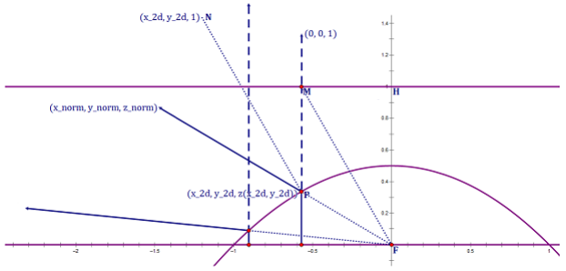
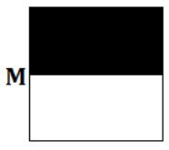
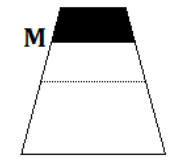
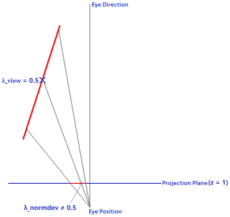

# Projector Functions

Since the sphere is a 2-manifold rather than a 3-manifold, a bijection can be formed between the points on the sphere and the coordinates of the 2D texture.  

## 1\. Cube Map  

Actually, the texel of the cube map is NOT uniform. This means that the solid angle subtended by each texel of the cube map is NOT the same. Let u and v be the texcoord of the cube map. By "Equation \(5.6\)" of [PBR Book](https://pbr-book.org/3ed-2018/Color_and_Radiometry/Working_with_Radiometric_Integrals#IntegralsoverArea), we have $\displaystyle d\omega = \frac{dA \cos \theta}{r^2} = dA \cdot \cos \theta \cdot \frac{1}{r^2} = \frac{(1 - (-1))*(1 - (-1))}{\text{cubesize.u}*\text{cubesize.v}} \cdot \frac{1}{\sqrt{1^2 + u^2 +v^2}} \cdot \frac{1}{1^2 + u^2 +v^2} = \frac{1}{\text{cubesize.u}*\text{cubesize.v}} \cdot \frac{4}{\sqrt{1^2 + u^2 +v^2} \cdot (1^2 + u^2 +v^2)}$. Actually the pseudo code "fWt = 4/(sqrt(fTmp)*fTmp)" by "Projection from Cube Maps" of \[Sloan 2008\] is exactly the $\displaystyle \frac{4}{\sqrt{1^2 + u^2 +v^2} \cdot (1^2 + u^2 +v^2)}$. The common divisor $\displaystyle \frac{1}{\text{cubesize.u}*\text{cubesize.v}}$ can be reduced, and thus is NOT calculated by \[Sloan 2008\]. The solid angle is calculated by [SHProjectCubeMap](https://github.com/microsoft/DirectXMath/blob/jul2018b/SHMath/DirectXSHD3D11.cpp#L341) in DirectXMath and [DiffuseIrradianceCopyPS](https://github.com/EpicGames/UnrealEngine/blob/4.27/Engine/Shaders/Private/ReflectionEnvironmentShaders.usf#L448) in UE4.  

## 2\. Sphere Map 
Real-Time Rendering Fourth Edition / 10.4.2 Sphere Map  

// Cons: NOT **uniform** ??? 

## 3\. Dual Paraboloid Map
By "10.4.4 Other Projections" of Real-Time Rendering Fourth Edition, the texel of the dual paraboloid map is more uniform than the cube map. By "20.4.1 Mapping and Distortion" of \[Colbert 2007\], the solid angle subtended by the texel of the dual paraboloid map is TODO 

### 3-1\. Definition  

Let the equation of the **(elliptic) paraboloid** be $\displaystyle z = \frac{1}{2} - \frac{1}{2}(x^2 + y^2)$.  

Evidently, the plane section of this paraboloid is the **parabola** of which the **focus** is the origin, the **vertex** is $\displaystyle (0, 0, \frac{1}{2})$ and the **directrix** is $\displaystyle z = 1$.  
Proof:  
For example, let $\displaystyle y = 0$, we have the intersection of the paraboloid and ZOX plane $\displaystyle z = \frac{1}{2} - \frac{1}{2} x^2$ which can be obtained by translating parabola $\displaystyle z = - \frac{1}{2} x^2$ by $\displaystyle \frac{1}{2}$ units in the positive Z direction.  
And the parabola $\displaystyle z = - \frac{1}{2} x^2$ can be written as $\displaystyle x^2 = -2z$. Compared to the standard equation $\displaystyle x^2 = -2pz$, we have **semi-latus rectum** $\displaystyle p = 1$. This means that $\displaystyle z = - \frac{1}{2} x^2$ is the parabola of which the focus is the $\displaystyle (0, 0, -\frac{p}{2}) = (0, 0, -\frac{1}{2})$, the vertex is the origin and the directrix is $\displaystyle z = \frac{p}{2} = \frac{1}{2}$.  
And we translate parabola $\displaystyle z = - \frac{1}{2} x^2$ by $\displaystyle \frac{1}{2}$ units in the positive Z direction to obtain $\displaystyle z = \frac{1}{2} - \frac{1}{2} x^2$ of which the focus is the origin $\displaystyle (0, 0, -\frac{p}{2} + \frac{1}{2}) = (0, 0, 0)$, the vertex is $\displaystyle (0, 0, 0 + \frac{1}{2}) = (0, 0, \frac{1}{2})$ and the directrix is $\displaystyle z = \frac{1}{2} + \frac{1}{2} = 1$.  

Let $\displaystyle \overrightarrow{(\text{x\_norm}, \text{y\_norm}, \text{z\_norm})}$ be one of the directions in the domain of the spherical function. The goal of the paraboloid mapping is to transform this direction to the coordinate $\displaystyle (\text{x\_2d}, \text{y\_2d})$ of the 2D texture.  
Proof:  
  
Let the ray from focus F with direction $\displaystyle \overrightarrow{(\text{x\_norm}, \text{y\_norm}, \text{z\_norm})}$ intersect the paraboloid at point P. Evidently, the unit vector in the direction of $\displaystyle \overrightarrow{FP}$ is $\displaystyle \overrightarrow{(\text{x\_norm}, \text{y\_norm}, \text{z\_norm})}$.  
Let PM be the **perpendicular distance** from P to directrix $\displaystyle z = 1$. Evidently, the unit vector in the the direction of $\displaystyle \overrightarrow{PM}$ is $\displaystyle \overrightarrow{(0, 0, 1)}$. And we have $\displaystyle \overrightarrow{FM} = \overrightarrow{FH} + \overrightarrow{HM} = \overrightarrow{(0, 0, 1)} + \overrightarrow{(\text{x\_2d}, \text{y\_2d}, 0)} = \overrightarrow{(\text{x\_2d}, \text{y\_2d}, 1)}$.  
Let $\displaystyle \overrightarrow{PN}$ be the angle bisector of $\displaystyle \overrightarrow{FP}$ and $\displaystyle \overrightarrow{PM}$. And we have the direction of $\displaystyle \overrightarrow{PN}$ is that $\displaystyle \overrightarrow{(\text{x\_norm}, \text{y\_norm}, \text{z\_norm})} + \overrightarrow{(0, 0, 1)} = \overrightarrow{(\text{x\_norm}, \text{y\_norm}, \text{z\_norm} + 1)}$.  
By the definition of the parabola, we have $\displaystyle | \overrightarrow{PM} | = | \overrightarrow{PF} |$ and thus $\displaystyle \triangle PMF$ is the **isosceles triangle**. This means that $\displaystyle \angle NPM = \angle FMP$. Hence, we have $\displaystyle \overrightarrow{PN} \parallel \overrightarrow{FM}$. This means that $\displaystyle \overrightarrow{PN} = \lambda \displaystyle \overrightarrow{FM} \Rightarrow \overrightarrow{(\text{x\_norm}, \text{y\_norm}, \text{z\_norm} + 1)} = \lambda \overrightarrow{(\text{x\_2d}, \text{y\_2d}, 1)} \Rightarrow (\text{x\_2d}, \text{y\_2d}) = \frac{1}{\text{z\_norm} + 1} (\text{x\_norm}, \text{y\_norm})$.  

### 3-2\. Perspective-Correct Interpolation

  
  
  
  

## 4\. Octahedron Map 
Real-Time Rendering Fourth Edition / 10.4.4 Other Projections  

// Octahedron Environment Maps  
// On Floating-Point Normal Vectors  
// A Survey of Efficient Representations for Independent Unit Vectors

## 4\. Applications  

### 4-1\. Point Light Shadow Mapping  

// TODO  

### 4-2\. Normal Representation  

// Real-Time Rendering Fourth Edition / 16.6 Compression and Precision  
// Evidently, a bijection can be formed between the unit vectors and the points on the sphere. And thus, the projector functions can be used to compress the normals to 2D coordinates.  

## References  
\[Heidrich 1998\] Wolfgang Heidrich, Hans-Peter Seidel. "View-independent Environment Maps." EGSR 1998.  
\[Colbert 2007\] [Mark Colbert, Jaroslav Krivanek. "GPU-Based Importance Sampling." GPU Gems 3.](https://developer.nvidia.com/gpugems/gpugems3/part-iii-rendering/chapter-20-gpu-based-importance-sampling)  
\[Sloan 2008\] [Peter-Pike Sloan. "Stupid Spherical Harmonics (SH)." Tricks GDC 2008.](http://www.ppsloan.org/publications/StupidSH36.pdf)  
\[Imagination 2017\] [Imagination. "Dual Paraboloid Environment Mapping." Power SDK Whitepaper 2017.](https://github.com/powervr-graphics/Native_SDK/blob/R17.1-v4.3/Documentation/Whitepapers/Dual%20Paraboloid%20Environment%20Mapping.Whitepaper.pdf)  
\[Cigolle 2014\] [Zina Cigolle, Sam Donow, Daniel Evangelakos, Michael Mara, Morgan McGuire, Quirin Meyer. "A Survey of Efficient Representations for Independent Unit Vectors." JCGT 2014.](https://jcgt.org/published/0003/02/01/)  
