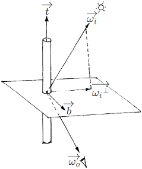
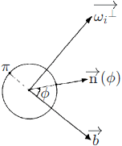

# Hair Rendering  

By "Equation \(5.9\)" of [PBR Book](https://www.pbr-book.org/3ed-2018/Color_and_Radiometry/Surface_Reflection#TheBRDF), we have the reflectance equation $\displaystyle \operatorname{L_o}(\overrightarrow{\omega_o}) = \int_\Omega \operatorname{f}(\overrightarrow{\omega_i}, \overrightarrow{\omega_o}) \operatorname{L_i}(\overrightarrow{\omega_i}) (\cos \theta_i)^+ \, d \overrightarrow{\omega_i}$.  

[HairMaterial](https://github.com/mmp/pbrt-v3/blob/master/src/materials/hair.h#L36) in PBRT-V3  

[HairShading](https://github.com/EpicGames/UnrealEngine/blob/4.27/Engine/Shaders/Private/HairBsdf.ush#L310) in UE4  

[EvaluateBSDF](https://github.com/Unity-Technologies/Graphics/blob/v10.8.0/com.unity.render-pipelines.high-definition/Runtime/Material/Hair/Hair.hlsl#L359) in Unity3D  

[PxrMarschnerHair](https://rmanwiki.pixar.com/display/REN25/PxrMarschnerHair) in RenderMan  

## Micro-Cylinder Models

The name **micro-cylinder models** is from "9.10.3 Micro-Cylinder Cloth Models" of [Real-Time Rendering Fourth Edition](https://www.realtimerendering.com/).

By [Kajiya 1998], at any given position of the cylinder, there are infinite number of normals which point in all directions perpendicular to the tangent.  

Let $\displaystyle \overrightarrow{t}$ be the tangent, $\displaystyle \overrightarrow{{\omega_i}^{\perp}}$ be the (normalized) projection of the incident direction $\displaystyle \overrightarrow{\omega_i}$ onto the plane perpendicular to the tangent, and $\displaystyle \overrightarrow{b} = \overrightarrow{{\omega_i}^{\perp}} \times \overrightarrow{t}$ be the bitangent.  

  

Let $\displaystyle \phi$ be the azimuth, and $\displaystyle \operatorname{\overrightarrow{n}}(\phi) = \overrightarrow{{\omega_i}^{\perp}} \sin \phi + \overrightarrow{b} \cos \phi$ be the normal points in one direction perpendicular to the tangent.  

  

The $\displaystyle (\cos \theta_i)^+$ is no longer calculated as $\displaystyle \max (0, \overrightarrow{n} \cdot \overrightarrow{\omega_i})$, but as the integral along the circumference of the cylinder intead. This means that $\displaystyle (\cos \theta_i)^+ = \int_0^\pi \operatorname{\overrightarrow{n}}(\phi) \cdot \overrightarrow{\omega_i} \, d \phi = \int_0^\pi (\overrightarrow{{\omega_i}^{\perp}} \sin \phi + \overrightarrow{b} \cos \phi) \cdot \overrightarrow{\omega_i} \, d \phi = \overrightarrow{{\omega_i}^{\perp}} \cdot \overrightarrow{\omega_i} \int_0^\pi \sin \phi \, d \phi = \overrightarrow{{\omega_i}^{\perp}} \cdot \overrightarrow{\omega_i} = \sin(\overrightarrow{t}, \overrightarrow{\omega_i}) = 1 - {(\overrightarrow{t} \cdot \overrightarrow{\omega_i})}^2$. The $\displaystyle (\cos \theta_i)^+$ is calculated by [FakeNormal](https://github.com/EpicGames/UnrealEngine/blob/4.27/Engine/Shaders/Private/HairBsdf.ush#L66) in UE4 and [_USE_LIGHT_FACING_NORMAL](https://github.com/Unity-Technologies/Graphics/blob/v10.8.0/com.unity.render-pipelines.high-definition/Runtime/Material/Hair/Hair.hlsl#L367) in Unity3D.

## References  
\[Kajiya 1998\] James Kajiya, Timothy Kay. "Rendering Fur with Three Dimensional Textures." SIGGRAPH 1998.  
\[Marschner 2003\] [Stephen Marschner, Henrik Jensen, Mike Cammarano. "Light Scattering from Human Hair Fibers." SIGGRAPH 2003.](https://www.cs.cornell.edu/~srm/publications/SG03-hair-abstract.html)  
\[Scheuermann 2004\] [Thorsten Scheuermann. "Practical Real-Time Hair Rendering and Shading." SIGGRAPH 2004.](https://www.shaderwrangler.com/publications/hairsketch/)  
\[Nguyen 2005\] [Hubert Nguyen, William Donnelly. "Hair Animation and Rendering in the Nalu Demo." GPU Gems 2.](https://developer.nvidia.com/gpugems/gpugems2/part-iii-high-quality-rendering/chapter-23-hair-animation-and-rendering-nalu-demo)  
\[Yuksel 2010\] [Cem Yuksel, Sarah Tariq. "Advanced Techniques in Real-time Hair Rendering and Simulation." SIGGRAPH 2010.]()  
\[Pekelis 2015\] [Leonid Pekelis, Christophe Hery, Ryusuke Villemin, Junyi Ling. "A Data-Driven Light Scattering Model for Hair." Pixar Technical Memo 2015.](https://graphics.pixar.com/library/DataDrivenHairScattering/index.html)  
\[Pharr 2016\] [Matt Pharr. "The Implementation of a Hair Scattering Model." PBRT V3.](http://pbrt.org/hair.pdf)  
\[Karis 2016\] [Brian Karis. "Physically Based Hair Shading in Unreal." SIGGRAPH 2016.](https://blog.selfshadow.com/publications/s2016-shading-course/)  
\[Hery 2017\] [Christophe Hery, Junyi Ling. "Pixar's Foundation for Materials: PxrSurface and PxrMarschnerHair." SIGGRAPH 2017.](https://blog.selfshadow.com/publications/s2017-shading-course/)  
