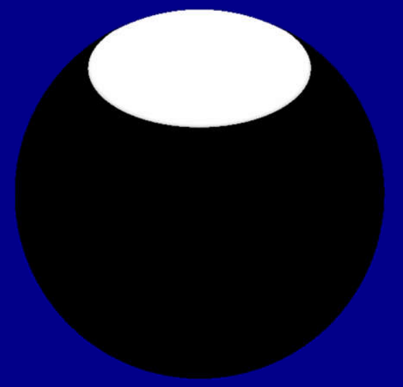

# LPV (Light Propagation Volumes)  

## SH (Spherical Harmonics)  

Let $\displaystyle \operatorname{\Upsilon_l^m}(\overrightarrow{\omega})$ be the SH basis function of which l is the degree and m is the basis function index from -l to l.  

Let $\displaystyle \operatorname{\mathcal{SH}}$ be the **SH (Spherical Harmonics) projection operation**. Analogous to the **Fourier transform**, we have $\displaystyle k_l^m = \operatorname{\mathcal{SH}}(\operatorname{f}(\overrightarrow{\omega})) = \int_{\mathrm{S}^2} \operatorname{f}(\overrightarrow{\omega}) \operatorname{\Upsilon_l^m}(\overrightarrow{\omega}) \, d\overrightarrow{\omega}$, and the original function can be reconstructed as the SH series $\displaystyle\operatorname{f}(\overrightarrow{\omega}) = \sum k_l^m \operatorname{\Upsilon_l^m}(\overrightarrow{\omega})$.  

Rotational Invariance  

Let R be the rotation matrix, and we have $\displaystyle {k'}_l^m = \operatorname{\mathcal{SH}}(\operatorname{f}(\mathrm{R} \overrightarrow{\omega})) = \int_{\mathrm{S}^2} \operatorname{f}(\mathrm{R} \overrightarrow{\omega}) \operatorname{\Upsilon_l^m}(\overrightarrow{\omega}) \, d\overrightarrow{\omega}$. By "Appendix: SH Rotation" of \[Kautz 2002\], we have the **rotational invariance** $\displaystyle {k'}_l^m = \sum_{m = -l}^l \mathrm{M}_l^m k_l^m$ where $\displaystyle \mathrm{R}$ is the rotation matrix.  
   
[XMSHRotate](https://github.com/microsoft/DirectXMath/blob/jul2018b/SHMath/DirectXSH.cpp#L1026)  

[XMSHRotateZ](https://github.com/microsoft/DirectXMath/blob/jul2018b/SHMath/DirectXSH.cpp#L1163)  

// Analytic Models

[XMSHEvalConeLight](https://github.com/microsoft/DirectXMath/blob/jul2018b/SHMath/DirectXSH.cpp#L4664)

// Appendix A3 ZH Coefficients for Spherical Light Source  

The light position is at the Z axis  

  

azimuth  
inclination  

By "13.5.3 Spherical Coordinates" of [PBRT-V3](https://pbr-book.org/3ed-2018/Monte_Carlo_Integration/Transforming_between_Distributions#SphericalCoordinates), we have $\displaystyle \int_{\Omega} \operatorname{\Upsilon_l^0}(\overrightarrow{\omega}) \, d \overrightarrow{\omega} = \int_0^{2\pi} \left\lparen \int_0^{\alpha} \operatorname{\Upsilon_l^0}(\overrightarrow{\omega}) \sin \theta \, d \theta \right\rparen \, d \phi$.  

For l = 0, we have $\operatorname{\Upsilon_0^0}(\overrightarrow{\omega}) = \frac{1}{2 \sqrt{\pi}}$ and $\displaystyle \int_{\Omega} \operatorname{\Upsilon_0^0}(\overrightarrow{\omega}) \, d \overrightarrow{\omega} = \int_{\Omega} \frac{1}{2 \sqrt{\pi}} \, d \overrightarrow{\omega} = \frac{1}{2 \sqrt{\pi}} \int_{\Omega} 1 \, d \overrightarrow{\omega} = \frac{1}{2 \sqrt{\pi}} \int_0^{2\pi} \left\lparen \int_0^{\alpha} \sin \theta \, d \theta \right\rparen \, d \phi = \frac{1}{2 \sqrt{\pi}} \int_0^{2\pi} ( (-\cos \alpha) - (-\cos 0) ) \, d \phi = \frac{1}{2 \sqrt{\pi}} 2\pi ( (-\cos \alpha) - (-\cos 0) ) = -\sqrt{\pi} (-1 + \cos \alpha)$.  

For l = 1, we have $\operatorname{\Upsilon_1^0}(\overrightarrow{\omega}) = \frac{\sqrt{3}}{2 \sqrt{\pi}} z$ and $\displaystyle \int_{\Omega} \operatorname{\Upsilon_1^0}(\overrightarrow{\omega}) \, d \overrightarrow{\omega} = \int_{\Omega} \frac{\sqrt{3}}{2 \sqrt{\pi}} z \, d \overrightarrow{\omega} = \frac{\sqrt{3}}{2 \sqrt{\pi}} \int_{\Omega} z \, d \overrightarrow{\omega} = \frac{\sqrt{3}}{2 \sqrt{\pi}} \int_0^{2\pi} \left\lparen \int_0^{\alpha} z \sin \theta \, d \theta \right\rparen \, d \phi = \frac{\sqrt{3}}{2 \sqrt{\pi}} \int_0^{2\pi} \left\lparen \int_0^{\alpha} \cos \theta \sin \theta \, d \theta \right\rparen \, d \phi = \frac{\sqrt{3}}{2 \sqrt{\pi}} \int_0^{2\pi} \left\lparen \frac{\sin^2 \alpha}{2} - \frac{\sin^2 0}{2} \right\rparen \, d \phi = \frac{\sqrt{3}}{2 \sqrt{\pi}} 2\pi \frac{\sin^2 \alpha}{2} = \frac{1}{2} \sqrt{3} \sqrt{\pi} \sin^2 \alpha$.  

## References  
\[Kautz 2002\] [Jan Kautz, Peter-Pike Sloan, John Snyder. "Fast, Arbitrary BRDF Shading for Low-Frequency Lighting Using Spherical Harmonics." EGWR 2002.](http://www.ppsloan.org/publications/shbrdf_final17.pdf)  
\[Sloan 2008\] [Peter-Pike Sloan. "Stupid Spherical Harmonics (SH) Tricks." GDC 2008.](http://www.ppsloan.org/publications/StupidSH36.pdf)  
\[Kaplanyan 2009\] [Anton Kaplanyan. "Light Propagation Volumes in CryEngine 3." SIGGRAPH 2009.](https://advances.realtimerendering.com/s2009/Light_Propagation_Volumes.pdf)  
\[Kaplanyan 2010\] Anton Kaplanyan. "Cascaded Light Propagation Volumes for Real-Time Indirect Illumination." I3D 2010.  
\[Kaplanyan 2011\] Anton Kaplanyan, Wolfgang Engel, Carsten Dachsbacher. "Diffuse Global Illumination with Temporally Coherent Light Propagation Volumes." GPU Pro 2.  
\[Engel 2012\] Wolfgang Engel, Igor Lobanchikov, Timothy Martin. "Dynamic Global Illumination from Many Lights." AltDevConf 2012.  
