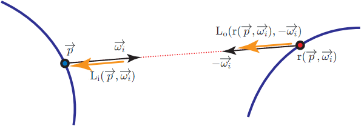
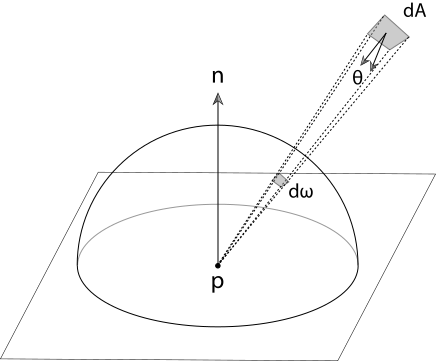
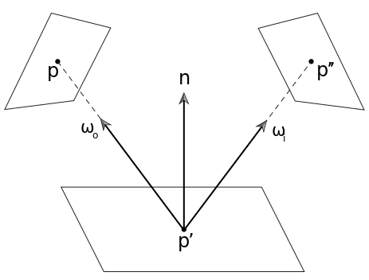
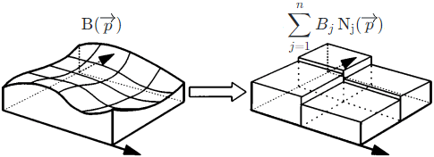

# Radiosity

## FEM (Finite Element Method)  

The main idea of **FEM(Finite Element Method)** is to convert the **infinite** problem of solving a **differential equation** into the **finite** problem of solving a **system of equations**.  

Let $\displaystyle \operatorname{f}(x)$ be the solution of a **differential equation** which can be written as $\displaystyle \operatorname{f}(x) = P(f(x))$.  

We try to approximate the $\displaystyle \operatorname{f}(x)$ by the **basis functions** $\displaystyle \sum_{k=1}^n f_k \operatorname{v_k}(x)$. The idea of the basis functions in **FEM** is similar to **SH (Spherical Harmonics)** or **Fourier**. But since the aim of the **FEM** is usually to **discretize** the domain of $\displaystyle \operatorname{f}(x)$, the basis functions in FEM is much simpler than in **SH** or **Fourier**. For example, when the domain of $\displaystyle \operatorname{f}(x)$ is [0, 1], let $\displaystyle \operatorname{v_1}(x) = {\begin{cases} 1 &{x \isin [0, \frac{1}{2}]} \\0 &{x \isin [\frac{1}{2}, 1]} \end{cases}}$ and $\displaystyle \operatorname{v_2}(x) = {\begin{cases} 0 &{x \isin [0, \frac{1}{2}]} \\1 &{x \isin [\frac{1}{2}, 1]} \end{cases}}$, evidently $\displaystyle \operatorname{v_1}(x)$ and $\displaystyle \operatorname{v_2}(x)$ are **orthogonal**.  

Let $\displaystyle \operatorname{r}(x) = \sum_{k=1}^n f_k \operatorname{v_k}(x) - P(\sum_{k=1}^n f_k \operatorname{v_k}(x))$ be the **residual**. The projection of the **residual** onto each basis function should be zero. This means that, for j = 1 ... n, we have $\displaystyle \int \operatorname{r}(x) \operatorname{v_j}(x) = 0$ (of which the $\displaystyle \operatorname{R}(x) = \operatorname{r}(x) \operatorname{v_j}(x)$ is also called the **weighted residual**). And we have the **system of equations** about the coefficients $\displaystyle f_k$.  

## Rendering Equation  

The **Rendering Equation** is also called the **LTE** (**Light Transport Equation**) by "14.4 The Light Transport Equation" of [PBRT-V3](https://www.pbr-book.org/3ed-2018/Light_Transport_I_Surface_Reflection/The_Light_Transport_Equation). And we have the **Rendering Equation** $\displaystyle \operatorname{L_o}(\overrightarrow{p}, \overrightarrow{\omega_o}) = \operatorname{L_e}(\overrightarrow{p}, \overrightarrow{\omega_o}) + \int_\Omega \operatorname{f}(\overrightarrow{p}, \overrightarrow{\omega_i}, \overrightarrow{\omega_o}) \operatorname{L_i}(\overrightarrow{p}, \overrightarrow{\omega_i}) (\cos \theta_i)^+ \, d \overrightarrow{\omega_i}$.   

According to the **Rendering Equation**, by [OSL (Open Shading Language)](https://github.com/AcademySoftwareFoundation/OpenShadingLanguage), the surface and the light are actually the same thing, since the light is merely the surface which is emissive.  

By "Figure 11.1" of [Real-Time Rendering Fourth Edition](http://www.realtimerendering.com/) and "Figure 14.14" of [PBRT-V3](https://pbr-book.org/3ed-2018/Light_Transport_I_Surface_Reflection/The_Light_Transport_Equation), by assuming no **participating media**, we have the relationship $\displaystyle \operatorname{L_i}(\overrightarrow{p}, \overrightarrow{\omega_i}) = \operatorname{L_o}(\operatorname{r}(\overrightarrow{p}, \overrightarrow{\omega_i}), -\overrightarrow{\omega_i})$ where $\displaystyle \operatorname{r}(\overrightarrow{p}, \overrightarrow{\omega})$ is the ray-casting function. This means that the incident radiance $\displaystyle \operatorname{L_i}(\overrightarrow{p}, \overrightarrow{\omega_i})$ at one point p is exactly the exitant radiance $\displaystyle \operatorname{L_o}(\operatorname{r}(\overrightarrow{p}, \overrightarrow{\omega_i}), -\overrightarrow{\omega_i})$ at another point $\displaystyle \operatorname{r}(\overrightarrow{p}, \overrightarrow{\omega_i})$.  
  

Hence, both the incident radiance $\displaystyle \operatorname{L_i}(\overrightarrow{p}, \overrightarrow{\omega})$ and the exitant radiance $\displaystyle \operatorname{L_o}(\overrightarrow{p}, \overrightarrow{\omega})$ can be represented by the same function $\displaystyle \operatorname{L}(\overrightarrow{p}, \overrightarrow{\omega})$. And thus, we have $\displaystyle \operatorname{L}(\overrightarrow{p}, \overrightarrow{\omega_o}) = \operatorname{L_e}(\overrightarrow{p}, \overrightarrow{\omega_o}) + \int_\Omega \operatorname{f}(\overrightarrow{p}, \overrightarrow{\omega_i}, \overrightarrow{\omega_o}) \operatorname{L}(\operatorname{r}(\overrightarrow{p}, \overrightarrow{\omega_i}), -\overrightarrow{\omega_i}) (\cos \theta_i)^+ \, d \overrightarrow{\omega_i}$ which is a **differential equation** of which the solution is the $\displaystyle \operatorname{L}(\overrightarrow{p}, \overrightarrow{\omega})$.  

Thus, the problem of rendering is essentially a problem of solving the **differential equation**. There are two independent approaches: ray tracing (which depends on the **Fredholm theory**) and radiosity (which depends on the **FEM**).  

## Ray Tracing  

By "Light transport and the rendering equation" of [CS 348B - Computer Graphics: Image Synthesis Techniques](http://www-graphics.stanford.edu/courses/cs348b-96/) and "Global Illumination and Rendering Equation" of [CS 294-13 Advanced Computer Graphics](https://inst.eecs.berkeley.edu/~cs294-13/fa09/), this differential equation is actually the [Fredholm Integral Equation](https://en.wikipedia.org/wiki/Fredholm_integral_equation) of which the solution is the [Liouville–Neumann Series](https://en.wikipedia.org/wiki/Liouville%E2%80%93Neumann_series). And thus, the solution of this differential equation can be written as the recursive form $\text{L} = \text{E} + \text{K}\text{E} + {\text{K}}^2\text{E} + {\text{K}}^3\text{E} + \ldots$.   

## Radiosity  

Note that the term **radiosity B** has been deprecated and should be called **radiant exitance M** or outgoing **irradiance E** instead. But to be consistent with most literature about **radiosity**, we still use **radiosity B** here.  

By "Equation (5.6)" of [PBRT-V3](https://pbr-book.org/3ed-2018/Color_and_Radiometry/Working_with_Radiometric_Integrals#IntegralsoverArea), we have the relationship $\displaystyle d\omega = \frac{\cos\theta}{r^2} dA$.  
  

By "Equation (14.14)" of [PBRT-V3](https://pbr-book.org/3ed-2018/Light_Transport_I_Surface_Reflection/The_Light_Transport_Equation#TheSurfaceFormoftheLTE), let $\operatorname{V}$ be the visibility function and we have the **surface form** of the rendering equation $\displaystyle \operatorname{L}(\overrightarrow{p'} \rightarrow \overrightarrow{p}) = \operatorname{L_e}(\overrightarrow{p'} \rightarrow \overrightarrow{p}) + \int_A \operatorname{f}(\overrightarrow{p''} \rightarrow \overrightarrow{p'} \rightarrow \overrightarrow{p}) \operatorname{V}(\overrightarrow{p''} \leftrightarrow \overrightarrow{p'}) \operatorname{L}(\overrightarrow{p''} \rightarrow \overrightarrow{p'}) (\cos \theta')^+ \frac{(\cos \theta'')^+}{{\| \overrightarrow{p''} - \overrightarrow{p'} \|}^2} \, d \operatorname{A}(\overrightarrow{p''}) = \operatorname{L_e}(\overrightarrow{p'} \rightarrow \overrightarrow{p}) + \int_A \operatorname{f}(\overrightarrow{p''} \rightarrow \overrightarrow{p'} \rightarrow \overrightarrow{p}) \operatorname{L}(\overrightarrow{p''} \rightarrow \overrightarrow{p'}) \operatorname{G}(\overrightarrow{p''} \rightarrow \overrightarrow{p'}) \, d \operatorname{A}(\overrightarrow{p''})$ where integral interval $\displaystyle A$ is the area of all the surfaces in the scene and $\displaystyle \operatorname{G}(\overrightarrow{p''} \rightarrow \overrightarrow{p'}) = \operatorname{V}(\overrightarrow{p''} \leftrightarrow \overrightarrow{p'}) \frac{(\cos \theta')^+ (\cos \theta'')^+}{{\| \overrightarrow{p''} - \overrightarrow{p'} \|}^2}$.  
  

We assume that the Lambert BRDF $\displaystyle \operatorname{f}(\overrightarrow{p''} \rightarrow \overrightarrow{p'} \rightarrow \overrightarrow{p}) = \frac{1}{\pi} \operatorname{\rho_{ss}}(\overrightarrow{p'})$ is used. This means that the outgoing radiance is the same in all directions and we have the relationship $\displaystyle \operatorname{L}(\overrightarrow{p'} \rightarrow \overrightarrow{p}) = \frac{\operatorname{B}(\overrightarrow{p'})}{\pi}$ where the $\displaystyle \operatorname{B}(\overrightarrow{p'})$ does NOT depend on the direction $\displaystyle \overrightarrow{p'} \rightarrow \overrightarrow{p}$. Hence, by "Equation (2.54)" of \[Cohen 1993\], the rendering equation can be written as the **radiosity equation** $\displaystyle \frac{\operatorname{B}(\overrightarrow{p'})}{\pi} = \frac{\operatorname{B_e}(\overrightarrow{p'})}{\pi} + \int_A \frac{1}{\pi} \operatorname{\rho_{ss}}(\overrightarrow{p'}) \frac{\operatorname{B}(\overrightarrow{p''})}{\pi} \operatorname{G}(\overrightarrow{p''} \rightarrow \overrightarrow{p'}) \, d \operatorname{A}(\overrightarrow{p''})$ ⇒ $\displaystyle \operatorname{B}(\overrightarrow{p'}) = \operatorname{B_e}(\overrightarrow{p'}) + \frac{1}{\pi} \operatorname{\rho_{ss}}(\overrightarrow{p'})  \int_A \operatorname{B}(\overrightarrow{p''}) \operatorname{G}(\overrightarrow{p''} \rightarrow \overrightarrow{p'}) \, d \operatorname{A}(\overrightarrow{p''})$ ⇒ $\displaystyle \operatorname{B}(\overrightarrow{p}) = \operatorname{B_e}(\overrightarrow{p}) + \frac{1}{\pi} \operatorname{\rho_{ss}}(\overrightarrow{p})  \int_A \operatorname{B}(\overrightarrow{p'}) \operatorname{G}(\overrightarrow{p'} \rightarrow \overrightarrow{p}) \, d \operatorname{A}(\overrightarrow{p'})$.  

By "Equation (3.2)" of \[Cohen 1993\], by **FEM**, the surface is **discretized** into n patches, and the solution of the **radiosity equation** $\displaystyle \operatorname{B}(\overrightarrow{p})$ is approximated by n **basis functions** $\displaystyle \sum_{j=1}^n B_j \operatorname{N_j}(\overrightarrow{p})$. And by "Equation (3.3)" of \[Cohen 1993\], the **basis function** can be really simple, for example, the constant basis $\displaystyle \operatorname{N_j}(\overrightarrow{p}) = {\begin{cases} 1 &{\overrightarrow{p} \isin A_j} \\0 &{\overrightarrow{p} \notin A_j} \end{cases}}$ where $\displaystyle A_j$ is the area of the ith patch surface.  
  

By "Equation (3.4)" of \[Cohen 1993\], we have the **residual** $\displaystyle \operatorname{r}(\overrightarrow{p}) = \sum_{j=1}^n B_j \operatorname{N_j}(\overrightarrow{p}) - \left \lparen \operatorname{B_e}(\overrightarrow{p}) + \frac{1}{\pi} \operatorname{\rho_{ss}}(\overrightarrow{p})  \int_A \left \lparen \sum_{j=1}^n B_j \operatorname{N_j}(\overrightarrow{p}) \right \rparen \operatorname{G}(\overrightarrow{p'} \rightarrow \overrightarrow{p}) \, d \operatorname{A}(\overrightarrow{p'}) \right \rparen = \sum_{j=1}^n B_j \operatorname{N_j}(\overrightarrow{p}) - \operatorname{B_e}(\overrightarrow{p}) - \frac{1}{\pi} \operatorname{\rho_{ss}}(\overrightarrow{p})  \int_A  \left \lparen \sum_{j=1}^n B_j \operatorname{N_j}(\overrightarrow{p}) \right \rparen \operatorname{G}(\overrightarrow{p'} \rightarrow \overrightarrow{p}) \, d \operatorname{A}(\overrightarrow{p'})$.  

By "Equation (3.19)" of \[Cohen 1993\], the projection of the residual onto each basis function should be zero. This means that, for i = 1 ... n, we have $\displaystyle 0 = \int_A \operatorname{r}(\overrightarrow{p}) \operatorname{N_i}(\overrightarrow{p}) \, d \operatorname{A}(\overrightarrow{p}) = \int_A \left \lparen \sum_{j=1}^n B_j \operatorname{N_j}(\overrightarrow{p}) - \operatorname{B_e}(\overrightarrow{p}) - \frac{1}{\pi} \operatorname{\rho_{ss}}(\overrightarrow{p})  \int_A  \left \lparen \sum_{j=1}^n B_j \operatorname{N_j}(\overrightarrow{p}) \right \rparen \operatorname{G}(\overrightarrow{p'} \rightarrow \overrightarrow{p}) \, d \operatorname{A}(\overrightarrow{p'}) \right \rparen \operatorname{N_i}(\overrightarrow{p}) \, d \operatorname{A}(\overrightarrow{p}) = B_i A_i - B_i^e A_i - A_i \rho_i^{ss} \sum_{j=1}^n F_{ij} B_j$ where $\displaystyle A_i$ is the area of the ith patch surface, $\displaystyle \operatorname{B_e}(\overrightarrow{p})$ is the assumed to be the constant $\displaystyle  B_i^e$ over the ith patch surface, $\displaystyle \operatorname{\rho_{ss}}(\overrightarrow{p})$ is the assumed to be the constant $\displaystyle \rho_i^{ss}$ over the ith patch surface and $\displaystyle F_{ij} = \frac{1}{A_i} \frac{1}{\pi} \int_{A_i} \int_{A_j} \operatorname{G}(\overrightarrow{p'} \rightarrow \overrightarrow{p}) \, d \operatorname{A}(\overrightarrow{p'}) \, d \operatorname{A}(\overrightarrow{p})$ is the form factor. This means that $\displaystyle B_i = B_i^e + \rho_i^{ss} \sum_{j=1}^n F_{ij} B_j$ which is exactly the "Equation (11.4)" of [Real-Time Rendering Fourth Edition](https://www.realtimerendering.com).  

Proof  

> By [Linearity Property](https://en.wikipedia.org/wiki/Integral#Linearity), we have $\displaystyle \int_A \left \lparen \sum_{j=1}^n B_j \operatorname{N_j}(\overrightarrow{p}) - \operatorname{B_e}(\overrightarrow{p}) - \frac{1}{\pi} \operatorname{\rho_{ss}}(\overrightarrow{p}) \int_A \left \lparen \sum_{j=1}^n B_j \operatorname{N_j}(\overrightarrow{p}) \right \rparen \operatorname{G}(\overrightarrow{p'} \rightarrow \overrightarrow{p}) \, d \operatorname{A}(\overrightarrow{p'}) \right \rparen \operatorname{N_i}(\overrightarrow{p}) \, d \operatorname{A}(\overrightarrow{p}) = \int_A \left \lparen \sum_{j=1}^n B_j \operatorname{N_j}(\overrightarrow{p}) \right \rparen \operatorname{N_i}(\overrightarrow{p}) \, d \operatorname{A} - \int_A \operatorname{B_e}(\overrightarrow{p}) \operatorname{N_i}(\overrightarrow{p}) \, d \operatorname{A}(\overrightarrow{p}) - \int_A  \left \lparen \frac{1}{\pi} \operatorname{\rho_{ss}}(\overrightarrow{p}) \int_A \left \lparen \sum_{j=1}^n B_j \operatorname{N_j}(\overrightarrow{p}) \right \rparen \operatorname{G}(\overrightarrow{p'} \rightarrow \overrightarrow{p}) \, d \operatorname{A}(\overrightarrow{p'}) \right \rparen \operatorname{N_i}(\overrightarrow{p}) \, d \operatorname{A}(\overrightarrow{p})$
> 
> First, we would like to prove that $\displaystyle \int_A \left \lparen \sum_{j=1}^n B_j \operatorname{N_j}(\overrightarrow{p}) \right \rparen \operatorname{N_i}(\overrightarrow{p}) \, d \operatorname{A}(\overrightarrow{p}) = B_i A_i$.  
>  
>> By [Linearity Property](https://en.wikipedia.org/wiki/Integral#Linearity), we have $\displaystyle \int_A \left \lparen \sum_{j=1}^n B_j \operatorname{N_j}(\overrightarrow{p}) \right \rparen \operatorname{N_i}(\overrightarrow{p}) \, d \operatorname{A}(\overrightarrow{p}) = \sum_{j=1}^n \int_A B_j \operatorname{N_j}(\overrightarrow{p}) \operatorname{N_i}(\overrightarrow{p}) \, d \operatorname{A}(\overrightarrow{p})$.  
>> Since $\displaystyle \operatorname{N_j}(\overrightarrow{p}) = {\begin{cases} 1 &{\overrightarrow{p} \isin A_j} \\0 &{\overrightarrow{p} \notin A_j} \end{cases}}$, we have $\displaystyle \sum_{j=1}^n \int_A B_j \operatorname{N_j}(\overrightarrow{p}) \operatorname{N_i}(\overrightarrow{p}) \, d \operatorname{A}(\overrightarrow{p}) = \int_A B_i \operatorname{N_i}(\overrightarrow{p}) \operatorname{N_i}(\overrightarrow{p}) \, d \operatorname{A}(\overrightarrow{p}) = \int_{A_i} B_i \, d \operatorname{A}(\overrightarrow{p}) = B_i A_i$  
> 
> Second, we would like to prove that $\displaystyle \int_A \operatorname{B_e}(\overrightarrow{p}) \operatorname{N_i}(\overrightarrow{p}) \, d \operatorname{A}(\overrightarrow{p}) = B_i^e A_i$.  
>  
>> Since $\displaystyle \operatorname{N_j}(\overrightarrow{p}) = {\begin{cases} 1 &{\overrightarrow{p} \isin A_j} \\0 &{\overrightarrow{p} \notin A_j} \end{cases}}$, we have $\displaystyle  \int_A \operatorname{B_e}(\overrightarrow{p}) \operatorname{N_i}(\overrightarrow{p}) \, d \operatorname{A}(\overrightarrow{p}) = \int_{A_i} \operatorname{B_e}(\overrightarrow{p}) \, d \operatorname{A}(\overrightarrow{p})$.  
>> Since $\displaystyle \operatorname{B_e}(\overrightarrow{p})$ is the assumed to be the constant $\displaystyle  B_i^e$ over the ith patch surface, we have $\displaystyle \int_{A_i} \operatorname{B_e}(\overrightarrow{p}) \, d \operatorname{A}(\overrightarrow{p}) = B_i^e A_i$.  
>  
> Third, we would like to prove that $\displaystyle \int_A  \left \lparen \frac{1}{\pi} \operatorname{\rho_{ss}}(\overrightarrow{p}) \int_A \left \lparen \sum_{j=1}^n B_j \operatorname{N_j}(\overrightarrow{p}) \right \rparen \operatorname{G}(\overrightarrow{p'} \rightarrow \overrightarrow{p}) \, d \operatorname{A}(\overrightarrow{p'}) \right \rparen \operatorname{N_i}(\overrightarrow{p}) \, d \operatorname{A}(\overrightarrow{p}) = A_i \rho_i^{ss} \sum_{j=1}^n F_{ij} B_j$.  
>  
>> By [Linearity Property](https://en.wikipedia.org/wiki/Integral#Linearity), we have $\displaystyle \int_A  \left \lparen \frac{1}{\pi} \operatorname{\rho_{ss}}(\overrightarrow{p}) \int_A \left \lparen \sum_{j=1}^n B_j \operatorname{N_j}(\overrightarrow{p}) \right \rparen \operatorname{G}(\overrightarrow{p'} \rightarrow \overrightarrow{p}) \, d \operatorname{A}(\overrightarrow{p'}) \right \rparen \operatorname{N_i}(\overrightarrow{p}) \, d \operatorname{A}(\overrightarrow{p}) = \sum_{j=1}^n \int_A  \left \lparen \frac{1}{\pi} \operatorname{\rho_{ss}}(\overrightarrow{p}) \int_A B_j \operatorname{N_j}(\overrightarrow{p}) \operatorname{G}(\overrightarrow{p'} \rightarrow \overrightarrow{p}) \, d \operatorname{A}(\overrightarrow{p'}) \right \rparen \operatorname{N_i}(\overrightarrow{p}) \, d \operatorname{A}(\overrightarrow{p})$.  
>> Since $\displaystyle \operatorname{N_i}(\overrightarrow{p}) = {\begin{cases} 1 &{\overrightarrow{p} \isin A_i} \\0 &{\overrightarrow{p} \notin A_i} \end{cases}}$ and $\displaystyle \operatorname{N_j}(\overrightarrow{p}) = {\begin{cases} 1 &{\overrightarrow{p} \isin A_j} \\0 &{\overrightarrow{p} \notin A_j} \end{cases}}$, we have $\displaystyle \sum_{j=1}^n \int_A  \left \lparen \frac{1}{\pi} \operatorname{\rho_{ss}}(\overrightarrow{p}) \int_A B_j \operatorname{N_j}(\overrightarrow{p}) \operatorname{G}(\overrightarrow{p'} \rightarrow \overrightarrow{p}) \, d \operatorname{A}(\overrightarrow{p'}) \right \rparen \operatorname{N_i}(\overrightarrow{p}) \, d \operatorname{A}(\overrightarrow{p}) = \sum_{j=1}^n \int_{A_i} \left \lparen \frac{1}{\pi} \operatorname{\rho_{ss}}(\overrightarrow{p}) \int_{A_j} B_j \operatorname{G}(\overrightarrow{p'} \rightarrow \overrightarrow{p}) \, d \operatorname{A}(\overrightarrow{p'}) \right \rparen \, d \operatorname{A}(\overrightarrow{p})$.  
>> Since $\displaystyle \operatorname{\rho_{ss}}(\overrightarrow{p})$ is the assumed to be the constant $\displaystyle \rho_i^{ss}$ over the ith patch surface, we have $\displaystyle \sum_{j=1}^n \int_{A_i} \left \lparen \frac{1}{\pi} \operatorname{\rho_{ss}}(\overrightarrow{p}) \int_{A_j} B_j \operatorname{G}(\overrightarrow{p'} \rightarrow \overrightarrow{p}) \, d \operatorname{A}(\overrightarrow{p'}) \right \rparen \, d \operatorname{A}(\overrightarrow{p}) = \rho_i^{ss} \sum_{j=1}^n \frac{1}{\pi} B_j \int_{A_i} \left \lparen \int_{A_j} \operatorname{G}(\overrightarrow{p'} \rightarrow \overrightarrow{p}) \, d \operatorname{A}(\overrightarrow{p'}) \right \rparen \, d \operatorname{A}(\overrightarrow{p}) = A_i \rho_i^{ss} \sum_{j=1}^n \left \lparen \frac{1}{A_i} \frac{1}{\pi} \int_{A_i} \int_{A_j} \operatorname{G}(\overrightarrow{p'} \rightarrow \overrightarrow{p}) \, d \operatorname{A}(\overrightarrow{p'}) \, d \operatorname{A}(\overrightarrow{p}) \right \rparen B_j = A_i \rho_i^{ss} \sum_{j=1}^n F_{ij} B_j$ 

## References  

\[Cohen 1993\] [Michael Cohen, John Wallace. "Radiosity and Realistic Image Synthesis." Academic Press Professional 1993.](https://www.graphics.cornell.edu/online/box)  
