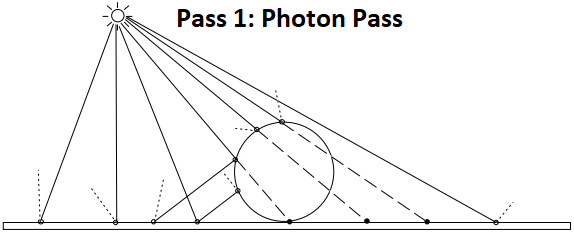
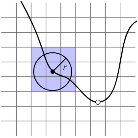
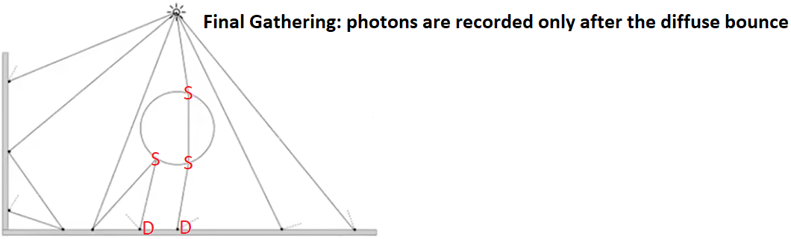
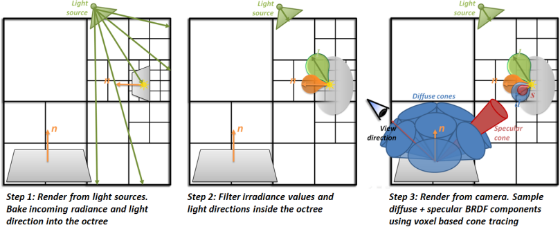

# VXGI (Voxel Global Illumintaion)  

## Photon Mapping  

By \[Jensen 1996\] and "16.2.2 Photon Mapping" of [PBRT-V3](https://pbr-book.org/3ed-2018/Light_Transport_III_Bidirectional_Methods/Stochastic_Progressive_Photon_Mapping#PhotonMapping), the photon mapping is composed of two-pass: the photon pass and the rendering pass. In the first photon pass, the paths are traced from the light sources and the lighting of the interaction points on the surface are recorded as the photons. In the second rendering pass, the paths are traced from the camera and the nearby photons of the interaction points are used to estimate the lighting.  

  
  

By "Progressive Photon Mapping" of [PBRT-V3](https://pbr-book.org/3ed-2018/Light_Transport_III_Bidirectional_Methods/Stochastic_Progressive_Photon_Mapping#x2-ProgressivePhotonMapping), the approach, that only the interaction points after the diffuse bounce are recorded as the photons in the first photon pass, is also called the final gathering.  

  

By \[Crassin 2011 B\], the idea of VXGI is to use the voxel cone tracing to perform the final gathering. The VXGI is composed of three pass: light injection pass, filtering pass and voxel cone tracing pass. In the first pass (light injection pass), the photons are organized in the voxels. In the second pass (filtering pass), TODO. In the third pass (voxel cone tracing pass), the voxel cone tracing is used to perform the final gathering.  

  

## SVO (Sparse Voxel Octree)  

[GigaVoxels](http://gigavoxels.inrialpes.fr/index.html)  

## Cone Tracing

[GigaVoxels](http://gigavoxels.inrialpes.fr/index.html) "Data/Shaders/rayCastFrag.glsl"

## Tips

## Clip Map  

[NVIDIA VXGI](https://developer.nvidia.com/vxgi)  

### Geometry Shader
By \[Harris 2019\], the geometry shader is hostile to the performance for mobile GPU.  
Besides, for Mali GPU, the geometry shader is not supported by the hardware and is emulated by the compute shader. And since the number of the vertices produced by a single geometry shader may vary, a parallel scan pass is required to perform the prefix sum.  
The normals may be calculated when the vertices are loaded. It must be ensured that the normals of the vertices of the same triangle are the same. For example, if a vertex is shared by multiple triangles, new vertices with different normals may be created for different triangles.  

### Conservative Rasterization
\[Hasselgren 2005\] may be replaced by "VK_EXT_conservative_rasterization"  

### Atomic Read-Modify-Write Operation
The atomic read-modify-write operation may be replaced by "VK_EXT_fragment_shader_interlock" or "GL_EXT_shader_framebuffer_fetch"  

## Reference  
\[Hasselgren 2005\] [Jon Hasselgren, Tomas Akenine-Moller, Lennart Ohlsson. "Chapter 42. Conservative Rasterization." GPU Gems 2.](https://developer.nvidia.com/gpugems/gpugems2/part-v-image-oriented-computing/chapter-42-conservative-rasterization)  
\[Crassin 2011 A\] [Cyril Crassin. "GigaVoxels: A Voxel-Based Rendering Pipeline For Efficient Exploration Of Large And Detailed Scenes." PhD Thesis 2011](http://gigavoxels.inrialpes.fr/index.html)  
\[Crassin 2011 B\] [Cyril Crassin, Fabrice Neyret, Miguel Sainz, Simon Green, Elmar Eisemann. "Interactive Indirect Illumination Using Voxel Cone Tracing." SIGGRAPH 2011.](https://research.nvidia.com/publication/interactive-indirect-illumination-using-voxel-cone-tracing)  
\[Eric 2017\] [Eric Arneback. “Comparing a Clipmap to a Sparse Voxel Octree for Global Illumination." Master thesis 2017.](https://erkaman.github.io/posts/masters_thesis.html)  
