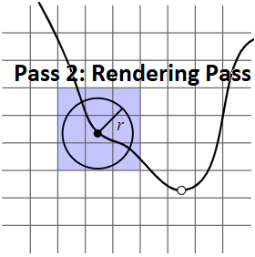

# VXGI (Voxel Global Illumintaion)  

## Photon Mapping  

By \[Jensen 1996\] and "16.2.2 Photon Mapping" of [PBRT-V3](https://pbr-book.org/3ed-2018/Light_Transport_III_Bidirectional_Methods/Stochastic_Progressive_Photon_Mapping#PhotonMapping), the **photon mapping** is composed of two-pass: the **photon pass** and the **rendering pass**. In the first pass (photon pass), the paths are traced from the light sources and the lighting of the interaction points on the surface are recorded as the photons. In the second pass (rendering pass), the paths are traced from the camera and the nearby photons of the interaction points are used to estimate the lighting.  
  
  

By "Progressive Photon Mapping" of [PBRT-V3](https://pbr-book.org/3ed-2018/Light_Transport_III_Bidirectional_Methods/Stochastic_Progressive_Photon_Mapping#x2-ProgressivePhotonMapping), the special case, where only the interaction points after the diffuse bounce are recorded as the photons in the photon pass, of the photon mapping is also called the **final gathering**.  
  

By \[Crassin 2011 B\], the idea of VXGI is to organize the photons by the voxels and to implement the "final gathering" by the following three steps: light injection, filtering and cone tracing. The first step (light injection) of VXGI is analogous to the first pass (photon pass) of photon mapping. The third step (cone tracing) of VXGI is analogous to the second pass (rendering pass) of photon mapping.  
  
  
  
  

## Cone Tracing  

// ray intersect at an infinitesimal point  
// cone intersect at an area/volume  
// geometry filterable // less accurate but reduced noise  

// cannot detect full occlusions that are a result of multiple partial ones  

// "Figure 11.12"  

// Dynamic Occlusion with Signed Distance Fields  

// PDF Cosine Term  
[Cosine-Weighted Hemisphere Sampling](https://pbr-book.org/3ed-2018/Monte_Carlo_Integration/2D_Sampling_with_Multidimensional_Transformations#Cosine-WeightedHemisphereSampling)  

## Global Illumination  

TODO: Not related to my current work  

## Ambient Occlusion  

## Reference  
\[Jensen 1996\] [Henrik Wann Jensen. "Global Illumination using Photon Maps." EGSR 1996.](http://graphics.ucsd.edu/~henrik/papers/photon_map/)  
\[Crassin 2011 A\] [Cyril Crassin. "GigaVoxels: A Voxel-Based Rendering Pipeline For Efficient Exploration Of Large And Detailed Scenes." PhD Thesis 2011.](http://gigavoxels.inrialpes.fr/index.html)  
\[Crassin 2011 B\] [Cyril Crassin, Fabrice Neyret, Miguel Sainz, Simon Green, Elmar Eisemann. "Interactive Indirect Illumination Using Voxel Cone Tracing." SIGGRAPH 2011.](https://research.nvidia.com/publication/interactive-indirect-illumination-using-voxel-cone-tracing)  
\[McLaren 2015\] [James McLaren. "The Technology of The Tomorrow Children." GDC 2015.](http://fumufumu.q-games.com/archives/TheTechnologyOfTomorrowsChildrenFinal.pdf)  
\[Eric 2017\] [Eric Arneback. “Comparing a Clipmap to a Sparse Voxel Octree for Global Illumination." Master thesis 2017.](https://erkaman.github.io/posts/masters_thesis.html)  
