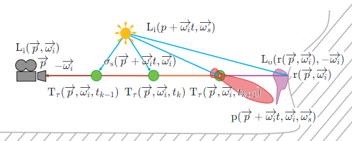

# Volume Rendering

## Rendering Equation  

Notation | Description | Shader Code Convention  
:-: | :-: | :-:  
$\displaystyle \overrightarrow{p}$ | Shading Position | N/A  
$\displaystyle \overrightarrow{\omega_o}$ | Outgoing Direction | V  
$\displaystyle \overrightarrow{\omega_i}$ | Incident Direction | L  
$\displaystyle \operatorname{L_e}(\overrightarrow{p}, \overrightarrow{\omega_o})$ | Emissive Radiance | N/A  
$\displaystyle \operatorname{f}(\overrightarrow{p}, \overrightarrow{\omega_i}, \overrightarrow{\omega_o})$ | BRDF | N/A
$\displaystyle \operatorname{L_i}(\overrightarrow{p}, \overrightarrow{\omega_i})$ | Incident Radiance | N/A
$\displaystyle (\cos \theta_L)^+$ | N/A | clamp(dot(N, L), 0.0, 1.0)  
$\displaystyle \operatorname{L_o}(\overrightarrow{p}, \overrightarrow{\omega_i})$ | Exitant Radiance | N/A  
$\displaystyle \operatorname{r}(\overrightarrow{p}, \overrightarrow{\omega})$ | Ray-Casting Function | N/A  

The **Rendering Equation** is also called the **LTE** (**Light Transport Equation**) by "14.4 The Light Transport Equation" of [PBRT-V3](https://www.pbr-book.org/3ed-2018/Light_Transport_I_Surface_Reflection/The_Light_Transport_Equation). And we have the **Rendering Equation** $\displaystyle \operatorname{L_o}(\overrightarrow{p}, \overrightarrow{\omega_o}) = \operatorname{L_e}(\overrightarrow{p}, \overrightarrow{\omega_o}) + \int_\Omega \operatorname{f}(\overrightarrow{p}, \overrightarrow{\omega_i}, \overrightarrow{\omega_o}) \operatorname{L_i}(\overrightarrow{p}, \overrightarrow{\omega_i}) (\cos \theta_L)^+ \, d \overrightarrow{\omega_i}$.   

By "Figure 11.1" of [Real-Time Rendering Fourth Edition](http://www.realtimerendering.com/) and "Figure 14.14" of [PBRT-V3](https://pbr-book.org/3ed-2018/Light_Transport_I_Surface_Reflection/The_Light_Transport_Equation), by assuming no **participating media**, we have the relationship $\displaystyle \operatorname{L_i}(\overrightarrow{p}, \overrightarrow{\omega_i}) = \operatorname{L_o}(\operatorname{r}(\overrightarrow{p}, \overrightarrow{\omega_i}), -\overrightarrow{\omega_i})$ where $\displaystyle \operatorname{r}(\overrightarrow{p}, \overrightarrow{\omega})$ is the ray-casting function. This means that the incident radiance $\displaystyle \operatorname{L_i}(\overrightarrow{p}, \overrightarrow{\omega_i})$ at one point p is exactly the exitant radiance $\displaystyle \operatorname{L_o}(\operatorname{r}(\overrightarrow{p}, \overrightarrow{\omega_i}), -\overrightarrow{\omega_i})$ at another point $\displaystyle \operatorname{r}(\overrightarrow{p}, \overrightarrow{\omega_i})$.  

  

Hence, both the incident radiance $\displaystyle \operatorname{L_i}(\overrightarrow{p}, \overrightarrow{\omega})$ and the exitant radiance $\displaystyle \operatorname{L_o}(\overrightarrow{p}, \overrightarrow{\omega})$ can be represented by the same function $\displaystyle \operatorname{L}(\overrightarrow{p}, \overrightarrow{\omega})$. And thus, we have $\displaystyle \operatorname{L}(\overrightarrow{p}, \overrightarrow{\omega_o}) = \operatorname{L_e}(\overrightarrow{p}, \overrightarrow{\omega_o}) + \int_\Omega \operatorname{f}(\overrightarrow{p}, \overrightarrow{\omega_i}, \overrightarrow{\omega_o}) \operatorname{L}(\operatorname{r}(\overrightarrow{p}, \overrightarrow{\omega_i}), -\overrightarrow{\omega_i}) (\cos \theta_L)^+ \, d \overrightarrow{\omega_i}$ which is an integral equation where the unknown function is $\displaystyle \operatorname{L}(\overrightarrow{p}, \overrightarrow{\omega})$.  

According to this integral equation, by [OSL (Open Shading Language)](https://github.com/AcademySoftwareFoundation/OpenShadingLanguage), the surface and the light are actually the same thing, since the light is merely the surface which is emissive.  

By "Light transport and the rendering equation" of [CS 348B - Computer Graphics: Image Synthesis Techniques](http://www-graphics.stanford.edu/courses/cs348b-96/) and "Global Illumination and Rendering Equation" of [CS 294-13 Advanced Computer Graphics](https://inst.eecs.berkeley.edu/~cs294-13/fa09/), this integral equation is actually the [Fredholm Integral Equation](https://en.wikipedia.org/wiki/Fredholm_integral_equation) of which the solution is the [Liouville–Neumann Series](https://en.wikipedia.org/wiki/Liouville%E2%80%93Neumann_series). And thus, the solution of this integral equation can be written as the recursive form $\text{L} = \text{E} + \text{K}\text{E} + {\text{K}}^2\text{E} + {\text{K}}^3\text{E} + \ldots$.  

## Radiative Transfer Equation 

Notation | Description | Shader Code Convention  
:-: | :-: | :-:  
$\displaystyle \operatorname{\sigma_t}(\overrightarrow{p} + \overrightarrow{\omega_i}t, \overrightarrow{\omega_i})$ | Attenuation/Extinction Coefficient | N/A  
$\displaystyle \operatorname{\sigma_a}(\overrightarrow{p} + \overrightarrow{\omega_i}t, \overrightarrow{\omega_i})$ | Absorption Coefficient | N/A  
$\displaystyle \operatorname{\sigma_s}(\overrightarrow{p} + \overrightarrow{\omega_i}t, \overrightarrow{\omega_i})$ | Scattering Coefficient | N/A  
$\displaystyle \operatorname{\Tau_{\tau}}(\overrightarrow{p}, \overrightarrow{\omega_i}, t)$ | Multiplicative Transmittance | N/A  
$\displaystyle \operatorname{p}(\overrightarrow{p} + \overrightarrow{\omega_i}t, \overrightarrow{\omega_i}, \overrightarrow{\omega_s})$ | Phase Function | N/A  

The **RTE** (**Radiative Transfer Equation**) is also called the **complete transport equation** by "Participating media" of [CS 348B - Computer Graphics: Image Synthesis Techniques](http://www-graphics.stanford.edu/courses/cs348b-96/), and is also called the **Equation of Transfer** by "15.1 The Equation of Transfer" of [PBRT-V3](https://pbr-book.org/3ed-2018/Light_Transport_II_Volume_Rendering/The_Equation_of_Transfer).  

By "Participating media" of [CS 348B - Computer Graphics: Image Synthesis Techniques](http://www-graphics.stanford.edu/courses/cs348b-96/), \[Fong 2017\], "Figure 14.3" of [Real-Time Rendering Fourth Edition](http://www.realtimerendering.com/) and "15.1 The Equation of Transfer" of [PBRT-V3](https://pbr-book.org/3ed-2018/Light_Transport_II_Volume_Rendering/The_Equation_of_Transfer), we have the **RTE** (**Radiative Transfer Equation**) $\displaystyle \operatorname{L_i}(\overrightarrow{p}, \overrightarrow{\omega_i}) = \int_0^{t_r} \operatorname{\Tau_{\tau}}(\overrightarrow{p}, \overrightarrow{\omega_i}, t) \cdot \left\lparen \operatorname{L_e}(\overrightarrow{p} + \overrightarrow{\omega_i}t, \overrightarrow{\omega_i}) + \operatorname{\sigma_s}(\overrightarrow{p} + \overrightarrow{\omega_i}t, \overrightarrow{\omega_i}) \left\lparen \int_{\Omega} \operatorname{p}(\overrightarrow{p} + \overrightarrow{\omega_i}t, \overrightarrow{\omega_i}, \overrightarrow{\omega_{s}}) \operatorname{L_i}(p + \overrightarrow{\omega_i}t, \overrightarrow{\omega_{s}}) \, d \overrightarrow{\omega_{s}} \right\rparen \right\rparen \, dt + \operatorname{\Tau_{\tau}}(\overrightarrow{p}, \overrightarrow{\omega_i}, t_r) \cdot \operatorname{L_o}(\operatorname{r}(\overrightarrow{p}, \overrightarrow{\omega_i}), -\overrightarrow{\omega_i})$ where $\displaystyle \operatorname{r}(\overrightarrow{p}, \overrightarrow{\omega_i})$ is the the ray-casting function, $\displaystyle t_r$ is the length such that $\displaystyle (\overrightarrow{p} + \overrightarrow{\omega_i} t_r) = \operatorname{r}(\overrightarrow{p}, \overrightarrow{\omega_i})$, $\displaystyle \operatorname{\Tau_{\tau}}(\overrightarrow{p}, \overrightarrow{\omega_i}, t) = e^{-\operatorname{\tau}(\overrightarrow{p}, \overrightarrow{\omega_i}, t)}$ is the [multiplicative transmittance](https://pbr-book.org/3ed-2018/Volume_Scattering/Volume_Scattering_Processes#Out-ScatteringandAttenuation) where $\displaystyle \operatorname{\tau}(\overrightarrow{p}, \overrightarrow{\omega_i}, t) = \int_0^t \operatorname{\sigma_t}(\overrightarrow{p} + \overrightarrow{\omega_i}t', \overrightarrow{\omega_i}) \, dt'$ is the [optical thickness](https://pbr-book.org/3ed-2018/Volume_Scattering/Volume_Scattering_Processes#Out-ScatteringandAttenuation) where $\displaystyle \operatorname{\sigma_t}(\overrightarrow{p} + \overrightarrow{\omega_i}t', \overrightarrow{\omega_i}) = \operatorname{\sigma_a}(\overrightarrow{p} + \overrightarrow{\omega_i}t', \overrightarrow{\omega_i}) + \operatorname{\sigma_s}(\overrightarrow{p} + \overrightarrow{\omega_i}t', \overrightarrow{\omega_i})$ is the [attenuation/extinction coefficient](https://pbr-book.org/3ed-2018/Volume_Scattering/Volume_Scattering_Processes#Out-ScatteringandAttenuation) where $\displaystyle \operatorname{\sigma_a}$ is the [absorption coefficient](https://pbr-book.org/3ed-2018/Volume_Scattering/Volume_Scattering_Processes#Absorption) and $\displaystyle \operatorname{\sigma_s}$ is the [scattering coefficient](https://pbr-book.org/3ed-2018/Volume_Scattering/Volume_Scattering_Processes#Absorption), and $\displaystyle \operatorname{p}(\overrightarrow{p} + \overrightarrow{\omega_i}t, \overrightarrow{\omega_i}, \overrightarrow{\omega_s})$ is the [phase function](https://pbr-book.org/3ed-2018/Volume_Scattering/Phase_Functions).  

  

Technically, the relationship between $\displaystyle \operatorname{L_i}(p + \overrightarrow{\omega_i}t, \overrightarrow{\omega_{s}})$ and $\displaystyle \operatorname{L_o}(\overrightarrow{p_{sun}}, \overrightarrow{\omega_{s}})$ follows the **RTE** (**Radiative Transfer Equation**). However, in real time rendering, we assume that $\displaystyle \operatorname{L_i}(p + \overrightarrow{\omega_i}t, \overrightarrow{\omega_{s}}) \approx \operatorname{\Tau_{\tau}}(p + \overrightarrow{\omega_i}t, -\overrightarrow{\omega_{s}}, t_{sun}) \cdot \operatorname{L_o}(\overrightarrow{p_{sun}}, \overrightarrow{\omega_{s}})$ where $\displaystyle \overrightarrow{p_{sun}} = \operatorname{r}(p + \overrightarrow{\omega_i}t, -\overrightarrow{\omega_{s}})$ and $\displaystyle \operatorname{L_o}(\overrightarrow{p_{sun}}, \overrightarrow{\omega_{s}})$ is the "intensity" of the sun (directional light). This means that the in-scattering part of the **RTE** (**Radiative Transfer Equation**) is ignored.  
 
Evidently, the relationship $\displaystyle \operatorname{L_i}(\overrightarrow{p}, \overrightarrow{\omega_i}) = \operatorname{L_o}(\operatorname{r}(\overrightarrow{p}, \overrightarrow{\omega_i}), -\overrightarrow{\omega_i})$ by "Figure 11.1" of [Real-Time Rendering Fourth Edition](http://www.realtimerendering.com/) and "Figure 14.14" of [PBRT-V3](https://pbr-book.org/3ed-2018/Light_Transport_I_Surface_Reflection/The_Light_Transport_Equation) is the simplified case of the **RTE** (**Radiative Transfer Equation**) by assuming no participating media.  

## Volumetric Fog  

TODO

## Volumetric Lighting  

[GameWorks VisualFX](https://developer.nvidia.com/volumetriclighting)  

TODO  

## Reference  
\[Bruneton 2008\] [Eric Bruneton, Fabrice Neyret. "Precomputed Atmospheric Scattering." EGSR 2008.](https://github.com/ebruneton/precomputed_atmospheric_scattering)  
\[Cantlay 2014\] [Iain Cantlay. From Terrain to Godrays Better Use of DirectX11. GDC 2014.](https://developer.nvidia.com/sites/default/files/akamai/gameworks/events/gdc14/GDC_14_From%20Terrain%20to%20Godrays%20-%20Better%20Use%20of%20DirectX11CantlayTatarinov.pdf)  
\[Hoobler 2016\] [Nathan Hoobler. "Fast, Flexible, Physically-Based Volumetric Light Scattering." GTC 2016.](https://developer.nvidia.com/sites/default/files/akamai/gameworks/downloads/papers/NVVL/Fast_Flexible_Physically-Based_Volumetric_Light_Scattering.pdf)  
\[Fong 2017\] [Julian Fong, Magnus Wrenninge, Christopher Kulla, Ralf Habel. "Production Volume Rendering." SIGGRAPH 2017 Course Notes.](https://graphics.pixar.com/library/)  
