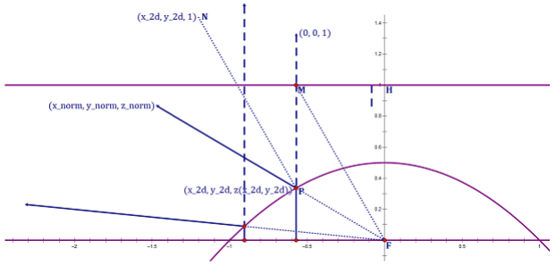

## Glance  
Since the sphere is a 2-manifold rather than a 3-manifold, a bijection can be formed between the points on the sphere and the coordinates of the 2D texture.  

## 1\. Projector Functions

### 1-1\. Sphere Mapping  
Real-Time Rendering Fourth Edition / 10.4.2 Sphere Mapping  

### 1-2\. Dual Paraboloid Mapping

  
  
  

## 2\. Applications  

### 2-1\. Point Light Shadow Mapping  

### 2-2\. Normal Representation  
Real-Time Rendering Fourth Edition / 16.6 Compression and Precision  

Evidently, a bijection can be formed between the unit vectors and the points on the sphere. And thus, the projector functions can be used to compress the normals to 2D coordinates.  

[Imagination Technologies Limited. "Dual Paraboloid Environment Mapping." Power SDK Whitepaper 2017.](https://github.com/powervr-graphics/Native_SDK/blob/R17.1-v4.3/Documentation/Whitepapers/Dual%20Paraboloid%20Environment%20Mapping.Whitepaper.pdf)  

