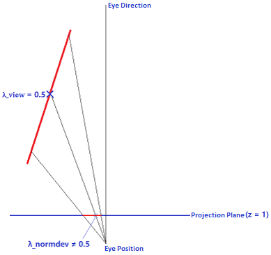

## Glance  
Since the sphere is a 2-manifold rather than a 3-manifold, a bijection can be formed between the points on the sphere and the coordinates of the 2D texture.  

## 1\. Projector Functions

### 1-1\. Sphere Mapping  
Real-Time Rendering Fourth Edition / 10.4.2 Sphere Mapping  

// Cons: NOT **uniform** ??? 

### 1-2\. Dual Paraboloid Mapping
Real-Time Rendering Fourth Edition / 10.4.4 Other Projections  

"The parabolic map has more **uniform** texel sampling of the environment compared to the sphere map, and even to the cube map." by Real-Time Rendering Fourth Edition  

  
  
  

### 1-3\. Octahedral Mapping  
Real-Time Rendering Fourth Edition / 10.4.4 Other Projections  

// Octahedron Environment Maps  
// On Floating-Point Normal Vectors  
// A Survey of Efficient Representations for Independent Unit Vectors

## 2\. Applications  

### 2-1\. Point Light Shadow Mapping  

### 2-2\. Normal Representation  
Real-Time Rendering Fourth Edition / 16.6 Compression and Precision  

Evidently, a bijection can be formed between the unit vectors and the points on the sphere. And thus, the projector functions can be used to compress the normals to 2D coordinates.  

\[Imagination 2017\] [Imagination. "Dual Paraboloid Environment Mapping." Power SDK Whitepaper 2017.](https://github.com/powervr-graphics/Native_SDK/blob/R17.1-v4.3/Documentation/Whitepapers/Dual%20Paraboloid%20Environment%20Mapping.Whitepaper.pdf)  
\[Cigolle 2014\] [Zina Cigolle, Sam Donow, Daniel Evangelakos, Michael Mara, Morgan McGuire, Quirin Meyer. "A Survey of Efficient Representations for Independent Unit Vectors." JCGT 2014.](https://jcgt.org/published/0003/02/01/)  
