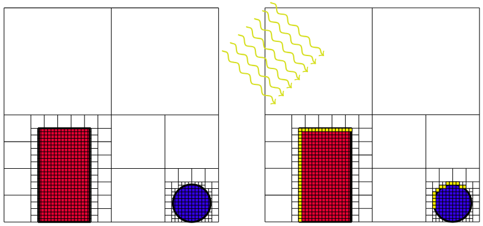
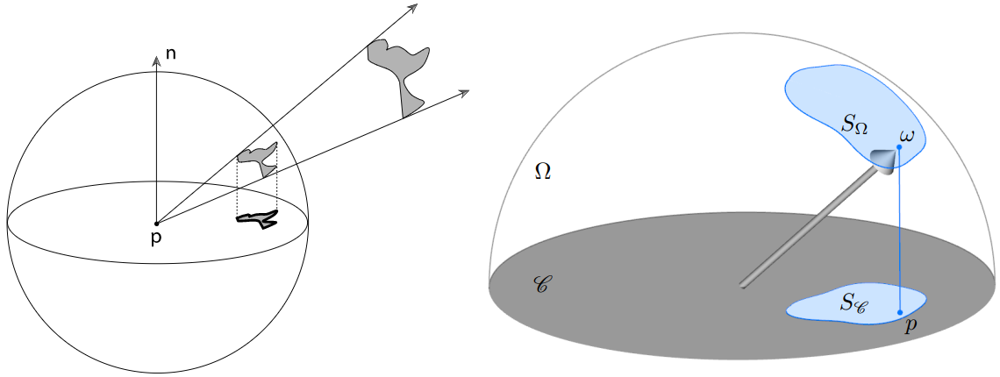

# VXGI (Voxel Global Illumintaion)  

## 1\. Workflow  

### 1-1\. Photon Mapping  

By "4.3 Overview" of \[Jensen 2001\] and "16.2.2 Photon Mapping" of [PBR Book V3](https://pbr-book.org/3ed-2018/Light_Transport_III_Bidirectional_Methods/Stochastic_Progressive_Photon_Mapping#PhotonMapping), the **photon mapping** is composed of two steps: **photon tracing** and **rendering**. During the **photon tracing** step, the **photon rays** are traced from the light sources, and the lighting information of the intersection positions of these **photon rays** is recorded as the photons. During the **rendering** step, the **primary rays** are traced from the camera and the **final gather rays** are traced from the [**final gather points**](http://docs.autodesk.com/MENTALRAY/2015/ENU/mental-ray-help/files/manual/node52.html), and the lighting information of the vicinal photons of the intersection positions of these **primary rays** or **final gather rays** is used to approximate the lighting of these intersection points by **density estimation**.  

By "7.5 Photon Gathering" of \[Jensen 2001\], "38.2.2 Final Gathering" of \[Hachisuka 2005\] and "16.2.2 Photon Mapping" of [PBR Book V3](https://pbr-book.org/3ed-2018/Light_Transport_III_Bidirectional_Methods/Stochastic_Progressive_Photon_Mapping#PhotonMapping), the rendering step of the photon mapping is usually composed of two steps: **radiance estimate** and **final gathering**. During the **radiance estimate** step, the **primary rays** are traced from the camera, and the lighting information of the vicinal photons of the intersection positions of these **primary rays** is used to approximate the lighting of these intersection points by **density estimation**. During the **final gathering** step, from some of the intersection positions of the **primary rays**, which are called the [**final gather points**](http://docs.autodesk.com/MENTALRAY/2015/ENU/mental-ray-help/files/manual/node52.html), the **final gather rays** are traced, and the lighting information of the vicinal photons of the intersection positions of these **final gather rays** is used to approximate the lighting of these intersection positions by **density estimation**.  

| **Photon Tracing** | **Rendering / Radiance-Estimate** | **Rendering / Final Gathering** |  
| :-: | :-: | :-: |  
|  |  |  |  

### 1-2\. VXGI (Voxel Global Illumintaion)  

By \[Crassin 2011\], the **VXGI (Voxel Global Illumintaion)** is composed of three steps: **light injection**, **filtering** and **cone tracing**. The idea of the VXGI is intrinsically to implement the photon mapping by storing the photons in the voxels. The **light injection** step of the VXGI is analogous to the **photon tracing** step of the photon mapping. The **cone tracing** of the VXGI is analogous to the **rendering / final gathering** step of the photon mapping. The **filtering** step of the VXGI is analogous to the idea of the **density estimation** of the photon mapping.  

| **Light Injection** | **Filtering** | **Cone Tracing** |  
| :-: | :-: | :-: |  
|  |  |  |  

### 2-1\. Light Injection  

As per the original version by \[Crassin 2011\], the voxels are stored in the **SVO (Sparse Voxel Octree)**. However, by \[McLaren 2015\] and \[Eric 2017\], the **Clipmap** is a better alternative. And actually, the **Clipmap** is exactly what the [NVIDIA VXGI](https://developer.nvidia.com/vxgi) is based on.  

#### 2-1-1\. Voxelization  

By \[Eric 2017\], there are several approaches to inject the lighting. Some approaches treat the geometry and the lighting separablely. The geometry is voxelized at first, and then the **RSM (Reflective Shadow Maps)** by \[Dachsbacher 2005\] is used to inject the lighting later. The advantage of these approaches is that as long as the geometry remains the same, the voxelized data of the geometry can be reused even if the lighting has been changed. However, we will focus on the "voxelization-based" approach which the [NVIDIA VXGI](https://developer.nvidia.com/vxgi) is based on. The light injection is performed at the same time when the geometry is voxelized. The most significant advantage of this approach is that the **RSM** is no longer required. However, the voxelized data can not be reused whenever either the geometry or the lighting has been changed. The **VXGI::UpdateVoxelizationParameters::invalidatedRegions** is used to invalidate the voxelized data when the geometry has been changed in the [NVIDIA VXGI](https://developer.nvidia.com/vxgi). And the **VXGI::UpdateVoxelizationParameters::invalidatedLightFrusta** is used to invalidate the voxelized data when the lighting has been changed in the [NVIDIA VXGI](https://developer.nvidia.com/vxgi).  

#### 2-1-2\. Toroidal Addressing  

TODO:  
By \[Panteleev 2014\], the [NVIDIA VXGI](https://developer.nvidia.com/vxgi) does use the **Toroidal Addressing** to reuse the voxelized data. However, it rarely happens that both the geometry and the lighting remain the same. Actually, the **VXGI::VoxelizationParameters::persistentVoxelData** is always set to **false** in the **NVIDIA Unreal Engine 4 Fork**. And the evolution of the rendering technique tends to get close to the real time solution and get rid of the cache based solution. The **DXR (DirectX Raytracing)** is the a typical example for this tendency. Thus, the **Toroidal Addressing** is not involved in the current version, but perhaps will be involved in the future version.  

#### 2-1-3\. Clipmap Logical Structure  

By \[Panteleev 2014\], we have the logical structure of the **Clipmap**. The first several clipmap levels have only one mipmap level, and the last clipmap level is the only one which has multiple mipmap levels. The voxel size increases for each (clipmap or mipmap) level. The texture size (voxel count) (of the zeroth mipmap level) of each clipmap level is the same. The volume of each mipmap level of the same clipmap level is the same.  

N/A | 0-0 | 1-0 | 2-0 | 2-1 | 2-2  
:-: | :-: | :-: | :-: | :-: | :-:   
Figure |  |  |  |  |   
Clipmap Level Index | 0 | 1 | 2 | 2 | 2  
Mipmap Level Index | 0 | 0 | 0 | 1 | 2  
Voxel Size | 1 | 2 | 4 | 8 | 16  
Texture Size (Voxel Count) | 4 | 4 | 4 | 2 | 1  
Volume | $\displaystyle (1 \times 4)^3 = 64$ | $\displaystyle (2 \times 4)^3 = 512$ | $\displaystyle (4 \times 4)^3 = 4096$ | $\displaystyle (8 \times 2)^3 = 4096$ | $\displaystyle (16 \times 1)^3 = 4096$  

#### 2-1-4\. Clipmap Physical Structure  

And here is the logical structure of the clipmap used in the **Global Illumination** sample of the [NVIDIA VXGI](https://developer.nvidia.com/vxgi). Logical Structure: clipmap level 0-3: only one mipmap level; clipmap level 4: mipmap 0-5 (6 levels)  

N/A | 0-0 | 1-0 | 2-0 | 3-0 | 4-0 | 4-1 | 4-2 | 4-3 | 4-4 | 4-5  
:-: | :-: | :-: | :-: | :-: | :-: | :-: | :-: | :-: | :-: | :-:  
Clipmap Level Index | 0 | 1 | 2 | 3 | 4 | 4 | 4 | 4 | 4 | 4  
Mipmap Level Index | 0 | 0 | 0 | 0 | 0 | 1 | 2 | 3 | 4 | 5  
Voxel Size | 8 | 16 | 32 | 64 | 128 | 256 | 512 | 1024 |2048 | 4096  
Texture Size (Voxel Count) | 128 | 128 | 128 | 128 | 128 | 64 | 32 | 16 | 8 | 4  
Volume | $\displaystyle {(8 \times 128)}^3 = 2^{30}$ | $\displaystyle {(16 \times 128)}^3 = 2^{33}$ | $\displaystyle {(32 \times 128)}^3 = 2^{36}$ | $\displaystyle {(64 \times 128)}^3 = 2^{39}$ | $\displaystyle {(128 \times 128)}^3 = 2^{42}$ | $\displaystyle {(256 \times 64)}^3 = 2^{42}$ | $\displaystyle {(512 \times 32)}^3 = 2^{42}$ | $\displaystyle {(1024 \times 16)}^3 = 2^{42}$ | $\displaystyle {(2048 \times 8)}^3 = 2^{42}$ | $\displaystyle {(4096 \times 4)}^3 = 2^{42}$  

And here is the physical structure of the clipmap used in the **Global Illumination** sample of the [NVIDIA VXGI](https://developer.nvidia.com/vxgi). The clipmap is implemented by the $\displaystyle 128 \times 128 \times 785$ 3D texture.  

3D Texture Depth Index | Clipmap Level Index | Mipmap Level Index | 3D Texture Width/Height   
:-: | :-: | :-: | :-: 
1 - 128   | 0   | 0   | 128   
131 - 258 | 1   | 0   | 128   
261 - 388 | 2   | 0   | 128   
391 - 518 | 3   | 0   | 128    
521 - 648 | 4   | 0   | 128 
651 - 714 | 4   | 1   | 64 (64 unused)  
717 - 748 | 4   | 2   | 32 (96 unused)  
751 - 766 | 4   | 3   | 16 (112 unused)  
769 - 776 | 4   | 4   | 8 (120 unused)  
779 - 782 | 4   | 5   | 4 (124 unused)  

3D Texture Depth Index | Equivalent 3D Texture Depth Index (Toroidal Address)  
:-: | :-:  
0   | 128
129 | 1    
------- | -------  
130 | 258  
259 | 131   
------- | -------  
260 | 388   
389 | 261    
------- | -------  
390 | 518    
519 | 391    
------- | -------  
520 | 648   
649 | 521   
------- | -------  
650 | 714   
715 | 651    
------- | -------  
716 | 748    
749 | 717    
------- | -------  
750 | 766    
767 | 751    
------- | -------  
768 | 776   
777 | 769    
------- | -------  
778 | 782    
783 | 779    
------- | -------  
784 | N/A    

#### 2-1-4\. MSAA  

TODO: conservative rasterization  
TODO: simulate "conservative rasterization" by MSAA (\[Takeshige 2015\])  

TODO: not related to "ambient occlusion"  

### 2-2\. Filtering  

  

TODO: anisotropic voxel  

### 2-3\. Cone Tracing  

#### 2-3-1\. Monte Carlo Method  

By [Additive Interval Property](https://en.wikipedia.org/wiki/Integral#Conventions), the ambient occlusion can be calculated as $\displaystyle \operatorname{k_A} = \int_\Omega \frac{1}{\pi}  \operatorname{V}(\overrightarrow{\omega_i}) (\cos \theta_i)^+ \, d \overrightarrow{\omega_i} = \frac{1}{\pi} \sum_{i=0}^{n} \left\lparen \int_{\Omega_i} \operatorname{V}(\overrightarrow{\omega_i}) (\cos \theta_i)^+ \, d \overrightarrow{\omega_i} \right\rparen$ where **n** is the number of cones, and $\displaystyle \Omega_i$ is the solid angle subtended by the **i**th cone.  
  
  
By \[Crassin 2011 B\], the visibility $\displaystyle \operatorname{V}(\overrightarrow{\omega_i})$ is assumed to be the same for all directions within the same cone, and the calculation of the ambient occlusion can be simplified as $\displaystyle \int_{\Omega_i} \operatorname{V}(\overrightarrow{\omega_i}) (\cos \theta_i)^+ \, d \overrightarrow{\omega_i} \approx \operatorname{V_c}(\Omega_i) \cdot \int_{\Omega_i} (\cos \theta_i)^+ \, d \overrightarrow{\omega_i}$ where $\displaystyle \operatorname{V_c}(\Omega_i) = 1 - \operatorname{A_{Final}}$ is the inverse of the final occlusion of the cone tracing.  

By "5.5.1 Integrals over Projected Solid Angle" of [PBRT-V3](https://pbr-book.org/3ed-2018/Color_and_Radiometry/Working_with_Radiometric_Integrals#IntegralsoverProjectedSolidAngle) and \[Heitz 2017\], the integral of the clamped cosine $\displaystyle \int_{\Omega_i} (\cos \theta_i)^+ \, d \overrightarrow{\omega_i}$ can be calculated as the projected area on the unit disk.  
  

By "20.4 Mipmap Filtered Samples" of \[Colbert 2007\], we use the mip-level $\text{sample\_mip\_level} = \displaystyle \max(0, \log(\sqrt{\frac{d\overrightarrow{\omega_S}}{d\overrightarrow{\omega_P}}}))$ to sample the filtered L value from the distant radiance distribution to reduce the variance. The $\displaystyle d\overrightarrow{\omega_S}$ is the solid angle subtended by the sample, and we have $\displaystyle d\overrightarrow{\omega_S} = \frac{1}{\text{N}} \cdot \frac{1}{\text{PDF}}$. The $\displaystyle d\overrightarrow{\omega_P}$ is the solid angle subtended by a single texel of the zeroth mip-level of the texture, and by "Projection from Cube Maps" of \[Sloan 2008\], we have $\displaystyle d\overrightarrow{\omega_P} = \frac{1}{\text{cubesize\_u} \cdot \text{cubesize\_v}} \cdot \frac{4}{\sqrt{1^2 + u^2 +v^2} \cdot (1^2 + u^2 +v^2)}$.  

The $\displaystyle d\overrightarrow{\omega_S}$ is calculated by [SolidAngleSample](https://github.com/EpicGames/UnrealEngine/blob/4.27/Engine/Shaders/Private/ReflectionEnvironmentShaders.usf#L414) in UE4 and [omegaS](https://github.com/Unity-Technologies/Graphics/blob/v10.8.0/com.unity.render-pipelines.core/ShaderLibrary/ImageBasedLighting.hlsl#L500) in Unity3D. And the $\displaystyle d\overrightarrow{\omega_P}$ is calculated by [SolidAngleTexel](https://github.com/EpicGames/UnrealEngine/blob/4.27/Engine/Shaders/Private/ReflectionEnvironmentShaders.usf#L355) in UE4 and [invOmegaP](https://github.com/Unity-Technologies/Graphics/blob/v10.8.0/com.unity.render-pipelines.core/ShaderLibrary/ImageBasedLighting.hlsl#L506) in Unity3D.  

  

#### 2-3-2\. Under Operator 

By \[Crassin 2011 B\], the **under operator** is used to calculated the final color $\displaystyle \mathrm{C}_\mathrm{Final}$ and the final occlusion $\displaystyle \mathrm{A}_\mathrm{Final}$.  

By \[Dunn 2014\], we have the recursive form of the **under operator**.  
$\displaystyle \mathrm{C}_\mathrm{Final}^{0} = 0$  
$\displaystyle \mathrm{A}_\mathrm{Final}^{0} = 0$  
$\displaystyle \mathrm{C}_\mathrm{Final}^{n + 1} = \mathrm{C}_\mathrm{Final}^{n} + (1 - \mathrm{A}_\mathrm{Final}^{n}) \cdot \mathrm{C}_{n}$  
$\displaystyle \mathrm{A}_\mathrm{Final}^{n + 1} = \mathrm{A}_\mathrm{Final}^{n} + (1 - \mathrm{A}_\mathrm{Final}^{n}) \cdot \mathrm{A}_{n}$  

Actually, the explicit form of the **under operator** can be proved by mathematical induction.  
$\displaystyle \mathrm{A}_\mathrm{Final}^{n + 1} = 1 - \prod_{i = 0}^{n} \left\lparen 1 - \mathrm{A}_{i} \right\rparen$  
$\displaystyle \mathrm{C}_\mathrm{Final}^{n + 1} = \sum_{i = 0}^{n} \left\lparen \left\lparen \prod_{\mathrm{Z}_{j} \operatorname{Nearer} \mathrm{Z}_{i}} \left\lparen 1 - \mathrm{A}_{j} \right\rparen \right\rparen \cdot \mathrm{C}_{i} \right\rparen$  

  

Evidently, by \[McLaren 2015\], the cone tracing may NOT dectect the full occlusion which is the result of mutiple partial occlusions.  
  

#### 2-3-3\. Self Intersection  

TODO  

**AdjustConePosition**  

By \[Wachter 2019\], "3.9.5 Robust Spawned Ray Origins" of [PBR Book V3](https://pbr-book.org/3ed-2018/Shapes/Managing_Rounding_Error#RobustSpawnedRayOrigins) and "6.8.6 Robust Spawned Ray Origins" of [PBR Book V4](https://pbr-book.org/4ed/Shapes/Managing_Rounding_Error#RobustSpawnedRayOrigins), we should offset the ray origin to avoid self intersection.  

## References  
\[Jensen 2001\] [Henrik Jensen. "Realistic Image Synthesis Using Photon Mapping." AK Peters 2001.](http://www.graphics.stanford.edu/papers/jensen_book/)  
\[Hachisuka 2005\] [Toshiya Hachisuka. "High-Quality Global Illumination Rendering Using Rasterization." GPU Gems 2.](https://developer.nvidia.com/gpugems/gpugems2/part-v-image-oriented-computing/chapter-38-high-quality-global-illumination)  
\[Dachsbacher 2005\] [Carsten Dachsbacher, Marc Stamminger. "Reflective Shadow Maps." I3D 2005.](https://cg.ivd.kit.edu/english/publikationen.php)  
\[Crassin 2011\] [Cyril Crassin, Fabrice Neyret, Miguel Sainz, Simon Green, Elmar Eisemann. "Interactive Indirect Illumination Using Voxel Cone Tracing." SIGGRAPH 2011.](https://research.nvidia.com/publication/interactive-indirect-illumination-using-voxel-cone-tracing)  
\[Dunn 2014\] [Alex Dunn. "Transparency (or Translucency) Rendering." NVIDIA GameWorks Blog 2014.](https://developer.nvidia.com/content/transparency-or-translucency-rendering)   
\[Panteleev 2014\] [Alexey Panteleev. "Practical Real-Time Voxel-Based Global Illumination for Current GPUs." GTC 2014.](https://on-demand.gputechconf.com/gtc/2014/presentations/S4552-rt-voxel-based-global-illumination-gpus.pdf)  
\[McLaren 2015\] [James McLaren. "The Technology of The Tomorrow Children." GDC 2015.](http://fumufumu.q-games.com/archives/TheTechnologyOfTomorrowsChildrenFinal.pdf)  
\[Takeshige 2015\] [Masaya Takeshige. "The Basics of GPU Voxelization." NVIDIA GameWorks Blog 2015.](https://developer.nvidia.com/content/basics-gpu-voxelization)  
\[Eric 2017\] [Eric Arneback. “Comparing a Clipmap to a Sparse Voxel Octree for Global Illumination." Master thesis 2017.](https://erkaman.github.io/posts/masters_thesis.html)  
\[Heitz 2017\] [Eric Heitz. "Geometric Derivation of the Irradiance of Polygonal Lights." Technical report 2017.](https://hal.archives-ouvertes.fr/hal-01458129)  
