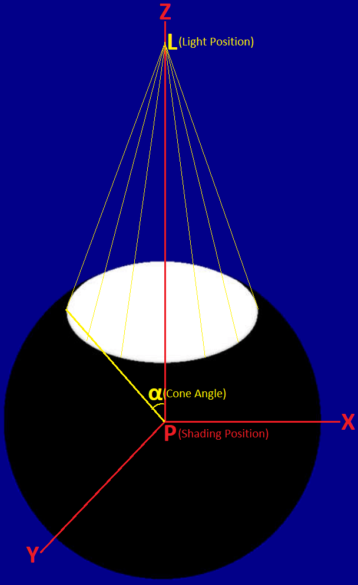

# LPV (Light Propagation Volumes)  

## SH (Spherical Harmonics)  

### SH Basis  

Let $\displaystyle \operatorname{\Upsilon_l^m}(\overrightarrow{\omega})$ be the SH basis function of which l is the degree (or band) and m is the basis function index from -l to l.  

The SH basis function $\displaystyle \operatorname{\Upsilon_l^0}(\overrightarrow{\omega})$ of which the m is zero is called **ZH (zonal harmonics)**.  

By "Appendix A2" of \[Sloan 2008\], we have the **polynomial forms** of SH basis $\displaystyle \operatorname{\Upsilon_l^m}(\overrightarrow{\omega})$. These polynomial forms are calculated by [sh_eval_basis_1](https://github.com/microsoft/DirectXMath/blob/jul2018b/SHMath/DirectXSH.cpp#L105) in DirectXMath, and [SHBasisFunction](https://github.com/EpicGames/UnrealEngine/blob/4.27/Engine/Shaders/Private/SHCommon.ush#L215) in UE4.  

Note that the direction vector $\displaystyle \overrightarrow{\omega} = \begin{bmatrix} x & y & z\end{bmatrix}$ should be **normalized** before using the polynomial forms. By "13.5.3 Spherical Coordinates" of [PBR Book V3](https://pbr-book.org/3ed-2018/Monte_Carlo_Integration/Transforming_between_Distributions#SphericalCoordinates) and "Spherical Coordinates" of "3.8.3 Spherical Parameterizations" of [PBR Book V4](https://pbr-book.org/4ed/Geometry_and_Transformations/Spherical_Geometry#x3-SphericalCoordinates), we have $\displaystyle \overrightarrow{\omega} = \begin{bmatrix} x & y & z\end{bmatrix} = \begin{bmatrix} \sin \theta \cos \phi & \sin \theta \sin \phi & \cos \theta \end{bmatrix}$ where $\displaystyle \phi$ is the azimuth and $\displaystyle \theta$ is the zenith (in physics, while in mathmatics $\displaystyle \theta$ is the azimuth and $\displaystyle \phi$ is the zenith).  

l  |  m  | $\displaystyle \operatorname{\Upsilon_l^m}(\overrightarrow{\omega})$  
:-: | :-: | :-:  
0  |  0  | $\displaystyle \frac{1}{2 \sqrt{\pi}} = 0.282094791773878140$       
1  | -1  | $\displaystyle - \frac{\sqrt{3}}{2 \sqrt{\pi}} y = -0.488602511902919920 y$     
1  |  0  | $\displaystyle \frac{\sqrt{3}}{2 \sqrt{\pi}} z = 0.488602511902919920 z$     
1  |  1  | $\displaystyle - \frac{\sqrt{3}}{2 \sqrt{\pi}} x = -0.488602511902919920 x$     

### SH Rotation

Let $\displaystyle \mathrm{R}$ be the rotation matrix. By "A. Rotation of Spherical Harmonics" of "4. SPHERICAL HARMONIC REPRESENTATION" of \[Ramamoorthi 2001 A\], for each degree (or band) l, we have $\displaystyle \operatorname{\Upsilon_l^m}(\mathrm{R} \overrightarrow{\omega}) = \sum_{j = 0}^{2 l} \operatorname{D_{mj}^l}(\mathrm{R}) \operatorname{\Upsilon_l^{j - l}}(\overrightarrow{\omega})$ where $\displaystyle \operatorname{D_l}(\mathrm{R})$ is the **Wigner D-matrix**. This means that $\displaystyle \begin{bmatrix} \operatorname{\Upsilon_l^{-l}}(\mathrm{R} \overrightarrow{\omega}) \\ \vdots \\ \operatorname{\Upsilon_l^0}(\mathrm{R} \overrightarrow{\omega}) \\ \vdots \\ \operatorname{\Upsilon_l^l}(\mathrm{R} \overrightarrow{\omega}) \end{bmatrix} = \operatorname{D_l}(\mathrm{R}) \begin{bmatrix} \operatorname{\Upsilon_l^{-l}}(\overrightarrow{\omega}) \\ \vdots \\ \operatorname{\Upsilon_l^0}(\overrightarrow{\omega}) \\ \vdots \\ \operatorname{\Upsilon_l^l}(\overrightarrow{\omega}) \end{bmatrix}$.  

By "Appendix: SH Rotation" of \[Kautz 2002\], for each degree (or band) l, each element of the Wigner D-matrix can be calculated as $\displaystyle \operatorname{D_{ij}^l}(\mathrm{R}) = \int_{\mathrm{S}^2} \operatorname{\Upsilon_l^{i - l}}(\mathrm{R} \overrightarrow{\omega}) \operatorname{\Upsilon_l^{j - l}}(\overrightarrow{\omega}) \, d\overrightarrow{\omega}$.  

For l = 0, we have $\displaystyle \mathrm{D_{00}^0} = \int_{\mathrm{S}^2} \operatorname{\Upsilon_0^0}(\mathrm{R} \overrightarrow{\omega}) \operatorname{\Upsilon_0^0}(\overrightarrow{\omega}) \, d\overrightarrow{\omega} = \int_{\mathrm{S}^2} \frac{1}{2 \sqrt{\pi}} \frac{1}{2 \sqrt{\pi}} \, d\overrightarrow{\omega} = \frac{1}{4\pi} \int_{\mathrm{S}^2} 1 \, d\overrightarrow{\omega} = \frac{1}{4\pi} 4\pi = 1$. This means that $\displaystyle \operatorname{D_l}(\mathrm{R}) = \begin{bmatrix} 1 \end{bmatrix}$.  

For l = 1, it is too complex to calculate the intergral for each element of the Wigner D-matrix. The trick by \[Hable 2014\] can be used to calculate the Wigner D-matrix. Since the equation $\displaystyle \begin{bmatrix} \operatorname{\Upsilon_1^{-1}}(\mathrm{R} \overrightarrow{\omega}) \\ \operatorname{\Upsilon_1^0}(\mathrm{R} \overrightarrow{\omega}) \\ \operatorname{\Upsilon_1^1}(\mathrm{R} \overrightarrow{\omega}) \end{bmatrix} = \operatorname{D_l}(\mathrm{R}) \begin{bmatrix} \operatorname{\Upsilon_1^-1}(\overrightarrow{\omega}) \\ \operatorname{\Upsilon_1^0}(\overrightarrow{\omega}) \\ \operatorname{\Upsilon_1^1}(\overrightarrow{\omega}) \end{bmatrix}$ holds for arbitrary direction $\displaystyle \overrightarrow{\omega}$, we can apply this equation to three linearly independent vectors **$\displaystyle \begin{bmatrix} 1 \\ 0 \\ 0 \end{bmatrix}$**, $\displaystyle \begin{bmatrix} 0 \\ 1 \\ 0 \end{bmatrix}$ and $\displaystyle \begin{bmatrix} 0 \\ 0 \\ 1 \end{bmatrix}$ to construct an invertible matrix. By the **polynomial forms** of SH basis, we have $\displaystyle \begin{bmatrix} \operatorname{\Upsilon_1^{-1}}(\mathrm{R} \overrightarrow{\omega}) \\ \operatorname{\Upsilon_1^0}(\mathrm{R} \overrightarrow{\omega}) \\ \operatorname{\Upsilon_1^1}(\mathrm{R} \overrightarrow{\omega}) \end{bmatrix} = \operatorname{D_l}(\mathrm{R}) \begin{bmatrix} \operatorname{\Upsilon_1^-1}(\overrightarrow{\omega}) \\ \operatorname{\Upsilon_1^0}(\overrightarrow{\omega}) \\ \operatorname{\Upsilon_1^1}(\overrightarrow{\omega}) \end{bmatrix} \Rightarrow$ $\displaystyle \color{red} \begin{bmatrix} 0 & - \frac{\sqrt{3}}{2 \sqrt{\pi}} & 0 \\ 0 & 0 & \frac{\sqrt{3}}{2 \sqrt{\pi}} \\ - \frac{\sqrt{3}}{2 \sqrt{\pi}} & 0 & 0 \end{bmatrix} \mathrm{R} \color{green} \overrightarrow{\omega} \color{red} = \operatorname{D_l}(\mathrm{R}) \begin{bmatrix} 0 & - \frac{\sqrt{3}}{2 \sqrt{\pi}} & 0 \\ 0 & 0 & \frac{\sqrt{3}}{2 \sqrt{\pi}} \\ - \frac{\sqrt{3}}{2 \sqrt{\pi}} & 0 & 0 \end{bmatrix} \color{green} \overrightarrow{\omega} \color{red} \Rightarrow \begin{bmatrix} 0 & - \frac{\sqrt{3}}{2 \sqrt{\pi}} & 0 \\ 0 & 0 & \frac{\sqrt{3}}{2 \sqrt{\pi}} \\ - \frac{\sqrt{3}}{2 \sqrt{\pi}} & 0 & 0 \end{bmatrix} \mathrm{R} \color{green} \begin{bmatrix} 1 & 0 & 0 \\ 0 & 1 & 0 \\ 0 & 0 & 1 \end{bmatrix} \color{red} = \operatorname{D_l}(\mathrm{R}) \begin{bmatrix} 0 & - \frac{\sqrt{3}}{2 \sqrt{\pi}} & 0 \\ 0 & 0 & \frac{\sqrt{3}}{2 \sqrt{\pi}} \\ - \frac{\sqrt{3}}{2 \sqrt{\pi}} & 0 & 0 \end{bmatrix} \color{green} \begin{bmatrix} 1 & 0 & 0 \\ 0 & 1 & 0 \\ 0 & 0 & 1 \end{bmatrix} \color{red}$ $\displaystyle \Rightarrow \begin{bmatrix} 0 & -1 & 0 \\ 0 & 0 & 1 \\ -1 & 0 & 0 \end{bmatrix} \mathrm{R} \begin{bmatrix} 1 & 0 & 0 \\ 0 & 1 & 0 \\ 0 & 0 & 1 \end{bmatrix} = \operatorname{D_l}(\mathrm{R}) \begin{bmatrix} 0 & -1 & 0 \\ 0 & 0 & 1 \\ -1 & 0 & 0 \end{bmatrix} \begin{bmatrix} 1 & 0 & 0 \\ 0 & 1 & 0 \\ 0 & 0 & 1 \end{bmatrix}$. Evidently, $\displaystyle \begin{bmatrix} 0 & -1 & 0 \\ 0 & 0 & 1 \\ -1 & 0 & 0 \end{bmatrix} \begin{bmatrix} 1 & 0 & 0 \\ 0 & 1 & 0 \\ 0 & 0 & 1 \end{bmatrix}$ is invertible and we have $\displaystyle \operatorname{D_l}(\mathrm{R}) = \begin{bmatrix} 0 & -1 & 0 \\ 0 & 0 & 1 \\ -1 & 0 & 0 \end{bmatrix} \mathrm{R} \begin{bmatrix} 1 & 0 & 0 \\ 0 & 1 & 0 \\ 0 & 0 & 1 \end{bmatrix} {\left \lparen \begin{bmatrix} 0 & -1 & 0 \\ 0 & 0 & 1 \\ -1 & 0 & 0 \end{bmatrix} \begin{bmatrix} 1 & 0 & 0 \\ 0 & 1 & 0 \\ 0 & 0 & 1 \end{bmatrix} \right \rparen}^{-1} = \begin{bmatrix} 0 & -1 & 0 \\ 0 & 0 & 1 \\ -1 & 0 & 0 \end{bmatrix} \mathrm{R} \begin{bmatrix} 1 & 0 & 0 \\ 0 & 1 & 0 \\ 0 & 0 & 1 \end{bmatrix} \begin{bmatrix} 0 & 0 & -1 \\ -1 & 0 & 0 \\ 0 & 1 & 0 \end{bmatrix} = \begin{bmatrix} 0 & -1 & 0 \\ 0 & 0 & 1 \\ -1 & 0 & 0 \end{bmatrix} \mathrm{R} \begin{bmatrix} 0 & 0 & -1 \\ -1 & 0 & 0 \\ 0 & 1 & 0 \end{bmatrix} = \begin{bmatrix} -{\mathrm{R}}_{10} & -{\mathrm{R}}_{11} & -{\mathrm{R}}_{12} \\ {\mathrm{R}}_{20} & {\mathrm{R}}_{21} & {\mathrm{R}}_{22} \\ -{\mathrm{R}}_{00} & -{\mathrm{R}}_{01} & -{\mathrm{R}}_{02} \end{bmatrix} \begin{bmatrix} 0 & 0 & -1 \\ -1 & 0 & 0 \\ 0 & 1 & 0 \end{bmatrix} = \begin{bmatrix} {\mathrm{R}}_{11} & -{\mathrm{R}}_{12} & {\mathrm{R}}_{10} \\ -{\mathrm{R}}_{21} & {\mathrm{R}}_{22} & -{\mathrm{R}}_{20} \\ {\mathrm{R}}_{01} & -{\mathrm{R}}_{02} & {\mathrm{R}}_{00} \end{bmatrix}$.  

The Wigner D-matrix is calculated by [DirectX::XMSHRotate](https://github.com/microsoft/DirectXMath/blob/jul2018b/SHMath/DirectXSH.cpp#L1026) and [DirectX::XMSHRotateZ](https://github.com/microsoft/DirectXMath/blob/jul2018b/SHMath/DirectXSH.cpp#L1163) in DirectXMath.  

l | $\displaystyle \operatorname{D_l}(\mathrm{R})$  
:-: | :-:  
0 | $\displaystyle \begin{bmatrix} 1 \end{bmatrix}$  
1 | $\displaystyle \begin{bmatrix} {\mathrm{R}}_{11} & -{\mathrm{R}}_{12} & {\mathrm{R}}_{10} \\ -{\mathrm{R}}_{21} & {\mathrm{R}}_{22} & -{\mathrm{R}}_{20} \\ {\mathrm{R}}_{01} & -{\mathrm{R}}_{02} & {\mathrm{R}}_{00} \end{bmatrix}$  

### SH Projection  

Let $\displaystyle \operatorname{\mathcal{SH}}$ be the **SH (Spherical Harmonics) projection operation**. Analogous to the **Fourier transform**, we have $\displaystyle f_l^m = \operatorname{\mathcal{SH}}(\operatorname{f}(\overrightarrow{\omega})) = \int_{\mathrm{S}^2} \operatorname{f}(\overrightarrow{\omega}) \operatorname{\Upsilon_l^m}(\overrightarrow{\omega}) \, d\overrightarrow{\omega}$, and the original function can be reconstructed as the SH series $\displaystyle \operatorname{f}(\overrightarrow{\omega}) = \sum_{l = 0}^{\infin} \sum_{m = -l}^l f_l^m \operatorname{\Upsilon_l^m}(\overrightarrow{\omega}) = \sum_{l = 0}^{\infin} \begin{bmatrix} f_l^{-l} & \cdots & f_l^0 & \cdots & f_l^l \end{bmatrix} \begin{bmatrix} \operatorname{\Upsilon_l^{-l}}(\overrightarrow{\omega}) \\ \vdots \\ \operatorname{\Upsilon_l^0}(\overrightarrow{\omega}) \\ \vdots \\ \operatorname{\Upsilon_l^l}(\overrightarrow{\omega}) \end{bmatrix}$.  
  
#### SH Rotational Invariance  
  
Let $\displaystyle \mathrm{R}$ be the rotation matrix. Let $\displaystyle \operatorname{f'}(\overrightarrow{\omega}) = \operatorname{f}(\mathrm{R}\overrightarrow{\omega})$ and $\displaystyle \operatorname{f'}(\overrightarrow{\omega}) = \sum_{l = 0}^{\infin} \sum_{m = -l}^l {f'}_l^m \operatorname{\Upsilon_l^m}(\overrightarrow{\omega})$. By "Basic Properties" of "3\. Review of Spherical Harmonics" of \[Sloan 2002\], we have $\displaystyle \begin{bmatrix} {f'}_l^{-l} & \cdots & {f'}_l^0 & \cdots & {f'}_l^l \end{bmatrix} = \begin{bmatrix} f_l^{-l} & \cdots & f_l^0 & \cdots & f_l^l \end{bmatrix} \operatorname{D_l}(\mathrm{R})$ where $\displaystyle \operatorname{D_l}(\mathrm{R})$ is the Wigner D-matrix.  

Proof  

> By "SH Projection", we have $\displaystyle \operatorname{f}(\overrightarrow{\omega}) = \sum_{l = 0}^{\infin} \sum_{m = -l}^l f_l^m \operatorname{\Upsilon_l^m}(\overrightarrow{\omega}) = \sum_{l = 0}^{\infin} \begin{bmatrix} f_l^{-l} & \cdots & f_l^0 & \cdots & f_l^l \end{bmatrix} \begin{bmatrix} \operatorname{\Upsilon_l^{-l}}(\overrightarrow{\omega}) \\ \vdots \\ \operatorname{\Upsilon_l^0}(\overrightarrow{\omega}) \\ \vdots \\ \operatorname{\Upsilon_l^l}(\overrightarrow{\omega}) \end{bmatrix}$.  
>  
> By "SH Rotation", we have $\displaystyle \begin{bmatrix} \operatorname{\Upsilon_l^{-l}}(\mathrm{R} \overrightarrow{\omega}) \\ \vdots \\ \operatorname{\Upsilon_l^0}(\mathrm{R} \overrightarrow{\omega}) \\ \vdots \\ \operatorname{\Upsilon_l^l}(\mathrm{R} \overrightarrow{\omega}) \end{bmatrix} = \operatorname{D_l}(\mathrm{R}) \begin{bmatrix} \operatorname{\Upsilon_l^{-l}}(\overrightarrow{\omega}) \\ \vdots \\ \operatorname{\Upsilon_l^0}(\overrightarrow{\omega}) \\ \vdots \\ \operatorname{\Upsilon_l^l}(\overrightarrow{\omega}) \end{bmatrix}$.  
>  
> This means that $\displaystyle \operatorname{f'}(\overrightarrow{\omega}) = \operatorname{f}(\mathrm{R}\overrightarrow{\omega}) = \sum_{l = 0}^{\infin} \begin{bmatrix} f_l^{-l} & \cdots & f_l^0 & \cdots & f_l^l \end{bmatrix} \begin{bmatrix} \operatorname{\Upsilon_l^{-l}}(\mathrm{R}\overrightarrow{\omega}) \\ \vdots \\ \operatorname{\Upsilon_l^0}(\mathrm{R}\overrightarrow{\omega}) \\ \vdots \\ \operatorname{\Upsilon_l^l}(\mathrm{R}\overrightarrow{\omega}) \end{bmatrix}  = \sum_{l = 0}^{\infin} \begin{bmatrix} f_l^{-l} & \cdots & f_l^0 & \cdots & f_l^l \end{bmatrix} \operatorname{D_l}(\mathrm{R}) \begin{bmatrix} \operatorname{\Upsilon_l^{-l}}(\overrightarrow{\omega}) \\ \vdots \\ \operatorname{\Upsilon_l^0}(\overrightarrow{\omega}) \\ \vdots \\ \operatorname{\Upsilon_l^l}(\overrightarrow{\omega}) \end{bmatrix}$ where $\displaystyle \operatorname{D_l}(\mathrm{R})$ is the Wigner D-matrix.  
>  
> Since $\displaystyle \operatorname{f'}(\overrightarrow{\omega}) = \sum_{l = 0}^{\infin} \sum_{m = -l}^l {f'}_l^m \operatorname{\Upsilon_l^m}(\overrightarrow{\omega}) = \sum_{l = 0}^{\infin} \begin{bmatrix} {f'}_l^{-l} & \cdots & {f'}_l^0 & \cdots & {f'}_l^l \end{bmatrix} \begin{bmatrix} \operatorname{\Upsilon_l^{-l}}(\overrightarrow{\omega}) \\ \vdots \\ \operatorname{\Upsilon_l^0}(\overrightarrow{\omega}) \\ \vdots \\ \operatorname{\Upsilon_l^l}(\overrightarrow{\omega}) \end{bmatrix}$, we have $\displaystyle \begin{bmatrix} {f'}_l^{-l} & \cdots & {f'}_l^0 & \cdots & {f'}_l^l \end{bmatrix} = \begin{bmatrix} f_l^{-l} & \cdots & f_l^0 & \cdots & f_l^l \end{bmatrix} \operatorname{D_l}(\mathrm{R})$.  
>  

#### SH Product Integration  
  
Let $\displaystyle \operatorname{f}(\overrightarrow{\omega}) = \sum_{l = 0}^{\infin} \sum_{m = -l}^l f_l^m \operatorname{\Upsilon_l^m}(\overrightarrow{\omega})$ and $\displaystyle \operatorname{g}(\overrightarrow{\omega}) = \sum_{l = 0}^{\infin} \sum_{m = -l}^l g_l^m \operatorname{\Upsilon_l^m}(\overrightarrow{\omega})$. By "Basic Properties" of "3\. Review of Spherical Harmonics" of \[Sloan 2002\], due to the orthonormality of the SH basis, we have $\displaystyle \int_{\mathrm{S}^2} \operatorname{f}(\overrightarrow{\omega}) \operatorname{g}(\overrightarrow{\omega}) \, d\overrightarrow{\omega} = \int_{\mathrm{S}^2} \left \lparen \sum_{l = 0}^{\infin} \sum_{m = -l}^l f_l^m \operatorname{\Upsilon_l^m}(\overrightarrow{\omega}) \right \rparen \left \lparen \sum_{l = 0}^{\infin} \sum_{m = -l}^l g_l^m \operatorname{\Upsilon_l^m}(\overrightarrow{\omega}) \right \rparen \, d\overrightarrow{\omega} = \sum_{l = 0}^{\infin} \sum_{m = -l}^l f_l^m g_l^m$.  

#### SH Product Projection  

Actually, "SH Product Projection" is related to the **Clebsch–Gordan coefficients** which is too complex to be used in rendering. We only need to know that "SH Product Projection" should be distinguished from "SH Product Integration".  

Let $\displaystyle \operatorname{h}(\overrightarrow{\omega}) = \operatorname{f}(\overrightarrow{\omega}) \operatorname{g}(\overrightarrow{\omega})$. By "Product Projection" of "3\. Review of Spherical Harmonics" of \[Sloan 2002\], we have that $\displaystyle h_l^m = \int_{\mathrm{S}^2} \operatorname{h}(\overrightarrow{\omega}) \operatorname{\Upsilon_l^m}(\overrightarrow{\omega}) \, d\overrightarrow{\omega} = \int_{\mathrm{S}^2} \operatorname{f}(\overrightarrow{\omega}) \operatorname{g}(\overrightarrow{\omega}) \operatorname{\Upsilon_l^m}(\overrightarrow{\omega}) \, d\overrightarrow{\omega} \ne \int_{\mathrm{S}^2} \operatorname{f}(\overrightarrow{\omega}) \operatorname{g}(\overrightarrow{\omega}) \, d\overrightarrow{\omega}$ which is totally different from "SH Product Integration".  
  
### SH Analytic Light

#### Light Distribution

By "SH Light Sources" of \[Green 2003\], the light position is at the Z axis and the light distribution at the shading position is $\displaystyle \operatorname{L}(\overrightarrow{\omega}) = \begin{cases} 1 & \theta < \alpha \\ 0 & \theta \geq \alpha \end{cases}$ where $\displaystyle \alpha$ is the cone angle.  

  

Due to circular symmetry of the light distribution at the shading position, only the coefficients on the ZH(Zonal Harmonics) of the light distribution are non-zero.  

By "Appendix A3 ZH Coefficients for Spherical Light Source" of \[Sloan 2008\], we have the coefficients on the ZH(Zonal Harmonics) of the light distribution.  

By "13.5.3 Spherical Coordinates" of [PBR Book V3](https://pbr-book.org/3ed-2018/Monte_Carlo_Integration/Transforming_between_Distributions#SphericalCoordinates) and "Equation \(2.23\)" of [PBR Book V4](https://pbr-book.org/4ed/Monte_Carlo_Integration/Transforming_between_Distributions#eq:spherical-cartesian-pdf-relation), we have $\displaystyle \int_{\Omega_\alpha} \operatorname{f}(\overrightarrow{\omega}) \, d \overrightarrow{\omega} = \int_0^{2\pi} \left\lparen \int_0^{\alpha} \operatorname{f}(\theta, \phi) \sin \theta \, d \theta \right\rparen \, d \phi$.  

For l = 0, we have $\displaystyle \mathrm{L_0} = \int_{\mathrm{S}^2} \operatorname{L}(\overrightarrow{\omega}) \operatorname{\Upsilon_0^0}(\overrightarrow{\omega}) \, d \overrightarrow{\omega} = \int_{\mathrm{S}^2} \operatorname{L}(\overrightarrow{\omega}) \frac{1}{2 \sqrt{\pi}} \, d \overrightarrow{\omega} = \frac{1}{2 \sqrt{\pi}} \int_{\mathrm{S}^2} \operatorname{L}(\overrightarrow{\omega}) \, d \overrightarrow{\omega} = \frac{1}{2 \sqrt{\pi}} \int_{\Omega_\alpha} 1 \, d \overrightarrow{\omega} = \frac{1}{2 \sqrt{\pi}} \int_0^{2\pi} \left\lparen \int_0^{\alpha} \sin \theta \, d \theta \right\rparen \, d \phi = \frac{1}{2 \sqrt{\pi}} \int_0^{2\pi} ( (-\cos \alpha) - (-\cos 0) ) \, d \phi = \frac{1}{2 \sqrt{\pi}} \int_0^{2\pi} (1 - \cos \alpha) \, d \phi = \frac{1}{2 \sqrt{\pi}} (1 - \cos \alpha) \int_0^{2\pi} 1 \, d \phi = \frac{1}{2 \sqrt{\pi}} (1 - \cos \alpha) 2 \pi = \sqrt{\pi} (1 - \cos \alpha)$.  

For l = 1, we have $\displaystyle \mathrm{L_1} = \int_{\mathrm{S}^2} \operatorname{L}(\overrightarrow{\omega}) \operatorname{\Upsilon_1^0}(\overrightarrow{\omega}) \, d \overrightarrow{\omega} = \int_{\mathrm{S}^2} \operatorname{L}(\overrightarrow{\omega}) \frac{\sqrt{3}}{2 \sqrt{\pi}} z \, d \overrightarrow{\omega} = \frac{\sqrt{3}}{2 \sqrt{\pi}} \int_{\mathrm{S}^2} \operatorname{L}(\overrightarrow{\omega}) z \, d \overrightarrow{\omega} = \frac{\sqrt{3}}{2 \sqrt{\pi}} \int_{\Omega_\alpha} \cos \theta \, d \overrightarrow{\omega} = \frac{\sqrt{3}}{2 \sqrt{\pi}} \int_0^{2\pi} \left\lparen \int_0^{\alpha} \cos \theta \sin \theta \, d \theta \right\rparen \, d \phi = \frac{\sqrt{3}}{2 \sqrt{\pi}} \int_0^{2\pi} \left\lparen \int_0^{\alpha} \cos \theta \sin \theta \, d \theta \right\rparen \, d \phi = \frac{\sqrt{3}}{2 \sqrt{\pi}} \int_0^{2\pi} \left\lparen \frac{\sin^2 \alpha}{2} - \frac{\sin^2 0}{2} \right\rparen \, d \phi = \frac{\sqrt{3}}{2 \sqrt{\pi}} \int_0^{2\pi} \frac{\sin^2 \alpha}{2} \, d \phi = \frac{\sqrt{3}}{2 \sqrt{\pi}} \frac{\sin^2 \alpha}{2} \int_0^{2\pi} 1 \, d \phi = \frac{\sqrt{3}}{2 \sqrt{\pi}} \frac{\sin^2 \alpha}{2} 2 \pi = \frac{\sqrt{3} \sqrt{\pi}}{2} \sin^2 \alpha$.  

The coefficients on the ZH(Zonal Harmonics) of the light distribution is calculated by [ComputeCapInt](https://github.com/microsoft/DirectXMath/blob/jul2018b/SHMath/DirectXSH.cpp#L35) in DirectXMath.  

#### Transfer Function

By "Normalization" of \[Sloan 2008\], the normalized clamped cosine $\displaystyle \frac{1}{\pi} (\cos \theta)^+$ can be used as the **transfer function** (\[Sloan 2002\]).  

Due to circular symmetry of the normalized clamped cosine, only the coefficients on the ZH(Zonal Harmonics) of the normalized clamped cosine are non-zero.  

By "Equation \(8\)" of \[Ramamoorthi 2001 B\] and "Normalization" of \[Sloan 2008\], we have the coefficients on the ZH(Zonal Harmonics) of the light distribution.  

For l = 0, by "5.5.1 Integrals over Projected Solid Angle" of [PBR Book V3](https://pbr-book.org/3ed-2018/Color_and_Radiometry/Working_with_Radiometric_Integrals#IntegralsoverProjectedSolidAngle) and "4.2.1 Integrals over Projected Solid Angle" of [PBR Book V4](https://pbr-book.org/4ed/Radiometry,_Spectra,_and_Color/Working_with_Radiometric_Integrals#IntegralsoverProjectedSolidAngle), we have $\displaystyle T_0 = \int_{\mathrm{S}^2} \frac{1}{\pi} (\cos \theta)^+ \operatorname{\Upsilon_0^0}(\overrightarrow{\omega}) \, d \overrightarrow{\omega} = \int_{\mathrm{S}^2} \frac{1}{\pi} (\cos \theta)^+ \frac{1}{2 \sqrt{\pi}} \, d \overrightarrow{\omega} = \frac{1}{\pi} \frac{1}{2 \sqrt{\pi}}\int_{\mathrm{S}^2} (\cos \theta)^+ \, d \overrightarrow{\omega} = \frac{1}{\pi} \frac{1}{2 \sqrt{\pi}} \int_{\mathcal{H}^2}  1 \, d \overrightarrow{\omega^{\perp}} = \frac{1}{\pi} \frac{1}{2 \sqrt{\pi}} \pi = \frac{1}{2 \sqrt{\pi}}$

For l = 1, we have $\displaystyle \mathrm{T_1} = \int_{\mathrm{S}^2} \frac{1}{\pi} (\cos \theta)^+ \operatorname{\Upsilon_1^0}(\overrightarrow{\omega}) \, d \overrightarrow{\omega} = \int_{\mathrm{S}^2} \frac{1}{\pi} (\cos \theta)^+ \frac{\sqrt{3}}{2 \sqrt{\pi}} z \, d \overrightarrow{\omega} = \frac{1}{\pi} \frac{\sqrt{3}}{2 \sqrt{\pi}} \int_{\mathrm{S}^2} (\cos \theta)^+ z \, d \overrightarrow{\omega} = \frac{1}{\pi} \frac{\sqrt{3}}{2 \sqrt{\pi}} \int_{\mathcal{H}^2} \cos \theta \cos \theta \, d \overrightarrow{\omega} = \frac{1}{\pi} \frac{\sqrt{3}}{2 \sqrt{\pi}} \int_0^{2\pi} \left\lparen \int_0^{\frac{\pi}{2}} \cos \theta \cos \theta \sin \theta \, d \theta \right\rparen \, d \phi =  \frac{1}{\pi} \frac{\sqrt{3}}{2 \sqrt{\pi}} \int_0^{2\pi} \left\lparen \left\lparen -\frac{\cos^3 \frac{\pi}{2}}{3} \right\rparen - \left\lparen -\frac{\cos^3 0}{3} \right\rparen \right\rparen \, d \phi = \frac{1}{\pi} \frac{\sqrt{3}}{2 \sqrt{\pi}} \int_0^{2\pi} \frac{1}{3} \, d \phi = \frac{1}{\pi} \frac{\sqrt{3}}{2 \sqrt{\pi}} \frac{1}{3} \int_0^{2\pi} 1 \, d \phi = \frac{1}{\pi} \frac{\sqrt{3}}{2 \sqrt{\pi}} \frac{1}{3} 2\pi = \frac{\sqrt{3}}{3 \sqrt{\pi}}$.

#### Product  

By "Basic Properties" of "3\. Review of Spherical Harmonics" of \[Sloan 2002\], due to the orthonormality of the SH basis, we have $\displaystyle \int_{\mathrm{S}^2} \operatorname{L}(\overrightarrow{\omega}) \frac{1}{\pi} (\cos \theta)^+ \, d\overrightarrow{\omega} = \int_{\mathrm{S}^2} (\sum \mathrm{L}_l^m \operatorname{\Upsilon_l^m}(\overrightarrow{\omega})) (\sum \mathrm{T}_l^m \operatorname{\Upsilon_l^m}(\overrightarrow{\omega})) \, d\overrightarrow{\omega} = \sum \mathrm{L}_l^m \mathrm{T}_l^m$.  

Due to circular symmetry of the light distribution and the normalized clamped cosine, only the coefficients on the ZH(Zonal Harmonics) of the light distribution and the normalized clamped cosine are non-zero.  

For l = 0, we have $\displaystyle \mathrm{L}_0 \mathrm{T}_0 = \sqrt{\pi} (1 - \cos \alpha) \frac{1}{2 \sqrt{\pi}} = \frac{1}{2} (1 - \cos \alpha)$.  

For l = 1, we have $\displaystyle \mathrm{L}_1 \mathrm{T}_1 = \frac{\sqrt{3} \sqrt{\pi}}{2} \sin^2 \alpha \frac{\sqrt{3}}{3 \sqrt{\pi}} = \frac{1}{2} \sin^2 \alpha$.  

However, the result $\displaystyle \mathrm{L}_0 \mathrm{T}_0 = \frac{1}{2} (1 - \cos \alpha)$ and $\displaystyle \mathrm{L}_1 \mathrm{T}_1 = \frac{3}{4} \sin^2 \alpha$ by "11.2 Analytical generation of cone and cosine lobes" of \[Kaplanyan 2009\] is **NOT** correct. We have the counterexample when the cone angle $\displaystyle \alpha$ is $\displaystyle \frac{\pi}{2}$, namely, the solid angle is the whole hemisphere. This means that $\displaystyle \int_{\mathrm{S}^2} \operatorname{L}(\overrightarrow{\omega}) \frac{1}{\pi} (\cos \theta)^+ \, d\overrightarrow{\omega} = \int_{\mathcal{H}^2} \frac{1}{\pi} \cos \theta \, d\overrightarrow{\omega} =  \frac{1}{\pi} \int_{\mathcal{H}^2} \cos \theta \, d\overrightarrow{\omega} = \frac{1}{\pi} \int_{\mathcal{H}^2} 1 \, d \overrightarrow{\omega^{\perp}} = \frac{1}{\pi} \pi = 1$. This is consistent with our result $\displaystyle \int_{\mathrm{S}^2} \operatorname{L}(\overrightarrow{\omega}) \frac{1}{\pi} (\cos \theta)^+ \, d\overrightarrow{\omega} = \mathrm{L}_0 \mathrm{T}_0 + \mathrm{L}_1 \mathrm{T}_1 = \frac{1}{2} (1 - \cos \alpha) + \frac{1}{2} \sin^2 \alpha = \frac{1}{2} (1 - \cos \frac{\pi}{2}) + \frac{1}{2} \sin^2 \frac{\pi}{2} = 1$. However, according to result by \[Kaplanyan 2009\], we have $\displaystyle \int_{\mathrm{S}^2} \operatorname{L}(\overrightarrow{\omega}) \frac{1}{\pi} (\cos \theta)^+ \, d\overrightarrow{\omega} = \mathrm{L}_0 \mathrm{T}_0 + \mathrm{L}_1 \mathrm{T}_1 = \frac{1}{2} (1 - \cos \alpha) + \frac{3}{4} \sin^2 \alpha = \frac{1}{2} (1 - \cos \frac{\pi}{2}) + \frac{3}{4} \sin^2 \frac{\pi}{2} = \frac{5}{4}$ which is **NOT** correct.  

#### Rotation  

We need to rotate the light from the Z axis to the specific direction $\displaystyle \begin{bmatrix} x & y & z\end{bmatrix} = \begin{bmatrix} \sin \theta \cos \phi & \sin \theta \sin \phi & \cos \theta \end{bmatrix}$. And we have the rotation matrix $\displaystyle \mathrm{R} = \mathrm{R_z}(\phi) \mathrm{R_y}(\theta) = \begin{bmatrix} \cos \phi & - \sin \phi & 0 \\ \sin \phi & \cos \phi & 0 \\ 0 & 0 & 1 \end{bmatrix} \begin{bmatrix} \cos \theta & 0 & \sin \theta \\ 0 & 1 & 0 \\ - \sin \theta & 0 & \cos \theta \end{bmatrix} = \begin{bmatrix} \cos \theta \cos \phi & - \sin \phi & \sin \theta \cos \phi \\ \cos \theta \sin \phi & \cos \phi & \sin \theta \sin \phi \\ - \sin \theta & 0 & \cos \theta \end{bmatrix}$. By "SH Rotation", we have the Wigner D-matrix $\displaystyle \operatorname{D_1}(\mathrm{R}) = \begin{bmatrix} {\mathrm{R}}_{11} & -{\mathrm{R}}_{12} & {\mathrm{R}}_{10} \\ -{\mathrm{R}}_{21} & {\mathrm{R}}_{22} & -{\mathrm{R}}_{20} \\ {\mathrm{R}}_{01} & -{\mathrm{R}}_{02} & {\mathrm{R}}_{00} \end{bmatrix} = \begin{bmatrix} \cos \phi & - \sin \theta \sin \phi & \cos \theta \sin \phi \\ 0 & \cos \theta & \sin \theta \\ - \sin \phi & -\sin \theta \cos \phi & \cos \theta \cos \phi \end{bmatrix} = \begin{bmatrix} \cos \phi & - y & \cos \theta \sin \phi \\ 0 & z & \sin \theta \\ - \sin \phi & -x & \cos \theta \cos \phi \end{bmatrix}$.  

However, the result $\displaystyle \operatorname{D_1}(\mathrm{R}) = \begin{bmatrix} ? & y & ? \\ ? & -z & ? \\  ? & x & ? \end{bmatrix}$ by "11.1 Arbitrary Rotation of function with circularly symmetry around Z" of \[Kaplanyan 2009\] is **NOT** correct. We have the counterexample when the "vcDir" is $\displaystyle \begin{bmatrix} 0 & 0 & 1 \end{bmatrix}$, namely, we do **NOT** rotate the light at all. This means that the coefficients should be the same in this case, namely, ```vResult.xyzw == half4(vZHCoeffs.x, 0, vZHCoeffs.y, 0)```. However, according to result by \[Kaplanyan 2009\], we have ```vResult.xyzw = half4(vZHCoeffs.x, 0, -vZHCoeffs.y, 0)``` which is **NOT** correct.  

## References  
\[Ramamoorthi 2001 A\] [Ravi Ramamoorthi, Pat Hanrahan. "On the Relationship between Radiance and Irradiance: Determining the illumination from images of a convex Lambertian object." JOSA 2001.](https://graphics.stanford.edu/papers/invlamb/)  
\[Ramamoorthi 2001 B\] [Ravi Ramamoorthi, Pat Hanrahan. "An Efficient Representation for Irradiance Environment Maps." SIGGRAPH 2001.](https://graphics.stanford.edu/papers/envmap/)  
\[Sloan 2002\] [Peter-Pike Sloan, Jan Kautz, John Snyder. "Precomputed Radiance Transfer for Real-Time Rendering in Dynamic, Low-Frequency Lighting Environments." SIGGRAPH 2002.](https://www.ppsloan.org/publications/shillum_final23.pdf)  
\[Kautz 2002\] [Jan Kautz, Peter-Pike Sloan, John Snyder. "Fast, Arbitrary BRDF Shading for Low-Frequency Lighting Using Spherical Harmonics." EGWR 2002.](http://www.ppsloan.org/publications/shbrdf_final17.pdf)  
\[Green 2003\] Robin Green. "Spherical Harmonic Lighting: The Gritty Details." GDC 2003.  
\[Sloan 2008\] [Peter-Pike Sloan. "Stupid Spherical Harmonics (SH) Tricks." GDC 2008.](http://www.ppsloan.org/publications/StupidSH36.pdf)  
\[Kaplanyan 2009\] [Anton Kaplanyan. "Light Propagation Volumes in CryEngine 3." SIGGRAPH 2009.](https://advances.realtimerendering.com/s2009/Light_Propagation_Volumes.pdf)  
\[Kaplanyan 2010\] Anton Kaplanyan. "Cascaded Light Propagation Volumes for Real-Time Indirect Illumination." I3D 2010.  
\[Kaplanyan 2011\] Anton Kaplanyan, Wolfgang Engel, Carsten Dachsbacher. "Diffuse Global Illumination with Temporally Coherent Light Propagation Volumes." GPU Pro 2.  
\[Engel 2012\] Wolfgang Engel, Igor Lobanchikov, Timothy Martin. "Dynamic Global Illumination from Many Lights." AltDevConf 2012.  
\[Hable 2014\] [John Hable. "Simple and Fast Spherical Harmonic Rotation." Filmic Worlds Blog 2014.](http://filmicworlds.com/blog/simple-and-fast-spherical-harmonic-rotation/)  
