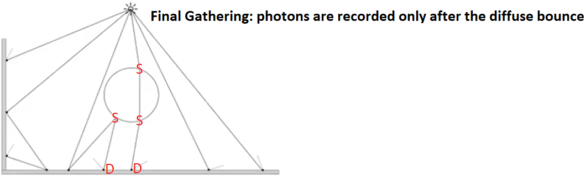
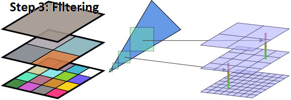
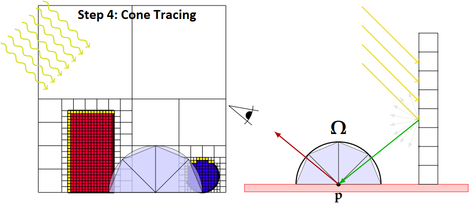
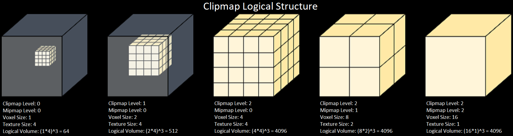
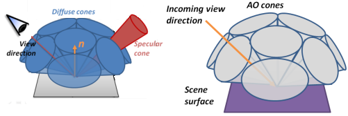

# VXGI (Voxel Global Illumintaion)  

## Photon Mapping  

By \[Jensen 1996\] and "16.2.2 Photon Mapping" of [PBRT-V3](https://pbr-book.org/3ed-2018/Light_Transport_III_Bidirectional_Methods/Stochastic_Progressive_Photon_Mapping#PhotonMapping), the **photon mapping** is composed of two-pass: the **photon pass** and the **rendering pass**. In the first pass (photon pass), the paths are traced from the light sources and the lighting of the interaction points on the surface are recorded as the photons. In the second pass (rendering pass), the paths are traced from the camera and the nearby photons of the interaction points are used to estimate the lighting.  
  
  

By "Progressive Photon Mapping" of [PBRT-V3](https://pbr-book.org/3ed-2018/Light_Transport_III_Bidirectional_Methods/Stochastic_Progressive_Photon_Mapping#x2-ProgressivePhotonMapping), the special case, where only the interaction points after the diffuse bounce are recorded as the photons in the photon pass, of the photon mapping is also called the **final gathering**.  
  

By \[Crassin 2011 B\], the idea of VXGI is to organize the photons by the voxels and to implement the "final gathering" by the following three steps: light injection, filtering and cone tracing. The first step (light injection) of the "final gathering" of VXGI is analogous to the first pass (photon pass) of photon mapping. The third step (cone tracing) of the "final gathering" of VXGI is analogous to the second pass (rendering pass) of photon mapping.  
  
  
  
  

## Voxelization  

### Clipmap  

TODO: by \[McLaren 2015\] and \[Eric 2017\], clipmap is better than SVO (sparse voxel octree).  

Clipmap Logical Structure

\[Panteleev 2014\]: "CLIPMAP VS. MIPMAP"  

Texture size (for zeroth mipmap level)  is the same for all clipmap levels, which is called that clipmap size  
The voxel size increses  
Only the last level has more than one mipmap levels (the logical volume remains the same within the same clipmap level)  

  

NVIDIA VXGI Implementation:  

Logical Structure:  
clipmap level 0-3: only one mipmap level  
clipmap level 4: mipmap 0-5 (6 levels)

Physical Structure:  
Texture3D 128\*128\*785  

3D Texture Depth Index | Clipmap Level Index | Mipmap Index | Voxel Size | Texture Size \(Voxel Count & 3D Texture Logical Width/Height\)  
:-: | :-: | :-: | :-: | :-: 
1 - 128   | 0   | 0   | 8    | 128   
131 - 258 | 1   | 0   | 16   | 128   
261 - 388 | 2   | 0   | 32   | 128   
391 - 518 | 3   | 0   | 64   | 128    
521 - 648 | 4   | 0   | 128  | 128 
651 - 714 | 4   | 1   | 256  | 64    
717 - 748 | 4   | 2   | 512  | 32    
751 - 766 | 4   | 3   | 1024 | 16     
769 - 776 | 4   | 4   | 2048 | 8     
779 - 782 | 4   | 5   | 4096 | 4     

3D Texture Depth Index | 3D Texture Equivalent Depth Index (Toroidal Address)  
:-: | :-:  
0   | 128
129 | 1    
130 | 258  
259 | 131   
260 | 388   
389 | 261    
390 | 518    
519 | 391    
520 | 648   
649 | 521   
650 | 714   
715 | 651    
716 | 748    
749 | 717    
750 | 766    
767 | 751    
768 | 776   
777 | 769    
778 | 782    
783 | 779    
784 | N/A    

### MSAA  

TODO: conservative rasterization  
TODO: simulate "conservative rasterization" by MSAA (\[Takeshige 2015\])  

## Light Injection  

TODO: not related to "ambient occlusion"  

## Filtering  

  

TODO: anisotropic voxel  

## Cone Tracing  

By [Additive Interval Property](https://en.wikipedia.org/wiki/Integral#Conventions), the ambient occlusion can be calculated as $\displaystyle \operatorname{k_A} = \int_\Omega \frac{1}{\pi}  \operatorname{V}(\overrightarrow{\omega_i}) (\cos \theta_i)^+ \, d \overrightarrow{\omega_i} = \frac{1}{\pi} \sum_{i=0}^{n} \left\lparen \int_{\Omega_i} \operatorname{V}(\overrightarrow{\omega_i}) (\cos \theta_i)^+ \, d \overrightarrow{\omega_i} \right\rparen$ where **n** is the number of cones, and $\displaystyle \Omega_i$ is the solid angle subtended by the **i**th cone.  
  
  
By \[Crassin 2011 B\], the visibility $\displaystyle \operatorname{V}(\overrightarrow{\omega_i})$ is assumed to be the same for all directions within the same cone, and the calculation of the ambient occlusion can be simplified as $\displaystyle \int_{\Omega_i} \operatorname{V}(\overrightarrow{\omega_i}) (\cos \theta_i)^+ \, d \overrightarrow{\omega_i} \approx \operatorname{V_c}(\Omega_i) \cdot \int_{\Omega_i} (\cos \theta_i)^+ \, d \overrightarrow{\omega_i}$ where $\displaystyle \operatorname{V_c}(\Omega_i) = 1 - \operatorname{A_{Final}}$ is the inverse of the final occlusion of the cone tracing.  

By "5.5.1 Integrals over Projected Solid Angle" of [PBRT-V3](https://pbr-book.org/3ed-2018/Color_and_Radiometry/Working_with_Radiometric_Integrals#IntegralsoverProjectedSolidAngle) and \[Heitz 2017\], the integral of the clamped cosine $\displaystyle \int_{\Omega_i} (\cos \theta_i)^+ \, d \overrightarrow{\omega_i}$ can be calculated as the projected area on the unit disk.  
  

By \[Crassin 2011 B\], the recursive form, which is similar to the "under operator" (\[Dunn 2014\]), can be used to calculated the final color $\displaystyle \operatorname{C_{Final}}$ and the final occlusion $\displaystyle \operatorname{A_{Final}}$ of the cone tracing.  
> $\displaystyle \operatorname{C_{Final}}(0) = 0$  
> $\displaystyle \operatorname{A_{Final}}(0) = 0$  
> $\displaystyle \operatorname{C_{Final}}(n + 1) = \operatorname{C_{Final}}(n) + (1 - \operatorname{A_{Final}}(n)) \cdot C_n$  
> $\displaystyle \operatorname{A_{Final}}(n + 1) = \operatorname{A_{Final}}(n) + (1 - \operatorname{A_{Final}}(n)) \cdot A_n$  

The explicit form of the final color $\displaystyle \operatorname{C_{Final}}$ and the final occlusion $\displaystyle \operatorname{A_{Final}}$ of the cone tracing can proved by mathematical induction.  
> Prove $\displaystyle \operatorname{A_{Final}}(n + 1) = 1 - \prod_{i = 0}^n (1 - A_i)$ by mathematical induction  
>  
>> Basis  
>> when n = 0  
>> $\displaystyle \text{left} = \operatorname{A_{Final}}(1) = \operatorname{A_{Final}}(0) + (1 - \operatorname{A_{Final}}(0)) \cdot A_0 = 0 + (1 - 0) \cdot A_0 = A_0$  
>> $\displaystyle \text{right} = 1 - (1 - A_0) = 0$  
>> left = right, the equation holds  
>   
>> Inductive step  
>> we assume that the proposition holds for n = k  
>> when n = k + 1  
>> $\displaystyle \text{left} = \operatorname{A_{Final}}((k + 1) + 1) = \operatorname{A_{Final}}(k + 1) + (1 - \operatorname{A_{Final}}(k + 1)) \cdot A_{k + 1} = (1 - \prod_{i = 0}^k (1 - A_i)) + (1 - (1 - \prod_{i = 0}^k (1 - A_i))) \cdot A_{k + 1} = 1 - \prod_{i = 0}^k (1 - A_i) - \prod_{i = 0}^k (1 - A_i) \cdot A_{k + 1} = 1 - \prod_{i = 0}^k (1 - A_i) (1 -  A_{k + 1}) = 1 - \prod_{i = 0}^{k + 1} (1 - A_i)$  
>> $\displaystyle \text{right} =  1 - \prod_{i = 0}^{k + 1} (1 - A_i)$  
>> left = right, the equation holds  
>  
> Prove $\displaystyle \operatorname{C_{Final}}(n + 1) = \sum_{i = 0}^{n} \left\lparen \prod_{Z_j \operatorname{Nearer} Z_i}(1 - A_j) \right\rparen \cdot C_i$ by mathematical induction  
>  
>> Basis  
>> when n = 0  
>> $\displaystyle \text{left} = \operatorname{C_{Final}}(1) = \operatorname{C_{Final}}(0) + (1 - \operatorname{A_{Final}}(0)) \cdot C_0 = 0 + (1 - 0) \cdot C_0 = C_0$  
>> $\displaystyle \text{right} = \sum_{i = 0}^{0} \left\lparen \prod_{Z_j \operatorname{Nearer} Z_i}(1 - A_j) \right\rparen \cdot C_i = \left\lparen \prod_{Z_j \operatorname{Nearer} Z_0}(1 - A_j) \right\rparen \cdot C_0 = 1 \cdot C_0 = C_0$  
>> left = right, the equation holds  
>   
>> Inductive step  
>> we assume that the proposition holds for n = k  
>> when n = k + 1  
>> $\displaystyle \text{left} = \operatorname{C_{Final}}((k + 1) + 1) = \operatorname{C_{Final}}(k + 1) + (1 - \operatorname{A_{Final}}(k + 1)) \cdot C_{k + 1} = \sum_{i = 0}^{k} \left\lparen \prod_{Z_j \operatorname{Nearer} Z_i}(1 - A_j) \right\rparen \cdot C_i + \left\lparen 1 - \left\lparen 1 - \prod_{i = 0}^{k} (1 - A_i)  \right\rparen \right\rparen \cdot C_{k + 1} = \sum_{i = 0}^{k} \left\lparen \prod_{Z_j \operatorname{Nearer} Z_i}(1 - A_j) \right\rparen \cdot C_i + \left\lparen \prod_{i = 0}^{k} (1 - A_i) \right\rparen \cdot C_{k + 1} = \sum_{i = 0}^{k} \left\lparen \prod_{Z_j \operatorname{Nearer} Z_i}(1 - A_j) \right\rparen \cdot C_i + \left\lparen \prod_{Z_j \operatorname{Nearer} Z_{k+1}} (1 - A_j) \right\rparen \cdot C_{k + 1} = \sum_{i = 0}^{k + 1} \left\lparen \prod_{Z_j \operatorname{Nearer} Z_i}(1 - A_j) \right\rparen \cdot C_i$  
>> $\displaystyle \text{right} = \sum_{i = 0}^{k + 1} \left\lparen \prod_{Z_j \operatorname{Nearer} Z_i}(1 - A_j) \right\rparen \cdot C_i$  
>> left = right, the equation holds  

  

Evidently, by \[McLaren 2015\], the cone tracing may NOT dectect the full occlusion which is the result of mutiple partial occlusions.  
  

## References  
\[Jensen 1996\] [Henrik Jensen. "Global Illumination using Photon Maps." EGSR 1996.](http://graphics.ucsd.edu/~henrik/papers/photon_map/)  
\[Jensen 2001\] [Henrik Jensen. "Realistic Image Synthesis Using Photon Mapping." AK Peters 2001.](http://www.graphics.stanford.edu/papers/jensen_book/)  
\[Crassin 2011 A\] [Cyril Crassin. "GigaVoxels: A Voxel-Based Rendering Pipeline For Efficient Exploration Of Large And Detailed Scenes." PhD Thesis 2011.](http://gigavoxels.inrialpes.fr/index.html)  
\[Crassin 2011 B\] [Cyril Crassin, Fabrice Neyret, Miguel Sainz, Simon Green, Elmar Eisemann. "Interactive Indirect Illumination Using Voxel Cone Tracing." SIGGRAPH 2011.](https://research.nvidia.com/publication/interactive-indirect-illumination-using-voxel-cone-tracing)  
\[Dunn 2014\] [Alex Dunn. "Transparency (or Translucency) Rendering." NVIDIA GameWorks Blog 2014.](https://developer.nvidia.com/content/transparency-or-translucency-rendering)   
\[Panteleev 2014\] [Alexey Panteleev. "Practical Real-Time Voxel-Based Global Illumination for Current GPUs." GTC 2014.](https://on-demand.gputechconf.com/gtc/2014/presentations/S4552-rt-voxel-based-global-illumination-gpus.pdf)  
\[McLaren 2015\] [James McLaren. "The Technology of The Tomorrow Children." GDC 2015.](http://fumufumu.q-games.com/archives/TheTechnologyOfTomorrowsChildrenFinal.pdf)  
\[Takeshige 2015\] [Masaya Takeshige. "The Basics of GPU Voxelization." NVIDIA GameWorks Blog 2015.](https://developer.nvidia.com/content/basics-gpu-voxelization)  
\[Eric 2017\] [Eric Arneback. “Comparing a Clipmap to a Sparse Voxel Octree for Global Illumination." Master thesis 2017.](https://erkaman.github.io/posts/masters_thesis.html)  
\[Heitz 2017\] [Eric Heitz. "Geometric Derivation of the Irradiance of Polygonal Lights." Technical report 2017.](https://hal.archives-ouvertes.fr/hal-01458129)  
