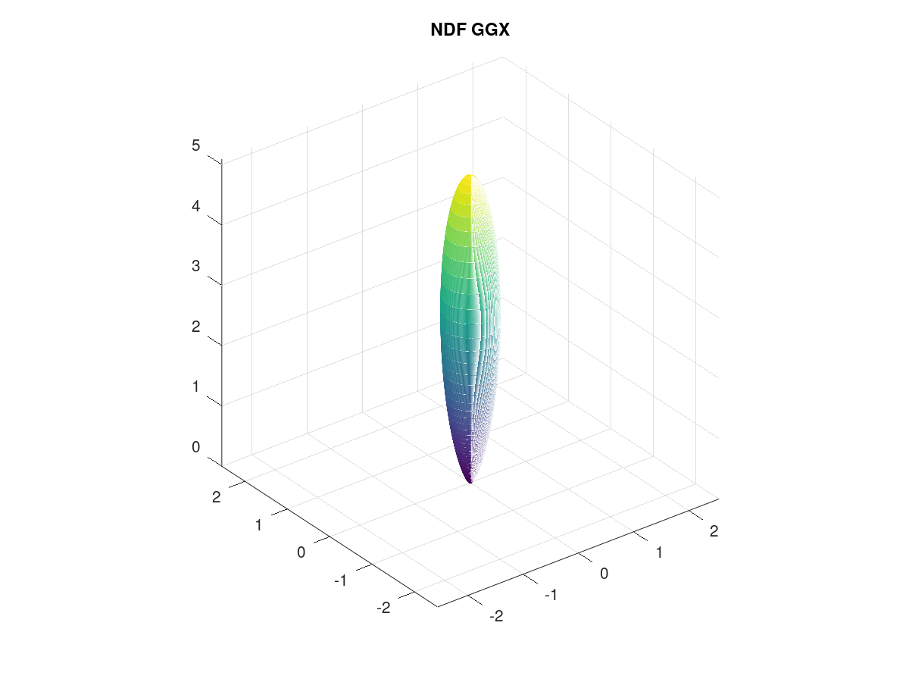

The following typical spherical distributions are plotted by the [GNU Octave](http://www.octave.org) which is an open source alternative to [MATLAB](https://www.mathworks.com/help/matlab/index.html).  

## NDF GGX

```MATLAB
# user-interface roughness parameter
r = 0.5;

# H = [h_x, h_y, h_z] is the half vector
# Usually, H is the 'm' in the NDF formulation
# And H is treated as the domain of the spherical distribution
[h_x, h_y, h_z] = sphere (256 - 1);

a = r * r;
a2 = a * a;

# H is in the tangent space where the N is (0, 0, 1)
NoH = h_z;

# https://github.com/EpicGames/UnrealEngine/blob/4.27/Engine/Shaders/Private/BRDF.ush#L318
# https://www.mathworks.com/help/matlab/matlab_prog/array-vs-matrix-operations.html
d = 1.0 + NoH .* (NoH .* a2 - NoH);
D_GGX = a2 ./ (pi .* d .* d);

# χ is the positive characteristic function
chi = NoH;
chi(chi > 0.0) = 1.0;
chi(chi <= 0.0) = 0.0;
D_GGX = chi .* D_GGX;

# surf(D_GGX .* h_x, D_GGX .* h_y, D_GGX .* h_z);
mesh(D_GGX .* h_x, D_GGX .* h_y, D_GGX .* h_z);
axis equal;
title ("NDF GGX");
```  



## VISIBILITY GGX

```MATLAB
# user-interface roughness parameter
r = 0.5;

# The Λ function
lambda =

# G2(l, v, m) = G1(m, v) /*masking*/ * G1(l, m) /*shadowing*/

# G1 = 1 / (1 + Λ(v))
```