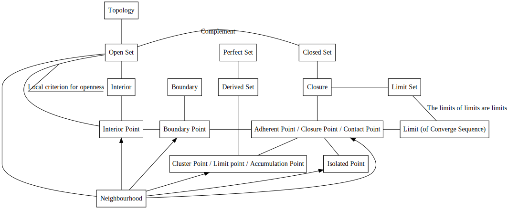

## License  
```  
Copyright (C) YuqiaoZhang

This program is free software: you can redistribute it and/or modify it under the terms of the GNU Lesser General Public License as published by the Free Software Foundation, either version 3 of the License, or (at your option) any later version.

This program is distributed in the hope that it will be useful, but WITHOUT ANY WARRANTY; without even the implied warranty of MERCHANTABILITY or FITNESS FOR A PARTICULAR PURPOSE.  See the GNU Lesser General Public License for more details.

You should have received a copy of the GNU Lesser General Public License along with this program.  If not, see <https://www.gnu.org/licenses/>
```  

Squeeze Theorem 夹逼准则  

### Boundedness Theorem 有界性定理  
\[Pugh 2015\] / 22 Theorem  
  
> Proof - Sketch  
> 1 we claim c = the Least Upper Bound of the set { x ∈ \[a,b\] : f(x) is bounded on \[a,x\] }  
> 2 we claim f(x) is bounded on \[a,c\] **NOTE since c can equal b, if the interval \[a,b\] were half-open \[a,b), we would have f(x) may not be continuous at c by applying b to c**  
> 3 we claim c = b  
>  
> Dependency  
> Least Upper Bound Property \# \[Pugh 2015\] / 2 Theorem  
> 函数极限的局部有界性 \# \[同济大学数学系 2014\] / 第一章 函数与极限 / 二、函数极限的性质/定律2（函数极限的局部有界性）  
>  

### Extreme Value Theorem 极值定理 // Maximum-Minimum Theorem 最大值最小值定理  
\[Pugh 2015\] / 23 Theorem  


### Intermediate Value Theorem 介值定理  

### Uniformly Continuous 一致连续性  
\[Pugh 2015\] / 1 RealNumbers / Exercises / 42  

$\displaystyle \sin (\frac{1}{x})$ is continuous on (0, 1) but not uniformly continuous 

for example $\displaystyle \varepsilon$=1.5 $\displaystyle \delta$=0.001 
let x=$\displaystyle \frac{\displaystyle 1}{\displaystyle 2000\pi+\frac{\displaystyle \pi}{\displaystyle 2}}$ y= $\displaystyle \frac{\displaystyle 1}{\displaystyle 2000\pi-\frac{\displaystyle \pi}{\displaystyle 2}}$ evidently \|x - y\|<0.001 and \|f(x) - f(y)\|=2>$\displaystyle \varepsilon$


## Topology  

  

### Cluster Point
cluster point: infinite  
\[Pugh 2015\] / 2 A Taste of Topology / 6 Other Metric Space Concepts / Clustering and Condensing /52 Theorem  

condensation point: uncountable number of points   

### Perfect Set 完成集  
Present Perfect 现在完成  

Perfect means being closed and having no isolated points  
\[Pugh 2015\] / 2 A Taste of Topology / 6 Other Metric Space Concepts / Perfect Metric Spaces / 56 Theorem  
ProofWiki / Equivalence of Definitions of Perfect Set  

\[Pugh 2015\] / 2 A Taste of Topology / 6 Other Metric Space Concepts / Perfect Metric Spaces / 57 Corollary  
> Proof - Sketch  
> NOTE "compact" implies "complete"  
> \[Pugh 2015\] / 2 A Taste of Topology / 7 Coverings / Total Boundedness / 66 Corollary  
> ProofWiki / Sequentially Compact Metric Space is Complete  

### Mapping (Topology)  
Inject 单射 / one-to-one 一一映射  
Surject 满射 / onto  
Biject 双射

### Continuous Mapping (Topology) 连续映射(拓扑)  
The sequential convergence preservation condition  
\[Pugh 2015\] / 2 A Taste of Topology / 2 Continuity / Definition  

The (ϵ, δ)-Condition  
\[Pugh 2015\] / 2 A Taste of Topology / 2 Continuity / The (ϵ, δ)-Condition / 4 Theorem  
ProofWiki / Sequential Continuity is Equivalent to Continuity in the Reals  
ProofWiki / Continuous Mapping is Sequentially Continuous  

The sequential convergence preservation condition (Improved)
\[Pugh 2015\] / 2 A Taste of Topology / Exercises / 13  
> Proof - Sketch  
> we construct (pn) such that pn = q + 1/n as "4 Theorem //The (ϵ, δ)-Condition"  
> suppose (f(pn)) doesn't converge to f(p), we construct (qn) such that q2n = q and q2n-1 = pn which impies (qn) converges to q while (f(qn)) doesn't converge //Contradiction! 
>  

### Homeomorphism 同胚 / homeomorphic 同胚的  
\[Pugh 2015\] / Figure 31  
The inverse of continuous bijection may not be continuous.  
  
\[Pugh 2015\] / Figure 32  
Trefoil Knot 三叶结  
Torus 环面  

Circle - Trefoil Knot - Square //**Attention:** Square vs Sphere  
Donut(2-Torus) - Coffee Cup  
//Unit Interval - Closed Unit Disk //Pending?  

ProofWiki / Trefoil Knot is Homeomorphic to Circle  
ProofWiki / Jokes / Coffee and Doughnuts  

The "**bijection**" means the "**equinumerous**" while the "**homeomorphic**" means not only the "**equinumerous**" but also the "**continuous**"  

### Limit  
\[Pugh 2015\] / 2 A Taste of Topology / Convergent Sequences and Subsequences  

Limit Point 极点 / Cluster Point 聚点 / Accumulation Point //**Attention:** Limit Point vs Limit of Sequence  
Isolated Point 孤立点  
Adherent Point 附着点 //Adherent Point ⇔ Limit (of Sequence) \[Pugh 2015\]  
\[Pugh 2015\] / 2 A Taste of Topology / 3 The Topology of a Metric Space / 5 Theorem  
($\displaystyle p_n$) converges to p ⇒ p is the adherent point  
ProofWiki / Closure of Subset of Metric Space by Convergent Sequence  

### Closed Set / Open Set  

\[Pugh 2015\] / 2 A Taste of Topology / 3 The Topology of a Metric Space / Definition //Open Set  

Open sets are unions of its r-neighborhoods  
\[Tu 2011\] / Local criterion for openness  
ProofWiki / Interior of Open Set  
ProofWiki / Equivalence of Definitions of Interior  
~~ProofWiki / Set is Open iff Neighborhood of all its Points~~  

Complement //[a, b] is closed since [a, b] is the complement of the open set ($\displaystyle -\infin$, b) $\displaystyle \cup$ (a, $\displaystyle +\infin$)  
//{0} $\displaystyle \cup$ {$\displaystyle \frac{1}{n}$ : n ∈ N} is closed since {0} $\displaystyle \cup$ {$\displaystyle \frac{1}{n}$ : n ∈ N} is the complement of the open set ($\displaystyle -\infin$, 0) $\displaystyle \cup$ (0, $\displaystyle \frac{1}{n}$) $\displaystyle \cup$ ($\displaystyle \frac{1}{n}$, $\displaystyle \frac{1}{n-1}$) $\displaystyle \cup$ ... $\displaystyle \cup$ ($\displaystyle \frac{1}{2}$, 1) //**NOTE** although {$\displaystyle \frac{1}{n}$} n ∈ N is closed, we can't infer the result by union since the closed set demands **Finite** union  

### Topology //induced by Metric  
union / **Finite** Intersection -produces-> Open Set  
\[Pugh 2015\] / 2 A Taste of Topology / 3 The Topology of a Metric Space / 6 Theorem  

Allow **Infinite** union //$(a, +\infin)$ is open since $(a, +\infin) = \displaystyle \bigcup_{n \isin \N} (a+\frac{1}{n}, n)$  

**Finite** Intersection //$\displaystyle \bigcap_{n \isin \N} (1-\frac{1}{n}, 2+\frac{1}{n})$=\[1,2\]  
//**Minimum of Infinite set may be undefined**   
ProofWiki / Definition:Min Operation  
ProofWiki / Definition:Operation/N-Ary Operation  
//**Minimum of Infinite set may not exist**  
//r = min{1, $\displaystyle \frac{1}{2}$, $\displaystyle \frac{1}{3}$, ... , $\displaystyle \frac{1}{n}$} n ∈ N ⇒ there doesn't exist such r  
//proof by contradiction  
//by archimedean property, we would find a number less than r if r were greater than 0  
//and thus we would have r is not the minimum  
  
Intersection / **Finite** union -produces-> Open Set  

The limits of limits are limits  
\[Pugh 2015\] / 2 A Taste of Topology / 3 The Topology of a Metric Space / 8 Theorem  
> choose $\displaystyle q_n$ from S (not from limS)  

Closure ⇔ Limit Set \[Pugh 2015\]  
Idempotent //lim(limS) = limS  
\[Pugh 2015\] / 2 A Taste of Topology / 3 The Topology of a Metric Space / 10 Corollary
> S ⊂ K ⇒ Limit(Adherent Point) of S ⊂ Limit(Adherent Point) of K    

\[Tu 2011\] / Appendices / A Point-Set Topology / Definition A.56 The sequence lemma  


### Continuous Mapping (Topology) 连续映射(拓扑)  
//**TODO** above "Continuous Mapping (Topology) 连续映射(拓扑)" move here  

PreImage 原像 //Inverse Image 逆像 //inverse map f-1 may not exist  
Annulus 环形  

\[Pugh 2015\] / 2 A Taste of Topology / 3 The Topology of a Metric Space / Topological Description of Continuity / 11 Theorem  

The closed set condition  
> Proof - Sketch  
> K is closed in N. To prove $\displaystyle \operatorname{{f}^{pre}}$(K) is closed in M,  we assume ($\displaystyle p_n$) /\* $\displaystyle p_n$ $\displaystyle \isin$ $\displaystyle \operatorname{{f}^{pre}}$(K) \*/ converges to p and it suffices to prove p $\displaystyle \isin$ $\displaystyle \operatorname{{f}^{pre}}$(K).  
> f(p) $\displaystyle \isin$ K /\* which implies p $\displaystyle \isin$ $\displaystyle \operatorname{{f}^{pre}}$(K) \*/ since (f($\displaystyle p_n$)) converges to f(p) in N and K is closed.  

The open set condition //As the defination in general topology  
> Proof - Sketch  
> construct $\displaystyle N_\epsilon$f(p) /\* ϵ-neighbourhood of f(p) in N \*/ which is open in N  
> $\displaystyle \operatorname{{f}^{pre}}$($\displaystyle N_\epsilon$f(p)) is open in M and p $\displaystyle \isin$ $\displaystyle \operatorname{{f}^{pre}}$($\displaystyle N_\epsilon$f(p))  
> exists δ such that δ-neighbourhood of p $\displaystyle \subset$ $\displaystyle \operatorname{{f}^{pre}}$($\displaystyle N_\epsilon$f(p))  

\[Pugh 2015\] / 2 A Taste of Topology / 3 The Topology of a Metric Space / Topological Description of Continuity / 12 Corollary  
Homeomorphism $\displaystyle \Leftrightarrow$ Topological Equivalence  

\[Pugh 2015\] / 2 A Taste of Topology / Exercise / 28  
Open Mapping 开映射  

continous mapping may not send open sets to open sets  
$\displaystyle \operatorname{f^{-1}}$ is continous $\displaystyle \Rightarrow$ f is open //open mapping  

### Inheritance 继承 
Subspace 子空间  
Relatively Open/Closed Set 相对开/闭集  
\[Pugh 2015\] / 2 A Taste of Topology / 3 The Topology of a Metric Space / Inheritance / 13 Inheritance Principle  
\[Pugh 2015\] / 2 A Taste of Topology / 3 The Topology of a Metric Space / Inheritance / 14 Corollary  
//induce subspace?  

\[Pugh 2015\] / 2 A Taste of Topology / 3 The Topology of a Metric Space / Inheritance / 15 Corollary  
Assume N is a subspace of M, we have that sets open relative to N may not be open relative to M.  
However, **if N is open**, sets open relative to N and sets open relative to M can be deduced by each other.

### Product 积
Product Topology 积拓扑  

define the basis  
\[Tu 2011\] / Appendices / A Point-Set Topology / A.6 Product Topology  

dsum //Taxicab Metric //Manhattan Metric //p=1  
dE //Euclidean Metric //p=2  
dmax //Chebyshev Distance //p=$\displaystyle \infty$  
ProofWiki / Definition:P-Product Metric  
ProofWiki / Chebyshev Distance is Limit of P-Product Metric //Squeeze Theorem  

\[Tu 2011\] / Appendices / A Point-Set Topology / A.6 Product Topology / 16 Proposition  
> Proof - Sketch  
> We have that "$\displaystyle \sqrt{ {d_{M1}(p_{1n},p_1)}^2 + {d_{M2}(p_{2n},p_2)}^2 } < \varepsilon$" $\displaystyle \Rightarrow$ "$\displaystyle d_{M1}(p_{1n},p_1)<\varepsilon$" $\displaystyle \land$ "$\displaystyle d_{M2}(p_{2n},p_2)<\varepsilon$" since "$\displaystyle {d_{M1}(p_{1n},p_1)}^2 > 0$" $\displaystyle \land$ "$\displaystyle {d_{M2}(p_{2n},p_2)}^2 > 0$"//$\displaystyle \forall x \isin \R, x^2 > 0$


\[Pugh 2015\] / 2 A Taste of Topology / 3 The Topology of a Metric Space / Product Metrics / 20 Theorem  
~~ProofWiki / Distance Function of Metric Space is Continuous~~  
> Since the d is a metric (proof is omitted by [\[Pugh 2015\]]), the triangle inequality follows.  


unit disc dmax-square dsum-rhombus

## Metric 度量

  

### Completeness 完备性  

Cauchy's Convergence Test 柯西收敛准则 / Cauchy Completeness 柯西完备性  
\[Pugh 2015\] / 1 Real Numbers / 2 Cuts / Cauchy sequences / 5 Theorem  
> Proof - Sketch  
> let b = LUB and we have there exist infinitely many $\displaystyle a_n$ such that |$\displaystyle a_n$ - b| < $\displaystyle \frac{\varepsilon}{2}$  
> since there are infinitely many of these $\displaystyle a_n$, for each N, we pick one $\displaystyle a_{n0}$ from these $\displaystyle a_n$ and then we have that there exists $\displaystyle a_{n0}$ such that |$\displaystyle a_{n0}$ - b| < $\displaystyle \frac{\varepsilon}{2}$  
> then |$\displaystyle a_n$ - b| $\displaystyle \le$ |$\displaystyle a_n$ - $\displaystyle a_{n0}$| + |$\displaystyle a_{n0}$ - b| = $\displaystyle \frac{\varepsilon}{2}$ + $\displaystyle \frac{\varepsilon}{2}$ = $\displaystyle \varepsilon$


Evidently, by triangle inequality, convergence $\displaystyle \Rightarrow$ cauchy sequence  
Completeness $\displaystyle \Rightarrow$ ( cauchy sequence $\displaystyle \Rightarrow$ convergence )  
\[Pugh 2015\] / 2 A Taste of Topology / 3 The Topology of a Metric Space / Completeness   

By the Cauchy's Convergence Test, R is complete, then we have that $\displaystyle R^m$ is complete  
\[Pugh 2015\] / 2 A Taste of Topology / 3 The Topology of a Metric Space / Completeness / 23 Theorem  
ProofWiki / Euclidean Space is Complete Metric Space  


**close** subspace of complete metric space $\displaystyle \Rightarrow$ complete  
by the relationship between limit and closure  
\[Pugh 2015\] / 2 A Taste of Topology / 3 The Topology of a Metric Space / Completeness / 24 Theorem  

The completeness involves **metric** and is undefined in the topology space  
The completeness is not a topological property // can't be propagated by the homeomorphic  
ProofWiki / Definition:Topological Property   

### (Covering) Compactness (覆盖)紧性  

\[Pugh 2015\] / 2 A Taste of Topology / 6 Other Metric Space Concepts / Coverings   

Defined in topology space  
(finite or infinite)open cover has finite subcover  //"has" means "reduce"  


reduce //infinite/finite cover to finite cover  
Proofwiki / Definition:Subcover  

a cover consists of scraps/patches  

For metric space, compact $\displaystyle \Leftrightarrow$ sequentially compact, and thus \[Pugh 2015\] doesn't distinguish them  
\[Pugh 2015\] / 2 A Taste of Topology / 7 Coverings
 / 63 Theorem  
ProofWiki / Sequentially Compact Metric Space is Compact  
ProofWiki / Compact Subspace of Metric Space is Sequentially Compact in Itself  
ProofWiki / Compact Space is Countably Compact  
ProofWiki / Countably Compact Metric Space is Sequentially Compact  

### Boundedness 有界性  

\[Pugh 2015\] / 2 A Taste of Topology / 6 Other Metric Space Concepts / Boundedness  

### Total Boundedness 全有界性

\[Pugh 2015\] / 2 A Taste of Topology / 7 Coverings / Total Boundedness  

discrete metric  
a discrete metric with 4 elements can be comprehended as a regular tetrahedron  
since d(x,y) = 1 (x $\displaystyle \ne$ y), **infinite discrete metric is bounded** //not totally bounded  

### Sequentially Compactness 列紧性    

Defined in metric space  
(infinite) sequence has convergent subsequence  

To reduce the infinite to the finite //closed and bounded ???  

Evidently, empty set and finite sets are trivial (sequentially) compact  

NOTE "compact" implies "complete"  
\[Pugh 2015\] / 2 A Taste of Topology / 7 Coverings / Total Boundedness / 66 Corollary  
ProofWiki / Sequentially Compact Metric Space is Complete  

Heine-Borel Theorem/Metric Space 海涅-博雷尔定理/度量空间  
For metric space, compact $\displaystyle \Leftrightarrow$ complete $\displaystyle \land$ totally bounded  
ProofWiki / Heine-Borel Theorem/Metric Space  
\[Pugh 2015\] / 2 A Taste of Topology / 7 Coverings / Total Boundedness / 66 Corollary  

The "Boundedness" haven't been defined in this section  
We should reference the \[Pugh 2015\] / 2 A Taste of Topology / 6 Other Metric Space Concepts / Boundedness  

Heine-Borel Theorem/Euclidean Space 海涅-博雷尔定理/欧几里得空间  
For euclidean space, compact $\displaystyle \Leftrightarrow$ closed $\displaystyle \land$ totally bounded  
> Proof - Sketch - \[Pugh 2015\]  
>  
> Sufficient Condition  
We claim that the closed interval [a, b] ⊂ R is compact. // \[Pugh 2015\] / 2 A Taste of Topology / 3 The Topology of a Metric Space / Compactness / 27 Theorem  
We claim that every box [a1 , b1 ] × · · · × [am , bm ] in Rm is compact. // \[Pugh 2015\] / 2 A Taste of Topology / 3 The Topology of a Metric Space / Compactness / 30 Corollary // ProofWiki / Tychonoff's Theorem  
  We claim that every closed subset of a compact is compact. // \[Pugh 2015\] / 2 A Taste of Topology / 3 The Topology of a Metric Space / Compactness / 32 Theorem  
Since A is bound, there exists a box in Rm and A is a subset of Rm.  
Since A is close, by 32 Theorem, we have that every closed and bounded subset of Rm is compact // \[Pugh 2015\] / 2 A Taste of Topology / 3 The Topology of a Metric Space / Compactness / 33 Theorem 
>  
> Necessary Condition  
We claim that every compact set is closed and bounded. / \[Pugh 2015\] / 2 A Taste of Topology / 3 The Topology of a Metric Space / Compactness / 26 Theorem  
ProofWiki / Metric Space is Hausdorff  
ProofWiki / Compact Subspace of Hausdorff Space is Closed  
ProofWiki / Compact Metric Space is Totally Bounded  
ProofWiki / Totally Bounded Metric Space is Bounded  

ProofWiki / Limit of Subsequence equals Limit of Sequence/Metric Space  

> Proof - Sketch - ProofWiki  
Since  
ProofWiki / Euclidean Space is Complete Metric Space  
ProofWiki / Subspace of Complete Metric Space is Closed iff Complete
ProofWiki / Totally Bounded Metric Space is Bounded  
ProofWiki / Bounded Subspace of Euclidean Space is Totally Bounded
ProofWiki / Heine-Borel Theorem/Metric Space  
We have that  
ProofWiki / Heine-Borel Theorem/Euclidean Space  

Note that the closed and bounded subset of a general metric space may fail to be compact.  
missing 1\.complete 2\.totally bounded  

discrete metric  
a discrete metric with 4 elements can be comprehended as a regular tetrahedron  
since d(x,y) = 1 (x $\displaystyle \ne$ y), **infinite discrete metric is bounded** //not totally bounded  
however, no subsequence of 1,2,3,4,... convergences  

Bolzano-Weierstrass Theorem 波尔查诺-维尔斯特拉斯定理   
\[Pugh 2015\] / 2 A Taste of Topology / 3 The Topology of a Metric Space / Compactness / 31 Theorem  
This theorem is merely a simple fact about compacts(the box in Rm)  
> Proof - Sketch  
Since the sequence is bounded, there exists a box in Rm and the sequence is in the box.  
By 30 Corollary, the box in Rm is sequentially compact.  
By the definition of sequentially compactness, we have the proof.  
  
// ProofWiki / Compact Space satisfies Finite Intersection Axiom  
// ProofWiki / Intersection of Closed Set with Compact Subspace is Compact  

\[Pugh 2015\] / 2 A Taste of Topology / 4 Compactness / Continuity and Compactness / 36 Theorem  
ProofWiki / Continuous Image of Compact Space is Compact  
  
This theorem generalizes the **"Extreme Value Theorem"/"Maximum-Minimum Theorem"**  
since the closed interval [a, b] is compact  
f([a, b]) is compact and then is bounded  
\[Pugh 2015\] / 2 A Taste of Topology / 4 Compactness / Continuity and Compactness / 37 Corollary  

Topological Property //Bicompactness(originally called)  
ProofWiki / Definition:Topological Property   
\[Pugh 2015\] / 2 A Taste of Topology / 4 Compactness / Continuity and Compactness / 38 Theorem  

The closed interval \[a, b\] is equinumerous to R while \[a, b\] and R are not homeomorphic.  
\[Pugh 2015\] / 1 RealNumbers / 4 Cardinality / 11 Corollary  
\[Pugh 2015\] / 2 A Taste of Topology / 4 Compactness / Continuity and Compactness / 39 Corollary  
//not continous  
the open interval is homeomorphic to R  

compact $\displaystyle \Rightarrow$ ( continous bijection $\displaystyle \Rightarrow$ homeomorphism )  
//note that the compact is necessary  


ProofWiki / Definition:Embedding (Topology)  
ProofWiki / Continuous Bijection from Compact to Hausdorff is Homeomorphism/Corollary  

uniformly continuous  
\[Pugh 2015\] / 1 Real Numbers / 42  
ProofWiki / Continuous Function on Compact Space is Uniformly Continuous  

### Connectedness 连通性  
Proper Subset 真子集  

Topological Property  
\[Pugh 2015\] / 2 A Taste of Topology / 5 Connectedness / 44 Corollary  

This theorem generalizes the **"Intermediate Value Theorem"**  
ProofWiki / Intermediate Value Theorem (Topology)  
\[Pugh 2015\] / 2 A Taste of Topology / 5 Connectedness / 45 Corollary  

related to the Inheritance Principle  
\[Pugh 2015\] / 3 The Topology of a Metric Space / Inheritance / 13 Inheritance Principle
  
Generally, the seperation of the subspace can't deduce the seperation of original space  
However, it can decude the space included by the closure  
\[Pugh 2015\] / 2 A Taste of Topology / 5 Connectedness / 49 Theorem  

### Arithmetic in R is continuous  
Since the domain of the arithmetic in R is R $\displaystyle \times$ R  
We would use the propositions in \[Pugh 2015\] / 2 A Taste of Topology / 3 The Topology of a Metric Space / Product Metrics  

## Reference  
\[Pugh 2015\] Charles Pugh. "Real Mathematical Analysis, Second Edition." Springer 2015.  
\[Tu 2011\] Loring Tu. "An Introduction to Manifolds, Second Edition." Springer 2011.  
~~\[同济大学数学系 2014\] 同济大学数学系. "高等数学 第七版." 高等教育出版社 2014.~~   
