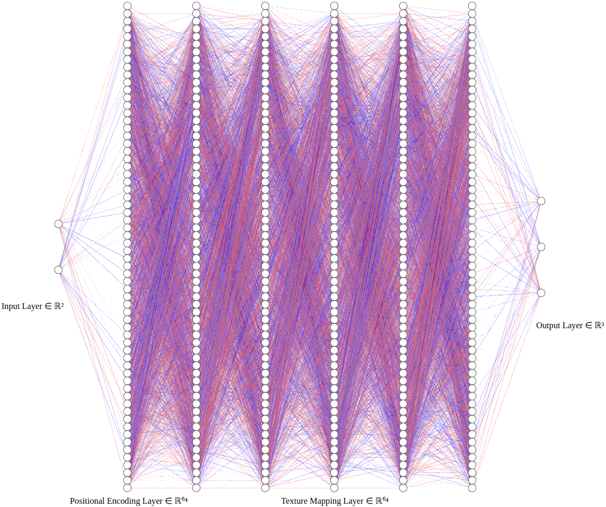

# Neural Texture Mapping

The idea is to represent the 2D texture by the neural network: $\displaystyle \begin{pmatrix} U & V \end{pmatrix} \rightarrow \begin{pmatrix} R & G & B \end{pmatrix}$.  

## Positional Encoding  

```python
NUM_FREQUENCIES = 16

class PositionalEncodingLayer(tensorflow.keras.layers.Layer):
    def __init__(self, num_frequencies, **kwargs):
        super(PositionalEncodingLayer, self).__init__(**kwargs)
        self.num_frequencies = num_frequencies

    def call(self, inputs):
        encoded = []
        for i in range(self.num_frequencies):
            encoded.append(tensorflow.math.sin((1 << i) * tensorflow.constant(numpy.pi) * inputs))
            encoded.append(tensorflow.math.cos((1 << i) * tensorflow.constant(numpy.pi) * inputs))
        return tensorflow.concat(encoded, axis=-1)

    def get_config(self):
        config = super(PositionalEncodingLayer, self).get_config()
        config.update({"num_frequencies": self.num_frequencies})
        return config

assert PositionalEncodingLayer(num_frequencies=NUM_FREQUENCIES)(tensorflow.random.uniform((7, 2))).shape == (7, NUM_FREQUENCIES * 4)
```

## Model  

  

```python
NUM_FREQUENCIES = 16
NUM_NEURONS_PER_TEXTURE_MAPPING_LAYER = 64
NUM_TEXTURE_MAPPING_LAYERS = 5

keras_model = tensorflow.keras.models.Sequential()
keras_model.add(tensorflow.keras.layers.InputLayer(shape=(2,)))
keras_model.add(PositionalEncodingLayer(num_frequencies=NUM_FREQUENCIES))
for i in range(NUM_HIDDEN_LAYERS):
    keras_model.add(tensorflow.keras.layers.Dense(NUM_NEURONS_PER_TEXTURE_MAPPING_LAYER, activation="relu"))
keras_model.add(tensorflow.keras.layers.Dense(3, activation="linear"))
```

## References  

\[Boksansky 2024\] [Jakub Boksansky. "Crash Course in Deep Learning (for Computer Graphics)." AMD GPUOpen 2024.](https://gpuopen.com/learn/deep_learning_crash_course/)  
