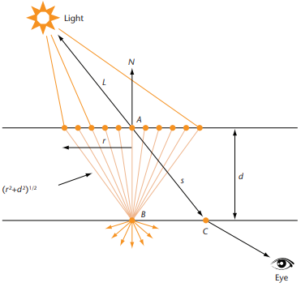

# Subsurface Scattering  

## 1\. Diffusion Profile  

The **diffusion profile** $\displaystyle \operatorname{R}(\Delta x, \Delta y, (\Delta z))$ by "14.4.2 Rendering with Diffusion Profile" of \[dEon 2007\] is called the **scattering profile** $\displaystyle \operatorname{S_p}(\overrightarrow{p_o}, \overrightarrow{p_i})$ by "Equation \(11.6\)" of [PBR Book](https://pbr-book.org/3ed-2018/Volume_Scattering/The_BSSRDF#eq:separable-bssrdf) and is called the **radial (scattering) profile** $\displaystyle \operatorname{S_r}(\| \overrightarrow{p_i} - \overrightarrow{p_o} \|)$ by "Equation \(11.9\)" of [PBR Book](https://pbr-book.org/3ed-2018/Volume_Scattering/The_BSSRDF#eq:distance-bssrdf).  

By "Advantages of a Sum-of-Gaussians Diffusion Profile" of \[dEon 2007\] and "Equation \(11.9\)" of [PBR Book](https://pbr-book.org/3ed-2018/Volume_Scattering/The_BSSRDF#eq:distance-bssrdf), by assuming the material is homogeneous, the diffusion profile is isotropic (radially symmetric). This means that the diffusion profile can be reduced to the 1D function $\displaystyle \operatorname{R}(\Delta x, \Delta y, (\Delta z)) = \operatorname{R}(\sqrt{{\Delta x}^2 +{\Delta y}^2 (+ {\Delta z}^2)}) = \operatorname{R}(r) = \operatorname{R}(\| \overrightarrow{p_i} - \overrightarrow{p_o} \|)$ and $\displaystyle \operatorname{S_p}(\overrightarrow{p_o}, \overrightarrow{p_i}) = \operatorname{S_r}(\| \overrightarrow{p_i} - \overrightarrow{p_o} \|)$.  

By the "Equation \(11.7\)" of [PBR Book](https://pbr-book.org/3ed-2018/Volume_Scattering/The_BSSRDF#eq:separable-bssrdf-directional), the general BSSRDF term $\displaystyle \operatorname{S}(\overrightarrow{p_o}, \overrightarrow{\omega_o}, \overrightarrow{p_i}, \overrightarrow{\omega_i})$ is factored into spatial and directional components which can be integrated independently from each other. And the calculation of the subsurface scattering can be simplified as $\displaystyle \operatorname{L_o}(\overrightarrow{p_o}, \overrightarrow{\omega_o}) = \int_{{\mathbb{R}}^2} \left\lparen \int_\Omega \operatorname{S}(\overrightarrow{p_o}, \overrightarrow{\omega_o}, \overrightarrow{p_i}, \overrightarrow{\omega_i}) \operatorname{L_i}(\overrightarrow{p_i}, \overrightarrow{\omega_i}) {(\cos \theta_i)}^+ \, d \overrightarrow{\omega_i} \right\rparen \, d \overrightarrow{p_i} \approx (1 - \operatorname{F_r}(\cos \theta_o)) \left\lparen \int_{{\mathbb{R}}^2} \operatorname{R}(\| \overrightarrow{p_i} - \overrightarrow{p_o} \|) \left\lparen \int_\Omega \frac{1 - \operatorname{F_r}(\cos \theta_i)}{c}  \frac{1}{\pi} \operatorname{L_i}(\overrightarrow{p_i}, \overrightarrow{\omega_i}) {(\cos \theta_i)}^+ \, d \overrightarrow{\omega_i} \right\rparen \, d \overrightarrow{p_i} \right\rparen$ where $\displaystyle \operatorname{F_r}(\cos \theta))$ is the Fresnel term and $\displaystyle c = 1 - 2 \int_0^{\frac{\pi}{2}} \operatorname{F_r}(\cos \theta)) \sin \theta \cos \theta \, d \theta$ is the the first moment of the Fresnel term.  

By "SSS-NOTE-TRSM" of [Unity3D](https://github.com/Unity-Technologies/Graphics/blob/v10.8.0/com.unity.render-pipelines.high-definition/Runtime/Material/Lit/Lit.hlsl#L1330), it is too inefficient to apply the first Fresnel term $\displaystyle 1 - \operatorname{F_r}(\cos \theta_o)$ after the diffusion profile term $\operatorname{R}(\| \overrightarrow{p_i} - \overrightarrow{p_o} \|)$. And the calculation of the subsurface scattering is further simplified as $\displaystyle \operatorname{L_o}(\overrightarrow{p_o}, \overrightarrow{\omega_o}) = (1 - \operatorname{F_r}(\cos \theta_o)) \left\lparen \int_{{\mathbb{R}}^2} \operatorname{R}(\| \overrightarrow{p_i} - \overrightarrow{p_o} \|) \left\lparen \int_\Omega \frac{1 - \operatorname{F_r}(\cos \theta_i)}{c} \frac{1}{\pi} \operatorname{L_i}(\overrightarrow{p_i}, \overrightarrow{\omega_i}) {(\cos \theta_i)}^+ \, d \overrightarrow{\omega_i} \right\rparen \, d \overrightarrow{p_i} \right\rparen \approx \int_{{\mathbb{R}}^2} \operatorname{R}(\| \overrightarrow{p_i} - \overrightarrow{p_o} \|) \left\lparen \int_\Omega (1 - \operatorname{F_r}(\cos \theta_o)) \frac{1 - \operatorname{F_r}(\cos \theta_i)}{c} \frac{1}{\pi} \operatorname{L_i}(\overrightarrow{p_i}, \overrightarrow{\omega_i}) {(\cos \theta_i)}^+ \, d \overrightarrow{\omega_i} \right\rparen \, d \overrightarrow{p_i} = \int_{{\mathbb{R}}^2} \operatorname{R}(\| \overrightarrow{p_i} - \overrightarrow{p_o} \|) \operatorname{F}(\overrightarrow{p_i}, \overrightarrow{\omega_o}) \, d \overrightarrow{p_i}$ where $\displaystyle \operatorname{F}(\overrightarrow{p_i}, \overrightarrow{\omega_o}) = \int_\Omega (1 - \operatorname{F_r}(\cos \theta_o)) \frac{1 - \operatorname{F_r}(\cos \theta_i)}{c} \frac{1}{\pi} \operatorname{L_i}(\overrightarrow{p_i}, \overrightarrow{\omega_i}) {(\cos \theta_i)}^+ \, d \overrightarrow{\omega_i}$ is the form factor. Although the terms **irradiance E** and **form factor F** may be interchangeably used, technically **irradiance E** should NOT be divided by $\displaystyle \pi$. This means that $\displaystyle \operatorname{E} = \pi \operatorname{F}$.  

Analogously to "Figure 13.10" of [PBR Book](https://pbr-book.org/3ed-2018/Monte_Carlo_Integration/2D_Sampling_with_Multidimensional_Transformations#SamplingaUnitDisk), we have the norm of the diffusion profile $\displaystyle \| \operatorname{R}({\Delta x}, {\Delta y}) \| = \int_{-\infin}^\infin \int_{-\infin}^\infin \operatorname{R}({\Delta x}, {\Delta y}) \, d {\Delta x} d {\Delta y} = \int_0^\infin \int_0^{2\pi} \operatorname{R}(r) r \, d \theta dr = \int_0^\infin \operatorname{R} (r) 2 \pi r \, dr$. The norm of the diffusion profile is called the **total diffuse reflectance** $\displaystyle R_d$ by "Incorporating Diffuse Color Variation" of \[dEon 2007\] and is called the **effective albedo** $\displaystyle {\rho}_{eff}$ by "Equation \(11.11\)" of [PBR Book](https://pbr-book.org/3ed-2018/Volume_Scattering/The_BSSRDF#eq:bssrdf-effective-albedo). Evidently, the diffusion profile depends on the position, since the total diffuse reflectance depends on the position. This means that the calculation of the subsurface scattering should technically be written as $\displaystyle \displaystyle \operatorname{L_o}(\overrightarrow{p_o}, \overrightarrow{\omega_o}) = \int_{{\mathbb{R}}^2} \operatorname{R}(\| \overrightarrow{p_i} - \overrightarrow{p_o} \|) \operatorname{F}(\overrightarrow{p_i}, \overrightarrow{\omega_o}) \, d \overrightarrow{p_i} = \int_{{\mathbb{R}}^2} \operatorname{R_{\overrightarrow{p_i}}}(\| \overrightarrow{p_i} - \overrightarrow{p_o} \|) \operatorname{F}(\overrightarrow{p_i}, \overrightarrow{\omega_o}) \, d \overrightarrow{p_i}$. However, it is too difficult to calculate the subsurface scattering if the diffusion profile varies between the positions. Thus, we resort to use the normalized diffusion profile $\displaystyle \operatorname{R_N}(\| \overrightarrow{p_i} - \overrightarrow{p_o} \|) = \frac{\operatorname{R_{\overrightarrow{p_i}}}(\| \overrightarrow{p_i} - \overrightarrow{p_o} \|)}{\| \operatorname{R_{\overrightarrow{p_i}}}(\| \overrightarrow{p_i} - \overrightarrow{p_o} \|) \|} = \frac{\operatorname{R_{\overrightarrow{p_i}}}(\| \overrightarrow{p_i} - \overrightarrow{p_o} \|)}{\operatorname{R_d}(\overrightarrow{p_i})}$ which is assumed to be the same at each postion. And the calculation of the subsurface scattering is further simplified as $\displaystyle \operatorname{L_o}(\overrightarrow{p_o}, \overrightarrow{\omega_o}) = \int_{{\mathbb{R}}^2} \operatorname{R_{\overrightarrow{p_i}}}(\| \overrightarrow{p_i} - \overrightarrow{p_o} \|) \operatorname{F}(\overrightarrow{p_i}, \overrightarrow{\omega_o}) \, d \overrightarrow{p_i} = \int_{{\mathbb{R}}^2} \operatorname{R_N}(\| \overrightarrow{p_i} - \overrightarrow{p_o} \|) \operatorname{R_d}(\overrightarrow{p_i}) \operatorname{F}(\overrightarrow{p_i}, \overrightarrow{\omega_o}) \, d \overrightarrow{p_i}$.  

According to $\displaystyle \operatorname{L_o}(\overrightarrow{p_o}, \overrightarrow{\omega_o}) = \int_{{\mathbb{R}}^2} \operatorname{R_N}(\| \overrightarrow{p_i} - \overrightarrow{p_o} \|) \operatorname{R_d}(\overrightarrow{p_i}) \operatorname{F}(\overrightarrow{p_i}, \overrightarrow{\omega_o}) \, d \overrightarrow{p_i}$, we merely need to calculate the total diffuse reflectance $\displaystyle \operatorname{R_d}(\overrightarrow{p_i})$ and the form factor $\displaystyle \operatorname{F}(\overrightarrow{p_i}, \overrightarrow{\omega_o})$ at each vicinal position $\displaystyle \overrightarrow{p_i}$ around the center position $\displaystyle \overrightarrow{p_o}$, and apply the blur pass to accumulate them according to the weights derived from the normalized diffusion profile $\displaystyle \operatorname{R_N}(\| \overrightarrow{p_i} - \overrightarrow{p_o} \|)$.  

## 2\. Texturing Mode

However, by "Incorporating Diffuse Color Variation" of \[dEon 2007\], it is difficult to measure the total diffuse reflectance. Thus, we resort to use the albedo from the texture asset to simulate the total diffuse reflectance.

Pre- and Post-Scatter Texturing Mode  

> By "Combining Pre-Scatter and Post-Scatter Texturing" of \[dEon 2007\], the "pre- and post-scatter texturing mode" assumes that the total diffuse reflectance $\displaystyle  \operatorname{R_d}(\overrightarrow{p_i})$ at each vicinal position equals product of the square root of the albedo $\displaystyle \sqrt{\operatorname{\rho}(\overrightarrow{p_i})}$ at the vicinal position  and the square root of the albedo $\displaystyle \sqrt{\operatorname{\rho}(\overrightarrow{p_o})}$ at the center position. This means that we have $\displaystyle \operatorname{L_o}(\overrightarrow{p_o}, \overrightarrow{\omega_o}) = \int_{{\mathbb{R}}^2} \operatorname{R_N}(\| \overrightarrow{p_i} - \overrightarrow{p_o} \|) \operatorname{R_d}(\overrightarrow{p_i})  \operatorname{F}(\overrightarrow{p_i}, \overrightarrow{\omega_o}) \, d \overrightarrow{p_i} = \int_{{\mathbb{R}}^2} \sqrt{\operatorname{\rho}(\overrightarrow{p_o})} \operatorname{R_N}(\| \overrightarrow{p_i} - \overrightarrow{p_o} \|) \sqrt{\operatorname{\rho}(\overrightarrow{p_i})} \operatorname{F}(\overrightarrow{p_i}, \overrightarrow{\omega_o}) \, d \overrightarrow{p_i}$ where the $\displaystyle \sqrt{\operatorname{\rho}(\overrightarrow{p_i})}$ is multiplied before the blur pass and the $\displaystyle \sqrt{\operatorname{\rho}(\overrightarrow{p_o})}$ is multiplied after the blur pass.  
>  
> By "Combining Pre-Scatter and Post-Scatter Texturing" of \[dEon 2007\], this texturing mode is the most physically plausible.  

Post-Scatter Texturing Mode
>  
> By "Post-Scatter Texturing" of \[dEon 2007\], the "post-scatter texturing mode" assumes that the total diffuse reflectance $\displaystyle \operatorname{R_d}(\overrightarrow{p_i})$ at each vicinal position equals the albedo $\displaystyle \operatorname{\rho}(\overrightarrow{p_o})$ at the center position. This means that we have $\displaystyle \operatorname{L_o}(\overrightarrow{p_o}, \overrightarrow{\omega_o}) = \int_{{\mathbb{R}}^2} \operatorname{R_N}(\| \overrightarrow{p_i} - \overrightarrow{p_o} \|) \operatorname{R_d}(\overrightarrow{p_i}) \operatorname{F}(\overrightarrow{p_i}, \overrightarrow{\omega_o}) \, d \overrightarrow{p_i} = \displaystyle \operatorname{L_o}(\overrightarrow{p_o}, \overrightarrow{\omega_o}) = \int_{{\mathbb{R}}^2} \operatorname{\rho}(\overrightarrow{p_o}) \operatorname{R_N}(\| \overrightarrow{p_i} - \overrightarrow{p_o} \|) \operatorname{F}(\overrightarrow{p_i}, \overrightarrow{\omega_o}) \, d \overrightarrow{p_i}$ where the $\displaystyle \operatorname{\rho}(\overrightarrow{p_o})$ is multiplied after the blur pass.    
>  
> Since the albedo from the texture asset is NOT blurred, no color bleeding occurs in this texturing mode and it seems that this texturing mode is undesirable. However, by "Post-Scatter Texturing" of \[dEon 2007\], when the texture asset is the photograph of real skin, since natural color bleeding has already occurred and no extra blurring should be performed, this texturing mode is an appropriate choice.  

Both "pre- and post-scatter texturing mode" and "post-scatter texturing mode" are supported in [Unity3D]((https://docs.unity3d.com/Packages/com.unity.render-pipelines.high-definition@10.8/manual/Diffusion-Profile.html)). However, only the "pre- and post-scatter texture mode" is supported in UE4.  

The "texturing Mode" is controlled by [GetModifiedDiffuseColorForSSS](https://github.com/Unity-Technologies/Graphics/blob/v10.8.0/com.unity.render-pipelines.high-definition/Runtime/Material/Lit/Lit.hlsl#L2023) and [ApplySubsurfaceScatteringTexturingMode](https://github.com/Unity-Technologies/Graphics/blob/v10.8.0/com.unity.render-pipelines.high-definition/Runtime/Material/SubsurfaceScattering/SubsurfaceScattering.compute#L395) in Unity3D, and [AdjustBaseColorAndSpecularColorForSubsurfaceProfileLighting](https://github.com/EpicGames/UnrealEngine/blob/4.27/Engine/Shaders/Private/DeferredShadingCommon.ush#L605) and [SubsurfaceRecombinePS](https://github.com/EpicGames/UnrealEngine/blob/4.27/Engine/Shaders/Private/PostProcessSubsurface.usf#L741) in UE4.  

## 3\. Diffuse BRDF

The form factor is approximated by the Lambert BRDF $\displaystyle \operatorname{F}(\overrightarrow{p_i}, \overrightarrow{\omega_o}) = \int_\Omega (1 - \operatorname{F_r}(\cos \theta_o)) \frac{1 - \operatorname{F_r}(\cos \theta_i)}{c} \frac{1}{\pi} \operatorname{L_i}(\overrightarrow{p_i}, \overrightarrow{\omega_i}) {(\cos \theta_i)}^+ \, d \overrightarrow{\omega_i} \approx \int_\Omega \frac{1}{\pi} \operatorname{L_i}(\overrightarrow{p_i}, \overrightarrow{\omega_i}) {(\cos \theta_i)}^+ \, d \overrightarrow{\omega_i}$ in [NVIDIA FaceWork](https://github.com/NVIDIAGameWorks/FaceWorks) and [Demo of \[Jimenez 2015\]](https://github.com/iryoku/separable-sss).  

However, the more accurate Disney BRDF $\displaystyle \operatorname{F}(\overrightarrow{p_i}, \overrightarrow{\omega_o}) = \int_\Omega (1 - \operatorname{F_r}(\cos \theta_o)) \frac{1 - \operatorname{F_r}(\cos \theta_i)}{c} \frac{1}{\pi} \operatorname{L_i}(\overrightarrow{p_i}, \overrightarrow{\omega_i}) {(\cos \theta_i)}^+ \, d \overrightarrow{\omega_i} \approx \int_\Omega \operatorname{F_r}(\cos \theta_o) \operatorname{F_r}(\cos \theta_i) \frac{1}{\pi} \operatorname{L_i}(\overrightarrow{p_i}, \overrightarrow{\omega_i}) {(\cos \theta_i)}^+ \, d \overrightarrow{\omega_i}$ is used in [UE4](https://github.com/EpicGames/UnrealEngine/blob/4.27/Engine/Shaders/Private/BRDF.ush#L253) and [Unity3D](https://github.com/Unity-Technologies/Graphics/blob/v10.8.0/com.unity.render-pipelines.core/ShaderLibrary/BSDF.hlsl#L414).  

TODO 


## 4\. Blur Pass  

Blur Pass | NVIDIA FaceWorks | Demo of \[Jimenez 2015\]  | UE4 | Unity3D  
:-: | :-: | :-: | :-: | :-:  
PreIntegrated SSS | Demo | N/A | PreIntegrated Skin Shading Model | N/A  
Separable SSS | N/A | Demo | Subsurface Profile Shading Model without Enable Burley  | N/A  
Disney SSS | N/A | N/A | Subsurface Profile Shading Model with Enable Burley | Subsurface Scattering Material Type  

Although the blur pass is much simpler than the general BSSRDF term, a general 2D convolution is still too unwieldy to be used in real time. By "Advantages of a Sum-of-Gaussians Diffusion Profile" of \[dEon 2007\], by assuming the range of the significant contribution domain of the red channel of the diffusion profile is 16 mm, 4096 (64 x 64) samples are required per pixel in the blur pass. Thus, more efficient method should be proposed to settle down this problem.  

Technically, the specular lighting should **NOT** be blurred. In the Demo of \[Jimenez 2015\], a dedicated [specularRT](https://github.com/iryoku/separable-sss/blob/master/Demo/Shaders/Main.fx#L272) is added to store the specular lighting. In UE4, the [checkerboard rendering](https://github.com/EpicGames/UnrealEngine/blob/4.27/Engine/Shaders/Private/LightAccumulator.ush#L18), which is a bit tricky, is applied to store the diffuse lighting and specular lighting in adjacent pixels, and the gbuffer data is modified by [AdjustBaseColorAndSpecularColorForSubsurfaceProfileLighting](https://github.com/EpicGames/UnrealEngine/blob/4.27/Engine/Shaders/Private/DeferredShadingCommon.ush#L605) before the lighting is calculated. In Unity3D, a dedicated [outSSSBuffer](https://github.com/Unity-Technologies/Graphics/blob/v10.8.0/com.unity.render-pipelines.high-definition/Runtime/RenderPipeline/ShaderPass/ShaderPassForward.hlsl#L91) is added to store the diffuse lighting.  

Evidently, the pixels which do NOT represent the skin (such as eyebrow) should be skipped. Usually, an empirical value is used to scale the distance between the vicinal position $\displaystyle \overrightarrow{p_i}$ and the center position $\displaystyle \overrightarrow{p_o}$. And the sampling should be skipped if this empirical value is too low (for example, less than $\displaystyle \frac{1}{255}$). This empirical value is called [SSSS_STRENGTH_SOURCE](https://github.com/iryoku/separable-sss/blob/master/SeparableSSS.h#L445) in Demo of \[Jimenez 2015\], [Opacity Map](https://docs.unrealengine.com/4.26/en-US/RenderingAndGraphics/Materials/LightingModels/SubSurfaceProfile/#materialinputchannels) in UE4 and [Subsurface Mask Map](https://docs.unity3d.com/Packages/com.unity.render-pipelines.high-definition@10.8/manual/Material-Type.html) in Unity3D.  

### 4-1\. PreIntegrated SSS  

The PreIntegrated SSS by \[Penner 2011 B\] is used by the [NVIDIA FaceWorks](https://github.com/NVIDIAGameWorks/FaceWorks) and the [Preintegrated Skin Shading Model](https://docs.unrealengine.com/4.27/en-US/RenderingAndGraphics/Materials/MaterialProperties/LightingModels/#preintegratedskin) of UE4.  

The main idea of PreIntegrated SSS is to pre-integrate $\displaystyle \operatorname{L_o}(\overrightarrow{p_o}, \overrightarrow{\omega_o}) = \int_{{\mathbb{R}}^2}  \operatorname{R_N}(\| \overrightarrow{p_i} - \overrightarrow{p_o} \|) \operatorname{R_d}(\overrightarrow{p_i}) \operatorname{F}(\overrightarrow{p_i}, \overrightarrow{\omega_o}) \, d \overrightarrow{p_i}$ offline.  

Texturing Mode & Lambert BRDF & Directional Light

> The "Post-Scatter Texturing Mode" is assumed. This means that $\displaystyle \operatorname{R_d}(\overrightarrow{p_i}) = \operatorname{\rho}(\overrightarrow{p_o})$.  
> And the form factor is approximated by the Lambert BRDF. This means that $\displaystyle \operatorname{F}(\overrightarrow{p_i}, \overrightarrow{\omega_o}) = \int_\Omega (1 - \operatorname{F_r}(\cos \theta_o)) \frac{1 - \operatorname{F_r}(\cos \theta_i)}{c} \frac{1}{\pi} \operatorname{L_i}(\overrightarrow{p_i}, \overrightarrow{\omega_i}) {(\cos \theta_i)}^+ \, d \overrightarrow{\omega_i} \approx \int_\Omega \frac{1}{\pi} \operatorname{L_i}(\overrightarrow{p_i}, \overrightarrow{\omega_i}) {(\cos \theta_i)}^+ \, d \overrightarrow{\omega_i}$.  
> And the light is assumed to be the directional light. This means that the [Delta Distribution](https://www.pbr-book.org/3ed-2018/Light_Transport_I_Surface_Reflection/Sampling_Light_Sources#LightswithSingularities) is applied and we have $\displaystyle \displaystyle \operatorname{F}(\overrightarrow{p_i}, \overrightarrow{\omega_o}) = \int_\Omega \frac{1}{\pi} \operatorname{L_i}(\overrightarrow{p_i}, \overrightarrow{\omega_i}) {(\cos \theta_i)}^+ \, d \overrightarrow{\omega_i} = \frac{1}{\pi} E_L {(\cos \theta_i)}^+$.  
> And the calculation of the subsurface scattering is further simplified as $\displaystyle \operatorname{L_o}(\overrightarrow{p_o}, \overrightarrow{\omega_o}) = \int_{{\mathbb{R}}^2}  \operatorname{R_N}(\| \overrightarrow{p_i} - \overrightarrow{p_o} \|) \operatorname{R_d}(\overrightarrow{p_i}) \operatorname{F}(\overrightarrow{p_i}, \overrightarrow{\omega_o}) \, d \overrightarrow{p_i} = \int_{{\mathbb{R}}^2} \operatorname{R_N}(\| \overrightarrow{p_i} - \overrightarrow{p_o} \|) \operatorname{\rho}(\overrightarrow{p_o}) \frac{1}{\pi} E_L {(\cos \theta_i)}^+ \, d \overrightarrow{p_i} = \frac{1}{\pi} \operatorname{\rho}(\overrightarrow{p_o}) E_L \int_{{\mathbb{R}}^2} \operatorname{R_N}(\| \overrightarrow{p_i} - \overrightarrow{p_o} \|) {(\cos \theta_i)}^+ \, d \overrightarrow{p_i}$.  

Curvature  

> Let $\displaystyle \operatorname{D}(\theta, c) = \int_{{\mathbb{R}}^2} \operatorname{R_N}(\| \overrightarrow{p_i} - \overrightarrow{p_o} \|) {(\cos \theta_i)}^+ \, d \overrightarrow{p_i}$ where $\displaystyle \theta$ is the angle between the normal $\displaystyle \overrightarrow{N}$ of the center position $\displaystyle \overrightarrow{p_o}$ and the opposite direction $\displaystyle \overrightarrow{L}$ of the directional light, and $\displaystyle c$ is the curvature which can be calculated on-the-fly as $\displaystyle \frac{1}{c} = \frac{\operatorname{ddx}(\overrightarrow{N})}{\operatorname{ddx}(\overrightarrow{P})}$. However, the curvature is precomputed by [GFSDK_FaceWorks_CalculateMeshCurvature](https://github.com/NVIDIAGameWorks/FaceWorks/blob/master/src/precomp.cpp#L160) in NVIDIA FaceWorks. Perhaps the on-the-fly method is NOT precise enough.  

Diffusion Profile

> The diffusion profile, which is approximated by the Gaussians, by \[dEon 2007\] is still used by [EvaluateDiffusionProfile](https://github.com/NVIDIAGameWorks/FaceWorks/blob/master/src/precomp.cpp#L533) in NVIDIA FaceWorks. However, the motivation of \[dEon 2007\] is to replace the general 2D convolution into two 1D convolutions to improve the performance by using the [Separable Filter](https://en.wikipedia.org/wiki/Separable_filter) property of the [Gaussian Blur](https://en.wikipedia.org/wiki/Gaussian_blur). But the $\displaystyle \operatorname{D}(\theta, c)$ is pre-integrated offline by \[Penner 2011 B\], the efficiency of the convolution is NOT important any more, and thus the more physically plausible diffusion profile $\displaystyle \operatorname{R_N}(r) = \frac{S}{8 \pi r}(e^{-S r}+e^{-\frac{1}{3} S r})$ by \[Christensen 2015\] should be used.  


Integrate on the Ring

>   
>  
> By \[Penner 2011 B\], $\displaystyle \operatorname{D}(\theta, c)$ is approximated as $\displaystyle \frac{\int_{-\pi}^{\pi} \operatorname{R_N}(2 c |\sin (\frac{x}{2})|) {(\cos (\theta + x))}^+  \, dx}{\int_{-\pi}^{\pi} \operatorname{R_N}(2 c |\sin (\frac{x}{2})|) \, dx}$ and pre-integrated offline to be stored in the LUT (Look Up Table).  
>  
> However, this approximation can be improved much further.  
>  
> Evidently, we have $\displaystyle r = 2 c |\sin (\frac{x}{2})|$ and $\displaystyle \frac{dr}{dx} = 2 c \frac{1}{2} \cos(\frac{x}{2}) = c \cos(\frac{x}{2})$ due to the symmetry.  
>  
> By "13.5.2 Polar Coordinates" of [PBR Book](https://pbr-book.org/3ed-2018/Monte_Carlo_Integration/Transforming_between_Distributions#PolarCoordinates), we have that $\displaystyle \operatorname{D}(\theta, c) = \int_{{\mathbb{R}}^2} \operatorname{R_N}(\| \overrightarrow{p_i} - \overrightarrow{p_o} \|) {(\cos \theta_i)}^+ \, d \overrightarrow{p_i} = \int_0^\infin \int_0^{2\pi} \operatorname{R_N}(r) r {(\cos \theta_i)}^+ \, d \theta_r dr = \int_0^\infin 2 \pi \operatorname{R_N} (r) r {(\cos \theta_i)}^+ \, dr = \int_0^{2c} 2 \pi \operatorname{R_N} (r) r {(\cos \theta_i)}^+ \, dr + \int_{2c}^\infin 2 \pi \operatorname{R_N} (r) r {(\cos \theta_i)}^+ \, dr$. Note that $\displaystyle \theta_r$ is the polar coordinate which is not marked in the figure and is reduced due to the circular symmetry.  
>  
> By "Figure 15.10" of [PBR Book](https://pbr-book.org/3ed-2018/Light_Transport_II_Volume_Rendering/Sampling_Subsurface_Reflection_Functions#fig:probe-segment-length), the diffusion profile falls off fairly quickly and the vicinal position $\displaystyle \overrightarrow{p_i}$, which is too far away from the center position $\displaystyle \overrightarrow{p_o}$, can be ignored. This means that we have $\displaystyle \operatorname{D}(\theta, c) = \int_0^{2c} 2 \pi \operatorname{R_N} (r) r {(\cos \theta_i)}^+ \, dr + \int_{2c}^\infin 2 \pi \operatorname{R_N} (r) r {(\cos \theta_i)}^+ \, dr \approx \frac{\int_0^{2c} 2 \pi \operatorname{R_N} (r) r {(\cos \theta_i)}^+ \, dr}{\int_0^{2c} 2 \pi \operatorname{R_N} (r) r \, dr}$.  
>  
> Evidently, the denominator does NOT equal one, since $\displaystyle 1 = \int_{{\mathbb{R}}^2} \operatorname{R_N}(\| \overrightarrow{p_i} - \overrightarrow{p_o} \|) \, d \overrightarrow{p_i} = \int_0^{2c} 2 \pi \operatorname{R_N} (r) r \, dr + \int_{2c}^\infin 2 \pi \operatorname{R_N} (r) r \, dr \Rightarrow \int_0^{2c} 2 \pi \operatorname{R_N} (r) r \, dr = 1 - \int_{2c}^\infin 2 \pi \operatorname{R_N} (r) r \, dr < 1$.  
>  
> By [Integration by Substitution](https://en.wikipedia.org/wiki/Integration_by_substitution) and symmetry, we have $\displaystyle \operatorname{D}(\theta, c) = \frac{\int_0^{2c} 2 \pi \operatorname{R_N} (r) r {(\cos \theta_i)}^+ \, dr}{\int_0^{2c} 2 \pi \operatorname{R_N} (r) r \, dr} = \frac{\frac{1}{2} \int_{-\pi}^{\pi} 2 \pi \operatorname{R_N} (2 c |\sin (\frac{x}{2})|) (2 c |\sin (\frac{x}{2})|) {(\cos (\theta + x))}^+ \frac{dr}{dx} \, dx}{\frac{1}{2} \int_{-\pi}^{\pi} 2 \pi \operatorname{R_N} (2 c |\sin (\frac{x}{2})|) (2 c |\sin (\frac{x}{2})|)  \frac{dr}{dx} \, dx} = \frac{\frac{1}{2} \int_{-\pi}^{\pi} 2 \pi \operatorname{R_N} (2 c |\sin (\frac{x}{2})|) (2 c |\sin (\frac{x}{2})|) {(\cos (\theta + x))}^+ （c \cos(\frac{x}{2})) \, dx}{\frac{1}{2} \int_{-\pi}^{\pi} 2 \pi \operatorname{R_N} (2 c |\sin (\frac{x}{2})|) (2 c |\sin (\frac{x}{2})|) （c \cos(\frac{x}{2})）\, dx}$.  
>  
> Here is the MATLAB code which verifies $\displaystyle \operatorname{D}(\theta, c) = \frac{\frac{1}{2} \int_{-\pi}^{\pi} 2 \pi \operatorname{R_N} (2 c |\sin (\frac{x}{2})|) (2 c |\sin (\frac{x}{2})|) {(\cos (\theta + x))}^+ （c \cos(\frac{x}{2})) \, dx}{\frac{1}{2} \int_{-\pi}^{\pi} 2 \pi \operatorname{R_N} (2 c |\sin (\frac{x}{2})|) (2 c |\sin (\frac{x}{2})|) （c \cos(\frac{x}{2})）\, dx}$.  
>     
>  ```matlab
>  global S = (1.0 / 0.7568628);
>  global c = 3.0;
>  global theta = pi / 4.0;
>  
>  % ========================================================
>  % numerator polar
>  % ========================================================
>  
>  function y = numerator_polar_positive(r)
>    global S
>    global c
>    global theta
>    R_N_mul_r = (S / (8.0 * pi)) * (exp(-S * r) + exp(-(1.0 / 3.0) * S * r));
>    x = 2.0 * asin(r / (2.0 * c));
>    cos_theta_add_x = max(0.0, cos(theta + x));
>    y = 2.0 * pi * R_N_mul_r * cos_theta_add_x;
>  endfunction
>  
>  function y = numerator_polar_negative(r)
>    global S
>    global c
>    global theta
>    R_N_mul_r = (S / (8.0 * pi)) * (exp(-S * r) + exp(-(1.0 / 3.0) * S * r));
>    x = -2.0 * asin(r / (2.0 * c));
>    cos_theta_add_x = max(0.0, cos(theta + x));
>    y = 2.0 * pi * R_N_mul_r * cos_theta_add_x;
>  endfunction
>  
>  q_numerator_polar = 0.5 * (quad("numerator_polar_positive", 0, 2.0 * c) + quad("numerator_polar_negative", 0, 2.0 * c));
>  
>  % output: "numerator_polar: 0.563473"
>  printf("numerator_polar: %f\n", q_numerator_polar);
>  
>  % ========================================================
>  % numerator ring
>  % ========================================================
>  
>  function y = numerator_ring(x)
>    global S
>    global c
>    global theta
>    r = 2.0 * c * abs(sin(0.5 * x));
>    R_N_mul_r = (S / (8.0 * pi)) * (exp(-1.0 * S * r) + exp(-(1.0 / 3.0) * S * r));
>    cos_theta_add_x = max(0.0, cos(theta + x));
>    dr_per_dx = 2.0 * c * 0.5 * cos(0.5 * x);
>    y =  2.0 * pi * R_N_mul_r * cos_theta_add_x * dr_per_dx;
>  endfunction
>  
>  q_numerator_ring = 0.5 * quad("numerator_ring", -pi, pi);
>  
>  % output: "numerator_ring: 0.563473"
>  printf("numerator_ring: %f\n", q_numerator_ring);
>  
>  % ========================================================
>  % denominator polar
>  % ========================================================
>  
>  function y = denominator_polar(r)
>    global S
>    R_N_mul_r = (S / (8.0 * pi)) * (exp(-S * r) + exp(-(1.0 / 3.0) * S * r));
>    y = 2.0 * pi * R_N_mul_r;
>  endfunction
>  
>  q_denominator_polar = quad("denominator_polar", 0, 2.0 * c);
>  
>  % output: "denominator_polar: 0.946522"
>  printf("denominator_polar: %f\n", q_denominator_polar);
>  
>  % ========================================================
>  % denominator ring
>  % ========================================================
>  
>  function y = denominator_ring(x)
>    global S
>    global c
>    r = 2.0 * c * abs(sin(0.5 * x));
>    R_N_mul_r = (S / (8.0 * pi)) * (exp(-1.0 * S * r) + exp(-(1.0 / 3.0) * S * r));
>    dr_per_dx = 2.0 * c * 0.5 * cos(0.5 * x);
>    y =  2.0 * pi * R_N_mul_r * dr_per_dx;
>  endfunction
>  
>  q_denominator_ring = 0.5 * quad("denominator_ring", -pi, pi);
>  
>  % output: "denominator_ring: 0.946522"
>  printf("denominator_ring: %f\n", q_denominator_ring);
>  ```  
>  
> The $\displaystyle \operatorname{D}(\theta, c)$ is pre-integrated by [GFSDK_FaceWorks_GenerateCurvatureLUT](https://github.com/NVIDIAGameWorks/FaceWorks/blob/master/src/precomp.cpp#L560) in NVIDIA FaceWorks.  

Three Normals  

> By \[Penner 2011 A\], three different normals should be used for different RGB channels and the LUT should be sampled three times according to the three different $\displaystyle \theta$s.  
> 
> Evidently, it is NOT efficient to sample the LUT three times and the $\displaystyle \displaystyle \overrightarrow{N} \cdot \displaystyle \overrightarrow{L}$, which denotes the part of the integral where x is close to zero and the diffuse profile is close to the peak, is detached from the total integral $\displaystyle \operatorname{D}(\theta, c)$ in NVIDIA FaceWorks.  
>  
> However, the remaining part of the integral is relatively small, and thus FaceWorks maps the remaining part of the integral from [-0.25, 0.25] to [0, 1] to fully use the precision of the texture (the [rgbAdjust](https://github.com/NVIDIAGameWorks/FaceWorks/blob/master/src/precomp.cpp#L673) in the [GFSDK_FaceWorks_GenerateCurvatureLUT](https://github.com/NVIDIAGameWorks/FaceWorks/blob/master/src/precomp.cpp#L560) in NVIDIA FaceWorks).  
>  
> The [GFSDK_FaceWorks_EvaluateSSSDirectLight](https://github.com/NVIDIAGameWorks/FaceWorks/blob/master/include/GFSDK_FaceWorks.hlsli#L325) is used to calculate the subsurface scattering on-the-fly. The LUT is only sampled once and three normals are used to calculate the $\displaystyle \displaystyle \overrightarrow{N} \cdot \displaystyle \overrightarrow{L}$ which is detached from the total integral. 

### 4-2\. Separable SSS  

The **Separable SSS** by \[Jimenez 2012\] is used by [Demo of \[Jimenez 2015\]](https://github.com/iryoku/separable-sss) and the [Subsurface Profile Shading Model](https://docs.unrealengine.com/4.27/en-US/RenderingAndGraphics/Materials/MaterialProperties/LightingModels/) **without** [Enable Burley](https://docs.unrealengine.com/4.27/en-US/RenderingAndGraphics/Materials/LightingModels/SubSurfaceProfile/) of UE4.  

Note that the demo of \[Jimenez 2012\] is provided by \[Jimenez 2015\]. Perhaps you can not believe it but it is really the truth. **The demo provided by \[Jimenez 2015\] has nothing to do with \[Jimenez 2015\]**. This is really arcane, and I do spend some time to realize this fact.  

The main idea of the Separable SSS is to approximate the diffusion profile kernel by the separable kernel. Evidently, the Monte Carlo method is **much more popular** than the separable kernel in real time rendering. **Thus, the Separable SSS has been obsolete and should be replaced by the Disney SSS**.  

Note that the word "separable" in the "Separable SSS" has nothing to do with the "11.4.1 Separable BSSRDFs" of [PBR Book](https://pbr-book.org/3ed-2018/Volume_Scattering/The_BSSRDF#eq:separable-bssrdf).  

Separable Kernel

> The approach of \[dEon 2007\] is to approximate the diffusion profile by the weighted sum of 6 Gaussians, and thus the general 2D convolution can be replaced by 12(2 x 6) 1D convolutions since the [Gaussian blur](https://en.wikipedia.org/wiki/Gaussian_blur) is a [separable filter](https://en.wikipedia.org/wiki/Separable_filter). However, the approach proposed by \[dEon 2007\] is applied in texture space which is too weird according to the convention of the real time rendering. And the screen space approach is proposed by \[Jimenez 2009\]. However, the approach proposed by \[Jimenez 2009\] still needs 12(2 x 6) passes to perform the 12(2 x 6) 1D convolutions. Evidently, this is still too expensive for real time rendering. And thus, the 2 passes approach is proposed by \[Jimenez 2012\].    
>  
> The main idea of \[Jimenez 2012\] is that in real time rendering, the non-separable diffusion profile is represented by the discretized kernel where the SVD can be applied, and the SVD indicates that the diffusion profile kernel can be approximated by a separable kernel $\displaystyle \operatorname{M}(x_o, y_o) = \sum_y (\sum_x \operatorname{E}(x_o + \Delta x, y_o + \Delta y) \cdot \operatorname{S}(\Delta x)) \cdot \operatorname{S^T}(\Delta y)$ where $\displaystyle \operatorname{S}(\Delta x) = \operatorname{R}(\frac{\Delta x \cdot \text{width}}{0.001 + \text{falloff}}) \cdot \text{strength} + \operatorname{\delta}(\Delta x) \cdot (1 - \text{strength})$ where **R** denotes the 1D diffusion profile and $\displaystyle \operatorname{\delta}(\Delta x)$ denotes the [Delta Function](https://en.wikipedia.org/wiki/Dirac_delta_function) such that $\displaystyle \operatorname{\delta}(0) = 1$.  
>   
> The $\displaystyle \operatorname{S}(\Delta x)$ is calculated by the [calculateKernel](https://github.com/iryoku/separable-sss/blob/master/Demo/Code/SeparableSSS.cpp#L205) in Demo of \[Jimenez 2015\] and the [ComputeMirroredSSSKernel](https://github.com/EpicGames/UnrealEngine/blob/4.27/Engine/Source/Runtime/Engine/Private/Rendering/SeparableSSS.cpp#L85) in UE4.  

Sampling Diffusion Profile  

> By \[dEon 2007\], the range of the significant contribution domain of the diffusion profile is about 16 mm. However, perhaps the diffusion profile is made narrower by the **falloff** in the formula by \[Jimenez 2012\], and thus the range of the significant contribution domain of the diffusion profile is reduced to 6(3x2) mm (the [RANGE](https://github.com/iryoku/separable-sss/blob/master/Demo/Code/SeparableSSS.cpp#L208) in the [calculateKernel](https://github.com/iryoku/separable-sss/blob/master/Demo/Code/SeparableSSS.cpp#L205) in Demo of \[Jimenez 2015\].  
>  
> According to the **numerical quadrature**, the function value sampled from the separable kernel $\displaystyle \operatorname{S}(\Delta x)$ should be multiplied by the difference of the domain the $\displaystyle \operatorname{\Delta} x$ and the $\displaystyle \operatorname{\Delta} y$ (the [area](https://github.com/iryoku/separable-sss/blob/master/Demo/Code/SeparableSSS.cpp#L225) in the [calculateKernel](https://github.com/iryoku/separable-sss/blob/master/Demo/Code/SeparableSSS.cpp#L205) in Demo of \[Jimenez 2015\]. And in Demo of \[Jimenez 2015\], it is manifested that the position of the sampling is fixed, and the offset in mm between the vicinal position $\displaystyle \overrightarrow{p_i}$ and the center position $\displaystyle \overrightarrow{p_o}$ in world space is stored in the [w](https://github.com/iryoku/separable-sss/blob/master/Demo/Code/SeparableSSS.cpp#L218) component of the [kernel](https://github.com/iryoku/separable-sss/blob/master/Demo/Code/SeparableSSS.h#L180) member of the [SeparableSSS](https://github.com/iryoku/separable-sss/blob/master/Demo/Code/SeparableSSS.h#L47) class.  
>  
> Technically, the position of the sampling is fixed. However, the [SSSS_STRENGTH_SOURCE](https://github.com/iryoku/separable-sss/blob/master/SeparableSSS.h#L445) in Demo of \[Jimenez 2015\] provides the scaling to tweak the offset. The [SSSS_STRENGTH_SOURCE](https://github.com/iryoku/separable-sss/blob/master/SeparableSSS.h#L445) is merely the alpha channel of the albedo texture, and is used to skip the pixels which do NOT represent the skin (such as eyebrow). Evidently, the [SSSS_STRENGTH_SOURCE](https://github.com/iryoku/separable-sss/blob/master/SeparableSSS.h#L445) has nothing to do with the **strength** in the formula by \[Jimenez 2012\] at all. However, this empirical value is adopted by both UE4 and Unity3D. The equivalent is called [Opacity Map](https://docs.unrealengine.com/4.26/en-US/RenderingAndGraphics/Materials/LightingModels/SubSurfaceProfile/#materialinputchannels) in UE4 and [Subsurface Mask Map](https://docs.unity3d.com/Packages/com.unity.render-pipelines.high-definition@10.8/manual/Material-Type.html) in Unity3D.  

World Scale  

> Since the offset of position of the sampling is fixed and stored in the [w](https://github.com/iryoku/separable-sss/blob/master/Demo/Code/SeparableSSS.cpp#L218) component of the [kernel](https://github.com/iryoku/separable-sss/blob/master/Demo/Code/SeparableSSS.h#L180), the mere purpose of the [SSSSBlurPS](https://github.com/iryoku/separable-sss/blob/master/SeparableSSS.h#L377) is to transform the offset from world space to texture space. Assuming that the center position is at the origin of the Y axis, the transformation can be calculated as $\displaystyle \text{TextureSpace} = \frac{1}{2} \times\frac{1}{\tan(\text{FOVY} \times 0.5)} \times \frac{1}{\text{ViewPositionZInWorldSpaceUnit}} \times \frac{1}{1000 \times \text{MetersPerWorldSpaceUnit}} \times \text{WorldSpaceDeltaXInMM}$ where the 1000 is to transform from mm to m, the $\displaystyle \frac{1}{\tan(\text{FOVY} \times 0.5)}$ is the second row and the second column of the projection matrix, and the 2 is to transform from NDC to texture space.  
>  
> And since the $\displaystyle \frac{\Delta x}{0.001 + \text{falloff}}$ is passed to the diffusion profile $\displaystyle \operatorname{R}(r)$ directly in the [calculateKernel](https://github.com/iryoku/separable-sss/blob/master/Demo/Code/SeparableSSS.cpp#L205) without the **width** in the formula by \[Jimenez 2012\] multiplied at all, the [sssWidth](https://github.com/iryoku/separable-sss/blob/master/Demo/Code/Demo.cpp#L1590) in Demo of \[Jimenez 2015\] can NOT be considered as the **width** in the formula by \[Jimenez 2012\].  
>  
> In [SSSSBlurPS](https://github.com/iryoku/separable-sss/blob/master/SeparableSSS.h#L377), the transformation is calculated as $\displaystyle \text{TextureSpace} = \frac{1}{\tan(\text{FOVY} \times 0.5)} \times \frac{1}{\text{ViewPositionZInWorldSpaceUnit}} \times\frac{\text{sssWidth}}{3} \times \text{WorldSpaceDeltaXInMM}$. By comparing these two formulas, a hypothesis can be proposed that $\displaystyle \text{MetersPerWorldSpaceUnit} = \frac{3}{1000 \times 2 \times \text{sssWidth}}$. The default of the [sssWidth](https://github.com/iryoku/separable-sss/blob/master/Demo/Code/Demo.cpp#L1590) in Demo of \[Jimenez 2015\] is 0.012, and thus the hypothesis implies that the **MetersPerWorldSpaceUnit** in Demo of \[Jimenez 2015\] is $\displaystyle \frac{1}{8}$. Fortunately, the vertex data of the head mesh in the Demo of \[Jimenez 2015\] is consistent with this result that  $\displaystyle \text{MetersPerWorldSpaceUnit} = \frac{1}{8}$.  

Properties between Demo of \[Jimenez 2015\] and UE4  

> Name in Formula by \[Jimenez 2012\] | Demo of \[Jimenez 2015\] | Demo of \[Jimenez 2015\] Unity3D Default  | UE4 Name | UE4 Default  
> :-: | :-: | :-: | :-: | :-:  
> strength | SSS Strength | (0.48, 0.41, 0.28) | Subsurface Color | (0.48, 0.41, 0.28)  
> falloff | SSS Falloff | (1.0, 0.37, 0.3) | Falloff Color | (1.0, 0.37, 0.3)  
> width | N/A | 1 | N/A | 1    
> N/A | SSS Width | 0.012 (0.125 Meters Per Unit) | World Unit Scale | 0.1 (Units Per Centimeter)  
>  
> strength  
>>  
>> The **strength** is to lerp between the SSS diffuse term $\displaystyle \operatorname{R}(\frac{\Delta x \cdot \text{width}}{0.001 + \text{falloff}})$ and the conventional diffuse term $\displaystyle \operatorname{\delta}(\Delta x)$. Evidently, when the **strength** equals 0, since $\displaystyle \operatorname{S}(\Delta x) = \displaystyle \operatorname{\delta}(\Delta x)$ and $\displaystyle \operatorname{\delta}(0) = 1$, the formula is reduced to the conventional diffuse term $\displaystyle \operatorname{M}(x_o, y_o) = \sum_y (\sum_x \operatorname{E}(x_o + \Delta x, y_o + \Delta y) \cdot \operatorname{S}(\Delta x)) \cdot \operatorname{S^T}(\Delta y) = \sum_y (\sum_x \operatorname{E}(x_o + \Delta x, y_o + \Delta y) \cdot \operatorname{\delta}(\Delta x)) \cdot \operatorname{\delta}(\Delta y) = \operatorname{E}(x_o, y_o)$.  
>>  
>> However, the [SSSS_STRENGTH_SOURCE](https://github.com/iryoku/separable-sss/blob/master/SeparableSSS.h#L445) has nothing to do with the **strength** in the formula by \[Jimenez 2012\] at all. The [SSSS_STRENGTH_SOURCE](https://github.com/iryoku/separable-sss/blob/master/SeparableSSS.h#L445) is merely the alpha channel of the albedo texture, and is used to skip the pixels which do NOT represent the skin (such as eyebrow). this empirical value is adopted by both UE4 and Unity3D. The equivalent is called [Opacity Map](https://docs.unrealengine.com/4.26/en-US/RenderingAndGraphics/Materials/LightingModels/SubSurfaceProfile/#materialinputchannels) in UE4 and [Subsurface Mask Map](https://docs.unity3d.com/Packages/com.unity.render-pipelines.high-definition@10.8/manual/Material-Type.html) in Unity3D.  
>  
> width  
>>  
>> The $\displaystyle \frac{\Delta x}{0.001 + \text{falloff}}$ is passed to the diffusion profile $\displaystyle \operatorname{R}(r)$ directly in the [calculateKernel](https://github.com/iryoku/separable-sss/blob/master/Demo/Code/SeparableSSS.cpp#L205) without the **width** in the formula by \[Jimenez 2012\] multiplied at all. This implies the **width** in the formula by \[Jimenez 2012\] is actually fixed at 1.  
   
### 4-3\. Disney SSS  

The **Disney SSS** by \[Golubev 2018\] is used by the [Subsurface Scattering Material Type](https://docs.unity3d.com/Packages/com.unity.render-pipelines.high-definition@10.8/manual/Material-Type.html) of Unity3D and the [Subsurface Profile Shading Model](https://docs.unrealengine.com/4.27/en-US/RenderingAndGraphics/Materials/MaterialProperties/LightingModels/) with [Enable Burley](https://docs.unrealengine.com/4.27/en-US/RenderingAndGraphics/Materials/LightingModels/SubSurfaceProfile/) of UE4.  

The main idea of the Disney SSS is to use the Monte Carlo method to integrate $\displaystyle \operatorname{L_o}(\overrightarrow{p_o}, \overrightarrow{\omega_o}) = \int_{{\mathbb{R}}^2} \operatorname{R}(\| \overrightarrow{p_i} - \overrightarrow{p_o} \|) \operatorname{F}(\overrightarrow{p_i}, \overrightarrow{\omega_o}) \, d \overrightarrow{p_i}$ in real time.  

By \[Christensen 2015\], the diffusion profile $\displaystyle \operatorname{R}(r) = \frac{A S}{8 \pi r}(e^{-S r}+e^{-\frac{1}{3} S r})$, where the A is the surface albedo and the S is the scaling factor, is used. The derivation of the diffusion profile will NOT be involved here, but you can refer to "15.5 Subsurface Scattering Using the Diffusion Equation" of [PBR Book V3](https://pbr-book.org/3ed-2018/Light_Transport_II_Volume_Rendering/Subsurface_Scattering_Using_the_Diffusion_Equation) for more information.  

#### 4-3-1\. Monte Carlo Integration  

PDF  

> By \[Christensen 2015\], we have the norm of the diffusion profile $\displaystyle \int_o^\infin \operatorname{R}(r) 2 \pi r \, dr = A$. This means that the surface albedo A is exactly the total diffuse reflectance and we have the normalized diffusion profile $\displaystyle \operatorname{R_N}(r) = \frac{\operatorname{R}(r)}{A}$. And by \[Golubev 2018\], the normalized function $\displaystyle \operatorname{p}(r, \theta) = \frac{\operatorname{R}(r)}{A} r = \operatorname{R_N}(r) r = \frac{s}{8 \pi}(e^{-sr}+e^{-\frac{sr}{3}})$ is used as the PDF.  

Estimator  

> By appealing $\displaystyle \operatorname{p}(r, \theta) = \operatorname{R_N}(r) r$ to $\displaystyle \operatorname{L_o}(\overrightarrow{p_o}, \overrightarrow{\omega_o}) = \int_{{\mathbb{R}}^2} \operatorname{R_N}(\| \overrightarrow{p_i} - \overrightarrow{p_o} \|) \operatorname{R_d}(\overrightarrow{p_i}) \operatorname{F}(\overrightarrow{p_i}, \overrightarrow{\omega_o}) \, d \overrightarrow{p_i}$, we have $\displaystyle \operatorname{L_o}(\overrightarrow{p_o}, \overrightarrow{\omega_o}) = \int_{{\mathbb{R}}^2} \operatorname{R_N}(\| \overrightarrow{p_i} - \overrightarrow{p_o} \|) \operatorname{R_d}(\overrightarrow{p_i}) \operatorname{F}(\overrightarrow{p_i}, \overrightarrow{\omega_o}) \, d \overrightarrow{p_i} = \int_0^\infin \int_0^{2\pi} \operatorname{R_N}(r) \operatorname{R_d}(\overrightarrow{p_i}) \operatorname{F}(p) r \, d \theta dr = \int_0^\infin \int_0^{2\pi} \frac{\operatorname{p}(r, \theta)}{r} \operatorname{R_d}(\overrightarrow{p_i}) \operatorname{F}(p) r \, d \theta dr = \int_0^\infin \int_0^{2\pi} \operatorname{p}(r, \theta) \operatorname{R_d}(\overrightarrow{p_i}) \operatorname{F}(p) \, d \theta dr$.  
>  
> By "Equation \(13.3\)" of [PBR Book](https://pbr-book.org/3ed-2018/Monte_Carlo_Integration/The_Monte_Carlo_Estimator), we have $\displaystyle \operatorname{L_o}(\overrightarrow{p_o}, \overrightarrow{\omega_o}) = \int_0^\infin \int_0^{2\pi} \operatorname{p}(r, \theta) \operatorname{R_d}(\overrightarrow{p_i}) \operatorname{F}(p) \, d \theta dr = \sum \frac{1}{N} \frac{\operatorname{p}(r, \theta) \operatorname{R_d}(\overrightarrow{p_i}) \operatorname{F}(p)}{\operatorname{p^i}(r, \theta)}$.  
>  
> Technically, $\displaystyle \operatorname{R_N}(r)$ is spectrally varying since the scaling factor s is spectrally varying. This means that the $\displaystyle \operatorname{p}(r, \theta) = \operatorname{R_N}(r) r$ is a vector "RGB". However, the PDF, which is used to calculate the sampling of the diffusion profile, should be a scalar "float". Thus, the spectral channel i is selected as the PDF and we have $\displaystyle \operatorname{p^i}(r, \theta) = \frac{\operatorname{R^i}(r)}{A} r$. This means that the $\displaystyle \operatorname{p}(r, \theta)$ in the numerator is a vector "RGB" while the $\displaystyle \operatorname{p^i}(r, \theta)$ in the denominator is a scalar "float". Analogously to the "Equation 15.11" of [PBR Book](https://pbr-book.org/3ed-2018/Light_Transport_II_Volume_Rendering/Sampling_Volume_Scattering#eq:homogeneous-medium-pmed), the average over all spectral channels can be used as the PDF. However, in real time rendering, the spectral channel corresponding to the minimum PDF is usually used for efficiency.  

Sampling 2D Diffusion Profile  

> Analogously to "Equation \(14.1\)" of [PBR Book](https://pbr-book.org/3ed-2018/Light_Transport_I_Surface_Reflection/Sampling_Reflection_Functions#MicrofacetBxDFs), we can derive the sampling of diffusion profile. Since the diffusion profile is isotropic (radially symmetric), we have $\displaystyle \displaystyle \operatorname{p}(\theta | r) = \frac{1}{2 \pi} \Rightarrow \theta = 2 \pi \xi_2$. Since the PDF is $\displaystyle \operatorname{p}(r, \theta) = \frac{\operatorname{R}(r)}{A} r$, we have the marginal PDF $\displaystyle \operatorname{p}(r) = \int_0^{2 \pi} \operatorname{R}(r) \, d \theta = \operatorname{R}(r) 2 \pi r$ and the CDF $\displaystyle \operatorname{P}(r) = \int_0^{r} \operatorname{p}(r') \, d r' = \xi_1$. Fortunately, by \[Golubev 2018\], the inverse of the CDF is closed-form and we have $\displaystyle r = \frac{1}{s} \cdot 3 \cdot \log_2(\frac{1 + {\operatorname{G}(u)}^{-\frac{1}{3}} + {\operatorname{G}(u)}^{\frac{1}{3}}}{4 u})$ where $\displaystyle \operatorname{G}(u) = 1 + 4u(2u + \sqrt{1 + 4u^2})$ and $\displaystyle u = 1 - \xi_1$.  
>  
> The sampling of diffusion profile is calculated by [RadiusRootFindAnalytic](https://github.com/EpicGames/UnrealEngine/blob/4.27/Engine/Shaders/Private/SubsurfaceBurleyNormalized.ush#L347) in UE4 and [SampleBurleyDiffusionProfile](https://github.com/Unity-Technologies/Graphics/blob/v10.8.0/com.unity.render-pipelines.high-definition/Runtime/Material/SubsurfaceScattering/SubsurfaceScattering.compute#L182) in Unity3D.  

Pseudo-Random Sequence  

> The $\displaystyle \xi_1$ is generated by pseudo-random sequence in UE4 and by evenly spaced sequence in Unity3D.  
>  
> The **pseudo-random sequence** is calculated by [Generate2DRandomNumber](https://github.com/EpicGames/UnrealEngine/blob/4.27/Engine/Shaders/Private/SubsurfaceBurleyNormalized.ush#L935) in UE4 and the **evenly spaced sequence** is calculated by [i * scale + offset](https://github.com/Unity-Technologies/Graphics/blob/v10.8.0/com.unity.render-pipelines.high-definition/Runtime/Material/SubsurfaceScattering/SubsurfaceScattering.compute#L182) in Unity3D.  
>  
> And the $\displaystyle \xi_2$ is generated by **Fibonacci sequence**, which is related to the [Golden Ratio](https://en.wikipedia.org/wiki/Golden_ratio#Relationship_to_Fibonacci_sequence), in both UE4 and Unity3D.  
>  
> The **Fibonacci sequence** is calculated by [FIBONACCI_SEQUENCE_ANGLE](https://github.com/EpicGames/UnrealEngine/blob/4.27/Engine/Shaders/Private/SubsurfaceBurleyNormalized.ush#L332) in UE4 and [Fibonacci2d](https://github.com/Unity-Technologies/Graphics/blob/v10.8.0/com.unity.render-pipelines.core/ShaderLibrary/Sampling/Fibonacci.hlsl#L248) in Unity3D.  

Low-Discrepancy Sequence  

> By "20.3 Quasirandom Low-Discrepancy Sequences" of \[Colbert 2007\] and "13.8.2 Quasi Monte Carlo" of [PBR Book](https://pbr-book.org/3ed-2018/Monte_Carlo_Integration/Careful_Sample_Placement#QuasiMonteCarlo), the **low-discrepancy sequence** is the better alternative than **pseudo-random sequence** to generate the $\displaystyle \xi_1$ and $\displaystyle \xi_2$.  
>  
> For example, the **Hammersley sequence** ("7.4.1 Hammersley and Halton Sequences" of [PBR Book](https://pbr-book.org/3ed-2018/Sampling_and_Reconstruction/The_Halton_Sampler#HammersleyandHaltonSequences)) is a typical **low-discrepancy sequence**.  
>  
> The **Hammersley sequence** is calculated by [Hammersley](https://github.com/EpicGames/UnrealEngine/blob/4.27/Engine/Shaders/Private/MonteCarlo.ush#L34) in UE4 and [Hammersley2d](https://github.com/Unity-Technologies/Graphics/blob/v10.8.0/com.unity.render-pipelines.core/ShaderLibrary/Sampling/Hammersley.hlsl#L415) in Unity3D.  

Stratified Sampling

> In UE4, the **Center Sample Reweighting**, which is controlled by the macro **REWEIGHT_CENTER_SAMPLE**, is used, and the **CDF** of the center sample is calculated and removed from the vicinal samples. And UE4 claims that the result of this approach is still unbiased.  

Sampling 3D Surface  

> By "Figure 15.8" of [PBR Book](https://pbr-book.org/3ed-2018/Light_Transport_II_Volume_Rendering/Sampling_Subsurface_Reflection_Functions#fig:separable-bssrdf-sampling), the sampling of the 2D diffusion profile should be mapped to the position on the 3D surface. And by "Figure 15.12" of [PBR Book](https://pbr-book.org/3ed-2018/Light_Transport_II_Volume_Rendering/Sampling_Subsurface_Reflection_Functions#fig:separable-bssrdf-sampling-pdf), the radii under three projection axes, which are the three basis vectors of the tangent space at the center position $\displaystyle \overrightarrow{p_o}$, are calculated. Evidently, it is too inefficient to be used in real time rendering.   
>  
> Analogously to the the "Bilateral Filter" by \[Mikkelsen 2010\], the radius is approximated as $\sqrt{{\|{\overrightarrow{p_i}}_{xy} - {\overrightarrow{p_o}}_{xy}\|}^2 + {{\Delta x}_z}^2}$ by \[Golubev 2018\]. The **Bilateral Filter** is controlled by the macro **SSS_BILATERAL_FILTER** in  Unity3D and the macro **USE_BILATERAL_FILTERING** in UE4.  
>  
> The **Stretch Texture** by "Correcting for UV Distortion" of \[dEon 2007\] can be used to calculate the radius as well. However, it is too inefficient to be used in real time rendering.  

#### 4-3-2\. Properties between Unity3D and UE4  
Formula Name | [Unity3D Name](https://docs.unity3d.com/Packages/com.unity.render-pipelines.high-definition@10.8/manual/Diffusion-Profile.html) | [Unity3D Default](https://github.com/Unity-Technologies/Graphics/blob/v10.8.0/com.unity.render-pipelines.high-definition/Runtime/RenderPipelineResources/Skin%20Diffusion%20Profile.asset#L17) | [UE4 Name](https://docs.unrealengine.com/4.27/en-US/RenderingAndGraphics/Materials/LightingModels/SubSurfaceProfile/) | [UE4 Default](https://github.com/EpicGames/UnrealEngine/blob/4.27/Engine/Source/Runtime/Engine/Classes/Engine/SubsurfaceProfile.h#L113)  
:-: | :-: | :-: | :-: | :-:  
N/A | World Scale | 1 (Meters Per Unit) | World Unit Scale | 0.1 (Units Per Centimeter)  
Total Diffuse Reflectance A | Texturing Mode | Pre- and Post-Scatter | N/A |  Post-Scatter    
N/A | N/A | N/A | Surface Albedo | (0.91058, 0.338275, 0.2718)  
N/A | N/A | N/A | Mean Free Path Color | (1.0, 0.1983/2.229, (0.1607/2.229)  
N/A | N/A | N/A | Mean Free Path Distance | (1.2\*2.229, 1.2\*2.229, 1.2\*2.229)  
N/A | Scattering Distance | (0.7568628, 0.32156864, 0.20000002) | N/A | N/A  
Scaling Factor S | N/A | $\displaystyle \frac{1}{\mathrm{ScatteringDistance}}$ | N/A | $\displaystyle \frac{\operatorname{GetScalingFactor}(\mathrm{SurfaceAlbedo})}{\mathrm{MeanFreePathColor} \cdot \mathrm{MeanFreePathDistance}}$  

By "11.1.3 Out-Scattering and Attenuation" of [PBR Book](https://pbr-book.org/3ed-2018/Volume_Scattering/Volume_Scattering_Processes#Out-ScatteringandAttenuation), we have the **mean free path** $\displaystyle \frac{1}{\sigma_{\tau}} = \frac{1}{\sigma_a + \sigma_s}$ where $\displaystyle \sigma_{\tau}$ is the extinction coefficient, $\displaystyle \sigma_a$ is the absorption coefficient and $\displaystyle \sigma_s$ is the scattering coefficient.  

Note that, in UE4, the scaling factor s is calculated by $\displaystyle S = \frac{\operatorname{GetScalingFactor}(\mathrm{SurfaceAlbedo})}{\mathrm{MeanFreePathColor} \cdot \mathrm{MeanFreePathDistance}}$ where the $\displaystyle \operatorname{GetScalingFactor}$ follows the Equation 5, 6, 7 of \[Christensen 2015\]. But, by \[Christensen 2015\], the result of the $\displaystyle \operatorname{GetScalingFactor}$ is exactly the scaling factor. Thus, the denominator is **NOT** reasonable.  

## 5\. Transmittance

The blur pass is only to accumulate the vicinal position $\displaystyle \overrightarrow{p_i}$ which is on the same face as the center position $\displaystyle \overrightarrow{p_o}$. And the transmittance is to accumulate the vicinal position $\displaystyle \overrightarrow{p_i}$ which is on the different face from the center position $\displaystyle \overrightarrow{p_o}$.  

### 5-1\. Thickness Map  

By "16.3 Simulating Absorption Using Depth Maps" of \[Green 2004\], if the objects are assumed to be convex, the thickness (the distance a light ray travels inside an object) can be estimated by using the shadow maps.  

The thickness is calculated by [GFSDK_FaceWorks_EstimateThicknessFromParallelShadowPoisson32](https://github.com/NVIDIAGameWorks/FaceWorks/blob/master/include/GFSDK_FaceWorks.hlsli#L518) in NVIDIA FaceWorks.  

However, it is NOT efficient to calculate the thickness in real time rendering. Actually, the baked thickness is provided by the [Substance](https://substance3d.adobe.com/documentation/bake/thickness-map-from-mesh-172818642.html).  

The backed thickness is used by the [Thin Object Transmission Mode](https://docs.unity3d.com/Packages/com.unity.render-pipelines.high-definition@10.8/manual/Diffusion-Profile.html) in Unity3D.  

The thickness is calculated by the [FillMaterialTransmission](https://github.com/Unity-Technologies/Graphics/blob/v10.8.0/com.unity.render-pipelines.high-definition/Runtime/Material/SubsurfaceScattering/SubsurfaceScattering.hlsl#L201), the [ShouldEvaluateThickObjectTransmission](https://github.com/Unity-Technologies/Graphics/blob/v10.8.0/com.unity.render-pipelines.high-definition/Runtime/Lighting/SurfaceShading.hlsl#L10) and the [EvaluateTransmittance_Punctual](https://github.com/Unity-Technologies/Graphics/blob/v10.8.0/com.unity.render-pipelines.high-definition/Runtime/Lighting/SurfaceShading.hlsl#L120) in Unity3D.  

### 5-2\. Transmittance Coefficient  

By \[Green 2004\], by the [Beer–Lambert law](https://en.wikipedia.org/wiki/Beer%E2%80%93Lambert_law), the transmittance coefficient can be calculated according to the thickness.  

The transmittance coefficient by \[Green 2004\] is calculated by [GFSDK_FaceWorks_EvaluateDeepScatterDirectLight](https://github.com/NVIDIAGameWorks/FaceWorks/blob/master/include/GFSDK_FaceWorks.hlsli#L559) in NVIDIA FaceWorks.  

However, the transmittance coefficient by the Beer–Lambert law is too inaccurate to be used.  

  

By \[Jimenez 2010\], the transmittance coefficient can be calculated based on the diffusion profile rather than the Beer–Lambert law. The idea of the "14.5.3 Modified Translucent Shadow Maps" of \[dEon 2007\] is applied. By assuming that the form factors $\displaystyle \operatorname{F}(\overrightarrow{p_i}, \overrightarrow{\omega_o})$ are the same, by "13.5.2 Polar Coordinates" of [PBR Book](https://pbr-book.org/3ed-2018/Monte_Carlo_Integration/Transforming_between_Distributions#PolarCoordinates), the transmittance coefficient can be calculated as $\displaystyle \operatorname{L_o}(\overrightarrow{p_o}, \overrightarrow{\omega_o})= \int_{{\mathbb{R}}^2} \operatorname{R}(\| \overrightarrow{p_i} - \overrightarrow{p_o} \|) \operatorname{F}(\overrightarrow{p_i}, \overrightarrow{\omega_o}) \, d \overrightarrow{p_i} = \operatorname{F} \int_{{\mathbb{R}}^2} \operatorname{R}(\| \overrightarrow{p_i} - \overrightarrow{p_o} \|) \, d \overrightarrow{p_i} = \operatorname{F} \int_o^\infin 2 \pi r \operatorname{R} (\sqrt{r^2 + d^2}) \, dr \Rightarrow \operatorname{T}(d)  = \int_o^\infin 2 \pi r \operatorname{R} (\sqrt{r^2 + d^2}) \, dr$ where d is the thickness, r is the distance on the different face of the surface and $\displaystyle \operatorname{R} (\sqrt{r^2 + d^2})$ is the diffusion profile.  

Usually, the form factor is approximated by the Lambert BRDF and the light is assumed to be the directional light. The [Delta Distribution](https://www.pbr-book.org/3ed-2018/Light_Transport_I_Surface_Reflection/Sampling_Light_Sources#LightswithSingularities) is applied and we have $\displaystyle \displaystyle \operatorname{F} = \frac{1}{\pi} E_L {(\cos \theta_i)}^+$. Evidently, the $\displaystyle {(\cos \theta_i)}^+$ varies at each position. However, since the form factors are assumed to be the same, the maximum value of $\displaystyle {(\cos \theta_i)}^+$ is used. This means that we have $\displaystyle \displaystyle \operatorname{F} = \frac{1}{\pi} E_L {(\cos \theta_i)}^+ \approx \frac{1}{\pi} E_L {(1)}^+ = \frac{1}{\pi} E_L$.  

By \[Golubev 2018\], the diffuse profile of \[Christensen 2015\] is applied, and we have $\displaystyle \operatorname{T}(d) = \int_0^\infin 2 \pi r \cdot \operatorname{R} (\sqrt{r^2 + d^2}) \, dr = \frac{1}{4} A (e^{-sd} + 3e^{-\frac{sd}{3}})$.  

The transmittance coefficient by \[Golubev 2018\] is calculated by the [ComputeTransmittanceDisney](https://github.com/Unity-Technologies/Graphics/blob/v10.8.0/com.unity.render-pipelines.high-definition/Runtime/Material/DiffusionProfile/DiffusionProfile.hlsl#L9) in Unity3D.  

## 6\. Specular BRDF  

### 6-1\. Two-lobe Blinn-Phong  

The Two-lobe Blinn-Phong is calculated by [EvaluateSpecularLight](https://github.com/NVIDIAGameWorks/FaceWorks/blob/master/samples/d3d11/shaders/lighting.hlsli#L129) in NVIDIA FaceWorks.  

TODO  
  
### 6-2\. Dual Trowbridge-Reitz  

The Dual Trowbridge-Reitz is calculated by [DualSpecularGGX](https://github.com/EpicGames/UnrealEngine/blob/4.27/Engine/Shaders/Private/ShadingModels.ush#L178) in UE4.  

TODO  

## References
\[Kelemen 2001\] [Csaba Kelemen, László Szirmay-Kalos. "A Microfacet Based Coupled Specular-Matte BRDF Model with Importance Sampling." EGSR 2001.](http://cg.iit.bme.hu/~szirmay/scook_link.htm)  
\[Green 2004\] [Simon Green. "Chapter 16. Real-Time Approximations to Subsurface Scattering." GPU Gems 1.](https://developer.nvidia.com/gpugems/gpugems/part-iii-materials/chapter-16-real-time-approximations-subsurface-scattering)  
\[dEon 2007\] [Eugene dEon, David Luebke. "Advanced Techniques for Realistic Real-Time Skin Rendering." GPU Gem 3.](https://developer.nvidia.com/gpugems/gpugems3/part-iii-rendering/chapter-14-advanced-techniques-realistic-real-time-skin)  
\[Colbert 2007\] [Mark Colbert, Jaroslav Krivanek. "GPU-Based Importance Sampling." GPU Gems 3.](https://developer.nvidia.com/gpugems/gpugems3/part-iii-rendering/chapter-20-gpu-based-importance-sampling)  
\[Jimenez 2009\] [Jorge Jimenez, Veronica Sundstedt, Diego Gutierrez. "Screen-Space Perceptual Rendering of Human Skin." ACM TAP 2009.](https://www.iryoku.com/sssss/)  
\[Jimenez 2009\] Jorge Jimenez, Diego Gutierrez. "Screen-Space Subsurface Scattering." GPU Pro 1.  
\[Jimenez 2010\] [Jorge Jimenez, David Whelan, Veronica Sundstedt, Diego Gutierrez. "Real-Time Realistic Skin Translucency." IEEE 2010.](http://www.iryoku.com/translucency/)  
\[Mikkelsen 2010\] [Morten Mikkelsen. "Skin Rendering by Pseudo–Separable Cross Bilateral Filtering." Naughty Dog.](https://mmikk.github.io/papers3d/cbf_skin.pdf)  
\[Penner 2011 A\] Eric Penner, George Borshukov. "Pre-Integrated Skin Shading." GPU Pro 2.  
\[Penner 2011 B\] [Eric Penner. "Pre-Integrated Skin Shading." SIGGRAPH 2011.](http://advances.realtimerendering.com/s2011/)  
\[Lazarov 2011\] [Dimitar Lazarov. "Physically Based Lighting in Call of Duty : Black Ops." SIGGRAPH 2011.](http://advances.realtimerendering.com/s2011/)  
\[Jimenez 2012\] [Jorge Jimenez, Adrian Jarabo, Diego Gutierrez. "Separable Subsurface Scattering." Technical Report 2012.](https://graphics.unizar.es/publications.html#year_2012)   
\[Jimenez 2015\] [Jorge Jimenez, Karoly Zsolnai, Adrian Jarabo1, Christian Freude, Thomas Auzinger, Xian-Chun Wu, Javier von der Pahlen, Michael Wimmer, Diego Gutierrez. "Separable Subsurface Scattering." EGSR 2015.](http://www.iryoku.com/separable-sss/)  
\[Christensen 2015\] [Per Christensen, Brent Burley. "Approximate Reflectance Profiles for Efficient Subsurface Scattering." SIGGRAPH 2015.](https://graphics.pixar.com/library/)  
\[Golubev 2018\] [Evgenii Golubev. "Efficient Screen-Space Subsurface Scattering Using Burley's Normalized Diffusion in Real-Time." SIGGRAPH 2018.](https://zero-radiance.github.io/post/sampling-diffusion/)  
