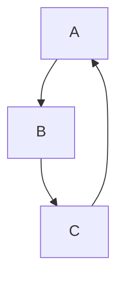

# ReSTIR (Reservoir-Based SpatioTemporal Importance Resampling)  

## 1\. Importance Resampling  

### 1-1\. Importance Sampling

By "Exercise 5.64" of ["Statistic Inference 2nd Edition"](https://archived.stat.ufl.edu/casella/), we have the **importance sampling** estimator $\displaystyle \int \mathop{\mathrm{t}} (x) \mathop{\mathrm{r}} (x) \, dx \approx \frac{1}{n} \sum_{i=1}^n \frac{\mathop{\mathrm{t}} (X_i)}{\mathop{\mathrm{p}} (X_i)} \mathop{\mathrm{r}} (X_i)$ where the **target distribution** has the **PDF (Probability Density Function)** t, the r is any function, and the n **samples** $\displaystyle X_i$ are generated from the **proposal distribution** with the **PDF** p.  

> Unbiased  
>>  
>> $\displaystyle \mathop{\mathrm{E_p}} \left( \frac{1}{n} \sum_{i=1}^n \frac{\mathop{\mathrm{t}} (X)}{\mathop{\mathrm{p}} (X)} \mathop{\mathrm{r}} (X)  \right) =  \frac{1}{n} \sum_{i=1}^n \mathop{\mathrm{E_p}} \left( \frac{\mathop{\mathrm{t}} (X)}{\mathop{\mathrm{p}} (X)} \mathop{\mathrm{r}} (X) \right) = \mathop{\mathrm{E_p}} \left( \frac{\mathop{\mathrm{t}} (X)}{\mathop{\mathrm{p}} (X)} \mathop{\mathrm{r}} (X) \right) = \int \frac{\mathop{\mathrm{t}} (x)}{\mathop{\mathrm{p}} (x)} \mathop{\mathrm{r}} (x) \mathop{\mathrm{p}} (x) \, dx = \int \mathop{\mathrm{t}} (x) \mathop{\mathrm{r}} (x) \, dx = \mathop{\mathrm{E_t}} ( \mathop{\mathrm{r}} (X) )$.  
>  
> Consistent  
>> 
>> By **LLN (Law of Large Numbers)**, we have $\displaystyle \lim \limits_{n \to \infty} \frac{1}{n} \sum_{i=1}^n \frac{\mathop{\mathrm{t}} (X_i)}{\mathop{\mathrm{p}} (X_i)} \mathop{\mathrm{r}} (X_i) = \mathop{\mathrm{E_p}} \left( \frac{1}{n} \sum_{i=1}^n \frac{\mathop{\mathrm{t}} (X)}{\mathop{\mathrm{p}} (X)} \mathop{\mathrm{r}} (X)  \right) = \int \mathop{\mathrm{t}} (x) \mathop{\mathrm{r}} (x) \, dx = \mathop{\mathrm{E_t}} ( \mathop{\mathrm{r}} (X) )$.  

By ["13.2 The Monte Carlo Estimator"](https://www.pbr-book.org/3ed-2018/Monte_Carlo_Integration/The_Monte_Carlo_Estimator#) of "PBR Book V3" and ["2.1.3 The Monte Carlo Estimator"](https://pbr-book.org/4ed/Monte_Carlo_Integration/Monte_Carlo_Basics#TheMonteCarloEstimator) of "PBR Book V4", we have the **Monte Carlo** estimator $\displaystyle \int \mathop{\mathrm{f}} (x) \, dx \approx \frac{1}{n} \sum_{i=1}^n \frac{\mathop{\mathrm{f}} (X_i)}{\mathop{\mathrm{p}} (X_i)}$ where the f is any function, and the n **samples** $\displaystyle X_i$ are generated from the **proposal distribution** with the **PDF** p.  

>> By substituting $\displaystyle \mathop{\mathrm{r}} (X) = \frac{\mathop{\mathrm{f}} (X)}{\mathop{\mathrm{t}} (X)}$ into the **importance sampling** estimator, we have the **Monte Carlo** estimator $\displaystyle \int \mathop{\mathrm{f}} (x) \, dx = \int \mathop{\mathrm{t}} (x) \mathop{\mathrm{r}} (x) \, dx \approx \frac{1}{n} \sum_{i=1}^n \frac{\mathop{\mathrm{t}} (X_i)}{\mathop{\mathrm{p}} (X_i)} \mathop{\mathrm{r}} (X_i) = \frac{1}{n} \sum_{i=1}^n \frac{\mathop{\mathrm{t}} (X_i)}{\mathop{\mathrm{p}} (X_i)} \frac{\mathop{\mathrm{f}} (X_i)}{\mathop{\mathrm{t}} (X_i)} = \frac{1}{n} \sum_{i=1}^n \frac{\mathop{\mathrm{f}} (X_i)}{\mathop{\mathrm{p}} (X_i)}$.  

By [13.10 Importance Sampling](https://www.pbr-book.org/3ed-2018/Monte_Carlo_Integration/Importance_Sampling) of "PBR Book V3" and ["2.2.2 Importance Sampling"](https://pbr-book.org/4ed/Monte_Carlo_Integration/Improving_Efficiency#ImportanceSampling) of "PBR Book V4", for f is always non-negative, when the **proposal distribution** **PDF** p is proportional to f (namely, $\displaystyle \mathop{\mathrm{p}} (X) = \frac{\displaystyle \mathop{\mathrm{f}} (X)}{\displaystyle {\| f \|}_1}$), the **variance** is zero and only one sample is sufficient.  

### 1-2\. MIS (Multiple Importance Sampling)

By ["13.10.1 Multiple Importance Sampling"](https://www.pbr-book.org/3ed-2018/Monte_Carlo_Integration/Importance_Sampling#MultipleImportanceSampling) of "PBR Book V3" and ["2.2.3 Multiple Importance Sampling"](https://pbr-book.org/4ed/Monte_Carlo_Integration/Improving_Efficiency#MultipleImportanceSampling) of "PBR Book V4", we have **MIS (multiple importance sampling)** estimator $\displaystyle \int \mathop{\mathrm{f}} (x) \, dx \approx \frac{1}{n_a} \sum_{i=1}^{n_a} \mathop{\mathrm{w_a}} (X_{a, i}) \frac{\mathop{\mathrm{f}} (X_{a, i})}{\mathop{\mathrm{p_a}} (X_{a, i})} + \frac{1}{n_b} \sum_{i=1}^{n_b} \mathop{\mathrm{w_b}} (X_{b, i}) \frac{\mathop{\mathrm{f}} (X_{b, i})}{\mathop{\mathrm{p_b}} (X_{b, i})}$ where f is any function, the $\displaystyle n_a$ **samples** $\displaystyle X_{a, i}$ are generated from the **proposal distribution** with the **PDF** $\displaystyle p_a$ and the **balance heuristic** **weight** $\displaystyle \mathop{\mathrm{w_a}} (X_{a, i}) = \frac{\displaystyle n_a \mathop{\mathrm{p_a}} (X_{a, i})}{\displaystyle n_a \mathop{\mathrm{p_a}} (X_{a, i}) + n_b \mathop{\mathrm{p_b}} (X_{a, i})}$, and the $\displaystyle n_b$ **samples** $\displaystyle X_{b, i}$ are generated from the **proposal distribution** with the **PDF** $\displaystyle p_b$ and the **balance heuristic** **weight** $\displaystyle \mathop{\mathrm{w_b}} (X_{b, i}) = \frac{\displaystyle n_b \mathop{\mathrm{p_b}} (X_{b, i})}{\displaystyle n_a \mathop{\mathrm{p_a}} (X_{b, i}) + n_b \mathop{\mathrm{p_b}} (X_{b, i})}$.  

> Unbiased  
>>  
>> $\displaystyle \mathop{\mathrm{E_{p_a}}} \left( \frac{1}{n_a} \sum_{i=1}^{n_a} \mathop{\mathrm{w_a}} (X_{a, i}) \frac{\mathop{\mathrm{f}} (X_{a, i})}{\mathop{\mathrm{p_a}} (X_{a, i})} \right) + \mathop{\mathrm{E_{p_b}}} \left( \frac{1}{n_b} \sum_{i=1}^{n_b} \mathop{\mathrm{w_b}} (X_{b, i}) \frac{\mathop{\mathrm{f}} (X_{b, i})}{\mathop{\mathrm{p_b}} (X_{b, i})} \right) = \frac{1}{n_a} \sum_{i=1}^{n_a} \mathop{\mathrm{E_{p_a}}} \left( \mathop{\mathrm{w_a}} (X_{a, i}) \frac{\mathop{\mathrm{f}} (X_{a, i})}{\mathop{\mathrm{p_a}} (X_{a, i})} \right) + \frac{1}{n_b} \sum_{i=1}^{n_b} \mathop{\mathrm{E_{p_b}}} \left( \mathop{\mathrm{w_b}} (X_{b, i}) \frac{\mathop{\mathrm{f}} (X_{b, i})}{\mathop{\mathrm{p_b}} (X_{b, i})} \right) = \mathop{\mathrm{E_{p_a}}} \left( \mathop{\mathrm{w_a}} (X_{a, i}) \frac{\mathop{\mathrm{f}} (X_{a, i})}{\mathop{\mathrm{p_a}} (X_{a, i})} \right) + \mathop{\mathrm{E_{p_b}}} \left( \mathop{\mathrm{w_b}} (X_{b, i}) \frac{\mathop{\mathrm{f}} (X_{b, i})}{\mathop{\mathrm{p_b}} (X_{b, i})} \right) = \int \mathop{\mathrm{w_a}} (x) \frac{\mathop{\mathrm{f}} (x)}{\mathop{\mathrm{p_a}} (x)} \mathop{\mathrm{p_a}} (x) \, dx + \int \mathop{\mathrm{w_b}} (x) \frac{\mathop{\mathrm{f}} (x)}{\mathop{\mathrm{p_b}} (x)} \mathop{\mathrm{p_b}} (x) \, dx = \int \mathop{\mathrm{w_a}} (x) \mathop{\mathrm{f}} (x) \, dx + \int \mathop{\mathrm{w_b}} (x) \mathop{\mathrm{f}} (x) \, dx =  \int \mathop{\mathrm{w_a}} (x) \mathop{\mathrm{f}} (x) + \mathop{\mathrm{w_b}} (x) \mathop{\mathrm{f}} (x) \, dx =  \int \left( \mathop{\mathrm{w_a}} (x) + \mathop{\mathrm{w_b}} (x) \right) \mathop{\mathrm{f}} (x) \, dx = \int \left( \frac{\displaystyle n_a \mathop{\mathrm{p_a}} (x)}{\displaystyle n_a \mathop{\mathrm{p_a}} (x) + n_b \mathop{\mathrm{p_b}} (x)} + \frac{\displaystyle n_b \mathop{\mathrm{p_b}} (x)}{\displaystyle n_a \mathop{\mathrm{p_a}} (x) + n_b \mathop{\mathrm{p_b}} (x)} \right) \mathop{\mathrm{f}} (x) \, dx = \int \left( \frac{\displaystyle n_a \mathop{\mathrm{p_a}} (x) + n_b \mathop{\mathrm{p_b}} (x)}{\displaystyle n_a \mathop{\mathrm{p_a}} (x) + n_b \mathop{\mathrm{p_b}} (x)} \right) \mathop{\mathrm{f}} (x) \, dx = \int \mathop{\mathrm{f}} (x) \, dx$.  
>  
> Consistent  
>> 
>> By **LLN (Law of Large Numbers)**, we have $\displaystyle \lim \limits_{n_a \to \infty} \frac{1}{n_a} \sum_{i=1}^{n_a} \mathop{\mathrm{w_a}} (X_{a, i}) \frac{\mathop{\mathrm{f}} (X_{a, i})}{\mathop{\mathrm{p_a}} (X_{a, i})} + \lim \limits_{n_b \to \infty} \frac{1}{n_b} \sum_{i=1}^{n_b} \mathop{\mathrm{w_b}} (X_{b, i}) \frac{\mathop{\mathrm{f}} (X_{b, i})}{\mathop{\mathrm{p_b}} (X_{b, i})} = \mathop{\mathrm{E_{p_a}}} \left( \frac{1}{n_a} \sum_{i=1}^{n_a} \mathop{\mathrm{w_a}} (X_{a, i}) \frac{\mathop{\mathrm{f}} (X_{a, i})}{\mathop{\mathrm{p_a}} (X_{a, i})} \right) + \mathop{\mathrm{E_{p_a}}} \left( \frac{1}{n_b} \sum_{i=1}^{n_b} \mathop{\mathrm{w_b}} (X_{b, i}) \frac{\mathop{\mathrm{f}} (X_{b, i})}{\mathop{\mathrm{p_b}} (X_{b, i})} \right) = \int \mathop{\mathrm{f}} (x) \, dx$.

For more general case, we may have multiple **proposal distributions** $\displaystyle p_a \, p_b \, p_c \, \cdots$. As long as the **weights** fulfill $\displaystyle \mathop{\mathrm{w_a}} + \mathop{\mathrm{w_b}} + \mathop{\mathrm{w_c}} + \cdots = 1$, we have the more general estimator $\displaystyle \int \mathop{\mathrm{f}} (x) \, dx \approx \frac{1}{n_a} \sum_{i=1}^{n_a} \mathop{\mathrm{w_a}} (X_{a, i}) \frac{\mathop{\mathrm{f}} (X_{a, i})}{\mathop{\mathrm{p_a}} (X_{a, i})} + \frac{1}{n_b} \sum_{i=1}^{n_b} \mathop{\mathrm{w_b}} (X_{b, i}) \frac{\mathop{\mathrm{f}} (X_{b, i})}{\mathop{\mathrm{p_b}} (X_{b, i})} + \frac{1}{n_c} \sum_{i=1}^{n_c} \mathop{\mathrm{w_c}} (X_{c, i}) \frac{\mathop{\mathrm{f}} (X_{c, i})}{\mathop{\mathrm{p_c}} (X_{c, i})} + \cdots$.  

And we have the more general **balance heuristic** **weights** $\displaystyle \mathop{\mathrm{w_a}} (X_{a, i}) = \frac{\displaystyle n_a \mathop{\mathrm{p_a}} (X_{a, i})}{\displaystyle n_a \mathop{\mathrm{p_a}} (X_{a, i}) + n_b \mathop{\mathrm{p_b}} (X_{a, i}) + n_c \mathop{\mathrm{p_c}} (X_{a, i}) + \cdots} \, \mathop{\mathrm{w_b}} (X_{a, i}) = \frac{\displaystyle n_b \mathop{\mathrm{p_b}} (X_{a, i})}{\displaystyle n_a \mathop{\mathrm{p_a}} (X_{a, i}) + n_b \mathop{\mathrm{p_b}} (X_{a, i}) + n_c \mathop{\mathrm{p_c}} (X_{a, i}) + \cdots} \, \mathop{\mathrm{w_c}} (X_{a, i}) = \frac{\displaystyle n_c \mathop{\mathrm{p_c}} (X_{a, i})}{\displaystyle n_a \mathop{\mathrm{p_a}} (X_{a, i}) + n_b \mathop{\mathrm{p_b}} (X_{a, i}) + n_c \mathop{\mathrm{p_c}} (X_{a, i}) + \cdots} \,  + \cdots$.  

#### 1-2-1\. Stratified Sampling  

For the case where the domain of these multiple K **proposal distributions** do NOT overlap each other and these K **weights** $\mathop{\mathrm{w_a}} = \mathop{\mathrm{w_b}} = \mathop{\mathrm{w_c}} = \cdots = \frac{1}{K}$, the **MIS (multiple importance sampling)** degenerates to the **stratified sampling** of which each **stratum** corresponds to the domain of each **proposal distribution**.  

### 1-3\. Reservoir Sampling  

By ["A.2 Reservoir Sampling"](https://www.pbr-book.org/4ed/Sampling_Algorithms/Reservoir_Sampling#) of "PBR Book V4", we have the **basic** **reservoir sampling**.  
   
We sequentially process each **sample** from the **stream**. The total length of the **stream** can indeed be infinite which is too large to be stored in the memory.   

We assume that we have processed **n** **samples**. This means that the number of the **seen samples** is **n**. For the **basic** **reservoir sampling**, the **reservoir** can hold at most **1** **reservoir sample**, and the first **1** **seen** **sample** is always selected to initialize the **reservoir**. For each subsequent **seen** **candidate sample**, we have the probability $\displaystyle \frac{1}{n}$ of selecting it to replace the existing **sample** within the **reservoir**.  

We can prove by **mathematical Induction** that at any iteration, when we have processed n **samples**, each **sample** from the **stream** has the equal probability $\displaystyle \frac{1}{n}$ of being included in the final **reservoir**.  

> Base Case  
>>
>> At the iteration, when we have processed n = 1 **sample**, each **sample** has the equal probability $\displaystyle \frac{1}{1} = 1$ of being included in the final **reservoir**.  
>  
> Inductive Step  
>> 
>> We assume that at the t-th iteration, when we have processed n = t **samples**, each **sample** from the **stream** has the equal probability $\displaystyle \frac{1}{t}$ of being included in the final **reservoir**.  
>>   
>> And we would like to prove that at the (t + 1)-th iteration, when we have processed n = t + 1 **samples**, each **sample** from the **stream** has the equal probability $\displaystyle \frac{1}{t + 1}$ of being included in the final **reservoir**.  
>>  
>> Evidently, the (t + 1)-th **seen sample** has the probability $\displaystyle \frac{1}{t + 1}$ of being selected to replace the existing **sample** within the **reservoir** and thus being included in the final **reservoir**.  
>>  
>> For the previous t **seen samples**, they have the probability $\displaystyle \frac{1}{t}$ of being included in the final **reservoir** at t-th iteration. At the same time, they have the probability $\displaystyle 1 - \frac{1}{t + 1} = \frac{t}{t + 1}$ of NOT being replaced by the (t + 1)-th **seen sample** at (t + 1)-th iteration. This means that they have the probability $\displaystyle \frac{1}{t} \times \frac{t}{t + 1} = \frac{1}{t + 1}$ of being included in the final **reservoir** at (t + 1)-th iteration.  

#### 1-3-1\. K-Sized Reservoir Sampling  

The difference is that the **reservoir** can hold at most **k** ~~(instead of 1)~~ **reservoir sample**, and the first **k** ~~(instead of 1)~~ **seen** **sample** is always selected to initialize the **reservoir**. For each subsequent **seen** **candidate sample**, we have the probability $\displaystyle \frac{k}{n}$  ~~(instead of $\displaystyle \frac{1}{n}$)~~ of selecting it to replace the existing **sample** within the **reservoir**.

When we have processed n **samples**, each **sample** from the **stream** has the equal probability $\displaystyle \frac{k}{n}$ ~~(instead of $\displaystyle \frac{1}{n}$)~~ of being included in the final **reservoir**.

#### 1-3-2\. Weighted Reservoir Sampling  

By ["A.2 Reservoir Sampling"](https://www.pbr-book.org/4ed/Sampling_Algorithms/Reservoir_Sampling#) of "PBR Book V4", we have the **weighted reservoir sampling**.  

The difference is that each **seen sample** has the probability according to the **weight** ~~(instead of the constant $\displaystyle \frac{k}{n}$)~~ of being selected to replace the existing **sample** within the **reservoir**.  
  
Each **sample** from the **stream** has the probability proportional to the **weight** of being included in the final **reservoir**.

### 1-4\. SIR (Sampling Importance Resampling) / Weighted Bootstrap / RIS (Resampled Importance Sampling)  

By "Exercise 5.65" of ["Statistic Inference 2nd Edition"](https://archived.stat.ufl.edu/casella/), we have the **SIR (sampling importance resampling)** / **weighted bootstrap** estimator $\displaystyle \int \mathop{\mathrm{t}} (x) \mathop{\mathrm{r}} (x) \, dx \approx \frac{1}{n} \sum_{j=1}^n \mathop{\mathrm{r}} (Y_j)$ where the **target distribution** has the **PDF** t, the r is any function, the m **samples** $\displaystyle X_i$ are generated from the **proposal distribution** with the **PDF** p, and the n **samples** $\displaystyle Y_j$ are then generated from the **discrete distribution** on these m **samples** $\displaystyle X_i$ with the **PMF (Probability Mass Function)** $\displaystyle w_i = \mathop{\mathrm{P}} (Y = X_i) = \frac{\displaystyle \frac{\mathop{\mathrm{t}} (X_i)}{\mathop{\mathrm{p}} (X_i)}}{\displaystyle \sum_{k=1}^m \frac{\mathop{\mathrm{t}} (X_k)}{\mathop{\mathrm{p}} (X_k)}}$.  

> The n **samples** $\displaystyle Y_j$ from the **discrete distribution** are approximately generated from the the **target distribution** with the **PDF** t.  
>>
>> By **importance sampling**, we have $\displaystyle \lim \limits_{n \to \infty} \frac{1}{m} \sum_{i=1}^m \frac{\mathop{\mathrm{t}} (X_i)}{\mathop{\mathrm{p}} (X_i)} \mathop{\mathrm{r}} (X_i) = \int \mathop{\mathrm{t}} (x) \mathop{\mathrm{r}} (x) \, dx = \mathop{\mathrm{E_t}} ( \mathop{\mathrm{r}} (X) )$.  
>>  
>> $\displaystyle \mathop{\mathrm{E_p}} \left( \frac{1}{m} \sum_{k=1}^m \frac{\mathop{\mathrm{t}} (X)}{\mathop{\mathrm{p}} (X)} \right) = \frac{1}{m} \sum_{k=1}^m \mathop{\mathrm{E_p}} \left( \frac{\mathop{\mathrm{t}} (X)}{\mathop{\mathrm{p}} (X)} \right) = \mathop{\mathrm{E_p}} \left( \frac{\mathop{\mathrm{t}} (X)}{\mathop{\mathrm{p}} (X)} \right) = \int \frac{\mathop{\mathrm{t}} (x)}{\mathop{\mathrm{p}} (x)} \mathop{\mathrm{p}} (x) \, dx = \int \mathop{\mathrm{t}} (x) \, dx = 1$.  
>>
>> By **LLN (Law of Large Numbers)**, we have $\displaystyle \lim \limits_{m \to \infty} \frac{1}{m} \sum_{k=1}^m \frac{\mathop{\mathrm{t}} (X)}{\mathop{\mathrm{p}} (X)} = \mathop{\mathrm{E_p}} \left( \frac{1}{m} \sum_{k=1}^m \frac{\mathop{\mathrm{t}} (X)}{\mathop{\mathrm{p}} (X)} \right) = 1$.  
>>  
>> $\displaystyle \mathop{\mathrm{E_w}} \left( \frac{1}{n} \sum_{j=1}^n \mathop{\mathrm{r}} (Y) \right) = \frac{1}{n} \sum_{j=1}^n  \mathop{\mathrm{E_w}} ( \mathop{\mathrm{r}} (Y) ) = \mathop{\mathrm{E_w}} ( \mathop{\mathrm{r}} (Y) ) = \sum_{i=1}^m w_i \mathop{\mathrm{r}} (X_i) = \sum_{i=1}^m \frac{\displaystyle \frac{\mathop{\mathrm{t}} (X_i)}{\mathop{\mathrm{p}} (X_i)}}{\displaystyle \sum_{k=1}^m \frac{\mathop{\mathrm{t}} (X_k)}{\mathop{\mathrm{p}} (X_k)}} \mathop{\mathrm{r}} (X_i) = \frac{\displaystyle \sum_{i=1}^m \frac{\mathop{\mathrm{t}} (X_i)}{\mathop{\mathrm{p}} (X_i)} \mathop{\mathrm{r}} (X_i)}{\displaystyle \sum_{k=1}^m \frac{\mathop{\mathrm{t}} (X_k)}{\mathop{\mathrm{p}} (X_k)}} = \frac{\displaystyle \frac{1}{m} \sum_{i=1}^m \frac{\mathop{\mathrm{t}} (X_i)}{\mathop{\mathrm{p}} (X_i)} \mathop{\mathrm{r}} (X_i)}{\displaystyle \frac{1}{m} \sum_{k=1}^m \frac{\mathop{\mathrm{t}} (X_k)}{\mathop{\mathrm{p}} (X_k)}}$.  
>>  
>> $\displaystyle \lim \limits_{m \to \infty} \mathop{\mathrm{E_w}} \left( \frac{1}{n} \sum_{j=1}^n \mathop{\mathrm{r}} (Y) \right) = \lim \limits_{m \to \infty} \frac{\displaystyle \frac{1}{m} \sum_{i=1}^m \frac{\mathop{\mathrm{t}} (X_i)}{\mathop{\mathrm{p}} (X_i)} \mathop{\mathrm{r}} (X_i)}{\displaystyle \frac{1}{m} \sum_{k=1}^m \frac{\mathop{\mathrm{t}} (X_k)}{\mathop{\mathrm{p}} (X_k)}} = \frac{\displaystyle \lim \limits_{m \to \infty} \frac{1}{m} \sum_{i=1}^m \frac{\mathop{\mathrm{t}} (X_i)}{\mathop{\mathrm{p}} (X_i)} \mathop{\mathrm{r}} (X_i)}{\displaystyle \lim \limits_{m \to \infty} \frac{1}{m} \sum_{k=1}^m \frac{\mathop{\mathrm{t}} (X_k)}{\mathop{\mathrm{p}} (X_k)}} = \frac{\displaystyle \int \mathop{\mathrm{t}} (x) \mathop{\mathrm{r}} (x) \, dx}{1} = \int \mathop{\mathrm{t}} (x) \mathop{\mathrm{r}} (x) \, dx = \mathop{\mathrm{E_t}} ( \mathop{\mathrm{r}} (X) )$.  
>>  
>> By **LLN (Law of Large Numbers)**, we have $\displaystyle \lim \limits_{n \to \infty} \frac{1}{n} \sum_{j=1}^n \mathop{\mathrm{r}} (Y) = \mathop{\mathrm{E_w}} \left( \frac{1}{n} \sum_{j=1}^n \mathop{\mathrm{r}} (Y) \right)$.  
>>  
>> $\displaystyle \lim \limits_{m \to \infty} \lim \limits_{n \to \infty} \frac{1}{n} \sum_{j=1}^n \mathop{\mathrm{r}} (Y_j) = \lim \limits_{m \to \infty} \mathop{\mathrm{E_w}} \left( \frac{1}{n} \sum_{j=1}^n \mathop{\mathrm{r}} (Y) \right) = \int \mathop{\mathrm{t}} (x) \mathop{\mathrm{r}} (x) \, dx = \mathop{\mathrm{E_t}} ( \mathop{\mathrm{r}} (X) )$.  

By \[Wyman 2023\], we have the **RIS (resampled importance sampling)** estimator $\displaystyle \frac{1}{n} \sum_{j=1}^n \left( \frac{\displaystyle \mathop{\mathrm{f}} (Y_j)}{\displaystyle \mathop{\mathrm{\hat{p}}} (Y_j)} \left( \frac{1}{m} \sum_{i=1}^m \frac{\displaystyle \mathop{ \mathrm{\hat{p}}} (X_i)}{\displaystyle \mathop{\mathrm{p}} (X_i)} \right) \right)  \approx \int \mathop{\mathrm{f}} (x) \, dx$ where the f is any function, the **target function** $\displaystyle \mathop{\mathrm{\hat{p}}}$ is always non-negative, the m **samples** $\displaystyle X_i$ are generated from the **proposal distribution** with the **PDF** p, and the n **samples** $\displaystyle Y_j$ are then generated from the **discrete distribution** on these m **samples** $\displaystyle X_i$ with the **PMF (Probability Mass Function)** $\displaystyle w_i = \mathop{\mathrm{P}} (Y = X_i) = \frac{\displaystyle \frac{\displaystyle \mathop{\mathrm{\hat{p}}} (X_i)}{\displaystyle \mathop{\mathrm{p}} (X_i)}}{\displaystyle \sum_{k=1}^m \frac{\displaystyle \mathop{\mathrm{\hat{p}}} (X_k)}{\displaystyle \mathop{\mathrm{p}} (X_k)}}$.

>> By substituting $\displaystyle \mathop{\mathrm{r}} (X) = \frac{\displaystyle \mathop{\mathrm{f}} (X)}{\displaystyle \mathop{\mathrm{\hat{p}}} (X)} {\| \hat{p} \|}_1$ and $\displaystyle \mathop{\mathrm{t}} (X) = \mathop{\mathrm{\bar{p}}} (X) = \frac{\displaystyle \mathop{\mathrm{\hat{p}}} (X)}{\displaystyle {\| \hat{p} \|}_1}$ into the **SIR (sampling importance resampling)** / **weighted bootstrap** estimator, we have $\displaystyle \lim \limits_{m \to \infty} \mathop{\mathrm{E_w}} \left( \frac{1}{n} \sum_{j=1}^n \frac{\displaystyle \mathop{\mathrm{f}} (Y)}{\displaystyle \mathop{\mathrm{\hat{p}}} (Y)} {\| \hat{p} \|}_1 \right) = \lim \limits_{m \to \infty} \mathop{\mathrm{E_w}} \left( \frac{1}{n} \sum_{j=1}^n \mathop{\mathrm{r}} (Y) \right) = \int \mathop{\mathrm{t}} (x) \mathop{\mathrm{r}} (x) \, dx = \int \frac{\displaystyle \mathop{\mathrm{\hat{p}}} (X)}{\displaystyle {\| \hat{p} \|}_1} \frac{\displaystyle \mathop{\mathrm{f}} (X)}{\displaystyle \mathop{\mathrm{\hat{p}}} (X)} {\| \hat{p} \|}_1 \, dx = \int \mathop{\mathrm{f}} (x) \, dx$ and $\displaystyle w_i = \frac{\displaystyle \frac{\mathop{\mathrm{t}} (X_i)}{\mathop{\mathrm{p}} (X_i)}}{\displaystyle \sum_{k=1}^m \frac{\mathop{\mathrm{t}} (X_k)}{\mathop{\mathrm{p}} (X_k)}} = \frac{\displaystyle \frac{\displaystyle \frac{\displaystyle \mathop{\mathrm{\hat{p}}} (X_i)}{\displaystyle {\| \hat{p} \|}_1}}{\mathop{\mathrm{p}} (X_i)}}{\displaystyle \sum_{k=1}^m \frac{\displaystyle \frac{\displaystyle \mathop{\mathrm{\hat{p}}} (X_k)}{\displaystyle {\| \hat{p} \|}_1}}{\mathop{\mathrm{p}} (X_k)}} = \frac{\displaystyle \frac{\mathop{\mathrm{\hat{p}}} (X_i)}{\mathop{\mathrm{p}} (X_i)}}{\displaystyle \sum_{k=1}^m \frac{\mathop{\mathrm{\hat{p}}} (X_k)}{\mathop{\mathrm{p}} (X_k)}}$.  
>>  
>> Since X and Y are independent, and the **target function** $\displaystyle \mathop{\mathrm{\hat{p}}}$ is always non-negative, we have $\displaystyle \mathop{\mathrm{E_p}} \left( \frac{1}{m} \sum_{i=1}^m \frac{\displaystyle \mathop{ \mathrm{\hat{p}}} (X)}{\displaystyle \mathop{\mathrm{p}} (X)} \mid Y \right) = \mathop{\mathrm{E_p}} \left( \frac{1}{m} \sum_{i=1}^m \frac{\displaystyle \mathop{ \mathrm{\hat{p}}} (X)}{\displaystyle \mathop{\mathrm{p}} (X)} \right) = \frac{1}{m} \sum_{i=1}^m \mathop{\mathrm{E_p}} \left( \frac{\displaystyle \mathop{ \mathrm{\hat{p}}} (X)}{\displaystyle \mathop{\mathrm{p}} (X)} \right) = \mathop{\mathrm{E_p}} \left( \frac{\displaystyle \mathop{ \mathrm{\hat{p}}} (X)}{\displaystyle \mathop{\mathrm{p}} (X)} \right) = \int \frac{\displaystyle \mathop{ \mathrm{\hat{p}}} (x)}{\displaystyle \mathop{\mathrm{p}} (x)} \mathop{\mathrm{p}} (x) \, dx = \int \mathop{ \mathrm{\hat{p}}} (x) \, dx = \int | \mathop{ \mathrm{\hat{p}}} (x) | \, dx = {\| \hat{p} \|}_1$.  
>>  
>> By **Law of Total Expectation**, we have $\displaystyle \lim \limits_{m \to \infty} \mathop{\mathrm{E_{w, p}}} \left( \frac{1}{n} \sum_{j=1}^n \left( \frac{\displaystyle \mathop{\mathrm{f}} (Y)}{\displaystyle \mathop{\mathrm{\hat{p}}} (Y)} \left( \frac{1}{m} \sum_{i=1}^m \frac{\displaystyle \mathop{ \mathrm{\hat{p}}} (X)}{\displaystyle \mathop{\mathrm{p}} (X)} \right) \right) \right) = \lim \limits_{m \to \infty} \mathop{\mathrm{E_{w}}} \left( \frac{1}{n} \sum_{j=1}^n \left( \frac{\displaystyle \mathop{\mathrm{f}} (Y)}{\displaystyle \mathop{\mathrm{\hat{p}}} (Y)} \mathop{\mathrm{E_p}} \left( \frac{1}{m} \sum_{i=1}^m \frac{\displaystyle \mathop{ \mathrm{\hat{p}}} (X)}{\displaystyle \mathop{\mathrm{p}} (X)} \mid Y \right) \right) \right) = \lim \limits_{m \to \infty} \mathop{\mathrm{E_w}} \left( \frac{1}{n} \sum_{j=1}^n \frac{\displaystyle \mathop{\mathrm{f}} (Y)}{\displaystyle \mathop{\mathrm{\hat{p}}} (Y)} {\| \hat{p} \|}_1 \right) = \int \mathop{\mathrm{f}} (x) \, dx$.  

By \[Wyman 2023\], the part $\displaystyle \mathop{\mathrm{W_Y}} = \frac{1}{\displaystyle \mathop{\mathrm{\hat{p}}} (Y_j)} \left( \frac{1}{m} \sum_{i=1}^m \frac{\displaystyle \mathop{ \mathrm{\hat{p}}} (X_i)}{\displaystyle \mathop{\mathrm{p}} (X_i)} \right)$ within the formula is also called the **unbiased contribution weight**.  

#### 1-4-1\. MIS (multiple importance sampling)  

By \[Wyman 2023\], we use the **MIS (multiple importance sampling)** to generate ($\displaystyle m_a$ + $\displaystyle m_b$) **samples** $\displaystyle X_{a, i}$ and $\displaystyle X_{b, i}$ from multiple **proposal distributions** $\displaystyle p_a$ and $\displaystyle p_b$, and we have the estimator $\displaystyle \frac{1}{n} \sum_{j=1}^n \left( \frac{\displaystyle \mathop{\mathrm{f}} (Y_j)}{\displaystyle \mathop{\mathrm{\hat{p}}} (Y_j)} \left( \frac{1}{m_a} \sum_{i=1}^{m_a} \mathop{\mathrm{w_a}} (X_{a, i}) \frac{\displaystyle \mathop{ \mathrm{\hat{p}}} (X_{a, i})}{\displaystyle \mathop{\mathrm{p_a}} (X_{a, i})} + \frac{1}{m_b} \sum_{i=1}^{m_b} \mathop{\mathrm{w_b}} (X_{b, i}) \frac{\displaystyle \mathop{ \mathrm{\hat{p}}} (X_{b, i})}{\displaystyle \mathop{\mathrm{p_b}} (X_{b, i})} \right) \right)  \approx \int \mathop{\mathrm{f}} (x) \, dx$ where $\displaystyle m_a$ **samples** $\displaystyle X_{a, i}$ are generated from **proposal distribution** with the **PDF** $\displaystyle p_a$ and the **balance heuristic** **weight** $\displaystyle \mathop{\mathrm{w_a}} (X_{a, i}) = \frac{\displaystyle m_a \mathop{\mathrm{p_a}} (X_{a, i})}{\displaystyle m_a \mathop{\mathrm{p_a}} (X_{a, i}) + m_b \mathop{\mathrm{p_b}} (X_{a, i})}$, $\displaystyle m_b$ **samples** $\displaystyle X_{b, i}$ are generated from **proposal distribution** with the **PDF** $\displaystyle p_b$ and the **balance heuristic** **weight** $\displaystyle \mathop{\mathrm{w_b}} (X_{b, i}) = \frac{\displaystyle m_b \mathop{\mathrm{p_b}} (X_{b, i})}{\displaystyle m_a \mathop{\mathrm{p_a}} (X_{b, i}) + m_b \mathop{\mathrm{p_b}} (X_{b, i})}$, and the n **samples** $\displaystyle Y_j$ are then generated from the **discrete distribution** on these ($\displaystyle m_a$ + $\displaystyle m_b$) **samples** $\displaystyle X_{a, i}$ and $\displaystyle X_{b, i}$ with the **PMF** $\displaystyle w_{a, i} = \mathop{\mathrm{P}} (Y = X_{a, i}) = \frac{\displaystyle \frac{1}{m_a} \mathop{\mathrm{w_a}} (X_{a, i}) \frac{\displaystyle \mathop{ \mathrm{\hat{p}}} (X_{a, i})}{\displaystyle \mathop{\mathrm{p_a}} (X_{a, i})} }{\displaystyle \frac{1}{m_a} \sum_{k=1}^{m_a} \mathop{\mathrm{w_a}} (X_{a, k}) \frac{\displaystyle \mathop{ \mathrm{\hat{p}}} (X_{a, k})}{\displaystyle \mathop{\mathrm{p_a}} (X_{a, k})} + \frac{1}{m_b} \sum_{k=1}^{m_b} \mathop{\mathrm{w_b}} (X_{b, k}) \frac{\displaystyle \mathop{ \mathrm{\hat{p}}} (X_{b, k})}{\displaystyle \mathop{\mathrm{p_b}} (X_{b, k})} }$ and $\displaystyle w_{b, i} = \mathop{\mathrm{P}} (Y = X_{b, i}) = \frac{\displaystyle \frac{1}{m_b} \mathop{\mathrm{w_b}} (X_{b, i}) \frac{\displaystyle \mathop{ \mathrm{\hat{p}}} (X_{b, i})}{\displaystyle \mathop{\mathrm{p_a}} (X_{b, i})} }{\displaystyle \frac{1}{m_a} \sum_{k=1}^{m_a} \mathop{\mathrm{w_a}} (X_{a, k}) \frac{\displaystyle \mathop{ \mathrm{\hat{p}}} (X_{a, k})}{\displaystyle \mathop{\mathrm{p_a}} (X_{a, k})} + \frac{1}{m_b} \sum_{k=1}^{m_b} \mathop{\mathrm{w_b}} (X_{b, k}) \frac{\displaystyle \mathop{ \mathrm{\hat{p}}} (X_{b, k})}{\displaystyle \mathop{\mathrm{p_b}} (X_{b, k})} }$.   

#### 1-4-2\. Weighted Reservoir Sampling  

By \[Wyman 2023\], we use the **weighted reservoir sampling** to generate n **samples** $\displaystyle Y_i$ from the **discrete distribution** on these m **samples** $\displaystyle X_i$ with the probabilities proportional to the **weights** **PMF** $\displaystyle w_i$.   

## 2\. SpatioTemporal  

## References  

\[Wyman 2023\] [Chris Wyman, Markus Kettunen, Daqi Lin, Benedikt Bitterli, Cem Yuksel, Wojciech Jarosz, Pawel Kozlowski, Giovanni Francesco. "A Gentle Introduction to ReSTIR: Path Reuse in Real-time." SIGGRAPH 2023.](https://intro-to-restir.cwyman.org/)  
