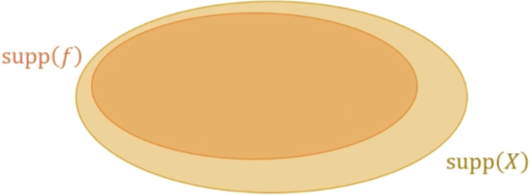
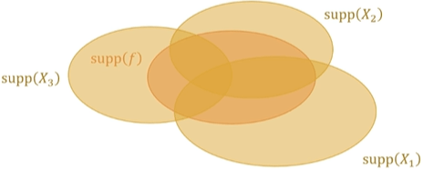

# ReSTIR (Reservoir-Based SpatioTemporal Importance Resampling)  

## Importance Sampling

By "Exercise 5.64" of ["Statistic Inference 2nd Edition"](https://archived.stat.ufl.edu/casella/), we have the **importance sampling** estimator $\displaystyle \int \mathop{\mathrm{t}} (x) \mathop{\mathrm{r}} (x) \, dx \approx \frac{1}{n} \sum_{i=1}^n \frac{\mathop{\mathrm{t}} (X_i)}{\mathop{\mathrm{p}} (X_i)} \mathop{\mathrm{r}} (X_i)$ where the **target distribution** has the **PDF (Probability Density Function)** t, the r is any function, and the n **samples** $\displaystyle X_i$ are generated from the **proposal distribution** with the **PDF** p.  

> Unbiased  
>>  
>> $\displaystyle \mathop{\mathrm{E_p}} \left( \frac{1}{n} \sum_{i=1}^n \frac{\mathop{\mathrm{t}} (X)}{\mathop{\mathrm{p}} (X)} \mathop{\mathrm{r}} (X)  \right) =  \frac{1}{n} \sum_{i=1}^n \mathop{\mathrm{E_p}} \left( \frac{\mathop{\mathrm{t}} (X)}{\mathop{\mathrm{p}} (X)} \mathop{\mathrm{r}} (X) \right) = \mathop{\mathrm{E_p}} \left( \frac{\mathop{\mathrm{t}} (X)}{\mathop{\mathrm{p}} (X)} \mathop{\mathrm{r}} (X) \right) = \int \frac{\mathop{\mathrm{t}} (x)}{\mathop{\mathrm{p}} (x)} \mathop{\mathrm{r}} (x) \mathop{\mathrm{p}} (x) \, dx = \int \mathop{\mathrm{t}} (x) \mathop{\mathrm{r}} (x) \, dx = \mathop{\mathrm{E_t}} ( \mathop{\mathrm{r}} (X) )$.  
>  
> Consistent  
>> 
>> By **LLN (Law of Large Numbers)**, we have $\displaystyle \lim \limits_{n \to \infty} \frac{1}{n} \sum_{i=1}^n \frac{\mathop{\mathrm{t}} (X_i)}{\mathop{\mathrm{p}} (X_i)} \mathop{\mathrm{r}} (Y_i) = \mathop{\mathrm{E_p}} \left( \frac{1}{n} \sum_{i=1}^n \frac{\mathop{\mathrm{t}} (X)}{\mathop{\mathrm{p}} (X)} \mathop{\mathrm{r}} (X)  \right) = \int \mathop{\mathrm{t}} (x) \mathop{\mathrm{r}} (x) \, dx = \mathop{\mathrm{E_t}} ( \mathop{\mathrm{r}} (X) )$.  

By ["13.2 The Monte Carlo Estimator"](https://www.pbr-book.org/3ed-2018/Monte_Carlo_Integration/The_Monte_Carlo_Estimator#) of "PBR Book V3" and ["2.1.3 The Monte Carlo Estimator"](https://pbr-book.org/4ed/Monte_Carlo_Integration/Monte_Carlo_Basics#TheMonteCarloEstimator) of "PBR Book V4", we have the **Monte Carlo** estimator $\displaystyle \int \mathop{\mathrm{f}} (x) \, dx \approx \frac{1}{n} \sum_{i=1}^n \frac{\mathop{\mathrm{f}} (X_i)}{\mathop{\mathrm{p}} (X_i)}$ where the f is any function, and the n **samples** $\displaystyle X_i$ are generated from the **proposal distribution** with the **PDF** p.  

>> By substituting $\displaystyle \mathop{\mathrm{r}} (X) = \frac{\mathop{\mathrm{f}} (X)}{\mathop{\mathrm{t}} (X)}$ into the **importance sampling** estimator, we have the **Monte Carlo** estimator $\displaystyle \int \mathop{\mathrm{f}} (x) \, dx = \int \mathop{\mathrm{t}} (x) \mathop{\mathrm{r}} (x) \, dx \approx \frac{1}{n} \sum_{i=1}^n \frac{\mathop{\mathrm{t}} (X_i)}{\mathop{\mathrm{p}} (X_i)} \mathop{\mathrm{r}} (X_i) = \frac{1}{n} \sum_{i=1}^n \frac{\mathop{\mathrm{t}} (X_i)}{\mathop{\mathrm{p}} (X_i)} \frac{\mathop{\mathrm{f}} (X_i)}{\mathop{\mathrm{t}} (X_i)} = \frac{1}{n} \sum_{i=1}^n \frac{\mathop{\mathrm{f}} (X_i)}{\mathop{\mathrm{p}} (X_i)}$.  

["2.2.2 Importance Sampling"](https://pbr-book.org/4ed/Monte_Carlo_Integration/Improving_Efficiency#ImportanceSampling) of "PBR Book V4"  
[13.10 Importance Sampling](https://www.pbr-book.org/3ed-2018/Monte_Carlo_Integration/Importance_Sampling) of "PBR Book V3"  

"The only limitation on p(x) is that it must be nonzero for all x where | f(x) | > 0 (namely f(x) \ne 0)"  // actually // otherwise the estimator will NOT be unbiased  

\[Wyman 2023\] supports  
\mathop{\mathrm{supp}}(f) // set of all x where f(x) \ne 0  
\mathop{\mathrm{supp}}(X) // set of all values x it can take with p(x) > 0 // namely p(x) \ne 0 // p(x) can Not < 0  
\mathop{\mathrm{supp}}(X) \subset \mathop{\mathrm{supp}}(f) // to be unbiased  

when PDF proportional to f(x) // f(x) should be non-negative // \propt // variance zero // we can use only one sample // called "perfect important sampling"  

  

## RIS (Resampled Importance Sampling) / SIR (Sampling Importance Resampling) / Weighted Bootstrap

By "Exercise 5.65" of ["Statistic Inference 2nd Edition"](https://archived.stat.ufl.edu/casella/), we have the **SIR (Sampling Importance Resampling)** / **Weighted Bootstrap** estimator $\displaystyle \int \mathop{\mathrm{t}} (x) \mathop{\mathrm{r}} (x) \, dx \approx \frac{1}{n} \sum_{j=1}^n \mathop{\mathrm{r}} (Y_j)$ where the **target distribution** has the **PDF** t, the r is any function, the m **samples** $\displaystyle X_i$ are generated from the **proposal distribution** with the **PDF** p, and the n **samples** $\displaystyle Y_j$ are then generated from the **discrete distribution** on these m **samples** $\displaystyle X_i$ with the **PMF (Probability Mass Function)** $\displaystyle w_i = \mathop{\mathrm{P}} (Y = X_i) = \frac{\displaystyle \frac{\mathop{\mathrm{t}} (X_i)}{\mathop{\mathrm{p}} (X_i)}}{\displaystyle \sum_{k=1}^m \frac{\mathop{\mathrm{t}} (X_k)}{\mathop{\mathrm{p}} (X_k)}}$.  

> The n **samples** $\displaystyle Y_j$ from the **discrete distribution** are approximately generated from the the **target distribution** with the **PDF** t.  
>>
>> By **importance sampling**, we have $\displaystyle \lim \limits_{n \to \infty} \frac{1}{m} \sum_{i=1}^m \frac{\mathop{\mathrm{t}} (X_i)}{\mathop{\mathrm{p}} (X_i)} \mathop{\mathrm{r}} (X_i) = \int \mathop{\mathrm{t}} (x) \mathop{\mathrm{r}} (x) \, dx = \mathop{\mathrm{E_t}} ( \mathop{\mathrm{r}} (X) )$.  
>>  
>> $\displaystyle \mathop{\mathrm{E_p}} \left( \frac{1}{m} \sum_{k=1}^m \frac{\mathop{\mathrm{t}} (X)}{\mathop{\mathrm{p}} (X)} \right) = \frac{1}{m} \sum_{k=1}^m \mathop{\mathrm{E_p}} \left( \frac{\mathop{\mathrm{t}} (X)}{\mathop{\mathrm{p}} (X)} \right) = \mathop{\mathrm{E_p}} \left( \frac{\mathop{\mathrm{t}} (X)}{\mathop{\mathrm{p}} (X)} \right) = \int \frac{\mathop{\mathrm{t}} (x)}{\mathop{\mathrm{p}} (x)} \mathop{\mathrm{p}} (x) \, dx = \int \mathop{\mathrm{t}} (x) \, dx = 1$.  
>>
>> By **LLN (Law of Large Numbers)**, we have $\displaystyle \lim \limits_{m \to \infty} \frac{1}{m} \sum_{k=1}^m \frac{\mathop{\mathrm{t}} (X)}{\mathop{\mathrm{p}} (X)} = \mathop{\mathrm{E_p}} \left( \frac{1}{m} \sum_{k=1}^m \frac{\mathop{\mathrm{t}} (X)}{\mathop{\mathrm{p}} (X)} \right) = 1$.  
>>  
>> $\displaystyle \mathop{\mathrm{E_w}} \left( \frac{1}{n} \sum_{j=1}^n \mathop{\mathrm{r}} (Y) \right) = \frac{1}{n} \sum_{j=1}^n  \mathop{\mathrm{E_w}} ( \mathop{\mathrm{r}} (Y) ) = \mathop{\mathrm{E_w}} ( \mathop{\mathrm{r}} (Y) ) = \sum_{i=1}^m w_i \mathop{\mathrm{r}} (X_i) = \sum_{i=1}^m \frac{\displaystyle \frac{\mathop{\mathrm{t}} (X_i)}{\mathop{\mathrm{p}} (X_i)}}{\displaystyle \sum_{k=1}^m \frac{\mathop{\mathrm{t}} (X_k)}{\mathop{\mathrm{p}} (X_k)}} \mathop{\mathrm{r}} (X_i) = \frac{\displaystyle \sum_{i=1}^m \frac{\mathop{\mathrm{t}} (X_i)}{\mathop{\mathrm{p}} (X_i)} \mathop{\mathrm{r}} (X_i)}{\displaystyle \sum_{k=1}^m \frac{\mathop{\mathrm{t}} (X_k)}{\mathop{\mathrm{p}} (X_k)}} = \frac{\displaystyle \frac{1}{m} \sum_{i=1}^m \frac{\mathop{\mathrm{t}} (X_i)}{\mathop{\mathrm{p}} (X_i)} \mathop{\mathrm{r}} (X_i)}{\displaystyle \frac{1}{m} \sum_{k=1}^m \frac{\mathop{\mathrm{t}} (X_k)}{\mathop{\mathrm{p}} (X_k)}}$.  
>>  
>> $\displaystyle \lim \limits_{m \to \infty} \mathop{\mathrm{E_w}} \left( \frac{1}{n} \sum_{j=1}^n \mathop{\mathrm{r}} (Y) \right) = \lim \limits_{m \to \infty} \frac{\displaystyle \frac{1}{m} \sum_{i=1}^m \frac{\mathop{\mathrm{t}} (X_i)}{\mathop{\mathrm{p}} (X_i)} \mathop{\mathrm{r}} (X_i)}{\displaystyle \frac{1}{m} \sum_{k=1}^m \frac{\mathop{\mathrm{t}} (X_k)}{\mathop{\mathrm{p}} (X_k)}} = \frac{\displaystyle \lim \limits_{m \to \infty} \frac{1}{m} \sum_{i=1}^m \frac{\mathop{\mathrm{t}} (X_i)}{\mathop{\mathrm{p}} (X_i)} \mathop{\mathrm{r}} (X_i)}{\displaystyle \lim \limits_{m \to \infty} \frac{1}{m} \sum_{k=1}^m \frac{\mathop{\mathrm{t}} (X_k)}{\mathop{\mathrm{p}} (X_k)}} = \frac{\displaystyle \int \mathop{\mathrm{t}} (x) \mathop{\mathrm{r}} (x) \, dx}{1} = \int \mathop{\mathrm{t}} (x) \mathop{\mathrm{r}} (x) \, dx = \mathop{\mathrm{E_t}} ( \mathop{\mathrm{r}} (X) )$.  
>>  
>> By **LLN (Law of Large Numbers)**, we have $\displaystyle \lim \limits_{n \to \infty} \frac{1}{n} \sum_{j=1}^n \mathop{\mathrm{r}} (Y) = \mathop{\mathrm{E_w}} \left( \frac{1}{n} \sum_{j=1}^n \mathop{\mathrm{r}} (Y) \right)$.  
>>  
>> $\displaystyle \lim \limits_{m \to \infty} \lim \limits_{n \to \infty} \frac{1}{n} \sum_{j=1}^n \mathop{\mathrm{r}} (Y_j) = \lim \limits_{m \to \infty} \mathop{\mathrm{E_w}} \left( \frac{1}{n} \sum_{j=1}^n \mathop{\mathrm{r}} (Y) \right) = \int \mathop{\mathrm{t}} (x) \mathop{\mathrm{r}} (x) \, dx = \mathop{\mathrm{E_t}} ( \mathop{\mathrm{r}} (X) )$.  

By \[Wyman 2023\], we have the **RIS (Resampled Importance Sampling)** estimator $\displaystyle \frac{1}{n} \sum_{j=1}^n \left( \frac{\displaystyle \mathop{\mathrm{f}} (Y_j)}{\displaystyle \mathop{\mathrm{\hat{p}}} (Y_j)} \left( \frac{1}{m} \sum_{i=1}^m \frac{\displaystyle \mathop{ \mathrm{\hat{p}}} (X_i)}{\displaystyle \mathop{\mathrm{p}} (X_i)} \right) \right)  \approx \int \mathop{\mathrm{f}} (x) \, dx$ where the f is any function, the **target function** $\displaystyle \mathop{\mathrm{\hat{p}}}$ is always non-negative, the m **samples** $\displaystyle X_i$ are generated from the **proposal distribution** with the **PDF** p, and the n **samples** $\displaystyle Y_j$ are then generated from the **discrete distribution** on these m **samples** $\displaystyle X_i$ with the **PMF (Probability Mass Function)** $\displaystyle w_i = \mathop{\mathrm{P}} (Y = X_i) = \frac{\displaystyle \frac{\displaystyle \mathop{\mathrm{\hat{p}}} (X_i)}{\displaystyle \mathop{\mathrm{p}} (X_i)}}{\displaystyle \sum_{k=1}^m \frac{\displaystyle \mathop{\mathrm{\hat{p}}} (X_k)}{\displaystyle \mathop{\mathrm{p}} (X_k)}}$.

>> By substituting $\displaystyle \mathop{\mathrm{r}} (X) = \frac{\displaystyle \mathop{\mathrm{f}} (X)}{\displaystyle \mathop{\mathrm{\hat{p}}} (X)} {\| \hat{p} \|}_1$ and $\displaystyle \mathop{\mathrm{t}} (X) = \mathop{\mathrm{\bar{p}}} (X) = \frac{\displaystyle \mathop{\mathrm{\hat{p}}} (X)}{\displaystyle {\| \hat{p} \|}_1}$ into the **SIR (sampling importance resampling)** / **weighted bootstrap** estimator, we have $\displaystyle \lim \limits_{m \to \infty} \mathop{\mathrm{E_w}} \left( \frac{1}{n} \sum_{j=1}^n \frac{\displaystyle \mathop{\mathrm{f}} (Y)}{\displaystyle \mathop{\mathrm{\hat{p}}} (Y)} {\| \hat{p} \|}_1 \right) = \lim \limits_{m \to \infty} \mathop{\mathrm{E_w}} \left( \frac{1}{n} \sum_{j=1}^n \mathop{\mathrm{r}} (Y) \right) = \int \mathop{\mathrm{t}} (x) \mathop{\mathrm{r}} (x) \, dx = \int \frac{\displaystyle \mathop{\mathrm{\hat{p}}} (X)}{\displaystyle {\| \hat{p} \|}_1} \frac{\displaystyle \mathop{\mathrm{f}} (X)}{\displaystyle \mathop{\mathrm{\hat{p}}} (X)} {\| \hat{p} \|}_1 \, dx = \int \mathop{\mathrm{f}} (x) \, dx$ and $\displaystyle w_i = \frac{\displaystyle \frac{\mathop{\mathrm{t}} (X_i)}{\mathop{\mathrm{p}} (X_i)}}{\displaystyle \sum_{k=1}^m \frac{\mathop{\mathrm{t}} (X_k)}{\mathop{\mathrm{p}} (X_k)}} = \frac{\displaystyle \frac{\displaystyle \frac{\displaystyle \mathop{\mathrm{\hat{p}}} (X_i)}{\displaystyle {\| \hat{p} \|}_1}}{\mathop{\mathrm{p}} (X_i)}}{\displaystyle \sum_{k=1}^m \frac{\displaystyle \frac{\displaystyle \mathop{\mathrm{\hat{p}}} (X_k)}{\displaystyle {\| \hat{p} \|}_1}}{\mathop{\mathrm{p}} (X_k)}} = \frac{\displaystyle \frac{\mathop{\mathrm{\hat{p}}} (X_i)}{\mathop{\mathrm{p}} (X_i)}}{\displaystyle \sum_{k=1}^m \frac{\mathop{\mathrm{\hat{p}}} (X_k)}{\mathop{\mathrm{p}} (X_k)}}$.  
>>  
>> Since X and Y are independent, we have $\displaystyle \mathop{\mathrm{E_p}} \left( \frac{1}{m} \sum_{i=1}^m \frac{\displaystyle \mathop{ \mathrm{\hat{p}}} (X)}{\displaystyle \mathop{\mathrm{p}} (X)} \mid Y \right) = \mathop{\mathrm{E_p}} \left( \frac{1}{m} \sum_{i=1}^m \frac{\displaystyle \mathop{ \mathrm{\hat{p}}} (X)}{\displaystyle \mathop{\mathrm{p}} (X)} \right) = \frac{1}{m} \sum_{i=1}^m \mathop{\mathrm{E_p}} \left( \frac{\displaystyle \mathop{ \mathrm{\hat{p}}} (X)}{\displaystyle \mathop{\mathrm{p}} (X)} \right) = \mathop{\mathrm{E_p}} \left( \frac{\displaystyle \mathop{ \mathrm{\hat{p}}} (X)}{\displaystyle \mathop{\mathrm{p}} (X)} \right) = \int \frac{\displaystyle \mathop{ \mathrm{\hat{p}}} (x)}{\displaystyle \mathop{\mathrm{p}} (x)} \mathop{\mathrm{p}} (x) \, dx = \int \mathop{ \mathrm{\hat{p}}} (x) \, dx = \int | \mathop{ \mathrm{\hat{p}}} (x) | \, dx = {\| \hat{p} \|}_1$.  
>>  
>> By **Law of Total Expectation**, we have $\displaystyle \lim \limits_{m \to \infty} \mathop{\mathrm{E_{w, p}}} \left( \frac{1}{n} \sum_{j=1}^n \left( \frac{\displaystyle \mathop{\mathrm{f}} (Y)}{\displaystyle \mathop{\mathrm{\hat{p}}} (Y)} \left( \frac{1}{m} \sum_{i=1}^m \frac{\displaystyle \mathop{ \mathrm{\hat{p}}} (X)}{\displaystyle \mathop{\mathrm{p}} (X)} \right) \right) \right) = \lim \limits_{m \to \infty} \mathop{\mathrm{E_{w}}} \left( \frac{1}{n} \sum_{j=1}^n \left( \frac{\displaystyle \mathop{\mathrm{f}} (Y)}{\displaystyle \mathop{\mathrm{\hat{p}}} (Y)} \mathop{\mathrm{E_p}} \left( \frac{1}{m} \sum_{i=1}^m \frac{\displaystyle \mathop{ \mathrm{\hat{p}}} (X)}{\displaystyle \mathop{\mathrm{p}} (X)} \mid Y \right) \right) \right) = \lim \limits_{m \to \infty} \mathop{\mathrm{E_w}} \left( \frac{1}{n} \sum_{j=1}^n \frac{\displaystyle \mathop{\mathrm{f}} (Y)}{\displaystyle \mathop{\mathrm{\hat{p}}} (Y)} {\| \hat{p} \|}_1 \right) = \int \mathop{\mathrm{f}} (x) \, dx$.  

## MIS (Multiple Importance Sampling)

["13.10.1 Multiple Importance Sampling"](https://www.pbr-book.org/3ed-2018/Monte_Carlo_Integration/Importance_Sampling#MultipleImportanceSampling) of "PBR Book V3"  
["2.2.3 Multiple Importance Sampling"](https://pbr-book.org/4ed/Monte_Carlo_Integration/Improving_Efficiency#MultipleImportanceSampling) of "PBR Book V4"  

// example // balance heuristic  

// balance heuristic // one pdf = 0 // not all pdf = 0 // weight not zero  

// the domain one pdf not cover f(x) will not be detrimental  

// the union of the domains of all pdfs cover f(x) // enough 

  

// TODO: \sum \mathop\mathrm w (x) = 1 // across all proposal distributions not all sample  
// Perhaps not necessary to be unbiased  

// TODO: \mathop\mathrm w_i = 0 when \mathop\mathrm p_k (x) = 0 for all k proposal distributions  // but actually such sample x will not be generated  

## Reservoir Sampling  

### Basic Reservoir Sampling  

By ["A.2 Reservoir Sampling"](https://www.pbr-book.org/4ed/Sampling_Algorithms/Reservoir_Sampling#) of "PBR Book V4", we have the **basic reservoir sampling**.  
   
We sequentially process each **sample** from the **stream**. The total length of the **stream** can indeed be infinite which is too large to be stored in the memory.   

We assume that we have processed **n** **samples**. This means that the number of the **seen samples** is **n**. For the **basic reservoir sampling**, the **reservoir** can hold at most **1** **reservoir sample**, and the first **1** **seen** **sample** is always selected to initialize the **reservoir**. For each subsequent **seen** **candidate sample**, we have the probability $\displaystyle \frac{1}{n}$ of selecting it to replace the existing **sample** within the **reservoir**.  

We can prove by **mathematical Induction** that at any iteration, when we have processed n **samples**, each **sample** from the **stream** has the equal probability $\displaystyle \frac{1}{n}$ of being included in the final **reservoir**.  

> Base Case  
>>
>> At the iteration, when we have processed n = 1 **sample**, each **sample** has the equal probability $\displaystyle \frac{1}{1} = 1$ of being included in the final **reservoir**.  
>  
> Inductive Step  
>> 
>> We assume that at the iteration, when we have processed n = k **samples**, each **sample** from the **stream** has the equal probability $\displaystyle \frac{1}{k}$ of being included in the final **reservoir**.  
>>   
>> And we would like to prove that at the iteration, when we have processed n = k + 1 **samples**, each **sample** from the **stream** has the equal probability $\displaystyle \frac{1}{k + 1}$ of being included in the final **reservoir**.  
>>  
>> Evidently, the (k + 1)-th **seen sample** has the probability $\displaystyle \frac{1}{k + 1}$ of being selected to replace the existing **sample** within the **reservoir** and thus being included in the final **reservoir**.  
>>  
>> For the previous k **seen samples**, they have the probability $\displaystyle \frac{1}{k}$ of being included in the final **reservoir** at k-th iteration. At the same time, they have the probability $\displaystyle 1 - \frac{1}{k + 1} = \frac{k}{k + 1}$ of NOT being replaced by the (k + 1)-th **seen sample** at (k + 1)-th iteration. This means that they have the probability $\displaystyle \frac{1}{k} \times \frac{k}{k + 1} = \frac{1}{k + 1}$ of being included in the final **reservoir** at (k + 1)-th iteration.  

### Weighted Reservoir Sampling  

By ["A.2 Reservoir Sampling"](https://www.pbr-book.org/4ed/Sampling_Algorithms/Reservoir_Sampling#) of "PBR Book V4", we have the **weighted reservoir sampling**.  

## SpatioTemporal Reuse  

## References  

\[Wyman 2023\] [Chris Wyman, Markus Kettunen, Daqi Lin, Benedikt Bitterli, Cem Yuksel, Wojciech Jarosz, Pawel Kozlowski, Giovanni Francesco. "A Gentle Introduction to ReSTIR: Path Reuse in Real-time." SIGGRAPH 2023.](https://intro-to-restir.cwyman.org/)  
